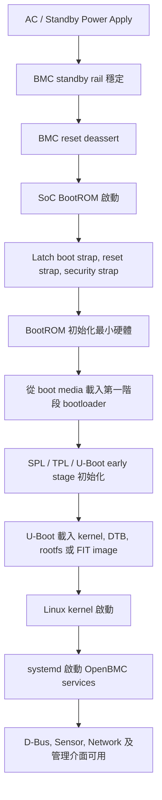
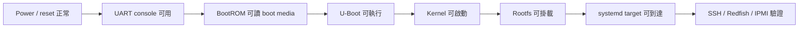

# 1. Boot Flow 與 SoC 初始化

## 適用範圍

本章適用於 BMC 新平台 bring-up, 開機流程確認, 故障分類, log 收集及專案量測紀錄.

## 適用讀者

- BMC firmware 工程師
- Hardware 及 CPLD 工程師
- Security 及 validation 工程師
- 系統整合與故障分析人員

## 快速導覽

| 常見故障現象 | 對應章節 |
| --- | --- |
| 無 UART, BootROM 無後續訊息 | [1.1](#11-bmc-soc-常見開機流程), [1.7](#17-boot-failure-分類與排查入口) |
| Boot source 或 reset strap 異常 | [1.2](#12-boot-strap--reset-strap-原理) |
| SPI-NOR, SPI-NAND 或 eMMC 無法啟動 | [1.3](#13-spi-nor--spi-nand--emmc-初始化流程差異) |
| SPL 停住, DDR training 失敗 | [1.4](#14-ddr-初始化) |
| 開機期間重複 reset | [1.5](#15-watchdog-在開機各階段的角色) |
| 不同 SoC 的 BootROM 或 boot media 差異 | [1.6](#16-各-soc-開機流程差異速查) |
| `kernel panic`, rootfs 或 service 問題 | [1.7](#17-boot-failure-分類與排查入口) |
| 專案設定, 量測值及驗收結果 | [1.8](#18-當前平台-boot-strap-設定與實際量測值) |

本章整理 BMC 從上電到管理服務可用之間的主要流程, 並建立 bring-up 與故障排查時的
共同語言.

新平台的 Boot Flow 由 power rail, reset, strap, clock, boot media, DDR,
bootloader, kernel, rootfs 與 userspace services 串接而成. 任一階段狀態不一致,
都可能表現為無 UART, 卡在 U-Boot, `kernel panic`, service 無法啟動,
或 Redfish, IPMI 無回應.

本章涵蓋 1.1 至 1.8: BMC SoC 常見開機流程, Boot Strap / Reset Strap,
SPI-NOR / SPI-NAND / eMMC 差異, DDR 初始化, Watchdog, SoC 差異,
Boot Failure 分類及當前平台量測表.

## 1.1 BMC SoC 常見開機流程

### 開機流程



各階段的主要內容如下:

- BMC standby rail 包含 `3V3_AUX`, `1V8` 及 core rail 等電源.
- BootROM 最小硬體初始化包含 clock, boot interface 及 SRAM.
- SPL / TPL / U-Boot early stage 初始化 DDR, pinmux, UART 及 clock.
- Linux kernel 完成 driver probe 及 rootfs mount.
- 管理服務包含 D-Bus, Sensor, Network, Redfish, IPMI 及 WebUI.

### 各階段觀察點

| 階段 | 主要觀察點 | 常用工具 | 常見問題 |
| --- | --- | --- | --- |
| Power apply | Standby rail, power good, reset input | 示波器, DMM | Rail 未穩, reset 未釋放 |
| BootROM | Boot media `CS`, `CLK`, early UART log | 示波器, LA, UART | Strap 錯誤, 裝置不可讀 |
| SPL / U-Boot early | DDR init, clock, pinmux, console | UART, JTAG | DDR training 失敗 |
| U-Boot normal | `bootcmd`, `mtdparts`, env, kernel load | UART, `printenv` | 參數或 image offset 錯誤 |
| Kernel | Driver probe, rootfs mount, init | `dmesg`, UART | `kernel panic`, rootfs 失敗 |
| Userspace | systemd target, D-Bus, network | `journalctl`, `systemctl` | Service 或 network 失敗 |

### 最小可開機路徑

Bring-up 初期建議先確認最小可開機路徑, 再逐步加入管理服務.



## 1.2 Boot Strap / Reset Strap 原理

Boot strap / reset strap 是 SoC 在 reset 釋放附近擷取的硬體腳位狀態,
用來決定早期啟動行為. 這些腳位通常在 BootROM 或 reset controller 的早期階段
被 latch. 之後即使腳位電位改變, 也不一定會影響本次 boot 結果.

### 常見 Strap 類型

| Strap 類型 | 可能決定的項目 | Bring-up 注意事項 |
| --- | --- | --- |
| Boot source | SPI-NOR, SPI-NAND, eMMC, UART recovery | Pull 設定需符合 datasheet |
| Boot width / mode | SPI mode, NAND bus width | BootROM 模式需符合接線 |
| Secure boot | Enable, disable, key source | 開發版與量產版分開記錄 |
| Debug mode | JTAG, UART download, recovery mode | 確認量產安全政策 |
| Clock source | Crystal 或 reference clock | Clock 未穩可能造成早期無 log |
| Address map | Memory remap, boot region | 對齊 linker 及 image offset |

### 建議排查方向

排查 strap 問題時, 除了確認 schematic 設計值, 也應量測 reset 釋放瞬間的
實際電位. 部分平台的 strap 可能受 CPLD, buffer, multi-function pin 或
update tool 影響. 量測點應靠近 SoC pin, 或選擇可代表 SoC input 的節點.

### Strap 紀錄表

| Strap Signal | SoC Pin | Design Value | Measured Value |
| --- | --- | --- | --- |
| Boot source strap | [待填] | [待填] | [待填] |
| Secure boot strap | [待填] | [待填] | [待填] |
| Debug strap | [待填] | [待填] | [待填] |

| Strap Signal | Latch 時間點 | Pull Resistor | 責任窗口 | 備註 |
| --- | --- | --- | --- | --- |
| Boot source strap | Reset deassert 附近 | [待填] | HW, BMC | [待填] |
| Secure boot strap | Reset deassert 附近 | [待填] | HW, Security | [待填] |
| Debug strap | Reset deassert 附近 | [待填] | HW, BMC | [待填] |

## 1.3 SPI-NOR / SPI-NAND / eMMC 初始化流程差異

不同 boot media 的 early boot 風險不同. Porting 時需一起核對硬體接線,
SoC BootROM 支援模式, U-Boot 設定, kernel MTD 或 block 設定及 image layout.

### Boot Media 比較

| Boot media | 早期流程特性 | 優點 | 常見風險 |
| --- | --- | --- | --- |
| SPI-NOR | BootROM 讀取固定 offset 或 header | Bring-up 較簡單 | 容量及寫入壽命限制 |
| SPI-NAND | BootROM 處理 page, ECC, bad block | 容量較大 | ECC, bad block, UBI layout |
| eMMC | MMC controller 讀 boot partition | 容量大, 管理方便 | `EXT_CSD`, power, clock |

### SPI-NOR Bring-up 檢查清單

- [ ] `CS`, `CLK`, `MOSI`, `MISO` 接線及 pinmux 正確.
- [ ] Flash voltage 與 SoC IO voltage 一致.
- [ ] BootROM 支援 flash read opcode 及 address byte 數.
- [ ] U-Boot defconfig 已啟用 SPI controller 及 SPI NOR driver.
- [ ] `mtdparts` 與 image layout 一致.
- [ ] U-Boot 可透過 `sf probe` 及 `sf read` 讀取合理資料.

```text
=> sf probe
=> sf read ${loadaddr} ${offset} ${size}
```

### SPI-NAND Bring-up 檢查清單

- [ ] BootROM 支援該 SPI-NAND 型號或相容初始化流程.
- [ ] ECC, OOB 及 bad block policy 與 BootROM, U-Boot, kernel 一致.
- [ ] UBI VID header offset, PEB size 及 LEB size 與 image 設定一致.
- [ ] 初始燒錄工具會避開 bad block 並保留 bootloader 必要副本.
- [ ] Kernel log 無大量 ECC error 或 UBI attach failure.

### eMMC Bring-up 檢查清單

- [ ] eMMC power rail, reset, clock 及 `DAT` / `CMD` pull-up 正確.
- [ ] Boot partition enable 設定符合 SoC BootROM 需求.
- [ ] Boot bus width 及 boot ack 設定符合 SoC BootROM 需求.
- [ ] U-Boot 可辨識 mmc device 及 partition.
- [ ] DTS 的 `bus-width`, `max-frequency` 及 `non-removable` 符合電路.
- [ ] Rootfs UUID, PARTUUID 及 `bootargs` 與實際 partition 對齊.

## 1.4 DDR 初始化

DDR 初始化通常是 Boot Flow 中較容易停在早期且資訊有限的階段. 若 SoC 需要 SPL
或 vendor DDR training binary, DDR 失敗可能表現為無後續 UART log, 重複 reset,
watchdog reset, 或卡在固定的 early boot 訊息.

### DDR Bring-up 檢查點

| 項目 | 說明 | 檢查方式 |
| --- | --- | --- |
| DDR type | DDR3, DDR4, LPDDR4, DDR5 | Schematic, BOM, datasheet |
| 顆粒型號 | Vendor, density, organization, rank | BOM, memory datasheet |
| Bus width | x8, x16, channel, rank | Schematic, layout review |
| Clock / reset | DDR clock, CKE, reset, ODT | 示波器, register dump |
| Power rail | VDD, VDDQ, VPP, reference voltage | DMM, 示波器 |
| Training parameter | Drive strength, ODT, timing, frequency | Vendor tool, SPL log |
| Layout constraint | Length matching, impedance, via, topology | Layout report |

### 排查程序

1. 確認 DDR power rail 及 reset timing 符合記憶體 datasheet.
2. 確認 SoC strap 或 bootloader 使用正確的 DDR type 及 frequency.
3. 降低 DDR frequency, 觀察系統是否可從無 log 進入 U-Boot.
4. 檢查 DDR training log 中的 byte lane, DQS 及 Vref 失敗資訊.
5. 比對 reference board 的 DDR routing, ODT, termination 及 config.
6. 若有多顆 DDR, 先使用最小顆數或 single rank 設定進行 bring-up.

### 常見現象

| 現象 | 建議排查方向 | 建議檢查 |
| --- | --- | --- |
| 無 UART, power / reset 正常 | BootROM 或 SPL 前段 DDR init | Early UART, JTAG PC, DDR rail |
| SPL banner 後停住 | DDR training 失敗 | SPL log level, config, 頻率 |
| U-Boot 可進, kernel 隨機 panic | DDR timing 或容量描述 | `memtester`, 降頻, memory node |
| 長時間測試發生 random crash | DDR margin 或電源雜訊 | 壓力及溫度測試, 示波器 |

## 1.5 Watchdog 在開機各階段的角色

Watchdog 可避免 BMC 卡在某個階段無限等待, 但在 bring-up 期間也可能縮短問題的
觀察時間. 建議先記錄各階段的 watchdog 狀態, 再依產品需求逐步啟用.

### Watchdog 層級

| Watchdog 類型 | 啟用位置 | 作用 | Bring-up 注意事項 |
| --- | --- | --- | --- |
| SoC hardware | BootROM, SPL, U-Boot, kernel | 防止早期卡死 | 可先延長 timeout |
| U-Boot | U-Boot runtime | 防止停在 bootloader | Debug 時留意自動 reset |
| Linux | Kernel driver, systemd | Userspace hang recovery | 確認 device 及設定 |
| External | CPLD, supervisor IC | 監控 BMC 或整板 | 確認 feed 條件及範圍 |
| Host | BIOS, BMC, IPMI | 監控 host boot 或 OS | 與 BMC watchdog 分開記錄 |

### Watchdog 紀錄清單

- [ ] 記錄 watchdog source.
- [ ] 記錄 timeout 時間.
- [ ] 記錄啟用階段.
- [ ] 記錄 feed 條件及 feed 者.
- [ ] 記錄 timeout 後的 reset 範圍.
- [ ] 確認 reset reason register 是否能保存.
- [ ] 記錄開發版停用或延長 timeout 的方式.

Watchdog source 可為 SoC, CPLD, external supervisor 或 host watchdog.
啟用階段可為 BootROM, SPL, U-Boot, Kernel 或 Userspace. Reset 範圍可為
BMC-only, full board 或 host-only.

## 1.6 各 SoC 開機流程差異速查

不同 BMC SoC 的 BootROM, strap, boot media 支援, DDR 初始化工具與
secure boot policy 可能不同. 下表用於建立專案筆記, 不取代 SoC datasheet
或 vendor application note.

| SoC 家族 | 常見 boot media | 早期初始化重點 | Bring-up 注意事項 |
| --- | --- | --- | --- |
| ASPEED AST24xx / AST25xx | 以 SPI-NOR 為主 | Strap, SPI, DDR, UART | Layout, pinmux, watchdog |
| ASPEED AST2600 | SPI-NOR, SPI-NAND, eMMC | Boot source, DDR, security | BootROM 模式及 image layout |
| Nuvoton NPCM7xx / NPCM8xx | 依平台而定 | Boot block, DDR, pinmux | BSP flow 及 flash layout |
| 其他 Linux BMC SoC | 視 SoC 支援 | BootROM, SPL, DDR, storage | 以 datasheet, EVB, BSP 為準 |

### 專案 SoC Boot 筆記清單

- [ ] 記錄 SoC 型號及 revision.
- [ ] 記錄 BootROM 支援的 boot source 清單.
- [ ] 記錄實際使用的 boot source.
- [ ] 記錄 strap pin 對照及量測值.
- [ ] 記錄 Bootloader 階段: SPL, TPL, U-Boot 或 vendor loader.
- [ ] 記錄 DDR config 來源及版本.
- [ ] 記錄 Secure boot 狀態.
- [ ] 記錄 Recovery boot 方式.
- [ ] 記錄 UART console 及 baud rate.
- [ ] 記錄 reset reason register 讀取方式.

## 1.7 Boot Failure 分類與排查入口

Boot Failure 建議先依系統停止的層級分類, 再同步量測與 log. 以下分類可作為
初期會議同步及 log 收集的共通格式.

### 故障分類

| 分類 | 觀察現象 | 建議排查方向 | 第一輪檢查 |
| --- | --- | --- | --- |
| 無上電 | Standby rail 不穩 | Power rail, CPLD, 負載 | DMM, 示波器, PGOOD |
| Reset 未釋放 | Reset pin 持續 asserted | Power good, CPLD, strap | Reset line, CPLD register |
| 無 UART | 無任何 log | Clock, strap, BootROM | UART TX, SPI `CS` / `CLK` |
| BootROM 讀取失敗 | Storage 有活動, 無後續 | Header, offset, opcode | LA, 燒錄檔, flash read |
| SPL / DDR 失敗 | Early log 後停住 | DDR config, rail, clock | SPL log, DDR rail, 降頻 |
| U-Boot 失敗 | 卡在 `bootcmd` | Env, `bootargs`, offset | `printenv`, `bdinfo`, read |
| Kernel panic | Kernel 啟動後 panic | DT, driver, rootfs, init | Panic log, DTB, rootfs |
| Rootfs mount 失敗 | `VFS unable to mount root` | `root=`, UBI, FS | `bootargs`, `/proc/mtd` |
| Userspace fail | Emergency 或 service failed | Dependency, 設定檔 | `systemctl`, `journalctl` |
| 管理介面不可用 | SSH, Redfish, IPMI 不通 | Network, `bmcweb`, firewall | IP, route, service status |

### 第一輪排查程序

1. 從上電前開始收集完整 UART log.
2. 使用示波器量測 standby rail, reset, clock 及 boot media `CS` / `CLK`.
3. 讀取 reset reason register.
4. 量測 Boot strap 實際值.
5. 收集 U-Boot env, `bootargs` 及 `mtdparts`.
6. 收集 kernel panic log 或 `dmesg`.
7. 收集 systemd failed units.
8. 記錄 image, U-Boot, kernel 及 DTS 版本.

```bash
$ systemctl --failed
$ journalctl -xb
$ uname -a
```

U-Boot 第一輪檢查可使用下列指令:

```text
=> printenv
=> bdinfo
=> sf probe
=> sf read ${loadaddr} ${offset} ${size}
```

## 1.8 當前平台 Boot Strap 設定與實際量測值

本節作為專案填寫區. Bring-up 前至少需完成 boot source, secure boot, UART,
flash, DDR 及 reset timing 的資料整理. 每次硬體 rework, CPLD 更新,
bootloader 更新或安全設定變更後, 建議同步更新.

### 測試資訊

| 項目 | 設定值或量測值 |
| --- | --- |
| 測試日期 | [待填] |
| Board revision | [待填] |
| Firmware version | [待填] |
| 測試條件 | [待填] |
| 量測工具 | [待填] |
| Log 或 issue 連結 | [待填] |

狀態欄位僅使用 `Not started`, `In progress`, `Verified`, `Blocked` 或 `N/A`.

### 平台設定與量測結果

| 項目 | 設定值或量測值 | 資料來源 | 責任窗口 | 狀態 |
| --- | --- | --- | --- | --- |
| SoC 型號 / revision | [待填] | BOM, register | HW, BMC | Not started |
| Boot source strap | [待填] | Schematic, 量測 | HW, BMC | Not started |
| Secure boot strap | [待填] | Schematic, 量測 | HW, Security, BMC | Not started |
| Recovery mode strap | [待填] | Schematic, 量測 | HW, BMC | Not started |
| UART console pin / header | [待填] | Schematic, layout | HW, BMC | Not started |
| UART baud rate | [待填] | Bootloader config | BMC | Not started |
| Boot flash 型號 / 容量 | [待填] | BOM, flash ID | HW, BMC | Not started |
| Boot flash voltage | [待填] | Schematic, 量測 | HW | Not started |
| DDR 型號 / 容量 | [待填] | BOM, memory config | HW, BMC | Not started |
| DDR 頻率 | [待填] | Bootloader config | BMC, HW | Not started |
| Reset deassert 時間 | [待填] | 示波器 | HW | Not started |
| Clock source / frequency | [待填] | Schematic, 量測 | HW | Not started |
| Watchdog timeout | [待填] | CPLD, SoC, systemd | BMC, HW | Not started |
| U-Boot version | [待填] | UART log, manifest | BMC | Not started |
| Kernel version / commit | [待填] | `uname -a`, manifest | BMC | Not started |
| DTS / DTB 版本 | [待填] | Build output, manifest | BMC | Not started |

### Bring-up 驗收清單

- [ ] AC on 後 BMC 可穩定進入 U-Boot.
- [ ] BMC 可穩定進入 Linux kernel.
- [ ] Rootfs 可掛載.
- [ ] systemd default target 可到達.
- [ ] `systemctl --failed` 無關鍵 service 失敗.
- [ ] SSH 或 serial login 可用.
- [ ] Redfish service 可依平台需求回應.
- [ ] Reset reason 可正確描述上一輪 reset 來源.
- [ ] AC cycle 行為已建立 baseline.
- [ ] BMC reset 行為已建立 baseline.
- [ ] Watchdog reset 行為已建立 baseline.

## 1.9 本章參考資料與交叉引用

- Flash layout 與 partition 細節請參考第 2 章.
- Pinmux, GPIO, reset, clock 及 power rail 細節請參考第 3, 4 章.
- Boot media 涉及 SPI, eMMC, I2C / SMBus 介面時, 請參考第 5 章.
- Yocto / U-Boot / kernel / DTS 建構與修改流程請參考第 7, 8, 9 章.
- 故障分析與 log 收集方法請參考第 25, 26 章.
