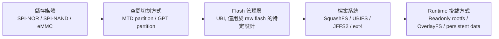
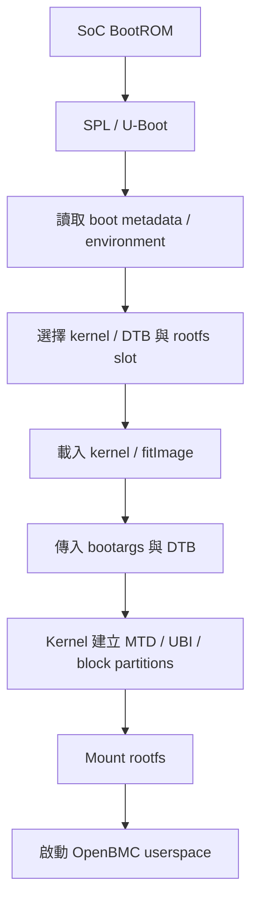
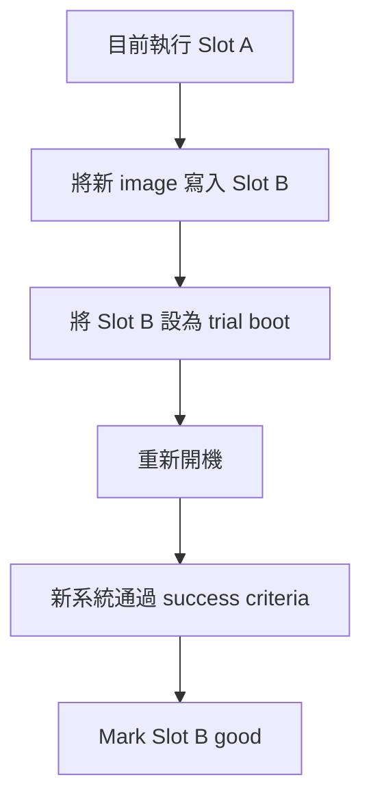
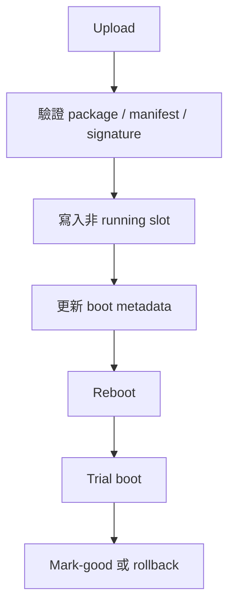

# 2. Flash Partition 與儲存架構

## 適用範圍

本文件說明 BMC 韌體的 Flash partition 與儲存架構, 涵蓋 raw flash 與 block device, MTD, UBI, GPT, 檔案系統, OverlayFS, 映像與更新封裝, A/B slot, rollback, recovery 及 persistent data. 文件同時整理 Yocto build output, 更新包與 target runtime layout 的對照及驗證方式.

## 適用讀者

- 負責 BMC 韌體, Bootloader, Linux kernel, Device Tree, Yocto build, 檔案系統或 software update 的開發與整合人員.
- 執行 storage layout bring-up, 更新驗證, 故障排查, factory reset 或 recovery 測試的人員.

## 快速導覽

- [理解儲存層級與媒體差異](#21-儲存架構的五個層級): 儲存媒體, partition, volume, 檔案系統與映像格式.
- [確認 raw flash 架構](#23-mtd-partition): MTD partition, UBI 與 UBIFS.
- [確認 eMMC 架構](#25-gpt-與-emmc-partition): GPT, PARTUUID, UUID, Label 與 WIC.
- [理解 rootfs 與 OverlayFS](#27-overlayfs): lowerdir, upperdir, workdir, copy-up, whiteout 與排查方式.
- [檢查映像及更新機制](#210-映像檔與更新包): 更新包, A/B slot, rollback, golden image 與 recovery.
- [核對 build 與 target](#214-yocto-build-與-layout-來源): layout 來源, target 端檢查與 software update 驗證.
- [執行 bring-up 與驗收](#219-bring-up-順序): 實測紀錄表與驗收 Checklist.

BMC 韌體需要儲存 bootloader / kernel / Device Tree / root filesystem / 系統設定 / 事件紀錄與更新資料. 這些內容可能放在 SPI-NOR / SPI-NAND 或 eMMC; 每種儲存媒體都有對應的分區方式 / 檔案系統與更新流程.

本章從儲存媒體開始, 依序說明 MTD / UBI / GPT / SquashFS / UBIFS / ext4 / OverlayFS / 映像檔 / A/B slot / rollback 與 persistent data, 並建立從 build output 到 target 實際掛載狀態的完整對照.

## 2.1 儲存架構的五個層級

閱讀 BMC 儲存架構時, 最容易混淆的是把儲存媒體 / partition / volume / 檔案系統與映像檔當成同一件事. 它們位於不同層級:



Build 與更新流程另外會產生 `.ubi` / `.wic` / `.mtd.tar` 等映像或封裝檔. 這些檔案用來燒錄 / 傳輸或更新, 不表示 target 一定會直接 mount 該檔案.

### 2.1.1 儲存媒體

儲存媒體是實際儲存資料的裝置:

| 儲存媒體         | Linux 常見介面 | 特性                                                  |
| ---------------- | -------------- | ----------------------------------------------------- |
| SPI-NOR          | MTD            | 容量較小 / 可直接隨機讀取 / 以 erase block 擦除       |
| SPI-NAND         | MTD            | 容量較大, 需要 ECC / bad block 與 OOB 管理            |
| eMMC             | Block device   | 內部具有 flash translation layer, 對 Linux 呈現為磁碟 |
| SD / USB storage | Block device   | 常用於開發 / 救援或外部儲存                           |
| SATA / NVMe SSD  | Block device   | 容量大, 較少作為小型 BMC 的主要 boot media            |

### 2.1.2 Partition

Partition 將一個儲存裝置切成數段空間.

Raw flash 常用 MTD partitions:

```text
mtd0  u-boot
mtd1  u-boot-env
mtd2  kernel
mtd3  rofs
mtd4  rwfs
```

Block device 常用 MBR 或 GPT partition table:

```text
/dev/mmcblk0p1  boot
/dev/mmcblk0p2  rootfs-a
/dev/mmcblk0p3  rootfs-b
/dev/mmcblk0p4  rw-data
```

### 2.1.3 Volume

Volume 是建立在其他儲存管理層上的邏輯空間. 本章最常見的是 UBI volume:

```text
MTD partition mtd3
        ↓ UBI attach
UBI device ubi0
├── rofs-a
├── rofs-b
└── rwfs
```

UBI volume 是 UBI device 內切分出的邏輯儲存空間. 它可以儲存 SquashFS image, 也可以格式化成 UBIFS 供系統讀寫.

### 2.1.4 檔案系統

檔案系統決定資料如何以目錄與檔案呈現, 例如:

| 檔案系統  | 用途                                      |
| --------- | ----------------------------------------- |
| SquashFS  | 唯讀 / 壓縮, 常用於 rootfs                |
| UBIFS     | 可寫, 建立在 UBI volume 上                |
| JFFS2     | 可寫, 常用於較小的 raw NOR 區域           |
| ext4      | 常用於 eMMC 等 block device               |
| OverlayFS | 將唯讀 lower layer 與可寫 upper layer 合併 |

### 2.1.5 映像與更新封裝

| 格式          | 用途                                                        |
| ------------- | ----------------------------------------------------------- |
| `.squashfs` | SquashFS 檔案系統映像                                       |
| `.ubifs`    | UBIFS 檔案系統映像                                          |
| `.ubi`      | 具有 volume table 與 volumes 的 UBI 映像                    |
| `.ext4`     | ext4 檔案系統映像                                           |
| `.wic`      | 包含 partition table 與多個 partitions 的磁碟映像           |
| `.mtd.tar`  | OpenBMC 更新流程使用的封裝                                  |
| `fitImage`  | 可包含 kernel / DTB / initramfs 與簽章資訊的 boot container |
| `MANIFEST`  | 更新包的版本 / 機型 / 用途與驗證資訊                        |

## 2.2 Raw Flash 與 Block Device

Linux 對 raw flash 與 block device 的處理方式不同.

### 2.2.1 Raw Flash

SPI-NOR / SPI-NAND 與 raw NAND 通常透過 MTD subsystem 管理. Raw flash 的特徵包括:

- 寫入前需要擦除.
- 擦除單位是 erase block.
- NAND 可能有 factory bad blocks.
- NAND 需要 ECC 與 OOB 管理.
- 寫入次數有限, 需要考量 wear.

Raw flash 通常不使用 GPT. 它的 partition 可由 Device Tree `fixed-partitions` / U-Boot `mtdparts` 或平台特定 layout 建立.

### 2.2.2 Block Device

eMMC / SD / SATA 與 NVMe 對 Linux 呈現為 block device. 其內部控制器已將 flash erase / bad block 與 wear 管理隱藏在裝置內部.

Block device 適合使用:

- MBR / GPT partition table.
- ext4 / FAT / SquashFS 等檔案系統.
- `lsblk` / `blkid` / `sfdisk` / `sgdisk` 等工具.

eMMC 不應使用 UBIFS. UBIFS 是為 UBI 設計, 而 UBI 是 raw flash 管理層.

## 2.3 MTD Partition

MTD (Memory Technology Device) 是 Linux 管理 raw flash 的 subsystem. 每個 MTD partition 通常會出現:

```text
/dev/mtd0      character device
/dev/mtdblock0 block-like interface, 是否使用依檔案系統與流程而定
```

### 2.3.1 Device Tree 範例

```dts
&fmc {
    status = "okay";

    flash@0 {
        compatible = "jedec,spi-nor";
        reg = <0>;
        spi-max-frequency = <50000000>;

        partitions {
            compatible = "fixed-partitions";
            #address-cells = <1>;
            #size-cells = <1>;

            u-boot@0 {
                label = "u-boot";
                reg = <0x00000000 0x00100000>;
                read-only;
            };

            u-boot-env@100000 {
                label = "u-boot-env";
                reg = <0x00100000 0x00020000>;
            };

            kernel@120000 {
                label = "kernel";
                reg = <0x00120000 0x00600000>;
            };

            rofs@720000 {
                label = "rofs";
                reg = <0x00720000 0x03200000>;
            };

            rwfs@3920000 {
                label = "rwfs";
                reg = <0x03920000 0x006e0000>;
            };
        };
    };
};
```

### 2.3.2 Offset / Size 與 Erase Block

每個 partition 的起始位置與大小最好對齊 erase block. 未對齊可能造成:

- 更新時需要保留同一 erase block 中其他 partition 的資料.
- 擦除範圍跨越 partition 邊界.
- Updater 或 MTD driver 無法安全處理.

所有 partitions 的範圍不得重疊, 也不得超出 flash 容量.

### 2.3.3 Partition Name

`label` 會影響 `/proc/mtd` 中的名稱, 也可能被 initramfs / update service 與 shell script 使用.

```bash
$ cat /proc/mtd
```

修改名稱時必須同步確認:

- Device Tree.
- U-Boot environment / `mtdparts`.
- Kernel bootargs.
- Initramfs / preinit scripts.
- Update package.
- Software update service.

## 2.4 UBI 與 UBIFS

UBI (Unsorted Block Images)是 raw flash 上的管理層, 主要處理:

- Wear leveling.
- Bad block.
- Erase counter.
- Logical erase block 映射.
- Volume table.

UBIFS 是建立在 UBI volume 上的可寫檔案系統.

```text
Raw NAND / SPI-NAND
        ↓
MTD partition
        ↓
UBI device
        ↓
UBI volume
        ↓
UBIFS
```

### 2.4.1 PEB 與 LEB

- PEB: Physical Erase Block, flash 上的實體擦除區塊.
- LEB: Logical Erase Block, UBI 提供給上層的邏輯區塊.

LEB 會比 PEB 小, 因為 UBI 需要儲存 erase counter header 與 volume identifier header.

### 2.4.2 Static 與 Dynamic Volume

| Volume 類型 | 適合用途                     | 特性                                     |
| ----------- | ---------------------------- | ---------------------------------------- |
| Static      | Kernel / SquashFS 等固定映像 | UBI 可驗證資料完整性, 更新時通常整體替換 |
| Dynamic     | UBIFS / 可變資料             | 允許內容持續改變                         |

Readonly rootfs 可放在 static UBI volume 中, 再透過 `ubiblock` 提供 block-like device 給 SquashFS mount.

### 2.4.3 UBI Attach

Bootargs 可能指定:

```text
ubi.mtd=ubi
```

也可能使用 MTD number. 使用 partition name 通常較容易閱讀, 但名稱必須和 `/proc/mtd` 一致.

Target 檢查:

```bash
$ cat /proc/mtd
$ ubinfo -a
$ cat /sys/class/ubi/ubi*/mtd_num
```

### 2.4.4 常見參數不一致

建立 `.ubi` 映像時, 需要配合實際 flash:

- Minimum I/O size.
- PEB size.
- Sub-page size.
- VID header offset.
- Volume size.

Build 參數與 target flash geometry 不一致時, 可能出現 bad VID header / attach failure 或 volume table error.

## 2.5 GPT 與 eMMC Partition

eMMC 是 block device, 新平台通常適合使用 GPT.

### 2.5.1 GPT 的用途

GPT 儲存:

- Partition 起始 LBA 與大小.
- Partition type GUID.
- Partition unique GUID.
- Partition name.
- Primary 與 backup headers.

常見 BMC layout:

```text
/dev/mmcblk0
├── rootfs-a
├── rootfs-b
├── rw-data
├── logs
└── recovery
```

### 2.5.2 PARTUUID / UUID 與 Label

- PARTUUID: GPT / partition table 中的 partition identity.
- UUID: 檔案系統建立時產生的 identity.
- Label: partition 或檔案系統的人類可讀名稱.

Bootargs 可使用:

```text
root=PARTUUID=<rootfs-a-partuuid> rootwait ro
```

相較 `/dev/mmcblk0p2`, PARTUUID 不依賴 partition node 編號, 但重新產生 image 時仍要確認 GUID 是否固定或同步更新.

### 2.5.3 WIC

Yocto `.wic` 是整碟映像, 通常包含:

```text
Partition table
+ boot partition
+ rootfs partitions
+ data partitions
+ 各 partition 的檔案系統內容
```

`.wks` 或 image recipe 定義 partition 位置 / 大小 / label / 檔案系統與來源.

Build 後應檢查:

```bash
$ wic ls <image>.wic
$ sfdisk -l <image>.wic
```

工具支援方式依 Yocto 版本與環境而異.

## 2.6 檔案系統

### 2.6.1 SquashFS

SquashFS 是壓縮的唯讀檔案系統, 常用於 BMC rootfs.

優點:

- 內容固定.
- 壓縮率高.
- 不會因 runtime 寫入逐漸改變.
- 更新時可替換完整映像.

限制:

- 不能直接修改.
- 需要 OverlayFS 或獨立 writable partition 儲存變更.

### 2.6.2 JFFS2

JFFS2 可直接建立在 MTD raw flash 上, 常用於較小的 SPI-NOR writable partition.

需要注意:

- Mount 時可能掃描整個 partition.
- 容量增加後 mount 與管理成本可能上升.
- 需配合 erase block 與 cleanmarker.
- 不適合把大量 log 持續寫入小型 NOR.

### 2.6.3 UBIFS

UBIFS 是建立在 UBI dynamic volume 上的可寫檔案系統, 適合 SPI-NAND / raw NAND.

它不是 block device 檔案系統, 不能直接格式化到 eMMC partition, 也不能跳過 UBI 直接寫到 raw MTD partition.

### 2.6.4 ext4

ext4 適用於 eMMC / SD 與 SSD. 需要考量:

- Journal mode.
- Commit interval.
- Power-loss behavior.
- Fsck policy.
- Mount timeout.
- Data partition 空間與 inode.
- eMMC lifetime.

### 2.6.5 tmpfs

tmpfs 使用 RAM, 重開機後內容消失. 適合:

- `/run`
- 暫存檔
- Firmware upload staging, 前提是 RAM 足夠
- 不需儲存的 debug data

大型 update image 若放在 tmpfs, 需先確認可用 RAM, 避免 OOM.

## 2.7 OverlayFS

OverlayFS 是 Linux 核心支援的 union filesystem. 它不直接管理儲存區塊, 而是使用底層檔案系統中的目錄作為資料層, 將唯讀的 lower layer 與可寫的 upper layer 合併成同一個檢視. 使用者從 merged mount point 存取檔案; 新增 / 修改與刪除結果儲存在 upper layer, lower layer 維持原本內容.

在 BMC 平台中, 常見配置是以 SquashFS 作為唯讀 rootfs, 再以 JFFS2 / UBIFS 或 ext4 儲存 runtime 變更:

```text
lowerdir  SquashFS rootfs
upperdir  JFFS2 / UBIFS / ext4 上的可寫目錄
workdir   OverlayFS 的核心工作目錄
merged    Userspace 實際看到的目錄樹
```

### 2.7.1 四個關鍵目錄

| 目錄         | 用途                                                  | 存取特性     |
| ------------ | ----------------------------------------------------- | ------------ |
| `lowerdir` | 提供原始內容; 可依核心版本與設定使用多個 lower layers | 通常唯讀     |
| `upperdir` | 儲存新增 / 修改 / 刪除標記與 metadata 變更            | 可寫         |
| `workdir`  | 核心處理 copy-up / rename 等流程時使用                | 核心專用     |
| `merged`   | Lower 與 upper 合併後的 mount point                   | 呈現可寫檢視 |

掛載範例:

```bash
$ mount -t overlay overlay \
      -o lowerdir=/rofs,upperdir=/rwfs/upper,workdir=/rwfs/work \
      /newroot
```

多個 lower directories 可使用冒號分隔:

```bash
$ mount -t overlay overlay \
      -o lowerdir=/lower1:/lower2,upperdir=/upper,workdir=/work \
      /merged
```

查找同一路徑時, 前面的 lower layer 優先於後面的 lower layer. 實際可使用的 layer 數量 / 巢狀方式與 mount options 受 kernel version 和設定限制, 平台應以 target kernel 的 OverlayFS 文件與實測結果為準.

### 2.7.2 讀取流程

存取 merged 中的檔案時, OverlayFS 依下列順序取得內容:

1. 先查詢 upperdir.
2. Upperdir 沒有該路徑時, 再依序查詢 lowerdir.
3. 回傳第一個可見的檔案.
4. 所有 layers 都沒有該路徑時, 回報檔案不存在.

Upper 與 lower 同時具有同名目錄時, OverlayFS 通常會合併兩邊的目錄項目. 若同名檔案同時存在, upper 版本會遮蔽 lower 版本.

### 2.7.3 寫入與 Copy-Up

修改 upperdir 已有的檔案時, 寫入直接發生在 upperdir.

修改只存在於 lowerdir 的檔案時, OverlayFS 會先執行 copy-up:

```text
Lower File
    ↓ 複製檔案與必要 metadata
Upper File
    ↓
套用本次修改
```

Copy-up 以檔案為單位. 即使只修改大型檔案中的少量資料, 首次寫入仍可能需要複製完整檔案, 因此會增加 I/O / 空間用量與延遲.

常見 copy-up 情境包括:

- 以可寫方式開啟 lower file.
- 修改 mode / owner / timestamp 或 extended attributes.
- Rename 來自 lower 的檔案或目錄.
- 對 lower directory 內的項目進行會改變上層檢視的動作.

Metadata-only copy-up / metacopy / redirect 與 index 行為會受到 kernel version / mount options 和 backing filesystem 能力影響.

### 2.7.4 刪除與 Whiteout

刪除 upperdir 中獨有的檔案時, OverlayFS 可直接移除 upper copy.

刪除 lowerdir 提供的檔案時, lower 內容保持原樣; OverlayFS 在 upperdir 建立 whiteout 標記, 使該路徑在 merged view 中不可見.

```text
lowerdir/etc/example.conf   仍然存在
upperdir/etc/<whiteout>     表示遮蔽該檔案
merged/etc/example.conf     不再顯示
```

Whiteout 的實體表示方式由 kernel / mount mode 與 backing filesystem 決定, 可能使用特殊字元裝置或 OverlayFS extended attribute. 排查時應避免只以一般 `ls` 判斷 upperdir 內容.

### 2.7.5 Opaque Directory

Upper 與 lower 同時存在同名目錄時, 預設會合併目錄內容. 若 upper directory 被標記為 opaque, 該目錄會遮蔽 lower 中的同名目錄內容, merged view 只呈現 upper directory 可見的項目.

Opaque marker 通常使用 OverlayFS extended attribute 儲存. 檢查前需確認 target 使用的命名空間與目前工具是否有足夠權限讀取.

### 2.7.6 Upperdir 與 Workdir 限制

Upperdir 與 workdir 應位於同一個可寫檔案系統, 且使用彼此獨立的目錄. 掛載前 workdir 應為空目錄, 不能同時提供給其他 OverlayFS mount 使用.

Backing filesystem 需要提供 OverlayFS 所需能力, 常見項目包括:

- Extended attributes.
- 穩定的 inode 與 directory entry 行為.
- `readdir` 可提供有效的 `d_type`.
- Rename / link 與權限語意符合 OverlayFS 要求.

Ext4 / XFS / Btrfs / UBIFS 與 JFFS2 能否作為 upper layer, 仍需依 target kernel / 檔案系統設定與產品測試確認. NFS / CIFS / FAT / 部分 FUSE filesystems 或受限的 network filesystem 經常缺少 upper layer 所需能力.

Lowerdir 通常限制較少, 適合放置 SquashFS 或其他唯讀內容. 巢狀 OverlayFS / network filesystem / idmapped mount / fs-verity 或安全標籤等組合具有額外限制, 需另外驗證.

### 2.7.7 常見 BMC 使用方式

```text
Readonly Rootfs
SquashFS image
        ↓ lowerdir

Persistent Writable Storage
JFFS2 / UBIFS / ext4
        ↓ upperdir + workdir

OverlayFS
        ↓ merged root

Userspace 看到可寫的 /
```

這種設計具有以下特性:

- Rootfs image 內容固定, 更新時可整體替換.
- Runtime 設定與變更集中在 writable storage.
- Factory reset 可依產品政策清除特定 upper content.
- A/B rootfs slots 可共用或分開使用 persistent data.
- Upper data schema 需要處理 upgrade 與 downgrade 相容性.

Factory reset 不宜直接假設清空整個 upperdir 即可完成. Upperdir 可能同時包含 factory data / network settings / credentials / certificates / logs 與 runtime cache; 需要依資料分類和 reset policy 決定清除範圍.

### 2.7.8 tmpfs Upper Layer

需要完全暫存的可寫 rootfs 時, 可使用 tmpfs 提供 upperdir 與 workdir. 所有變更會在 reboot 後消失, 適合 rescue / demo / 測試或 live image.

需留意:

- Copy-up 會消耗 RAM.
- 大型 log / dump 或 update image 可能造成記憶體不足.
- Reboot 前需要另行儲存必要資料.
- OOM 可能影響系統穩定性.

### 2.7.9 效能與容量

影響 OverlayFS 效能的因素包括:

- Lower layer 數量與 path lookup 深度.
- Copy-up 檔案大小.
- Upper filesystem 延遲.
- Flash erase / write 特性.
- Extended attribute 與 metadata負載.
- Directory entry 數量.
- Index / redirect / metacopy 等 mount options.

需要監控 upper filesystem 的容量與 inode:

```bash
$ df -h /rwfs
$ df -i /rwfs
$ du -x -h /rwfs | sort -h | tail
```

Upper filesystem 滿載時可能造成 copy-up / 設定 / journal / certificate 或 account更新失敗.

### 2.7.10 Kernel Version 與 Mount Options

OverlayFS 功能會隨 Linux kernel版本演進. 常見進階選項包括:

- `redirect_dir`
- `index`
- `xino`
- `metacopy`
- `userxattr`
- Volatile mount, 依 kernel 支援

這些選項會影響 rename / inode identity / NFS export / metadata copy-up / 安全屬性與復原行為. 平台文件應儲存 kernel version / kernel config / 實際mount options / backing filesystems 與掛載腳本版本.

### 2.7.11 Target 端檢查

確認 mount tree:

```bash
$ findmnt -R /
$ findmnt -t overlay -o TARGET,SOURCE,FSTYPE,OPTIONS
$ cat /proc/mounts | grep -E 'overlay|squashfs|ubifs|jffs2|ext4'
```

確認 kernel support:

```bash
$ grep overlay /proc/filesystems
$ zcat /proc/config.gz 2>/dev/null | grep CONFIG_OVERLAY_FS
$ lsmod | grep '^overlay' || true
```

OverlayFS 可能 built into kernel, 因此 `lsmod` 沒有輸出仍可能正常; `/proc/filesystems` / kernel config 與實際mount結果更具判斷力.

確認空間 / inode與kernel log:

```bash
$ df -h
$ df -i
$ dmesg | grep -Ei 'overlay|upper|lower|workdir|xattr|whiteout|opaque'
$ journalctl -b --no-pager | grep -Ei 'overlay|mount|rwfs|rofs'
```

確認 extended attributes 時, 需先評估資料敏感性與權限:

```bash
$ getfattr -d -m '.*' <upper-path> 2>/dev/null
```

### 2.7.12 Copy-Up 實測

可在核准的測試檔案上確認 copy-up:

```bash
$ ls -l <lowerdir>/<test-file>
$ ls -l <upperdir>/<test-file> 2>/dev/null

$ printf '\n# overlay test\n' >> <merged>/<test-file>

$ ls -l <upperdir>/<test-file>
```

測試前需備份內容, 且不要選擇 account / network / certificate / boot 或 update相關檔案.

### 2.7.13 清除與還原

清除 upper content會移除所有疊加變更, 包括 whiteouts / opaque markers / 設定與 runtime資料. 安全流程通常是:

```text
確認清除範圍與保留清單
        ↓
停止會寫入 upperdir 的 services
        ↓
儲存 factory / field-writable data
        ↓
Unmount overlay 或進入 recovery 環境
        ↓
清除核准範圍
        ↓
重建空的 upperdir / workdir
        ↓
重新掛載並驗證
```

直接在目前作為 rootfs使用的upperdir 中刪除所有內容, 可能造成執行中的系統不一致. 正式factory reset 應由initramfs / recovery image 或經過驗證的reset service 執行.

### 2.7.14 安全標籤與權限

SELinux / Smack / AppArmor / IMA / EVM 與 capabilities可能影響 copy-up 後的security metadata. 排查時應:

- 儲存security denial logs.
- 比較 lower 與 upper的owner / mode / xattr 與 label.
- 確認upper filesystem 支援所需security xattrs.
- 檢查 initramfs 與 userspace是否使用一致的label policy.

不建議把停用安全機制當成一般修正方式. 若在隔離測試環境暫時調整 policy, 需記錄差異並回到正式設定重測.

### 2.7.15 常見問題

| 現象                        | 建議排查方向                                | 第一輪檢查                                    |
| --------------------------- | --------------------------------------- | --------------------------------------------- |
| OverlayFS mount 失敗         | Lower / upper / workdir 或 filesystem能力 | `dmesg` / `findmnt` / xattr / workdir狀態 |
| Rootfs變成唯讀              | Upper mount 失敗或upper filesystem 出錯   | Mount tree / UBIFS / JFFS2 / ext4 log         |
| 修改重開機後消失            | Upper 位於 tmpfs或persistent mount 未載入  | Mount options / upper path / boot log         |
| 刪除的lower 檔案又出現       | Whiteout 未儲存或upper 被重建             | Upperdir / factory reset / migration          |
| 目錄缺少lower 內容           | Opaque marker                           | Upper xattr 與目錄內容                         |
| 第一次修改大檔案很慢        | Full file copy-up                       | 檔案大小 / upper I/O / free space             |
| `No space left on device` | Upper 容量或 inode耗盡                    | `df -h` / `df -i` / `du`                |
| Permission denied           | Owner / mode / xattr / 安全標籤         | Audit log /`getfattr` / security policy     |
| Upgrade後設定異常           | Upper schema 與新版 rootfs不相容          | Migration log / 版本 / rollback policy        |

Rootfs 顯示可寫時, SquashFS image 仍維持原始內容; runtime 變更位於upperdir. 排查與factory reset 都應先確認實際 lower / upper / workdir與 merged 路徑.

## 2.8 常見 BMC Storage Layout

### 2.8.1 SPI-NOR Static MTD

```text
SPI-NOR
├── u-boot
├── u-boot-env
├── kernel / fitImage
├── rofs：SquashFS
└── rwfs：JFFS2
```

適合容量較小 / layout 固定的平台. 重點是 MTD offsets / erase alignment / partition names 與 updater 完全一致.

### 2.8.2 SPI-NAND + UBI

```text
SPI-NAND
├── u-boot
├── u-boot-env
└── MTD partition：ubi
    ├── kernel-a
    ├── rofs-a
    ├── kernel-b
    ├── rofs-b
    └── rwfs：UBIFS
```

適合需要 bad-block management / wear leveling 與較大容量的 raw flash 平台.

### 2.8.3 eMMC GPT

```text
eMMC
├── boot / kernel
├── rootfs-a
├── rootfs-b
├── rw-data
├── logs / dumps
└── recovery
```

適合需要較多 persistent data / logs / dumps 或 A/B slots 的平台.

### 2.8.4 SPI-NOR + eMMC

```text
SPI-NOR
├── SPL / U-Boot
├── U-Boot environment
└── Recovery metadata

 eMMC
├── rootfs-a
├── rootfs-b
└── rw-data
```

此設計需要特別保護 SPI-NOR 中的 boot entry 與 eMMC root selection. 若 U-Boot environment 損壞, 仍應有 recovery path.

## 2.9 Bootloader / Kernel 與 Rootfs

完整 boot path:



### 2.9.1 Bootargs

Raw MTD / UBI 平台常見:

```text
ubi.mtd=ubi root=/dev/ubiblock0_0 rootfstype=squashfs ro
```

Block device 平台常見:

```text
root=PARTUUID=<uuid> rootfstype=ext4 rootwait ro
```

實際參數依 layout 而異. 排查時以 U-Boot 最後傳入的 `/proc/cmdline` 為準.

### 2.9.2 FIT Image

FIT 可包含:

- Kernel image.
- DTB.
- Initramfs.
- Load / entry address.
- Hash / signature.
- 多組 board configurations.

若 kernel 更新但 DTB 沒更新, 或 Bootloader 選到另一組 configuration, 可能造成 source 與 target 行為不一致.

### 2.9.3 U-Boot Environment

Environment 可能儲存:

- Bootargs.
- Active slot.
- Boot priority.
- Bootcount / bootlimit.
- Upgrade pending state.
- Recovery request.

Linux 的 `/etc/fw_env.config` 必須和 U-Boot environment offset / size / erase size 與 redundant copy 管理方式一致.

## 2.10 映像檔與更新包

### 2.10.1 Filesystem Image

`.squashfs` / `.ubifs` / `.ext4` 表示單一檔案系統映像. 它們通常會被放入某個 partition 或 volume.

### 2.10.2 UBI Image

`.ubi` 可能包含 volume table 與多個 volumes. 它不是 UBIFS 的另一個副檔名.

```text
.ubi
├── rofs volume：SquashFS image
└── rwfs volume：初始 UBIFS data
```

### 2.10.3 WIC Image

`.wic` 是整個 block device 的映像, 可同時包含 GPT / MBR / partitions 與檔案系統.

### 2.10.4 OpenBMC Update Package

`.static.mtd.tar` / `.ubi.mtd.tar` 或平台自訂 package 通常包含 image files 與 `MANIFEST`. Updater 會檢查:

- MachineName.
- Purpose.
- Version.
- Signature / key type.
- Package 內容.
- Target layout.

Build output 存在, 不代表 update service 一定接受; package metadata 必須符合 target 設定.

## 2.11 A/B Slot

A/B update 的目的, 是先更新目前未執行的 slot, 再測試新版本, 失敗時回到舊版本.



若未通過, Bootloader 依 bootcount / watchdog 或 metadata 回到 Slot A.

### 2.11.1 Slot 需要包含什麼

必須明確定義:

- Kernel 是否 A/B.
- DTB 是否 A/B.
- Rootfs 是否 A/B.
- Initramfs 是否 A/B.
- Persistent data 是否共用.
- Update metadata 放在哪裡.

只複製 rootfs, kernel 與 DTB 仍共用單一版本, 可能造成不完整 rollback.

### 2.11.2 Trial Boot 與 Mark-Good

Trial boot 表示新 slot 尚未被確認穩定. Success criteria 可以包含:

- Kernel 成功啟動.
- Rootfs mount 成功.
- 必要 systemd target 到達.
- Watchdog 正常運作.
- Software inventory 顯示正確版本.
- Network 或管理介面 ready.

Success criteria 不宜過早, 否則關鍵 services 失敗時仍可能把 image 標記為 good; 也不宜過晚, 避免正常開機反覆 rollback.

### 2.11.3 Persistent Data Migration

A/B slots 通常共用 persistent data. 新版 service 若修改設定格式, 回退到舊版時可能無法讀取.

需要定義:

- Forward migration.
- Downgrade behavior.
- Schema version.
- Backup / restore.
- Migration failure handling.

## 2.12 Golden Image 與 Recovery

Golden image 是最後救援使用的已知可用版本. 它通常應:

- 預設唯讀或具有 write protection.
- 只允許經授權更新.
- 提供基本 network / serial console 與 update 能力.
- 能識別 production slots 與硬體版本.
- 不依賴已損壞的共用 rwfs.

Recovery entry 可能來自:

- Hardware strap.
- GPIO / button.
- CPLD register.
- Bootcount exceeded.
- U-Boot command.
- Watchdog rollback.

Recovery 必須實際測試可重新寫入 production image, 而不是只確認能顯示 shell.

## 2.13 Persistent Data

Persistent data 是 firmware update 後仍需保留的資料, 例如:

- Network settings.
- Users 與 credentials.
- SSH host keys.
- TLS certificates.
- Asset / factory data.
- Calibration data.
- Event logs, 依產品要求.
- OpenBMC service settings.

### 2.13.1 不同資料的儲存規則

| 資料              | Update 後  | Factory Reset |
| ----------------- | ---------- | ------------- |
| Network config    | 通常保留   | 依產品需求    |
| Users / passwords | 通常保留   | 通常重設      |
| SSH host keys     | 通常保留   | 依安全規格    |
| Factory data      | 保留       | 通常不可清除  |
| AssetTag          | 保留       | 依產品需求    |
| Event logs        | 依產品需求 | 通常可清除    |
| Crash dumps       | 可清理     | 可清除        |
| Firmware staging  | 不需保留   | 可清除        |

### 2.13.2 RWFS 空間

RWFS 滿載可能造成:

- Service 無法寫入設定.
- Journal / event 無法儲存.
- Update staging 失敗.
- OverlayFS copy-up 失敗.
- Login 或 certificate 更新失敗.

需要同時監控容量與 inode:

```bash
$ df -h
$ df -i
$ du -x -h /var | sort -h | tail
```

### 2.13.3 Factory Reset

Factory reset 不是擦除整顆 flash. 它應有明確清單:

```text
清除：user settings / network config / logs
保留：factory serial / MAC / calibration / golden image
```

Reset script / partition layout 與 OpenBMC services 必須使用同一份規則.

## 2.14 Yocto Build 與 Layout 來源

Storage layout 可能分散在:

- Machine configuration.
- Image recipe.
- `IMAGE_FSTYPES`.
- Device Tree fixed partitions.
- UBI / ubinize config.
- WIC `.wks`.
- U-Boot config.
- Initramfs / preinit scripts.
- Platform updater.

### 2.14.1 Build Output

```bash
$ bitbake -e obmc-phosphor-image | grep '^IMAGE_FSTYPES='
$ bitbake -e obmc-phosphor-image | \
    grep -E '^(MACHINE|FLASH_SIZE|IMAGE_ROOTFS_SIZE)='

$ ls -lh tmp/deploy/images/${MACHINE}/
```

### 2.14.2 Update Package

```bash
$ tar tf <image>.mtd.tar | sort
$ tar xfO <image>.mtd.tar MANIFEST
$ sha256sum <image>.mtd.tar
```

需要儲存:

- Image type.
- Machine.
- Git commits.
- Manifest.
- Partition / volume config.
- SHA-256.
- Build timestamp.

### 2.14.3 對齊檢查

| 層級       | Raw Flash                         | eMMC                          |
| ---------- | --------------------------------- | ----------------------------- |
| Bootloader | `mtdparts` / env                | GPT / PARTUUID / env          |
| Kernel     | DTS partitions / MTD / UBI config | GPT parser / MMC / filesystem |
| Build      | Flash layout / ubinize config     | `.wks` / WIC                |
| Runtime    | `/proc/mtd` / `ubinfo`        | `lsblk` / `blkid`         |
| Updater    | Partition / volume names          | Slot / partition identities   |

## 2.15 Target 端檢查

### 2.15.1 Raw Flash

```bash
$ cat /proc/mtd
$ mtdinfo -a 2>/dev/null
$ dmesg | grep -Ei 'spi-nor|spi.*nand|mtd|nand|ecc|bad block'
```

### 2.15.2 UBI

```bash
$ ubinfo -a 2>/dev/null
$ cat /sys/class/ubi/ubi*/mtd_num 2>/dev/null
$ dmesg | grep -Ei 'ubi|ubifs|vid header|peb|leb'
```

### 2.15.3 Block Device

```bash
$ lsblk -f
$ blkid
$ sfdisk -l
$ sgdisk -p /dev/mmcblk0 2>/dev/null
$ sgdisk -v /dev/mmcblk0 2>/dev/null
```

### 2.15.4 Mount Tree

```bash
$ findmnt -R /
$ cat /proc/mounts
$ df -h
$ df -i
```

### 2.15.5 Boot 與 Slot

```bash
$ cat /proc/cmdline
$ fw_printenv 2>/tmp/fw_printenv.err | sort
$ cat /tmp/fw_printenv.err
```

常見 variables 依平台不同, 可能包括:

```text
bootcount
bootlimit
upgrade_available
active_slot
bootargs
mtdparts
```

## 2.16 Software Update 驗證

更新流程可拆成:



### 2.16.1 每個階段要儲存什麼

| 階段      | 儲存內容                                      |
| --------- | --------------------------------------------- |
| Upload    | Package checksum / 可用空間                   |
| Verify    | MANIFEST / MachineName / signature result     |
| Write     | Target slot / progress / kernel log           |
| Switch    | Env / metadata before and after               |
| Reboot    | UART log / bootargs / running slot            |
| Mark-good | Success criteria / software associations      |
| Rollback  | Bootcount / reset reason / previous image log |

### 2.16.2 最小測試矩陣

- 同版更新.
- 升版更新.
- 允許或拒絕降版.
- Upload 空間不足.
- 寫入期間 BMC reset.
- 寫入期間 AC loss.
- 新 kernel panic.
- 新 userspace 無法 ready.
- RWFS 滿載.
- Automatic rollback.
- Golden image boot.

中斷測試需在可恢復的實驗環境進行, 並先確認 serial console / 外部 programming 或 golden recovery 可用.

## 2.17 常見問題與判讀

| 現象                                      | 流程大約停在哪裡      | 優先檢查                                   |
| ----------------------------------------- | --------------------- | ------------------------------------------ |
| `/proc/mtd` 名稱或大小錯誤              | MTD partition 建立    | Running DTB / bootargs / flash size        |
| `lsblk` 沒有預期 partition              | GPT / device probe    | WIC / GPT / MMC log                        |
| U-Boot 找得到 image, kernel 找不到 rootfs | Bootargs / root mount | `root=` / `ubi.mtd=` / PARTUUID        |
| UBI attach 失敗                           | UBI geometry / flash  | PEB / VID offset / ECC / bad blocks        |
| UBIFS mount 失敗                          | Writable filesystem   | UBI volume / metadata / power-loss history |
| SquashFS error                            | Readonly image        | Image checksum / flash readback / offset   |
| OverlayFS 未掛載                          | Preinit / upperdir    | Mount order / xattr / workdir              |
| ext4 變成 read-only                       | Filesystem / eMMC     | ext4 log / fsck / eMMC health              |
| `fw_printenv` 失敗                      | Environment config    | Offset / size / CRC / redundant env        |
| 更新後仍啟動舊版                          | Slot metadata         | Env / priority / UART boot log             |
| 更新後無法 rollback                       | Slot 不完整           | Kernel / DTB / rootfs / metadata           |
| Factory reset 後 factory data 消失        | Reset scope           | Partition / script / persistent policy     |
| Update package 被拒絕                     | Metadata / signature  | MANIFEST / MachineName / updater journal   |

## 2.18 Storage Debug Log 收集

以下腳本只讀取一般狀態, 不寫入 flash / 不執行 fsck, 也不修改 boot metadata:

```bash
#!/bin/sh

OUT=/tmp/storage-debug
mkdir -p "$OUT"

cat /etc/os-release > "$OUT/os-release.txt" 2>&1
uname -a > "$OUT/uname.txt"
cat /proc/cmdline > "$OUT/proc-cmdline.txt"
cat /proc/mtd > "$OUT/proc-mtd.txt" 2>&1
cat /proc/partitions > "$OUT/proc-partitions.txt" 2>&1

findmnt -R / > "$OUT/findmnt.txt" 2>&1
cat /proc/mounts > "$OUT/proc-mounts.txt" 2>&1
df -h > "$OUT/df-h.txt" 2>&1
df -i > "$OUT/df-i.txt" 2>&1

command -v fw_printenv >/dev/null 2>&1 && \
    fw_printenv > "$OUT/fw-printenv.txt" 2>&1
command -v mtdinfo >/dev/null 2>&1 && \
    mtdinfo -a > "$OUT/mtdinfo.txt" 2>&1
command -v ubinfo >/dev/null 2>&1 && \
    ubinfo -a > "$OUT/ubinfo.txt" 2>&1
command -v lsblk >/dev/null 2>&1 && \
    lsblk -f > "$OUT/lsblk.txt" 2>&1
command -v blkid >/dev/null 2>&1 && \
    blkid > "$OUT/blkid.txt" 2>&1
command -v sfdisk >/dev/null 2>&1 && \
    sfdisk -l > "$OUT/sfdisk.txt" 2>&1
command -v sgdisk >/dev/null 2>&1 && \
    sgdisk -p /dev/mmcblk0 > "$OUT/sgdisk.txt" 2>&1

dmesg -T > "$OUT/dmesg.txt"
journalctl -b --no-pager > "$OUT/journal.txt" 2>&1

tar czf "/tmp/storage-debug-$(date +%Y%m%d-%H%M%S).tar.gz" \
    -C /tmp storage-debug
```

完整 environment / partition GUID / 序號與檔案路徑可能包含平台資訊, 對外分享前應檢查內容.

## 2.19 Bring-up 順序

1. 確認 boot media 型號 / 容量與硬體接線.
2. 判斷它是 raw flash 還是 block device.
3. 確認 MTD / UBI 或 GPT layout 的唯一來源.
4. 驗證 Bootloader 能讀取 kernel / DTB 與 rootfs.
5. 確認 kernel 建立正確 partitions / volumes.
6. 確認 rootfs / rwfs 與 OverlayFS 的 mount tree.
7. 確認 persistent data 的儲存與 reset 規則.
8. 比對 Yocto build output / update package 與 target layout.
9. 驗證同版與升版更新.
10. 驗證 trial boot / mark-good 與 rollback.
11. 執行可控的 reset / power-loss tests.
12. 驗證 golden / recovery path.
13. 監控 RWFS 容量 / inode 與 flash / eMMC health.
14. 儲存 layout / 版本 / checksum / logs 與測試結果.

## 2.20 平台實測紀錄表

| 項目              | 來源 / 指令            | 實測值 | 備註                    |
| ----------------- | ---------------------- | ------ | ----------------------- |
| Boot media        | Schematic / BOM        | [待填] | NOR / NAND / eMMC       |
| Device model      | Kernel log / datasheet | [待填] | JEDEC / eMMC CID        |
| Capacity          | Datasheet / runtime    | [待填] | Byte / MiB              |
| Erase / page size | `mtdinfo`            | [待填] | Raw flash               |
| Partition source  | DTS / GPT / UBI config | [待填] | 唯一來源                |
| MTD layout        | `/proc/mtd`          | [待填] | Raw flash               |
| UBI layout        | `ubinfo -a`          | [待填] | UBI platform            |
| GPT layout        | `sgdisk -p`          | [待填] | eMMC platform           |
| Rootfs            | `findmnt /`          | [待填] | Device / FS / options   |
| Overlay           | `findmnt -R /`       | [待填] | lower / upper / work    |
| RWFS usage        | `df -h` / `df -i`  | [待填] | Capacity / inode        |
| Bootargs          | `/proc/cmdline`      | [待填] | Root / slot             |
| U-Boot env        | `fw_printenv`        | [待填] | Active slot / bootcount |
| Build image       | Deploy directory       | [待填] | Type / SHA-256          |
| Update package    | MANIFEST               | [待填] | Version / machine       |
| Running slot      | Boot metadata          | [待填] | A / B                   |
| Recovery          | Strap / metadata       | [待填] | Entry / exit            |
| Factory reset     | Test result            | [待填] | Cleared / retained      |

## 2.21 驗收 Checklist

### 儲存與 Layout

- [ ] 已區分儲存媒體 / partition / volume / 檔案系統與映像格式.
- [ ] Raw flash 使用 MTD / UBI; block device 使用 MBR / GPT 的原因清楚.
- [ ] Partition offsets / sizes 與 erase alignment 正確.
- [ ] DTS / U-Boot / Yocto / Updater 與 Runtime layout 一致.
- [ ] `/proc/mtd` / `ubinfo` 或 `lsblk` 與設計表一致.

### Rootfs 與 Persistent Data

- [ ] Rootfs 檔案系統與 mount options 正確.
- [ ] OverlayFS lower / upper 與 workdir 已確認.
- [ ] RWFS 容量與 inode 有監控方式.
- [ ] Factory data / 設定 / logs 與 staging data 已分開管理.
- [ ] Factory reset 清除與保留範圍已驗證.

### Update 與 Recovery

- [ ] Build image type 與更新包格式正確.
- [ ] MANIFEST / MachineName / purpose 與 signature 驗證正常.
- [ ] A/B slot 包含完整的 kernel / DTB 與 rootfs 組合.
- [ ] Trial boot / mark-good / bootcount 與 rollback 已驗證.
- [ ] Persistent data migration 與 downgrade policy 已定義.
- [ ] 更新中 reset / power loss 不會破壞所有可開機 slots.
- [ ] Golden image 或外部 recovery path 已實測.

## 2.22 本章重點

1. 儲存媒體 / partition / volume / 檔案系統與映像格式位於不同層級.
2. SPI-NOR / NAND 是 raw flash, 通常由 MTD 管理; eMMC 是 block device, 通常使用 GPT.
3. UBI 是 raw flash 管理層, UBIFS 才是可 mount 的檔案系統.
4. SquashFS 適合唯讀 rootfs; 可寫資料應放在 JFFS2 / UBIFS / ext4 或 OverlayFS upper layer.
5. `.ubi` 是 UBI 映像, `.wic` 是整碟映像, `.mtd.tar` 是更新封裝.
6. Storage layout 必須在 Device Tree / U-Boot / Yocto / Updater 與 target runtime 之間保持一致.
7. A/B 不只是複製兩份 partitions, 還需要 trial boot / mark-good / rollback 與 metadata.
8. Persistent data migration 是 upgrade 與 downgrade 都要處理的問題.
9. Factory reset 應依清單移除使用者設定, 同時保留 factory data 與 recovery 所需內容.
10. Recovery path 必須在正式更新前實測.

## 2.23 本章參考資料

- Linux kernel documentation - UBIFS: https://docs.kernel.org/filesystems/ubifs.html
- Linux kernel documentation - OverlayFS: https://docs.kernel.org/filesystems/overlayfs.html
- Linux MTD project - UBIFS FAQ and HOWTO: http://linux-mtd.infradead.org/faq/ubifs.html
- OpenBMC Flash Layout documentation: https://github.com/openbmc/docs/blob/master/architecture/code-update/flash-layout.md
- OpenBMC Code Update documentation: https://github.com/openbmc/docs/blob/master/architecture/code-update/code-update.md
- U-Boot documentation: https://docs.u-boot.org/
- Yocto Project Reference Manual: https://docs.yoctoproject.org/ref-manual/
