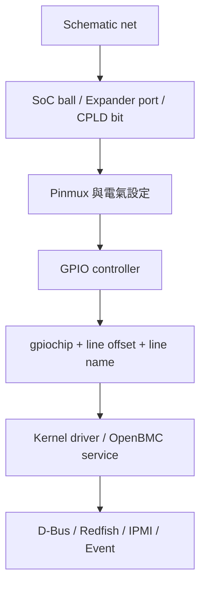
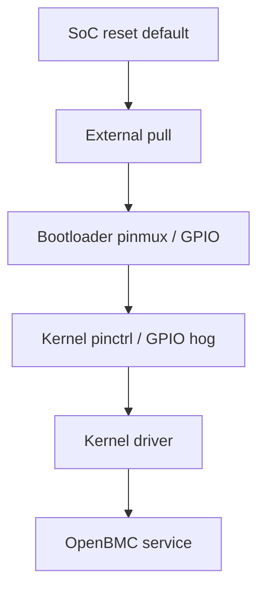
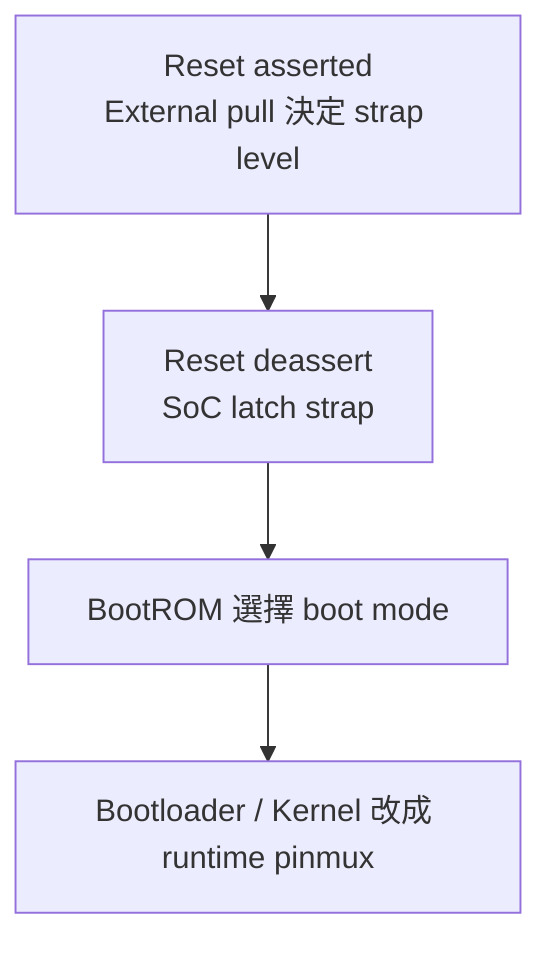

# 3. Pinmux 與 GPIO 通用設計模式

## 適用範圍

本文件說明 BMC 平台的 Pinmux 與 GPIO 設計, 涵蓋 Device Tree, active level, reset default, GPIO expander, interrupt, OpenBMC mapping, 以及從 schematic 追蹤至 D-Bus, Redfish, IPMI 與事件的驗證方式.

## 適用讀者

- 負責 BMC 韌體, Linux kernel, Device Tree, OpenBMC service, 硬體整合或平台 bring-up 的開發與整合人員.
- 執行 Pinmux, GPIO, interrupt, presence, power, reset, LED, button, write protect 或 mux select 驗證與故障排查的人員.

## 快速導覽

- [理解 Pinmux, GPIO 與訊號對照](#31-pinpadball-與-net): 從 schematic net, SoC ball, GPIO line 追蹤至 OpenBMC object.
- [確認 Pinctrl 與 GPIO 設定](#34-linux-pinctrl-framework): Pinctrl state, GPIO controller, line name 與 consumer.
- [驗證訊號極性與啟動交接](#38-active-level-與-logical-value): Active level, logical value, reset default 與 GPIO hog.
- [檢查 Expander, Interrupt 與 Debounce](#311-gpio-expander): GPIO expander bring-up, interrupt trigger 與 debounce.
- [核對 OpenBMC 整合](#316-openbmc-integration): Inventory, LED, power control 與介面狀態.
- [執行排查與驗收](#319-target-端排查流程): Target 檢查, Debug Log, bring-up 順序與驗收 Checklist.

Pinmux 決定 SoC pin 要連接 GPIO, I2C, UART, PWM 或其他硬體功能; GPIO 則讓 Linux 與 OpenBMC 讀取或控制單一數位訊號. BMC 平台的 power, reset, presence, fault, LED, button, write protect 與 mux select 都常經過這兩層.

本章從 pin, pinmux 與 GPIO 的關係開始, 接著說明 Device Tree, active level, reset default, GPIO expander, interrupt, OpenBMC mapping, 以及如何從 schematic 一路追到 D-Bus 與 Redfish.

### 3.0 先建立 Pinmux 與 GPIO 的理解模型

閱讀這個主題時，最容易混淆的是把 pin、pinmux、GPIO、訊號名稱與 OpenBMC 狀態視為同一件事。它們其實位於不同層級：

```text
主板電路          Schematic net、pull resistor、buffer、level shifter
                        ↓
SoC 封裝           Ball / package pin
                        ↓
SoC I/O cell        Pad、電氣設定、power domain
                        ↓
Pinmux              選擇 GPIO / I2C / UART / PWM / SPI 等功能
                        ↓
GPIO controller     Direction、input value、output value、edge detection
                        ↓
Linux GPIO line     gpiochip、offset、line name、consumer、active flag
                        ↓
Kernel / Service    Driver、GPIO hog、OpenBMC service
                        ↓
管理介面            D-Bus、Redfish、IPMI、event log
```

因此，看到「GPIO 不正常」時，至少可能有六種不同問題：

1. Schematic 上接到的 net 或 ball 與預期不同。
2. Pinmux 沒有選成 GPIO，而是仍由 UART、PWM 或其他 peripheral 使用。
3. Pin configuration 的 pull、open-drain、input enable 或 drive strength 不合適。
4. GPIO controller 的 direction、active level 或 interrupt type 不正確。
5. Line 已被另一個 kernel driver、hog 或 userspace process 擁有。
6. 底層 GPIO 正常，但 OpenBMC 的 polarity、state mapping 或 event policy 錯誤。

排查時應逐層確認，不宜把 `gpioinfo` 看得到 line，直接視為整條功能路徑正常。

#### 3.0.1 Pinmux 和 GPIO 分別回答什麼問題

- **Pinmux 回答**：「這顆實體 pin 現在交給哪個硬體功能使用？」
- **Pin configuration 回答**：「這顆 pin 的電氣行為如何設定？」
- **GPIO controller 回答**：「若它被選成 GPIO，方向、輸出與輸入值是什麼？」
- **GPIO consumer 回答**：「目前由哪個 driver 或 process 使用這條 line？」
- **OpenBMC mapping 回答**：「這個 logical state 對產品功能代表什麼？」

例如 `PSU0_PRSNT_N` 為 Low，不代表所有層都應顯示 `0`：

```text
實體腳位 Low
→ Hardware signal asserted
→ GPIO descriptor 套用 ACTIVE_LOW
→ Consumer 取得 logical active = 1
→ Inventory Present = true
```

#### 3.0.2 一條 GPIO 的完整文件應回答什麼

對每條重要訊號，至少應能回答：

- Schematic net name 與 revision 是什麼？
- 接到 SoC ball、GPIO expander port，還是 CPLD register bit？
- Runtime function 是 GPIO 還是 alternate function？
- Active level、外部 pull 與 voltage domain 是什麼？
- Reset、Bootloader、Kernel 與 service 各階段由誰控制？
- Linux gpiochip label、line offset、line name 與 consumer 是什麼？
- 它是 input、output、interrupt、strap，還是多重用途？
- D-Bus / Redfish / IPMI 對應到哪個 object 或 property？
- 哪些測試可安全執行，哪些動作可能造成 power、reset 或安全影響？

後續各節就是用來回答這些問題。

## 3.1 Pin, Pad, Ball 與 Net

同一條硬體訊號在不同文件中會使用不同名稱.

| 名稱 | 所在位置 | 用途 |
|---|---|---|
| Net name | Schematic | 描述板上訊號, 例如 `PSU0_PRSNT_N` |
| Ball / Pin | SoC package | 描述封裝腳位, 例如 `A12` |
| Pad | SoC 內部 I/O cell | Pinmux 與 pin configuration 的對象 |
| GPIO line | Linux GPIO controller | 描述 gpiochip 中的 line offset |
| Line name | Device Tree / driver | 提供人類可讀的功能名稱 |
| D-Bus object | OpenBMC | 描述 inventory, sensor 或 control |

完整追蹤路徑:



例如:

```text
PSU0_PRSNT_N
        ↓
SoC ball A12
        ↓
GPIO function
        ↓
gpiochip0 line 24，line name psu0-present-n
        ↓
PSU presence service
        ↓
Inventory Present=true / false
```

每一條重要訊號都應保留這份對照, 避免只記錄 GPIO number.

## 3.2 Pinmux 是什麼

一個 SoC pin 通常支援多種功能, 例如:

```text
Pin A12
├── GPIOA3
├── UART5_RX
├── I2C8_SDA
└── PWM2
```

Pinmux 選擇其中一種功能.若硬體將 A12 接成 I2C SDA, 但 software 選成 GPIO, I2C controller 即使 probe 成功, 也無法在外部 pin 上送出正確訊號.

### 3.2.1 Alternate Function

GPIO 是 pin 的其中一種功能; I2C, UART, PWM, SPI 等則是 alternate functions.Peripheral driver 通常透過 pinctrl state 要求正確功能.

```text
I2C driver probe
        ↓
套用 pinctrl default state
        ↓
Pinmux 選擇 I2C function
        ↓
Controller 驅動 SDA / SCL
```

### 3.2.2 Pinmux 衝突

同一個 pin 同一時間只能提供一組互斥功能.常見衝突:

- GPIO 與 UART 共用.
- GPIO 與 PWM 共用.
- I2C 與專用 sideband signal 共用.
- Boot strap 與 runtime GPIO 共用.
- JTAG 與一般 GPIO 共用.

Device Tree 中同時啟用兩個使用相同 pin group 的 peripherals, 可能造成 probe failure, 後套用的 state 覆蓋前者, 或硬體輸出異常.

#### 3.2.3 Pinmux 不等於 GPIO Direction

Pinmux 選成 GPIO，只表示該 pad 被路由到 GPIO controller；它還沒有決定這條 line 是 input 或 output。Direction 通常由 GPIO consumer 在要求 line 時設定。

```text
Pinmux = GPIO function
        ↓
GPIO controller 可看見這條 line
        ↓
Consumer request line
        ↓
設定 input 或 output，以及初始 output value
```

反過來，如果 pinmux 仍為 UART TX，即使程式嘗試把對應 GPIO offset 設為 output，實體 pin 也可能仍由 UART controller 驅動。這是「register 看似有改，pin 電壓卻沒變」的常見方向之一。

#### 3.2.4 Pinmux 的 Owner 與切換時機

Pinmux 可能在多個階段被設定：

```text
SoC reset default
→ BootROM / strap sampling
→ Bootloader pinmux
→ Kernel pinctrl default state
→ Driver runtime / sleep state
```

Kernel 啟動後看到的 pinctrl 狀態，只能代表當下狀態，不能證明 reset release 或 Bootloader 階段沒有短暫切錯。對 power enable、reset、flash mux、write protect 與 boot strap，應搭配示波器或 logic analyzer 觀察完整時間線。

#### 3.2.5 如何判斷 Pinmux 衝突

Pinmux 衝突不一定總是以 probe failure 呈現。不同 SoC 與 driver 可能出現：

- Pinctrl core 拒絕第二個 owner，並在 kernel log 留下 request failure。
- 後套用的 state 改寫 mux，使先前 peripheral 不再有外部波形。
- Bootloader 設定正確，但 Kernel 套用另一組 state 後功能消失。
- Debug/JTAG 或 secure mode 鎖住 pin function，使一般 DTS 設定無法生效。

第一輪應同時比對 running DTB、pinctrl debugfs、consumer probe log 與實體波形，而不是只確認 source DTS 中存在某個 pinctrl node。

## 3.3 Pin Configuration

Pin configuration 描述 pin 的電氣行為, 常見項目包括:

- Bias pull-up.
- Bias pull-down.
- Bias disable.
- Drive strength.
- Open-drain.
- Input enable.
- Output enable.
- Schmitt trigger.
- Slew rate, 依 SoC 支援.

### 3.3.1 Pull-up 與 Pull-down

Input 或 Hi-Z pin 需要穩定的預設電位.電位來源可能是:

- 板上的外部 resistor.
- SoC 內部 pull.
- CPLD 或其他 device 的 output.
- Level shifter 的預設狀態.

關鍵訊號應優先確認 schematic 上的 external pull, 不能只依 DTS 的 `bias-pull-up` 推測實體狀態.部分 SoC pull 很弱, 也可能在 reset 階段尚未生效.

### 3.3.2 Drive Strength

Drive strength 影響 output 能提供的電流與 edge rate.設定過小可能無法在負載下達到有效電位; 設定過大可能增加 overshoot, EMI 與 ringing.

I2C open-drain line 的上升時間主要由 pull-up 與 bus capacitance 決定, 不應以 push-pull drive strength 取代正確的 I2C 電氣設計.

### 3.3.3 Open-drain

Open-drain output 可主動拉低, High state 則由 pull-up 提供.常見於:

- I2C SDA / SCL.
- Shared interrupt.
- Wired-OR fault.
- Reset / alert sideband.

文件需記錄 pull-up voltage domain, 尤其跨 power domain 時要確認 back-powering 與 power-off leakage.

## 3.4 Linux Pinctrl Framework

Linux pinctrl framework 管理:

- Pin enumeration.
- Pin groups.
- Pinmux functions.
- Pin configuration.
- Device 的 pinctrl states.

### 3.4.1 Pinctrl State

常見 state:

- `default`:device 正常工作時使用.
- `sleep`:suspend 或低功耗時使用.
- `idle`:device 暫時閒置時使用.

實際 state 由 driver 與 binding 決定.

Device Tree 範例:

```dts
&pinctrl {
    pinctrl_i2c5_default: i2c5-default {
        function = "I2C5";
        groups = "I2C5";
    };
};

&i2c5 {
    status = "okay";
    pinctrl-names = "default";
    pinctrl-0 = <&pinctrl_i2c5_default>;
};
```

`function`, `groups`, `pins` 與 pinconf properties 依 SoC binding 定義, 不可直接把其他 SoC 的範例複製過來.

### 3.4.2 Pinctrl 何時套用

Device driver probe 時, driver core 通常會選擇 `default` state.若 device 未啟用, driver 尚未 probe 或 state reference 錯誤, pin 可能保持 bootloader 或 reset default.

排查 peripheral 時需同時確認:

- Running DTB 中有正確 pinctrl node.
- Consumer node 使用正確 `pinctrl-0`.
- Pinctrl driver 已 probe.
- Pin 未被其他 function 使用.
- Secure mode / strap 沒有限制該 function.

## 3.5 GPIO Controller, Chip 與 Line

GPIO controller 向 Linux 註冊一組 GPIO lines, 例如:

- SoC GPIO bank.
- I2C GPIO expander.
- SPI GPIO expander.
- FPGA / CPLD GPIO controller driver.

Linux character device 通常顯示為:

```text
/dev/gpiochip0
/dev/gpiochip1
```

### 3.5.1 Line Offset

Line offset 是該 gpiochip 內的編號:

```text
gpiochip0 line 0
gpiochip0 line 1
...
```

Line offset 與 SoC ball name, schematic pin number 或舊式 global GPIO number 分屬不同表示方式.

### 3.5.2 gpiochip 編號

`gpiochip0`, `gpiochip1` 可能受 driver probe 順序影響.加入 expander, 改成 module 或調整 kernel 後, chip number 可能改變.

腳本與 service 應優先使用:

- Line name.
- Chip label + offset.
- Device path.

### 3.5.3 Line Name

`gpio-line-names` 為每條 line 提供功能名稱:

```dts
&gpio0 {
    gpio-line-names =
        "pwrbtn-n", "pltrst-n", "host-pgood", "bios-wp-n",
        "psu0-present-n", "psu1-present-n", "fan0-present-n", "fan1-present-n";
};
```

名稱順序必須和 controller 的 line offsets 完全一致.

## 3.6 libgpiod 工具

現代 Linux GPIO userspace 介面使用 GPIO character device 與 libgpiod.

### 3.6.1 列出 Controllers

```bash
gpiodetect
```

### 3.6.2 查看 Lines

```bash
gpioinfo
gpioinfo gpiochip0
```

輸出可包含:

- Line offset.
- Line name.
- Direction.
- Active-low flag.
- Consumer.
- Bias, 依 kernel / driver 支援.

### 3.6.3 尋找 Line

```bash
gpiofind psu0-present-n
```

不同 libgpiod versions 的 command syntax 與輸出格式可能不同, 正式腳本需依 target 版本驗證.

### 3.6.4 讀取 Input

libgpiod v1 常見形式:

```bash
gpioget gpiochip2 3
```

新版工具可提供不同參數形式.執行前應查看:

```bash
gpioget --help
```

### 3.6.5 監看 Edge

```bash
gpiomon --num-events=5 gpiochip2 3
```

適合 presence, button, intrusion 與 interrupt bring-up.若 line 已由 kernel driver 接管, userspace 可能無法再次要求該 line.

### 3.6.6 設定 Output

`gpioset` 會要求 line 並設定 output.不同版本對 line 保持時間與 daemonize mode 的行為不同.

只應對已核准的低風險測試線使用.Power enable, reset, write protect, strap 與 mux select 需要先確認 owner, active level 與副作用.

## 3.7 GPIO Consumer

Consumer 是要求 GPIO line 的 kernel driver 或 userspace process.

Device Tree 常使用:

```dts
some_device@40 {
    compatible = "vendor,some-device";
    reg = <0x40>;

    reset-gpios = <&gpio0 12 GPIO_ACTIVE_LOW>;
    enable-gpios = <&gpio0 13 GPIO_ACTIVE_HIGH>;
};
```

Driver 透過 descriptor-based GPIO API 取得 `reset` 與 `enable` lines.`gpioinfo` 通常可顯示 consumer name, 協助確認 line 已由誰使用.

### 3.7.1 Property 命名

GPIO Device Tree property 通常使用:

```text
<function>-gpios
```

例如:

- `reset-gpios`
- `enable-gpios`
- `presence-gpios`
- `power-gpios`

Property 名稱, cell 數量與 flags 需依該 device binding.

### 3.7.2 Line Busy

當 line 已被 driver, GPIO hog 或 userspace process 要求, 再使用 `gpioget` / `gpioset` 可能收到 busy error.此時應先查看 consumer, 不應透過強制解除 driver 來繞過正常 ownership.

#### 3.7.3 Descriptor-based GPIO 的語意

現代 Linux driver 通常透過 GPIO descriptor API 使用 line，而不是依賴全域 GPIO number。Device Tree 中的 active flag 會成為 descriptor 的一部分，consumer API 通常取得 logical value。

以 `reset-gpios = <&gpio0 12 GPIO_ACTIVE_LOW>;` 為例：

```text
Consumer 要求 assert reset
→ logical value = 1
→ descriptor 套用 ACTIVE_LOW
→ physical output = Low
```

Driver 若使用 logical API，就不應再次手動反相；否則可能造成 double inversion。若 driver 刻意使用 raw API，文件與程式應明確說明，因為 raw value 直接描述 controller level，不套用 active-low 語意。

#### 3.7.4 Request 與初始 Output Value

對 output line，安全的作法是要求 line 時同時指定初始 logical value，避免先要求成 input、之後再改 output 所形成的短暫 glitch。實際是否能完全無 glitch，仍受 GPIO controller、pinctrl、外部 pull 與硬體設計影響。

關鍵 output 應記錄：

- request 前的 reset/default level。
- request 時的初始 logical value。
- polarity 轉換後的 physical level。
- driver remove、service restart 與 BMC reboot 時 line 如何處理。
- consumer 釋放 line 後由 external pull 拉到什麼狀態。

## 3.8 Active Level 與 Logical Value

Active level 描述訊號在何種 physical level 下具有功能意義.

以 `PSU0_PRSNT_N` 為例:

```text
Physical Low
        ↓
PSU presence asserted
        ↓
GPIO_ACTIVE_LOW 轉換
        ↓
Logical active = 1
        ↓
Inventory Present = true
```

### 3.8.1 Physical 與 Logical

| 層級 | `PSU0_PRSNT_N` 插入時 |
|---|---|
| Pin voltage | Low |
| Hardware signal | Asserted |
| DTS flag | `GPIO_ACTIVE_LOW` |
| gpiod logical value | Active / 1, 依工具是否採 logical mode |
| OpenBMC | `Present=true` |

工具版本與 options 可能決定顯示 raw 或 logical value, 因此測試紀錄應直接寫出:

- Pin 實測電壓.
- DTS active flag.
- Tool command 與輸出.
- OpenBMC property.

### 3.8.2 名稱中的 `_N`

`_N`, `#` 或 `L` 通常表示 Low active, 但最終仍需以 schematic, datasheet 與實測確認.External inverter, level shifter 或 CPLD logic 都可能改變 BMC pin 看到的 polarity.

#### 3.8.3 完整極性判讀案例：BIOS_WP_N

假設硬體定義 `BIOS_WP_N = Low` 時啟用寫入保護，而 BMC GPIO 直接連到該 net：

```text
功能需求：啟用寫入保護
Hardware asserted level：Low
DTS：GPIO_ACTIVE_LOW
Consumer logical request：1
Physical output：Low
結果：Write protection enabled
```

若更新流程要暫時解除保護：

```text
Consumer logical request：0
Physical output：High
結果：Write protection disabled
```

但如果中間存在反相 buffer 或 CPLD，BMC pin 的 physical level 可能與 flash WP pin 不同。因此正式紀錄至少要分別寫出：BMC-side voltage、經過的邏輯元件、flash-side voltage，以及最終功能狀態。

#### 3.8.4 常見的極性錯誤

- Schematic net 名稱有 `_N`，程式又額外反相一次。
- DTS 使用 `GPIO_ACTIVE_LOW`，service config 同時設定 `inverted=true`。
- `gpioget` 的工具版本或選項顯示 logical value，但測試者把它當 raw level。
- CPLD register 已經提供解碼後狀態，OpenBMC 又依 net name 反相。
- Expander pin 經過 transistor 或 level shifter，實際 polarity 與 SoC-side 假設不同。

排查時應建立 truth table，並分別記錄 physical level、asserted state、descriptor logical value 與產品 property，不要只寫「0/1 顛倒」。

## 3.9 Reset Default 與控制權交接

一條 output signal 在系統啟動期間可能經過多個 owner:



每次交接都可能產生短暫 glitch.Power enable, reset, write protect 與 flash mux 需量測完整時間線.

### 3.9.1 Safe Default

| 訊號 | 常見安全預設 |
|---|---|
| `VR_EN` | Disable |
| `PSU_ON_N` | Deassert / PSU off |
| `PERST_N` | Assert reset, 直到條件滿足 |
| `BIOS_WP_N` | Write protection enabled |
| Flash mux | Boot owner / protected owner |

實際安全狀態由平台設計決定.文件需記錄 physical level, 而不是只寫 high / low 的功能推測.

### 3.9.2 BMC Reboot

若產品要求 BMC reboot 時 Host 繼續運作, 需確認:

- SoC GPIO reset default.
- External pull.
- CPLD 是否維持 output.
- Kernel handoff gap.
- Power-control service 重新啟動行為.
- Line ownership 是否會短暫釋放.

## 3.10 GPIO Hog

GPIO hog 讓 kernel 在 GPIO controller 註冊時立即要求 line 並設定 input 或 output.

```dts
&gpio0 {
    bios_wp_default: bios-wp-default-hog {
        gpio-hog;
        gpios = <10 GPIO_ACTIVE_HIGH>;
        output-high;
        line-name = "bios-wp-default";
    };
};
```

適合:

- Kernel early boot 必須保持的安全線.
- 不需要後續動態變更的 strap / mux default.
- Driver 尚未 probe 前要維持的固定狀態.

若後續 driver 或 userspace 需要控制同一 line, hog 會造成 ownership conflict.這類訊號通常更適合由正式 consumer driver 從 early boot 接管.

`output-high` / `output-low` 描述 physical output level; 功能上的 enabled / disabled 仍需依電路判斷.

## 3.11 GPIO Expander

GPIO expander 透過 I2C, SPI 或其他 bus 增加 GPIO lines.例如 PCA9555 提供 16-bit GPIO.

```dts
&i2c7 {
    status = "okay";

    gpio_expander0: gpio@20 {
        compatible = "nxp,pca9555";
        reg = <0x20>;
        gpio-controller;
        #gpio-cells = <2>;

        gpio-line-names =
            "psu0-present-n", "psu1-present-n",
            "riser0-present-n", "riser1-present-n",
            "fanboard0-present-n", "fanboard1-present-n",
            "cable0-present-n", "cable1-present-n",
            "fault-led", "uid-led",
            "reserved-exp0-10", "reserved-exp0-11",
            "wp-enable", "mux-sel0", "mux-sel1", "expander-int-n";
    };
};
```

### 3.11.1 Bring-up 順序

```text
I2C root adapter
        ↓
Mux child adapter，若有
        ↓
Expander address ACK
        ↓
Expander driver probe
        ↓
新的 gpiochip 出現
        ↓
Line names 與方向驗證
```

### 3.11.2 Reset 與 Supply

Expander outputs 的 power-on default 由 expander datasheet, reset pin 與 external pull 決定.若 expander 位於 Host power domain, Host off 時可能整顆 GPIO controller 消失, OpenBMC service 需要處理 unavailable 與重新 probe.

### 3.11.3 Interrupt

部分 expander 提供 INT output, 通知 input 發生變更.需確認:

- INT active level.
- Interrupt parent.
- Trigger type.
- Shared interrupt behavior.
- Read input register 後如何清除 interrupt.

## 3.12 Interrupt GPIO

GPIO input 可作為 interrupt source, 但 GPIO value 與 interrupt configuration 是不同設定.

```dts
some_device@40 {
    compatible = "vendor,some-device";
    reg = <0x40>;

    interrupt-parent = <&gpio0>;
    interrupts = <14 IRQ_TYPE_LEVEL_LOW>;
};
```

### 3.12.1 Edge 與 Level

- Rising edge:Low → High 時觸發.
- Falling edge:High → Low 時觸發.
- Both edges:兩種轉換都觸發.
- Level high / low:電位維持有效時持續視為 asserted.

Level interrupt handler 必須清除 device 內部 status source, 否則 IRQ 會持續觸發.

### 3.12.2 Shared Interrupt

Wired-OR / open-drain interrupt 可能由多顆 devices 共用.Handler 需要讀取所有可能 sources 的 status, 並清除真正的來源.

### 3.12.3 `/proc/interrupts`

```bash
cat /proc/interrupts
watch -n 1 cat /proc/interrupts
```

配合 scope / logic analyzer 判斷:

- Pin 是否真的跳變.
- IRQ count 是否增加.
- Driver 是否進入 handler.
- Status 是否被清除.

#### 3.12.4 Interrupt 的完整處理鏈

GPIO interrupt 能正常工作，至少要完成以下鏈條：

```text
Device 內部事件發生
→ Device 拉動 INT pin
→ Pinmux 將 pad 設為 GPIO / interrupt function
→ GPIO controller 偵測 edge 或 level
→ Parent interrupt controller 收到 IRQ
→ Kernel handler 讀取 device status
→ Handler 清除或解除真正的 interrupt source
→ INT pin 回到 inactive
```

若 `/proc/interrupts` 計數不增加，問題可能在 pin 電位、pinmux、GPIO IRQ mapping、parent interrupt 或 trigger type。若計數快速增加，則可能是 level source 未清除、polarity 錯誤，或 shared IRQ 中仍有其他 device 保持 asserted。

#### 3.12.5 Edge 和 Level 的選擇不是只看波形

- Edge trigger 適合事件以轉換表示，handler 不需等待 pin 回復才能解除 IRQ。
- Level trigger 適合 device 持續保持告警，直到 handler 清除內部 status。
- 使用 edge trigger 監看很短的 pulse 時，仍需確認 GPIO controller 能否捕捉 pulse width。
- 使用 both-edge 監看 presence 時，需處理插入、拔除及 debounce，避免將 bounce 建立成多筆事件。

Trigger type 應依 device datasheet、board wiring 與 driver clear flow 共同決定，不能只因 net 名稱以 `_N` 結尾就直接選 `IRQ_TYPE_LEVEL_LOW`。

## 3.13 Debounce

Mechanical button, presence switch 與 hot-plug connector 可能在變化時快速抖動.

Debounce 可由:

- RC circuit.
- CPLD.
- GPIO controller hardware.
- Kernel driver.
- Userspace service.

使用哪一層應有單一清楚 owner.多層 debounce 疊加可能造成反應過慢, 沒有 debounce 則可能產生 event storm.

需記錄:

- Debounce time.
- Rising / falling 是否相同.
- Short pulse 是否被忽略.
- 插入 / 拔除事件的穩定條件.
- BMC reboot 後初始狀態是否產生假 event.

## 3.14 Boot Strap 與 Runtime Function

部分 pin 在 reset deassert 附近被 SoC 當成 boot strap, 之後再切換為 GPIO 或 peripheral function.



檢查 strap 時應量測 reset 釋放附近的電位.Linux 啟動後的 `gpioinfo` 只能顯示 runtime state, 無法證明 boot-time strap 正確.

另外需要確認:

- CPLD / buffer 是否在 strap sampling 時驅動該 line.
- Runtime output 是否會影響下一次 warm reset.
- Strap pin 共用 LED / button 時的 pull 與負載.
- Secure boot, recovery, JTAG 相關 strap 具有適當保護.

## 3.15 常見訊號設計

### 3.15.1 Presence

```text
Physical connector presence pin
        ↓
GPIO / CPLD debounce
        ↓
OpenBMC presence service
        ↓
Inventory Present
        ↓
Sensor availability / Redfish inventory
```

存在來源可能是 GPIO, FRU EEPROM, PMBus response 或多種來源組合.平台需定義 priority 與 conflict handling.

### 3.15.2 Fault

Fault pin 可能是 live status, 也可能經 CPLD latch.若事件需要保留, 應分開 current fault 與 latched fault, 不應只輪詢瞬時 GPIO.

### 3.15.3 Reset

Reset output 需要確認:

- Active level.
- Minimum pulse width.
- Power-state gating.
- Reset target.
- BMC reboot behavior.
- External pull 與 CPLD override.

### 3.15.4 Power Enable

Power enable 需由 power sequence owner 控制.一般 debug script 不應直接切換, 因為 rail sequencing, PGOOD 與 fault interlock 可能位於 CPLD 或 power-control service.

### 3.15.5 Write Protect

Write-protect line 通常預設為 protected.解除流程需包含:

- Authorization.
- Target firmware / flash owner 確認.
- Host / BMC power state.
- Update window.
- Failure / reboot recovery.
- 更新後恢復保護.

### 3.15.6 LED

LED 需要記錄 polarity, owner, blink pattern 與 priority.BMC, CPLD 與 front-panel hardware 同時可控制時, 需要明確 arbitration.

### 3.15.7 Button

Button 需要 debounce, short / long press 判斷與 event owner.Power button 與 reset button 可能由 CPLD 直接產生 pulse, 也可能交給 OpenBMC service 決策.

## 3.16 OpenBMC Integration

### 3.16.1 Inventory Presence

Presence GPIO 最終常映射為:

```text
xyz.openbmc_project.Inventory.Item.Present
```

可插拔元件還需同步處理:

- Inventory lifecycle.
- Sensor availability.
- FRU rescan.
- Associations.
- Insert / remove event.

### 3.16.2 Present, Available 與 Functional

| 狀態 | 意義 |
|---|---|
| Present | 實體是否存在 |
| Available | 目前資料或服務是否可取得 |
| Functional | 元件是否能正常提供功能 |

例如 PSU 插入但 PMBus 暫時 timeout:

```text
Present=true
Available=false
Functional 尚不一定立即變成 false
```

### 3.16.3 LED

GPIO-controlled LED 可由 Linux LED class, phosphor-led-manager 或 platform service 控制.Redfish identify state, D-Bus LED group 與 physical LED 必須一致.

### 3.16.4 Power Control

Power-control service 可能讀取:

- `PWRBTN_N`
- `PLTRST_N`
- `SLP_Sx`
- `PSU_PGOOD`
- `VR_PGOOD`
- `SYS_PWROK`

並控制:

- Power button pulse.
- Reset pulse.
- Rail enable, 依平台架構.

這些訊號的 owner, active level, time constraint 與 reset behavior 都需實測.

## 3.17 SoC GPIO, Expander 與 CPLD 的邊界

| 類型 | 存取方式 | 需要記錄 |
|---|---|---|
| SoC GPIO | `/dev/gpiochip*` | Pinctrl, line offset, line name |
| I2C GPIO expander | GPIO cdev + I2C device | Bus path, address, reset, supply |
| CPLD bit | I2C / LPC / MMIO / driver | Register, bit, access, latch, clear |
| MCU state | Mailbox / I2C / UART / D-Bus | Protocol, firmware, timeout |
| Host sideband | eSPI / LPC / GPIO passthrough | Owner, host power state, BIOS config |

CPLD fault latch 即使被 driver 暴露成 GPIO-like state, 仍要保留 read-clear, W1C, sticky 與 reset domain 等 register 語意.

### 3.17.1 完整案例：PSU Presence 從接點到 Redfish

假設 PSU 插入後，connector 將 `PSU0_PRSNT_N` 拉低，訊號經 GPIO expander 傳給 BMC：

```text
PSU connector contact closes
→ PSU0_PRSNT_N = Low
→ PCA9555 port 0 input = 0
→ Device Tree 將 line 描述為 GPIO_ACTIVE_LOW
→ GPIO consumer 取得 logical active = 1
→ Presence service 設定 Inventory Present = true
→ PSU sensor / FRU 開始建立或啟用
→ Redfish PowerSupply 資源顯示 Present
```

若 Redfish 顯示 PSU 不存在，可依下列順序縮小範圍：

1. 電表或 scope 確認 expander pin 是否真的為 Low。
2. 確認 I2C adapter、mux channel 與 expander address 可存取。
3. 確認 expander driver probe，並出現對應 gpiochip。
4. 確認 line offset、line name、direction 與 consumer。
5. 比較 raw physical level 和 descriptor logical state。
6. 檢查 presence service 設定與 D-Bus `Present` property。
7. 確認 inventory association 與 Redfish mapping。

若拔插時產生多筆事件，則進一步確認 connector bounce、CPLD／service debounce，以及是否有多個 owner 同時建立事件。

### 3.17.2 完整案例：Reset Output 的安全交接

假設 BMC GPIO 控制 active-low 的 `SLOT_RESET_N`：

```text
External pull-down
→ SoC reset 階段保持 reset asserted
→ Bootloader 不改變該 pin
→ Kernel pinctrl 選為 GPIO
→ Slot driver request output，初始 logical asserted
→ Slot power 與 PGOOD 成立
→ Driver logical deassert
→ Physical pin 轉為 High，解除 reset
```

需要注意的不是只有最終 High/Low，而是每次 owner 交接是否產生短暫 High pulse。若 slot 尚未供電就短暫解除 reset，可能造成裝置狀態不確定。這類訊號需用 waveform 驗證，而不能只以 `gpioinfo` 的穩態輸出判斷。

## 3.18 Kernel 與 Yocto

常見 kernel functions:

- GPIOLIB.
- GPIO character device.
- Pinctrl / pinmux / pinconf.
- SoC GPIO driver.
- GPIO expander driver.
- DebugFS, 若開發映像需要.

Target:

```bash
zcat /proc/config.gz | grep -Ei 'GPIO|GPIOLIB|PINCTRL|PINMUX|PINCONF'
ls -l /dev/gpiochip*
```

Build:

```bash
bitbake -e virtual/kernel | grep '^S='
find tmp/work -path '*linux*' -name '.config' -print
```

若 expander driver 編成 module, 依賴該 gpiochip 的 service 需要處理 module load 與 probe timing.

## 3.19 Target 端排查流程

### 3.19.1 Schematic 與 DTB

先確認:

- Net name 與 SoC ball.
- Pin function.
- External pull.
- Level shifter / buffer.
- Power domain.
- Running DTB.

不能只看 source DTS; bootloader 可能載入另一份 DTB.

### 3.19.2 Pinctrl

```bash
mount | grep debugfs >/dev/null || \
    mount -t debugfs debugfs /sys/kernel/debug

find /sys/kernel/debug/pinctrl -maxdepth 2 -type f -print
cat /sys/kernel/debug/pinctrl/*/pins 2>/dev/null
cat /sys/kernel/debug/pinctrl/*/pinmux-pins 2>/dev/null
cat /sys/kernel/debug/pinctrl/*/pinconf-pins 2>/dev/null
cat /sys/kernel/debug/pinctrl/*/gpio-ranges 2>/dev/null
```

檢查目標 pin 的 function, owner 與 GPIO range.

### 3.19.3 GPIO

```bash
gpiodetect
gpioinfo
gpiofind <line-name>
```

確認 chip label, offset, name, direction, active flag 與 consumer.

### 3.19.4 Physical Level

以電表, 示波器或 logic analyzer 確認:

- Input voltage.
- Output transition.
- Reset / boot 時間線.
- Glitch.
- Edge / debounce.
- BMC reboot 與 Host power transition.

### 3.19.5 OpenBMC

```bash
systemctl --failed
journalctl -b --no-pager | \
    grep -Ei 'gpio|presence|power|reset|intrusion|led|button'

busctl tree xyz.openbmc_project.ObjectMapper | \
    grep -Ei 'inventory|sensor|state|led'
```

## 3.20 常見問題與判讀

| 現象 | 流程大約停在哪裡 | 優先檢查 |
|---|---|---|
| `gpioinfo` 沒有 line name | DTB / controller | Running DTB, line order, driver probe |
| gpiochip number 改變 | Probe order | Line name, chip label, device path |
| Peripheral 沒有訊號 | Pinmux | Pinctrl state, function, conflict |
| GPIO 讀值和電壓相反 | Active level | DTS flag, inverter, logical / raw mode |
| Output 設定後 pin 不變 | Pinmux / ownership | Alternate function, consumer, CPLD override |
| `gpioset` 顯示 busy | Line 已被要求 | `gpioinfo` consumer, hog, driver |
| Presence 反相 | Mapping | Physical level, active flag, service config |
| Presence event 抖動 | Debounce | Scope, gpiomon, CPLD / service debounce |
| Interrupt count 不增加 | IRQ config | Trigger, parent, pinmux, scope |
| IRQ storm | Level source 未清除 | Device status, handler, shared IRQ |
| BMC reboot 造成 Host 掉電 | Safe default / handoff | Pull, hog, driver, power service, CPLD |
| Write protect 無法解除 | Polarity / owner | WP pin, mux, update state, security policy |
| LED 顯示反相 | Polarity / owner | LED class, GPIO, CPLD pattern |
| Button 誤動作 | Pull / debounce | Floating pin, RC, edge, service policy |

## 3.21 Debug Log 收集

以下腳本只收集狀態, 不要求或切換 GPIO output:

```bash
#!/bin/sh

OUT=/tmp/pinmux-gpio-debug
mkdir -p "$OUT"

cat /etc/os-release > "$OUT/os-release.txt" 2>&1
uname -a > "$OUT/uname.txt"
cat /proc/cmdline > "$OUT/proc-cmdline.txt"
cat /proc/device-tree/model > "$OUT/model.txt" 2>&1

dmesg -T > "$OUT/dmesg.txt"
journalctl -b --no-pager > "$OUT/journal.txt" 2>&1
systemctl --failed > "$OUT/systemctl-failed.txt" 2>&1

command -v gpiodetect >/dev/null 2>&1 && \
    gpiodetect > "$OUT/gpiodetect.txt" 2>&1
command -v gpioinfo >/dev/null 2>&1 && \
    gpioinfo > "$OUT/gpioinfo.txt" 2>&1

mount | grep debugfs >/dev/null 2>&1 || \
    mount -t debugfs debugfs /sys/kernel/debug

cat /sys/kernel/debug/gpio > "$OUT/debug-gpio.txt" 2>&1
find /sys/kernel/debug/pinctrl -maxdepth 3 -type f -print \
    > "$OUT/pinctrl-files.txt" 2>&1

for f in /sys/kernel/debug/pinctrl/*/pins \
         /sys/kernel/debug/pinctrl/*/pinmux-pins \
         /sys/kernel/debug/pinctrl/*/pinconf-pins \
         /sys/kernel/debug/pinctrl/*/gpio-ranges; do
    [ -f "$f" ] || continue
    name=$(echo "$f" | tr '/' '_')
    cat "$f" > "$OUT/$name.txt" 2>&1
done

tar czf "/tmp/pinmux-gpio-debug-$(date +%Y%m%d-%H%M%S).tar.gz" \
    -C /tmp pinmux-gpio-debug
```

## 3.22 Bring-up 順序

Pinmux 與 GPIO bring-up 建議依「先靜態資料、再唯讀狀態、最後才進行控制測試」的順序進行。

#### 3.22.1 建立靜態對照

1. 從 schematic 取得 net name、SoC ball／expander port／CPLD bit。
2. 記錄 active level、external pull、voltage domain、buffer／inverter 與 power source。
3. 從 SoC datasheet 或 pinctrl binding 找到對應 pin group 與可選 function。
4. 確認訊號是否同時為 boot strap、JTAG、UART 或其他共用功能。
5. 記錄 reset default，以及 Bootloader、Kernel、driver、service 的預期 owner。

輸出應是一列可追蹤的訊號紀錄，而不是只有「GPIO 24」。

#### 3.22.2 確認 Running Software

1. 確認 Bootloader 實際載入的 DTB 與 source revision 相符。
2. 確認 pinctrl、GPIO controller 與 expander driver 已 probe。
3. 透過 pinctrl debugfs 確認目標 pad 的 function、group 與 owner。
4. 使用 `gpiodetect`、`gpioinfo`、`gpiofind` 記錄 chip label、offset、line name、direction、active flag 與 consumer。
5. 確認沒有 GPIO hog、kernel driver 與 userspace service 重複要求同一 line。

#### 3.22.3 驗證 Input

Input 測試應同時保存：

```text
測試條件
→ 實體 pin voltage / waveform
→ gpioinfo direction 與 active flag
→ gpioget 或 driver 取得的 logical state
→ D-Bus property
→ Redfish / IPMI / event 結果
```

對 presence、button 與 intrusion，還要測試 debounce、短脈波、插拔、BMC reboot 初始狀態及 event 次數。

#### 3.22.4 驗證 Output

Output 測試前先依風險分類：

- **低風險**：測試專用 GPIO、非關鍵 LED。
- **中風險**：一般 mux select、非關鍵 reset，需確認 target 狀態。
- **高風險**：power enable、Host reset、flash mux、write protect、CPLD reset。

高風險 line 不應用通用 `gpioset` 直接測試，應透過正式 driver 或 service，並確認 recovery path。測試至少量測 initial level、assert/deassert level、pulse width、glitch，以及 consumer 重新啟動和 BMC reboot 時的行為。

#### 3.22.5 驗證 Interrupt

1. 先確認 inactive 與 active physical level。
2. 確認 interrupt parent、line mapping 與 trigger type。
3. 觸發一次可控事件，觀察 waveform 與 `/proc/interrupts` count。
4. 確認 handler 讀取正確 status source。
5. 確認 clear 後 pin 回到 inactive，且沒有 IRQ storm。
6. 測試短脈波、重複事件、shared interrupt 與 service restart。

#### 3.22.6 驗證開機與控制權交接

至少測試四條時間線：

```text
AC on → BMC boot → OpenBMC ready
BMC warm reboot，Host 保持運作
Host power off → on
OpenBMC service restart
```

關鍵訊號需同步保存 waveform、Bootloader log、kernel log、gpio consumer 與 D-Bus state。若只看系統 ready 後的 GPIO state，無法發現 early-boot glitch。

#### 3.22.7 完成條件

Bring-up 完成不只是「GPIO 可以讀寫」，還應包含：

- Schematic、DTS、runtime line 與 OpenBMC object 可完整對照。
- Physical level、logical value 與產品語意一致。
- Reset default 與所有控制權交接符合安全需求。
- Interrupt、debounce、event 與 clear flow 已驗證。
- BMC reboot、Host transition 與 AC cycle 不造成非預期輸出。
- 高風險 line 只能由核准 owner 控制。
- 正常輸出、異常輸出、waveform 與測試結果已保存。

## 3.23 平台訊號紀錄表

| Signal | Hardware Pin | Linux Line | Active Level | Reset Default | Pull / Domain | Owner | Consumer | 風險 |
|---|---|---|---|---|---|---|---|---|
| `PWRBTN_N` | [待填] | [待填] | Low | [待填] | [待填] | BMC / CPLD | Power control | Critical |
| `PLTRST_N` | [待填] | [待填] | Low | Input | [待填] | Host / PCH | State monitor | High |
| `BIOS_WP_N` | [待填] | [待填] | Low | Protected | [待填] | BMC / Security | Update service | High |
| `PSU0_PRSNT_N` | [待填] | [待填] | Low | Input | [待填] | BMC / CPLD | Inventory | High |
| `FAN0_PRESENT_N` | [待填] | [待填] | Low | Input | [待填] | BMC | Fan service | High |
| `VR_FAULT_N` | [待填] | [待填] | Low | Input | [待填] | CPLD / HW | Fault service | High |
| `CHASSIS_INTRUSION_N` | [待填] | [待填] | Low | Input | [待填] | BMC / Security | Intrusion | Medium |
| `UID_LED` | [待填] | [待填] | [待填] | Off | [待填] | BMC / CPLD | LED manager | Medium |
| `I2C_MUX_SEL0` | [待填] | [待填] | [待填] | Safe channel | [待填] | BMC / CPLD | Bus owner | High |

每列再補充:

- Schematic revision.
- DTS node / property.
- gpiochip label / offset.
- Physical inactive / active voltage.
- Debounce / interrupt type.
- OpenBMC object.
- 已驗證情境與 waveform location.

## 3.24 驗收 Checklist

### Pinmux

- [ ] Schematic net, SoC ball, pin group 與 function 已對齊.
- [ ] Running DTB 包含正確 pinctrl states.
- [ ] 沒有互斥 peripheral 同時要求相同 pins.
- [ ] Pull, drive strength, open-drain 與 power domain 符合電路需求.
- [ ] Boot straps 在 reset sampling 時間點已量測.

### GPIO

- [ ] GPIO controller, chip label, line offset 與 line name 已記錄.
- [ ] 自動化流程不依賴可能變動的 gpiochip number.
- [ ] Active level 已由 physical voltage, DTS flag 與 OpenBMC state 交叉驗證.
- [ ] Kernel consumer, GPIO hog 與 userspace owner 沒有衝突.
- [ ] GPIO expander 的 bus, address, reset, supply 與 interrupt 已驗證.

### 關鍵訊號

- [ ] Power enable, reset, write protect 與 mux select 具有安全 reset default.
- [ ] BMC reboot 不會造成非預期 Host power / reset.
- [ ] Presence, fault, button 與 intrusion 已驗證 debounce.
- [ ] Interrupt trigger, count, handler 與 clear flow 正確.
- [ ] LED polarity, pattern 與 BMC / CPLD ownership 正確.

### OpenBMC

- [ ] Inventory Present, Available, Functional 語意正確.
- [ ] D-Bus, Redfish, IPMI 與 physical signal 一致.
- [ ] Hot-plug, service restart, AC cycle 與 Host power transition 已測試.
- [ ] Debug log 與 waveforms 已保存, 且收集腳本不會切換高風險 outputs.

## 3.25 本章重點

1. Pinmux 選擇 SoC pin 的硬體功能; GPIO 是其中一種可選功能.
2. Schematic net, SoC ball, GPIO line 與 D-Bus object 需要完整對照.
3. Pinctrl 同時管理 pinmux states 與 pull, drive, open-drain 等電氣設定.
4. GPIO line offset 屬於特定 gpiochip; gpiochip number 可能隨 probe 順序改變.
5. Active-low 訊號需要同時記錄 physical level 與 logical value.
6. Reset default 由 SoC, external pull, bootloader, hog, driver 與 service 共同形成時間線.
7. GPIO hog 適合固定 early-boot 狀態; 需要動態控制的 line 應由正式 consumer 接管.
8. GPIO expander 必須先完成 bus 與 driver bring-up, 才會出現對應 gpiochip.
9. Presence, fault, reset, power enable 與 write protect 需要明確的 owner 與安全流程.
10. 排查應從 schematic 與 physical level 開始, 再依序檢查 pinctrl, gpiochip, consumer 與 OpenBMC.

## 3.26 本章參考資料

- Linux kernel documentation - GPIO mappings: https://docs.kernel.org/driver-api/gpio/board.html
- Linux kernel documentation - GPIO character device userspace API: https://docs.kernel.org/userspace-api/gpio/chardev.html
- Linux kernel documentation - PINCTRL subsystem: https://docs.kernel.org/driver-api/pin-control.html
- Linux kernel Device Tree bindings - GPIO: https://github.com/torvalds/linux/tree/master/Documentation/devicetree/bindings/gpio
- libgpiod documentation: https://libgpiod.readthedocs.io/
- OpenBMC entity-manager: https://github.com/openbmc/entity-manager
