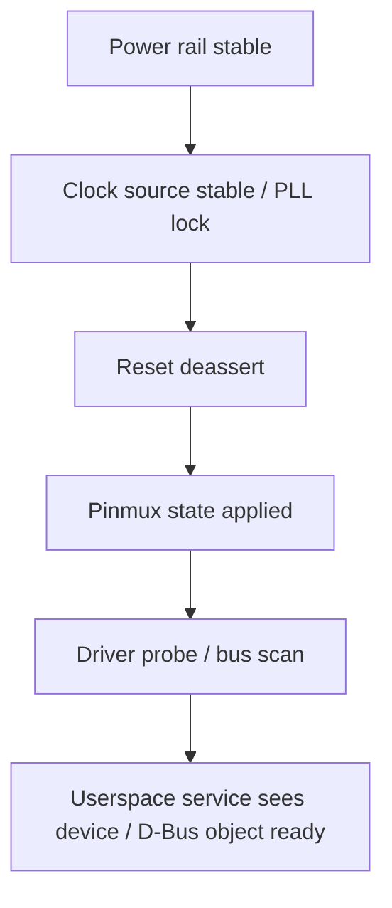

# 4. Reset、Clock 與 Power Domain

本章整理 BMC 平台中 reset、clock、power rail、regulator、power domain 與 ready signal 的共用設計模式與排查方法. 這一章和第 1 章 Boot Flow、第 3 章 Pinmux / GPIO、第 5 章周邊匯流排、第 16 章 Power Control 關係很密切; 差異在於本章聚焦「硬體 domain 是否已具備讓 device probe、bus transaction、host power transition 正常進行的前置條件」.

Reset / Clock / Power Domain 問題常呈現為: driver probe deferred、I2C / SPI / eMMC / MAC 無回應、PHY link 不起、host power sequence timeout、BMC reboot 影響 host、watchdog reset 後狀態不一致、周邊偶發消失. 排查時應同時檢查相關訊號, 需要同時把 rail、clock、reset、pinmux、driver binding、service policy、CPLD state、reset reason 串起來看.

## 適用範圍

本章涵蓋 BMC 平台中的 reset、clock、power rail、regulator、power domain、ready signal、相關時序量測, 以及 kernel 與 userspace 的 dependency 排查.

## 適用讀者

- 負責 BMC 硬體 bring-up、Linux kernel、Device Tree、OpenBMC power control 或平台驗證的人員.
- 需要排查 device probe、bus transaction、host power transition、reset reason 或 power sequence 問題的人員.

## 快速導覽

- [基本觀念與依賴關係](#41-基本觀念)
- [Reset 類型與影響範圍](#42-reset-類型與影響範圍)
- [Clock 類型與檢查重點](#43-clock-類型與檢查重點)
- [Power rail、regulator 與 power domain](#44-power-railregulator-與-power-domain)
- [DTS 範本](#45-dts-範本resetclockregulatorpower-domain)
- [Timing 與量測欄位](#47-timing-與量測欄位)
- [Reset reason 與 fault latch](#48-reset-reason-與-fault-latch)
- [Device probe deferred 排查](#410-device-probe-deferred-與-dependency-排查)
- [Bring-up 順序](#412-bring-up-順序)
- [驗收 Checklist](#414-驗收-checklist)

## 4.1 基本觀念

| 名詞 | 說明 | Bring-up 關注點 |
|----|----|----|
| Reset source | 產生 reset 的來源, 例如 POR IC、CPLD、SoC watchdog、BMC GPIO、host PCH | 需知道觸發條件與 reset 範圍 |
| Reset domain | 同一 reset source 或 reset controller 影響的一組電路 | 避免誤以為 BMC reset 不會影響 host sideband |
| Reset consumer | 被 reset 訊號控制的 device / block | 需知道 active level、minimum pulse width、release timing |
| Clock source | oscillator、crystal、PLL、clock generator、SoC internal clock | 需確認頻率、抖動、enable、source select |
| Clock consumer | 需要 clock 才能工作的 device / peripheral | driver probe 前 clock 是否已存在與已 enable |
| Power rail | 電源 rail, 例如 3V3_AUX、1V8、VCCIO、PHY_AVDD | voltage、ramp、PGOOD、dependency |
| Regulator | Linux 中可描述與管理的供電來源, 例如 fixed-regulator、PMIC regulator | constraints、enable GPIO、always-on、boot-on |
| Power domain | 一組共享供電 / clock / reset dependency 的硬體區塊 | domain on/off 順序與 runtime PM |
| Ready signal | 表示 domain 可用的訊號, 例如 PGOOD、PLL_LOCK、LINK_UP、CHANNEL_READY | 需定義何時可由軟體開始存取 |

常見 dependency:



若任一層缺資料, 後面看到的現象可能只是連鎖結果. 例如 I2C device ACK 不到, 方向可能是 I2C pinmux 錯、pull-up rail 未上、expander reset 未釋放、clock gate 未開、bus owner 還在 CPLD / Host、或 power domain 尚未 ready.

## 4.2 Reset 類型與影響範圍

| Reset 類型 | 常見來源 | 影響範圍 | 常見現象 | 必填資料 |
|----|----|----|----|----|
| POR / Power-on reset | reset IC、CPLD、PMIC | 全板或 BMC domain | AC cycle 後所有狀態回預設 | rail threshold、delay、release 條件 |
| Cold reset | power rail drop 後重新啟動 | BMC / host / full board | register state 全部消失 | 哪些 rail 被關閉、reset reason |
| Warm reset | 不掉主要供電, 只重置邏輯 | SoC / host / peripheral | 部分狀態保留, 問題較難重現 | reset signal、clock 是否持續 |
| BMC-only reset | BMC reset pin、watchdog、software reboot | BMC SoC 與 BMC-managed peripherals | BMC 重啟, host 可能繼續跑 | host sideband 是否受影響 |
| Host reset | PCH / CPU / CPLD / BMC 控制 | host domain | Host 重開, BMC 不重開 | PLTRST / RSMRST / SLP 與 POST 狀態 |
| Peripheral reset | SoC reset controller、GPIO reset | MAC、USB、I2C device、PHY、FPGA | 單一 device probe 或 runtime 失敗 | active level、pulse width、release delay |
| Watchdog reset | SoC watchdog、external watchdog、CPLD | BMC-only 或 full board | reset reason 顯示 watchdog | timeout、feed source、reset target |
| Brownout reset | rail droop、power fault | 受影響電源 domain | 隨機 reboot、flash corruption、device missing | rail waveform、fault latch、PGOOD log |

Reset 排查基本要求:

- 同時保存 reset reason register、CPLD reset latch、power fault latch、UART log、scope / LA waveform.
- 明確標示 reset 範圍: BMC-only、host-only、full board、單一 peripheral.
- 對 BMC reboot / watchdog reset 特別確認 host power 是否受到 side effect.
- 若 reset line 是 open drain 或由多方 wired-OR, 需列出所有可能拉低者.
- 若 reset line 由 CPLD pulse 產生, 需記錄 pulse width、stretch、debounce 與 clear rule.

## 4.3 Clock 類型與檢查重點

| Clock 類型 | 範例 | 檢查項目 | 常見風險 |
|----|----|----|----|
| Crystal / oscillator | 25MHz、24MHz、32.768kHz | 頻率、振幅、起振時間、load capacitor | BMC 無 early UART、RTC 不準、BootROM 失敗 |
| Reference clock | PCIe REFCLK、RGMII 125MHz、RMII 50MHz | source、enable、jitter、spread spectrum | link 不起、device training fail |
| SoC PLL | CPU / AHB / APB / peripheral PLL | lock 狀態、divider、parent clock | peripheral timeout、baud rate 錯 |
| Peripheral gate | I2C / SPI / UART / MAC clock gate | driver 是否 enable、runtime PM | driver probe deferred、bus 無 clock |
| External clock generator | clock buffer、clock generator IC | I2C config、OE pin、power rail | 多個 device 同時異常 |
| Host-provided clock | eSPI/LPC/PECI/PCIe sideband clock | host power state、PCH readiness | BMC service 在 host off 讀不到訊號 |

Clock bring-up 建議:

- 對 early boot 相關 clock, 例如 main crystal、SPI clock、UART clock, 優先以 scope 量測.
- 對 Linux driver 相關 clock, 檢查 DTS `clocks` / `clock-names`、kernel config、`/sys/kernel/debug/clk/clk_summary`.
- 對 network / PCIe / eSPI 類高速 clock, 確認 clock source、frequency、enable pin、reset timing 與 PHY / PCH dependency.
- 若 baud rate、PWM frequency、fan tach、I2C clock 異常, 除了 driver 設定, 也要檢查 parent clock 與 divider.

常用 clock debug:

```bash
$ mount | grep debugfs || mount -t debugfs debugfs /sys/kernel/debug
$ cat /sys/kernel/debug/clk/clk_summary 2>/dev/null | head -200
$ find /sys/kernel/debug/clk -maxdepth 2 -type f -print 2>/dev/null

$ dmesg | grep -Ei 'clk|clock|pll|osc|refclk|rate'
```

## 4.4 Power rail、regulator 與 power domain

Linux regulator framework 用於描述電壓 / 電流 regulator 與其 consumer, 常見能力包含 enable / disable、電壓設定、current limit 與 constraints. BMC 平台中不一定所有 rail 都由 Linux regulator 管理; 有些 rail 只由 CPLD / PMIC / analog circuit 控制, 但仍建議在本章記錄 dependency 與 ready 條件.

| 類型 | Linux 表達 | 適用情境 | 注意事項 |
|----|----|----|----|
| Fixed always-on rail | `regulator-fixed` + `regulator-always-on` | 3V3_AUX、1V8 standby | 仍需量測 ramp 與 ripple |
| GPIO controlled regulator | `regulator-fixed` + enable GPIO | PHY power、sensor power、slot power | active level 與 boot-on 預設需確認 |
| PMIC regulator | PMIC driver + regulator node | SoC core、DDR、peripheral rail | constraints 與 power sequence 必須對齊 datasheet |
| CPLD controlled rail | CPLD register / GPIO / D-Bus | host main rail、slot power | 記錄 register bit、PGOOD、fault latch |
| Host dependent rail | Host power state 控制 | eSPI、PECI、PCIe device | BMC service 需依 host state gating |
| External hot-swap / eFuse | HSC / eFuse driver 或 GPIO fault | riser、NVMe、PCIe slot | fault clear、retry、inrush policy |

Power domain 表格要同時填 rail、clock、reset、dependency、ready 條件. 只填 rail 名稱不足以排查 probe 問題.

## 4.5 DTS 範本: reset、clock、regulator、power domain

### 4.5.1 Reset controller consumer

``` dts
ethernet@1e660000 {
    compatible = "vendor,soc-mac";
    reg = <0x1e660000 0x1000>;
    resets = <&rst 12>;
    reset-names = "mac";
    clocks = <&syscon ASPEED_CLK_GATE_MAC1CLK>;
    clock-names = "macclk";
    status = "okay";
};
```

檢查重點:

- `resets` 與 `reset-names` 順序需與 driver 期待一致.
- shared reset 不適合任意放在多個 consumer node; 需確認 reset 影響範圍.
- 若 reset 其實是外部 IC 腳位, 通常用 `reset-gpios` 更直觀; 若是 SoC internal reset controller, 使用 `resets`.

### 4.5.2 Clock consumer

``` dts
uart5: serial@1e784000 {
    compatible = "ns16550a";
    reg = <0x1e784000 0x1000>;
    clocks = <&syscon ASPEED_CLK_APB>;
    clock-names = "uartclk";
    pinctrl-names = "default";
    pinctrl-0 = <&pinctrl_uart5_default>;
    status = "okay";
};
```

檢查重點:

- `clock-names` 必須與 driver 期待名稱一致.
- clock parent / divider 改變可能影響 UART baud、I2C bus speed、PWM frequency、MAC reference.
- debugfs `clk_summary` 可用來看 enable count、prepare count、rate、parent.

### 4.5.3 Fixed regulator / GPIO enable rail

``` dts
vdd_3v3_aux: regulator-vdd-3v3-aux {
    compatible = "regulator-fixed";
    regulator-name = "vdd_3v3_aux";
    regulator-min-microvolt = <3300000>;
    regulator-max-microvolt = <3300000>;
    regulator-always-on;
};

vdd_phy: regulator-vdd-phy {
    compatible = "regulator-fixed";
    regulator-name = "vdd_phy";
    regulator-min-microvolt = <3300000>;
    regulator-max-microvolt = <3300000>;
    gpio = <&gpio0 45 GPIO_ACTIVE_HIGH>;
    enable-active-high;
    startup-delay-us = <10000>;
};

ethernet-phy@0 {
    reg = <0>;
    vdd-supply = <&vdd_phy>;
    reset-gpios = <&gpio0 46 GPIO_ACTIVE_LOW>;
};
```

檢查重點:

- `startup-delay-us` 應來自 regulator / PHY datasheet 或量測結果.
- enable GPIO active level 需與硬體實測一致.
- 若 rail 在 bootloader 階段已開, Linux regulator state 需避免 probe 時誤關.

## 4.6 Domain 對照表範本

| Domain | Rail | Clock | Reset | Dependency | Ready 條件 | Owner | Boot risk | 狀態 |
|----|----|----|----|----|----|----|----|----|
| BMC core | \[待填\] | main osc / PLL \[待填\] | BMC_RST_N / POR \[待填\] | standby rail / reset IC | UART early log / reset reason valid | HW, BMC | Critical | \[待確認\] |
| DDR | \[待填\] | DDR clock \[待填\] | DDR reset / CKE | BMC core rail / DDR rail | SPL DDR init pass / memtest | HW, BMC | Critical | \[待確認\] |
| Boot SPI | 3V3_AUX \[待填\] | SPI clock from SoC | POR / flash reset \[待填\] | boot strap / WP / HOLD | U-Boot `sf probe` pass | HW, BMC | Critical | \[待確認\] |
| MAC/RGMII | \[待填\] | 25MHz / 125MHz \[待填\] | PHY_RST_N | PHY power / strap / MDIO | link up / `ethtool` 正常 | HW, BMC | High | \[待確認\] |
| RMII/NC-SI | \[待填\] | 50MHz / RMII REFCLK \[待填\] | PHY / NIC reset | Host NIC / sideband | NC-SI package response | BMC, Host | High | \[待確認\] |
| eSPI/LPC | \[待填\] | host side clock \[待填\] | host reset / PLTRST_N | PCH power / RSMRST / straps | channel ready / host state valid | Host, BMC | High | \[待確認\] |
| I2C sensor rail | \[待填\] | I2C controller clock | expander/sensor reset | pull-up rail / mux / bus owner | i2cdetect / driver probe | BMC | Medium | \[待確認\] |
| Fan PWM/Tach | \[待填\] | PWM / tach clock | peripheral reset | fan power / tach pull-up | PWM output / RPM read | BMC, HW | High | \[待確認\] |
| PCIe slot mgmt | \[待填\] | REFCLK \[待填\] | PERST_N | slot power / CPLD / host state | device present / MCTP / SMBus | Host, BMC | High | \[待確認\] |
| CPLD | \[待填\] | CPLD clock \[待填\] | CPLD_RST_N | standby rail | register map readable | CPLD/HW, BMC | Critical | \[待確認\] |

## 4.7 Timing 與量測欄位

對 power / reset / clock domain, 單點狀態不夠, 需記錄 timing. 建議以 AC applied、BMC reset deassert、Host power button、main rail enable、PGOOD、reset release 為共同時間軸.

| 時間點 | 事件 | 量測訊號 | Target | 實測 | 判定 |
|----|----|----|---:|---:|----|
| T0 | AC applied | AC_OK / standby input | 0 ms | \[待填\] | \[待確認\] |
| T1 | Standby rail stable | 3V3_AUX / 1V8 / core | \[待填\] | \[待填\] | \[待確認\] |
| T2 | BMC reset release | BMC_RST_N | \[待填\] | \[待填\] | \[待確認\] |
| T3 | Main clock stable | OSC / PLL_LOCK | \[待填\] | \[待填\] | \[待確認\] |
| T4 | Boot media access | SPI_CS / SPI_CLK | \[待填\] | \[待填\] | \[待確認\] |
| T5 | U-Boot banner | UART TX | \[待填\] | \[待填\] | \[待確認\] |
| T6 | Linux starts | kernel log timestamp | \[待填\] | \[待填\] | \[待確認\] |
| T7 | Userspace ready | systemd default target | \[待填\] | \[待填\] | \[待確認\] |
| T8 | Host power request | PWRBTN_N / PWR_EN | \[待填\] | \[待填\] | \[待確認\] |
| T9 | Main rail PGOOD | PS_PWROK / VR_PGOOD | \[待填\] | \[待填\] | \[待確認\] |
| T10 | Host reset release | PLTRST_N / PERST_N | \[待填\] | \[待填\] | \[待確認\] |
| T11 | POST complete | POST_COMPLETE / port80 | \[待填\] | \[待填\] | \[待確認\] |

量測建議:

- Reset 與 PGOOD 請使用同一台 LA / scope 的共同 trigger, 避免不同工具時間基準不一致.
- 對 clock 起振時間, 需量測振幅穩定與 frequency lock, 並同時確認是否已達穩定頻率與振幅.
- 對 GPIO / CPLD event, 需同步保存 BMC journal 與 CPLD register dump.

## 4.8 Reset reason 與 fault latch

Reset reason 是 boot failure 排查的入口, 但需注意它可能被下次 reset 覆蓋, 也可能只能描述 SoC 自身 reset, 無法描述外部 full board reset 原因.

建議保存欄位:

| 資料 | 來源 | 說明 |
|----|----|----|
| SoC reset reason | SoC register / kernel log / U-Boot log | POR、watchdog、software reset、external reset |
| Watchdog status | SoC / systemd / CPLD | timeout source、last feed time、reset target |
| CPLD fault latch | CPLD register | brownout、VR fault、PGOOD timeout、thermal trip |
| PMIC / VR fault | PMBus / PMIC register | UV/OV/OC/OT、status word、clear rule |
| Host reset cause | BIOS / CPLD / PCH sideband | warm reset、power button、OS reboot、watchdog |
| Event timeline | journal / SEL / Redfish EventLog | 軟體看見的 transition 與錯誤 |

常用指令範本:

> [待確認] 原始文件的 regulator 匯出指令使用 `/tmp/$ reset-debug/regulator.txt`, 其中 `$` 與空白可能影響輸出路徑. 以下保留原始指令, 執行前需依平台確認.

```bash
$ mkdir -p /tmp/reset-debug
$ cat /etc/os-release > /tmp/reset-debug/os-release.txt
$ uname -a > /tmp/reset-debug/uname.txt
$ cat /proc/cmdline > /tmp/reset-debug/proc-cmdline.txt
$ dmesg -T > /tmp/reset-debug/dmesg.txt
$ journalctl -b --no-pager > /tmp/reset-debug/journal-current.txt
$ journalctl -b -1 --no-pager > /tmp/reset-debug/journal-previous.txt 2>&1
$ systemctl --failed > /tmp/reset-debug/systemctl-failed.txt 2>&1
$ busctl tree xyz.openbmc_project.State.Host > /tmp/reset-debug/dbus-host-state.txt 2>&1
$ busctl tree xyz.openbmc_project.State.Chassis > /tmp/reset-debug/dbus-chassis-state.txt 2>&1
$ fw_printenv > /tmp/reset-debug/fw_printenv.txt 2>&1
$ cat /sys/kernel/debug/clk/clk_summary > /tmp/reset-debug/clk_summary.txt 2>&1
$ find /sys/kernel/debug/pinctrl -maxdepth 3 -type f -print > /tmp/reset-debug/pinctrl-files.txt 2>&1
$ cat /sys/kernel/debug/gpio > /tmp/reset-debug/debug-gpio.txt 2>&1
$ find /sys/class/regulator -maxdepth 3 -type f -print -exec sh -c 'echo ==== $1; cat $1 2>/dev/null' _ {} \; > /tmp/$ reset-debug/regulator.txt 2>&1
$ tar czf /tmp/reset-debug-$(date +%Y%m%d-%H%M%S).tar.gz -C /tmp reset-debug
```

若平台有 `devmem`、CPLD tool、PMBus tool、vendor reset reason command, 請另外保存:

```bash
# 依平台調整，以下僅為欄位提醒
# cpldtool dump > /tmp/reset-debug/cpld-dump.txt
# pmbus-status-dump > /tmp/reset-debug/pmbus-status.txt
# devmem <reset_reason_register> > /tmp/reset-debug/reset-reason.txt
```

## 4.9 OpenBMC / Host power state 整合

x86 類平台常由 OpenBMC x86-power-control 或平台 power daemon 監控 GPIO / D-Bus 訊號, 維護 Host state machine, 並提供 hard power on/off/cycle、soft power on/off/cycle 等能力. 這類 service 的設定與本章 domain 資料需一致, 尤其是 PWRBTN、RESET、NMI、PS_PWROK、POST_COMPLETE、PLTRST、SLP_Sx、RSMRST.

| Signal | 常見角色 | 對 domain 的意義 |
|----|----|----|
| PS_PWROK | PSU / main power ready | Host main rail 是否可視為有效 |
| SIO_POWER_GOOD / PCH_PWROK | Host power good | Host sideband 是否可讀 |
| RSMRST_N | Resume reset | PCH standby domain 是否 ready |
| PLTRST_N | Platform reset | Host peripheral 是否離開 reset |
| POST_COMPLETE | BIOS POST 狀態 | Host boot 是否到達指定階段 |
| PWRBTN_N | BMC 對 host power button pulse | Power transition requester |
| RESET_N / RSTBTN_N | BMC 對 host reset | Host reset transition |
| NMI_N | BMC 觸發 NMI | Debug / crash capture |

驗證重點:

- BMC reboot 後, power daemon 是否能重新發現 host current state, 而並重新判斷 Host 當前狀態.
- AC restore policy 是否和 CPLD default / BIOS policy / BMC policy 一致.
- 若使用 PLTRST 判斷 warm reset, 需確認 polarity、debounce 與 host reset timing.
- 所有 power button / reset pulse width 需符合 platform power sequence 文件.
- 多 host 平台需確認每個 host 的 GPIO / DBUS 設定沒有共用錯線.

## 4.10 Device probe deferred 與 dependency 排查

Reset / Clock / Power Domain 問題常在 kernel 中呈現為 deferred probe. 建議依序檢查 supply、clock、reset、GPIO、IRQ、bus parent.

常用指令:

```bash
$ dmesg | grep -Ei 'defer|probe|reset|clk|clock|regulator|supply|power domain|genpd|timeout'
$ cat /sys/kernel/debug/devices_deferred 2>/dev/null
$ cat /sys/kernel/debug/clk/clk_summary 2>/dev/null | grep -i '<device-or-clock>'
$ find /sys/class/regulator -maxdepth 2 -type l -o -type d 2>/dev/null
```

常見方向:

| dmesg / 現象 | 建議排查方向 | 第一輪檢查 |
|----|----|----|
| `-EPROBE_DEFER` | regulator / clock / reset provider 尚未 ready | provider driver、DTS phandle、kernel config |
| `supply vdd not found` | `*-supply` 名稱錯或 regulator node 不存在 | DTS supply property、regulator-name |
| `failed to get reset` | `resets` / `reset-names` 錯 | reset binding、driver 期待名稱 |
| `failed to enable clock` | clock provider / gate / parent 問題 | clk_summary、clock-names、driver log |
| device timeout | reset 未 release、clock 無、rail 未穩 | scope、pinctrl、regulator state |
| I2C NACK | device rail off、reset asserted、pull-up rail off、bus mux 錯 | rail、reset、i2cdetect、mux channel |
| MAC no link | PHY rail/clock/reset/strap | MDIO、PHY reset waveform、REFCLK |

## 4.11 常見問題與排查入口

| 現象 | 建議排查方向 | 第一輪檢查 |
|----|----|----|
| BMC 完全無 UART | core rail、main oscillator、BMC reset、strap | scope rail/reset/osc、BootROM SPI access |
| BMC watchdog 後 host 掉電 | watchdog reset 範圍過大、CPLD default、power enable glitch | reset scope、CPLD latch、PWR_EN waveform |
| Peripheral probe 偶發失敗 | reset release 太早、clock unstable、rail ramp 慢 | LA/scope timing、driver retry、startup-delay |
| MAC link 不起 | PHY reset/clock/strap/MDIO/rail | REFCLK、PHY_RST_N、MDIO read、ethtool |
| eMMC 偶發找不到 | eMMC reset/clock/power sequence、bus width | dmesg mmc、scope CMD/CLK/RST、EXT_CSD |
| eSPI/LPC 不 ready | host standby domain、RSMRST、PLTRST、clock | host signal timeline、power daemon log |
| Fan PWM 無輸出 | PWM clock gate、pinmux、fan power、daemon override | clk_summary、pinctrl、sysfs、scope |
| I2C expander 消失 | expander rail/reset、bus mux、clock stretching、address conflict | i2cdetect、rail、reset、mux state |
| BMC reboot 後 power state 錯 | power daemon rediscovery 不完整、state file 舊資料 | D-Bus state、journal、power-config |
| factory reset 後 power policy 錯 | persistent policy 被清或未重建 | settings manager、power restore policy |
| AC restore 行為不一致 | CPLD default / BIOS / BMC policy 衝突 | AC cycle log、CPLD register、BMC setting |
| reset reason 不可信 | register 被清、只記錄 SoC reset、外部 latch 未讀 | early U-Boot log、CPLD latch、PMIC status |

## 4.12 Bring-up 順序

1.  建立 rail / clock / reset / ready signal 依賴圖, 先從 BMC core、DDR、boot flash、UART 開始.
2.  收集 reset source: POR IC、CPLD、watchdog、BMC GPIO、Host reset、peripheral reset.
3.  收集 clock source: crystal、oscillator、clock generator、PLL、host-provided clock.
4.  收集 power rail: standby、BMC core、IO、DDR、PHY、sensor、host sideband、slot power.
5.  對每個 domain 填寫 rail、clock、reset、dependency、ready 條件與 owner.
6.  以 scope / LA 量測 AC on、BMC reset、Linux boot、Host power on 的 timing.
7.  在 kernel 中驗證 regulator、clk、reset provider 與 consumer 是否 probe.
8.  在 userspace 中驗證 power daemon、state manager、sensor daemon 是否依 domain 狀態 gating.
9.  做異常測試: BMC reboot、watchdog reset、AC loss、host reset、peripheral reset、rail fault、clock disable 模擬.
10. 將 reset reason、fault latch、journal、dmesg 與 waveform 放在同一測試紀錄.

## 4.13 當前平台 Reset / Clock / Power 實測表

| Domain | Rail 量測 | Clock 量測 | Reset 量測 | Ready signal | Kernel / service 狀態 | 結論 |
|----|----|----|----|----|----|----|
| BMC core | \[待填\] | \[待填\] | \[待填\] | UART early log | \[待填\] | \[待確認\] |
| DDR | \[待填\] | \[待填\] | \[待填\] | SPL DDR init pass | \[待填\] | \[待確認\] |
| Boot flash | \[待填\] | SPI_CLK \[待填\] | \[待填\] | `sf probe` / kernel mtd | \[待填\] | \[待確認\] |
| MAC/RGMII | \[待填\] | 25/125MHz \[待填\] | PHY_RST_N \[待填\] | link up | \[待填\] | \[待確認\] |
| eSPI/LPC | \[待填\] | \[待填\] | PLTRST_N / RSMRST_N \[待填\] | channel ready | \[待填\] | \[待確認\] |
| I2C expander | \[待填\] | I2C bus clock \[待填\] | EXP_RST_N \[待填\] | device ACK | \[待填\] | \[待確認\] |
| Fan domain | fan rail \[待填\] | PWM/Tach clock \[待填\] | \[待填\] | RPM read | \[待填\] | \[待確認\] |
| CPLD | \[待填\] | \[待填\] | CPLD_RST_N \[待填\] | register readable | \[待填\] | \[待確認\] |
| Host main | \[待填\] | host clocks \[待填\] | PLTRST_N \[待填\] | POST complete | \[待填\] | \[待確認\] |

## 4.14 驗收 Checklist

- [ ] 所有 reset source 與 reset domain 已列出, 包含 BMC-only、host-only、full board、peripheral.
- [ ] reset reason register、CPLD fault latch、PMIC / VR fault status 的讀取方式已記錄.
- [ ] 主要 clock source、frequency、enable、parent、consumer 已列出.
- [ ] `clk_summary` 可讀, 且 key peripheral clock rate / enable state 合理.
- [ ] power rail、regulator、PGOOD、fault line、dependency 與 ready 條件已列出.
- [ ] DTS 中 `resets` / `reset-names`、`clocks` / `clock-names`、`*-supply` 與 driver binding 一致.
- [ ] GPIO reset / enable line 的 active level、pulse width、startup delay 已量測.
- [ ] AC on、BMC reboot、watchdog reset、host power on/off/cycle 都有 timing log.
- [ ] BMC reboot 不會造成 host power 非預期切換, 或已有明確產品政策.
- [ ] Host state rediscovery、AC restore policy、power daemon state transition 已驗證.
- [ ] Device probe deferred 已檢查, 沒有未解釋的 supply / clock / reset dependency.
- [ ] Network、eSPI/LPC、I2C expander、fan、CPLD 等關鍵 domain 通過實機驗證.
- [ ] 異常測試包含 brownout、fault latch、reset stuck、clock missing、power rail delayed、watchdog reset.
- [ ] 測試紀錄包含 waveform、UART、dmesg、journal、D-Bus state、CPLD / PMIC dump、image version.

## 4.15 本章重點

1. Device 可用前通常要依序滿足 power、clock、reset、pinmux 與 driver dependency.
2. Reset source、reset domain 與 reset consumer需要分開記錄, 才能判斷實際影響範圍.
3. Clock 排查同時包含實體波形、parent / divider、gate與driver enable state.
4. Power rail名稱不足以描述 domain; 還需要PGOOD、fault、dependency與ready條件.
5. BMC reboot、watchdog reset、Host reset與full-board reset需要分開驗證.
6. Deferred probe 通常代表regulator、clock、reset、GPIO、IRQ或parent bus尚未 ready.
7. Reset reason可能被覆寫或只涵蓋部分domain, 需搭配CPLD與PMIC fault latch.
8. Power-control service 必須在BMC 重啟後重新發現Host 狀態.
9. 關鍵時序應以同一個scope / logic analyzer 時間基準量測.
10. 驗收紀錄應同時保存 waveform、UART、kernel log、journal、D-Bus 與 firmware版本.

## 4.16 本章參考資料
- Linux kernel documentation - Reset controller API: https://www.kernel.org/doc/html/latest/driver-api/reset.html
- Linux kernel documentation - Reset Device Tree bindings: https://www.kernel.org/doc/Documentation/devicetree/bindings/reset/
- Linux kernel documentation - Common Clock Framework: https://www.kernel.org/doc/html/latest/driver-api/clk.html
- Linux kernel documentation - Regulator framework overview: https://docs.kernel.org/power/regulator/overview.html
- Linux kernel documentation - Voltage and current regulator API: https://docs.kernel.org/driver-api/regulator.html
- OpenBMC x86-power-control README: https://github.com/openbmc/x86-power-control/blob/master/README.md
