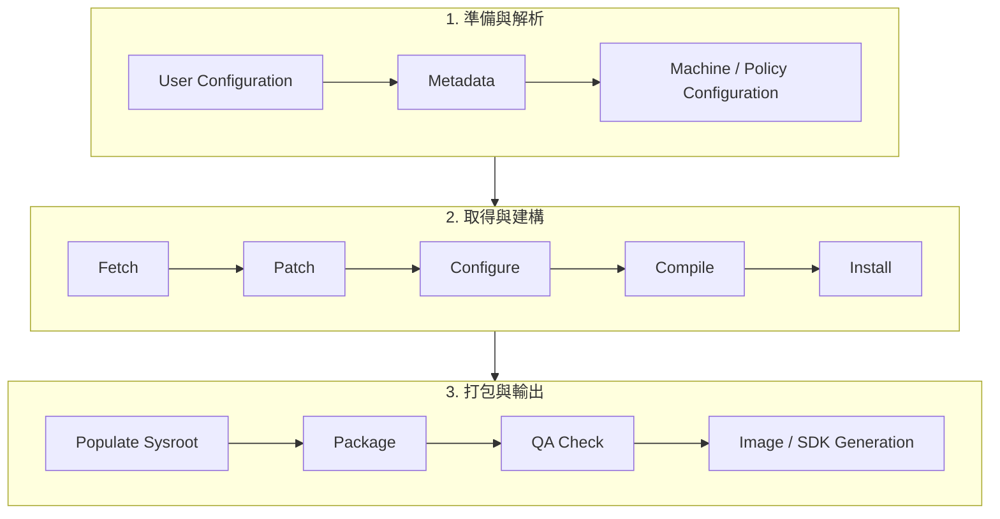

# 7. Build System 與 BSP 結構

## 適用範圍

本文件說明 Yocto, OpenEmbedded, BitBake 與 OpenBMC 的 Build System 及 BSP 結構, 涵蓋 layer, machine, distro, image, recipe, `.bbappend`, `devtool`, Docker 建構環境, 單一套件除錯, 自訂 recipe, 以及 OpenBMC 新 Machine Layer 與 DTS bring-up 流程.

## 適用讀者

- 負責 BMC 韌體, Yocto/OpenEmbedded, OpenBMC, BSP, Linux kernel, U-Boot, Device Tree 或 CI 建構環境的開發與整合人員.
- 執行新平台 porting, recipe 維護, 套件除錯, 映像建構, patch 管理或 Machine Layer bring-up 的人員.

## 快速導覽

- [理解 Yocto 與 OpenBMC 建構架構](#71-yocto-簡介): Yocto, Poky, OpenEmbedded, BitBake 與 Layer Model.
- [查閱常用變數與建構流程](#72-常用變數目錄結構與-bitbake-建構流程): Build 目錄, 設定檔, 變數, tasks 與 `BBMASK`.
- [建立 Docker 建構環境](#73-在-docker-中建立-yocto-專案並建置完整映像): Container, 資源配置, Poky 初始化與映像建置.
- [單獨建置與除錯套件](#74-單獨建置與除錯特定套件): Task 重跑, 產物位置, log 與 kernel 建置.
- [維護 bbappend 與 patch](#75-使用-bbappend-修改套件行為): `.bbappend`, `FILESEXTRAPATHS`, override 與安裝內容.
- [使用 devtool 開發](#76-使用-devtool-修改原始碼並產出補丁patch): Workspace, `modify`, `update-recipe`, `finish` 與部署測試.
- [撰寫自訂 recipe](#77-撰寫一個自訂的-bb-recipe): Recipe 欄位, 建構類型, systemd 與 package split.
- [執行新 Machine Layer bring-up](#79-openbmc-新-machine-layer-與-dts-bring-up-系統化流程): Layer, machine, template, Linux DTS 與 U-Boot DTS.

Yocto / OpenEmbedded 的核心觀念如下: recipe 描述套件如何取得, patch, 編譯, 安裝與打包; layer 保存不同來源與用途的 metadata; machine 定義硬體; distro 定義政策; image 定義最終 rootfs 組成.

建議目錄地圖:

| 區域          | 內容                  | 常改檔案                            |
| ------------- | --------------------- | ----------------------------------- |
| meta-platform | machine, DTS, recipes | conf/machine/*. conf, recipes-kernel |
| meta-common   | 共用功能              | packagegroup, systemd unit          |
| u-boot        | bootloader            | defconfig, board config, env        |
| linux         | kernel                | defconfig, fragments, dts           |
| openbmc apps  | user space services   | JSON config, service override       |


## 7.1 Yocto 簡介

Yocto Project 是一個開源協作專案, 用來幫助開發者建立針對特定硬體架構(target boards)的**自訂 Linux 作業系統**. 在 BMC porting 情境中, Yocto 的價值是把 kernel, bootloader, rootfs, package, SDK, license 資訊與平台差異, 放進一套可重現的建構流程中管理.

它處理了嵌入式 Linux 開發常見的幾個問題: 硬體架構碎片化, 軟體元件相依複雜, 建構流程難以重現. Yocto 提供一套標準化工具鏈, 讓開發者可以:

- 從原始碼建構 Linux 映像
- 精確控制要放入哪些套件
- 管理套件之間的相依關係
- 支援跨平台編譯, 例如 ARM, x86, MIPS, RISC-V 等
- 長期維護產品生命週期
- 輸出 rootfs, kernel, bootloader, package feed, SDK 與 license / SBOM 相關資料

Yocto 由多個核心元件所組成, 為了方便理解, 可以用**人體**來類比:

| 名稱 | 解釋 | 類比 |
|---|---|---|
| **Poky** | Yocto 的參考發行版, 整合 BitBake, OpenEmbedded-Core 與參考 metadata. | 完整的人體樣本 |
| **BitBake** | 負責解析 metadata 並執行建構流程的任務引擎. | 大腦(發號施令) |
| **OpenEmbedded** | 提供建構系統的核心架構與 metadata, 例如 recipes, classes, configuration. | 身體的骨架與器官 |

補充說明:

- Poky 是 Yocto Project 提供的「**參考用完整組合**」, 它是一個可以實際建出映像的參考組合, 但**不是唯一選項**. 可以拿 Poky 來改, 也可以依專案需求自行組合 BitBake, OE-Core 與各 layers.
- 近年的 Yocto 文件中, Poky 的角色更偏向參考與測試目標; 新的工作流程也可使用個別 clone 的 `bitbake`, `openembedded-core`, `meta-yocto`, 或使用 `bitbake-setup` 建立建構環境.`poky` 作為 DISTRO 設定仍然存在.
- OpenBMC 是另一個完整的「人體」, 它**使用** Yocto / OpenEmbedded / BitBake 工具來建構 BMC 映像, 但不要把 OpenBMC 和 Poky 混在一起看.

## 7.1.1 Yocto Build Flow(簡化流程)



常見的 Yocto 架構圖資訊量很大, 初學時可先用「從左到右」的流程理解:

1. **準備階段(Prepare)**
   - BitBake 開始運作, 讀取四類設定:
     - **User Configuration**: 例如 `build/conf/local.conf`
     - **Metadata**: 各 layer 的 recipes, classes, conf
     - **Machine Configuration**: 硬體設定, 例如 `qemux86-64`, `ast2600-evb`, 專案 machine
     - **Policy Configuration**: 發行版政策, 例如 `poky`, OpenBMC distro 設定
   - 這些設定決定「要建構什麼」以及「如何建構」.

2. **擷取與打補丁(Fetch / Patch)**
   - BitBake 根據 `SRC_URI` 變數, 從 Git, HTTP, local file 或 mirror 取得原始碼, 對應 task 通常是 `do_fetch`.
   - 接著將 patches 套用到原始碼上, 對應 task 通常是 `do_patch`.

3. **配置, 編譯與安裝(Configure / Compile / Install)**
   - 執行建構前設定, 對應 `do_configure`, 例如 Autotools, CMake, Meson 的設定階段.
   - 開始編譯, 對應 `do_compile`.
   - 將編譯好的檔案安裝到暫存目的地, 對應 `do_install`.
   - 不同 recipe 之間可能存在 build-time dependency, 因此 BitBake 會依任務依賴圖排程.

4. **部署到 Sysroot 與打包(Populate Sysroot / Package)**
   - 將可供其他 recipe 使用的 headers, libraries, pkg-config files 等部署到 sysroot, 對應 `do_populate_sysroot`.
   - 將安裝結果拆成多個 package, 對應 `do_package`.

5. **產生安裝套件(Write RPM / DEB / IPK)**
   - 將 package 轉成目標平台可使用的格式, 例如 RPM, DEB, IPK.
   - BMC 專案常見產出位置包含 `tmp/deploy/rpm/`, `tmp/deploy/ipk/` 或依 distro 設定而定的 package deploy 目錄.

6. **QA 檢查(QA Check)**
   - Yocto 在建構過程中會執行多種 QA 檢查, 例如 metadata, runtime dependency, license, installed-vs-shipped, rpath, host contamination 等.
   - QA issue 不一定每次都會讓 build fail, 實際行為會受 `WARN_QA`, `ERROR_QA`, distro policy 影響.

7. **套件供給(Package Feeds)**
   - 建出的 package 可作為 package feed, 放在 `tmp/deploy/` 底下.
   - 若產品支援線上套件更新, 可進一步規劃 package feed server; 若是 BMC 韌體, 多數情境仍以 image update 為主.

8. **產生映像與 SDK(Image / SDK Generation)**
   - BitBake 最後會依 image recipe 產生 rootfs 與可燒錄映像, 例如 ext4, wic, ubi, mtd tar, squashfs 等.
   - 也可以產生 SDK 或 eSDK, 供應用程式開發者使用.

## 7.1.2 Poky

Poky 是 Yocto 的**參考發行版**(reference distribution). 白話文來說, 它是一組「可以拿來建出參考 Linux 系統」的建構工具與 metadata 組合. 它提供:

- OpenEmbedded 建構系統相關元件, 例如 BitBake 與 OpenEmbedded-Core
- 一組參考 metadata, 幫助開發者建立自訂發行版
- 參考 machine, image, distro 設定, 用於學習, 測試與驗證建構環境

傳統 Poky repository 的根目錄常見結構如下:

```text
poky/
├── bitbake/                     # BitBake 主程式（Python）
├── build/                       # 編譯輸出目錄（執行 oe-init-build-env 後產生）
├── contrib/                     # 貢獻者工具
├── meta/                        # OpenEmbedded-Core 的 metadata（recipes、classes、機器配置）
├── meta-poky/                   # Poky 參考發行版的額外 metadata
├── meta-selftest/               # 自我測試用的 recipes 與 append 檔
├── meta-skeleton/               # BSP 和 Kernel 開發的 recipes 範本
├── meta-yocto-bsp/              # Yocto 計畫的參考 BSP metadata
├── oe-init-build-env            # 設定編譯環境的腳本
└── scripts/                     # 輔助工具腳本
```

`build/` 資料夾是在執行 `source oe-init-build-env` 後建立的, 裡面包含 `conf/`, 暫存資料, sstate-cache, 以及最終輸出的映像檔.

需要注意的是, Poky repository 的使用方式會隨 Yocto 版本演進而調整. 若專案採用新版本 Yocto, 建議先查該版本的官方文件, 確認目前建議的環境建立方式.

## 7.1.3 OpenEmbedded

OpenEmbedded 是一套**建構框架**, 可視為前面類比中的「身體骨架與器官」. 它主要由下列部分組成:

- **OE-Core(OpenEmbedded-Core)**: 核心 metadata, 包含基礎 recipes, classes 與 configuration.
- **BitBake**: 建構引擎, 負責排程與執行任務.
- **meta-openembedded**: 社群維護的額外 recipes 集合, 常見的 `meta-oe`, `meta-python`, `meta-networking` 等都在這個體系內.

OE-Core 是許多 OpenEmbedded 衍生系統共用的「標準骨架」. Yocto Project 與 OpenBMC 都大量使用 OE-Core 的模型.

常見檔案類型:

- **Recipe(`.bb`)**: 描述如何下載, 設定, 編譯, 安裝, 打包某個軟體套件.
- **Append(`.bbappend`)**: 在不直接修改原 recipe 的前提下, 追加 patch, 設定或安裝內容.
- **Class(`.bbclass`)**: 定義共用建構邏輯, 例如 `cmake.bbclass`, `meson.bbclass`, `systemd.bbclass`.
- **Configuration(`.conf`)**: 定義 machine, distro, layer, local build policy 等設定.

## 7.1.4 BitBake

BitBake 是一個**任務執行引擎**(task execution engine), 主要用來解析與執行 Yocto / OpenEmbedded 專案中的 recipes. 它的概念與 GNU Make 有些相似, 但更適合處理大量套件, 交叉編譯, 任務依賴, 快取與平行排程.

BitBake 的運作流程大致如下:

1. **解析基礎設定**: 讀取 `bblayers.conf`, 各 layer 的 `layer.conf`, `bitbake.conf`, `local.conf` 等.
2. **建立 BBFILES 清單**: 根據 `BBFILES` 變數, 找到所有 `.bb` 與 `.bbappend` 檔案.
3. **解析 Recipes 與 Classes**: 將 metadata 載入並展開變數, 繼承 class, 套用 override.
4. **產生任務依賴圖**: 根據 `DEPENDS`, `RDEPENDS`, task dependency 與 class logic, 建立任務順序.
5. **執行任務**: 依依賴順序平行執行 `do_fetch`, `do_unpack`, `do_patch`, `do_configure`, `do_compile`, `do_install`, `do_package`, `do_rootfs` 等任務.
6. **使用 cache 與 sstate**: 若任務輸入未改變, 可重用 shared state, 降低重建時間.

使用 BitBake 的好處:

- 可以組出完整嵌入式 Linux 發行版
- 透過依賴圖管理套件與任務順序
- 可平行處理多個 recipe 與 task, 加快建置速度
- 可透過 sstate-cache 改善重複建構時間
- 可把 build-time dependency 與 runtime dependency 分開描述

常用指令:

```bash
# 建立 image
bitbake core-image-minimal

# OpenBMC 常見 image target
bitbake obmc-phosphor-image

# 只跑特定 recipe 的某個 task
bitbake -c compile <recipe>
bitbake -c clean <recipe>
bitbake -c cleansstate <recipe>

# 查 recipe 使用的變數展開結果
bitbake -e <recipe> | less

# 查 layers
bitbake-layers show-layers
bitbake-layers show-recipes
bitbake-layers show-appends

# 產生 dependency graph
bitbake -g <target>
```

## 7.1.5 Layer Model

Layer Model 是 Yocto 用來管理套件與客製化內容的核心機制, 設計目標是**同時支援協作與客製化**.

白話文來說, Layer Model 就是**把肉一層一層疊起來**的起司蛋糕概念:

- **Layer 就是一層起司**: 每一層包含一組相關 recipes 與設定. BSP, GUI, 中介軟體, 應用服務, 公司共用政策都可以分開放.
- **重複 recipe 會依規則處理**: 如果同一個 recipe 名稱出現在多個 layer 中, BitBake 會依 layer priority, version, `PREFERRED_VERSION` 等規則選擇.
- **`.bbappend` 可追加既有 recipe**: 不修改原 recipe, 也能增加 patch, service, config 或安裝檔案.
- **最終結果是疊合後的系統**: 所有 layer 疊加後, BitBake 依優先權, override 與設定產出完整系統.
- **Layer 可以重複使用**: 同一個 BSP layer, feature layer 或公司共用 layer 可在多個專案使用.
- **分層是為了降耦合**: 更換硬體時替換 BSP layer, 新增功能時加入 feature layer, 量產政策放在 distro / product layer.

常見 layer 分層方式:

**第一種: 由大到小, 由廣泛到精細**

- 底層: OE-Core / 基礎系統
- 中層: BSP(板級支援套件), SoC vendor layer, 中介軟體
- 上層: 發行版政策, 產品設定, 應用程式, OEM 客製化

**第二種: 企業內部常見分層**

- **Root Layer**: 由硬體製造商, SoC vendor 或 upstream 專案提供的基礎 layer, 例如 OpenBMC 常用 layer.
- **Model Layer**: 針對特定平台, 板子, SKU 所設計的 layer.
- **Recipe Layer**: 針對特定工具, 服務, OEM 套件或公司共用元件所提供的 layer.

OpenBMC 常見 layer 類型:

```text
openbmc/
├── meta/                         # OE-Core / Yocto 相關基礎 layer
├── meta-openembedded/            # 社群 recipes，例如 meta-oe、meta-python、meta-networking
├── meta-phosphor/                # OpenBMC 核心服務與共用設定
├── meta-aspeed/                  # ASPEED SoC BSP
├── meta-nuvoton/                 # Nuvoton SoC BSP
├── meta-ibm/、meta-facebook/等    # vendor / platform layer
└── build/                        # 建構輸出
```

實務建議:

- 不要直接改 upstream layer, 優先用專案 layer + `.bbappend` 管理差異.
- 平台相關設定放 machine layer; 產品政策放 distro 或 product layer; 應用程式放 application layer.
- Layer priority 不宜濫用, 否則後續很難追蹤 recipe 來源.
- 每個 layer 應清楚定義相依 layer, 寫在 `conf/layer.conf` 的 `LAYERDEPENDS`.

## 7.1.6 OpenBMC 和 Yocto 的關係

重要澄清: OpenBMC **不是** Yocto 的競爭者, 而是 Yocto 的**使用者**.

**Yocto Project** 是一個框架, 用來建立各式各樣的嵌入式 Linux 系統. 它提供工具, metadata 與建構基礎設施.

**OpenBMC** 則是一個專門為伺服器 BMC(Baseboard Management Controller)設計的韌體堆疊. 它包含硬體監控, 感測器管理, 遠端電源控制, IPMI / Redfish 支援, 軟體更新, 事件紀錄等功能.

OpenBMC 本身使用 Yocto 工具來建構. OpenBMC 借用 BitBake, layer model, OpenEmbedded-Core 與大量 metadata, 再疊加 BMC 專屬服務與平台設定. 因此:

- Yocto / OpenEmbedded / BitBake: 提供建構框架.
- OpenBMC: 提供 BMC runtime 架構與服務集合.
- OpenBMC image: 是 Yocto build system 建出的 BMC 韌體映像.

OpenBMC 常見建構流程:

```bash
# 進入 OpenBMC source tree
cd openbmc

# 設定 machine；不同專案 machine 名稱不同
. setup <machine_name>

# 開始建構 BMC image
bitbake obmc-phosphor-image

# 產出通常位於
ls tmp/deploy/images/<machine_name>/
```

## 7.1.7 BMC Porting 時 Yocto 需要優先確認的檔案

| 項目 | 常見位置 | 用途 | Porting 注意事項 |
|---|---|---|---|
| Machine conf | `conf/machine/<machine>.conf` | 定義 MACHINE, SoC, kernel, UBoot, image type | 需對齊實際 board, flash type, SoC BSP |
| Layer conf | `conf/layer.conf` | 定義 BBFILES, LAYERDEPENDS, layer priority | 確認相依 layer 與 priority 是否合理 |
| Kernel recipe / bbappend | `recipes-kernel/linux/` | 指定 kernel source, defconfig, DTS, patch | DTS, driver patch, config fragment 是 bring-up 重點 |
| U-Boot recipe / bbappend | `recipes-bsp/u-boot/` | 指定 bootloader source, defconfig, env, patch | flash layout, bootcmd, secure boot, recovery 需同步 |
| Image recipe | `recipes-phosphor/images/` 或 product layer | 定義 rootfs 內容 | 確認需要的 service, tool, debug package 是否進 image |
| Packagegroup | `recipes-*/packagegroups/` | 集中管理套件集合 | 適合控管 feature 開關與產品差異 |
| Systemd service | `recipes-*/<pkg>/files/*.service` | 定義 daemon 啟動方式 | 需檢查 dependency, restart policy, boot time impact |
| Entity Manager / Sensor config | `recipes-phosphor/configuration/` 或平台 layer | 定義 inventory, sensor, FRU, presence | 需對齊 schematic, I2C bus map, Redfish/IPMI mapping |

## 7.1.8 Yocto / OpenBMC 常見排查入口

```bash
# 確認目前 machine / distro / image 相關變數
bitbake -e obmc-phosphor-image | grep -E "^(MACHINE|DISTRO|IMAGE_FSTYPES|PREFERRED_PROVIDER|BBLAYERS)="

# 查某個 recipe 實際來源
bitbake-layers show-recipes <recipe>
bitbake-layers show-appends | grep <recipe>

# 進入 recipe 開發流程
bitbake -c devshell <recipe>

# 清掉某個 recipe 的 sstate 後重建
bitbake -c cleansstate <recipe>
bitbake <recipe>

# 只重跑 image rootfs
bitbake -c rootfs obmc-phosphor-image

# 找 deploy image
ls tmp/deploy/images/${MACHINE}/

# 找 package 輸出
find tmp/deploy -maxdepth 3 -type f | grep -E "\.(rpm|ipk|deb)$" | head

# 找 recipe workdir
bitbake -e <recipe> | grep '^WORKDIR='
```

## 7.1.9 小結

Yocto 可以理解成「可重現的嵌入式 Linux 建構框架」, BitBake 是任務引擎, OpenEmbedded 提供 metadata 骨架, Poky 是參考發行版, OpenBMC 則是在這套框架上建出的 BMC 韌體專案. 對 BMC porting 來說, 最重要的是把 machine, layer, kernel, U-Boot, image, sensor / inventory config, firmware update layout 這幾塊關係釐清, 後續 debug 才能有效率地把問題定位到 BSP, kernel, Device Tree, user space service 或平台設定.


## 7.2 常用變數, 目錄結構與 BitBake 建構流程

這章整理 Yocto 的「廚房」: 目錄怎麼放, 設定檔怎麼寫, 常用變數代表什麼, BitBake 如何解析 metadata 並執行 tasks. 熟悉這些內容後, 排查 BMC image 建構失敗, recipe 沒有被套用, layer 優先權不如預期, sstate 沒有命中等問題會更有效率.

## 7.2.1 目錄結構

執行 `source oe-init-build-env` 後, 常見流程會建立或切換到 `build/` 目錄.`build/` 是整個建構過程的工作核心, 包含設定檔, 下載資料, 快取, 中間產物與最終輸出.

```text
build/
├── bitbake-cookerdaemon.log   # BitBake cooker daemon 的執行日誌
├── cache/                     # BitBake 解析快取，加速下次解析
├── conf/                      # 設定檔，例如 local.conf、bblayers.conf
├── downloads/                 # 下載的原始碼與 SCM mirror，通常由 DL_DIR 指定
├── sstate-cache/              # Shared State Cache，通常由 SSTATE_DIR 指定
└── tmp/                       # 建構中間產物與最終輸出，通常由 TMPDIR 指定
    ├── work/                  # 各 recipe 的工作目錄，含 source、build output、log
    ├── deploy/                # image、SDK、套件等輸出
    ├── sysroots-components/   # sysroot 元件資料
    ├── stamps/                # task stamp，用於判斷 task 是否需要重跑
    └── log/                   # build log 與部分統計資料
```

各目錄用途:

- `conf/`: 最重要的設定檔所在地, 包含 `local.conf` 與 `bblayers.conf`.
- `downloads/`:`do_fetch` 下載的 tarball, Git mirror 或其他 source cache 會放在這裡. 此目錄可跨專案共用, 降低重複下載成本.
- `sstate-cache/`: Shared State Cache, 保存可重用的 task 輸出. 若 task 的輸入與 signature 沒有變化, BitBake 可從 sstate 還原結果, 減少重建時間.
- `tmp/`: 建構過程的主要工作區.`tmp/work/` 是各 recipe 的獨立工作空間, `tmp/deploy/` 是 image, package, SDK 等輸出位置.
- `tmp/work/<machine或arch>/<recipe>/<version>/`: 常見 recipe workdir, 可找到 `temp/log.do_*`, `image/`, `package/`, `packages-split/`, source tree 等資料.
- `tmp/deploy/images/<machine>/`: BMC image, kernel, DTB, U-Boot, manifest, tarball 或 flash image 的常見輸出位置.

實務建議:

- `downloads/` 與 `sstate-cache/` 可透過共用目錄, 符號連結或 NFS 提供給多個開發者或 CI 使用, 節省網路頻寬與建構時間.
- CI 環境若共用 sstate, 需同時控管 Yocto branch, layer revisions, host distro, compiler 版本與 `MACHINE` / `DISTRO`, 避免 cache 命中行為難以追蹤.
- 若懷疑 sstate 造成舊檔被重用, 先針對單一 recipe 使用 `bitbake -c cleansstate <recipe>`, 不建議一開始就刪整個 `sstate-cache/`.

## 7.2.2 設定檔說明

### `local.conf`: 個人建構設定

`local.conf` 是使用者自訂建構選項的主要設定檔, 通常位於 `build/conf/local.conf`. 它適合放開發者本機或 CI job 層級的設定, 例如 target machine, 下載目錄, sstate 目錄, package format, 平行建構參數等.

| 項目 | 說明 | 變數 | 常見預設或範例 |
|---|---|---|---|
| 目標機器 | 要編譯給哪塊板子或 QEMU target | `MACHINE` | `qemux86-64`, `ast2600-evb`, `<project-machine>` |
| 下載目錄 | source archive / Git mirror 位置 | `DL_DIR` | `${TOPDIR}/downloads` |
| 快取目錄 | Shared State Cache 位置 | `SSTATE_DIR` | `${TOPDIR}/sstate-cache` |
| 輸出目錄 | 建構中間產物與 deploy 資料 | `TMPDIR` | `${TOPDIR}/tmp` |
| 發行版政策 | distro policy, 例如 libc, init, feature set | `DISTRO` | `poky`, OpenBMC distro 設定 |
| 套件格式 | 產生 RPM, DEB 或 IPK | `PACKAGE_CLASSES` | `package_rpm`, `package_ipk` |
| SDK 架構 | SDK 執行端架構 | `SDKMACHINE` | `x86_64`, `i686` |
| 映像功能 | debug-tweaks, ssh-server 等 image feature | `EXTRA_IMAGE_FEATURES` | 依 distro / image 而定 |
| BitBake 任務數 | BitBake 同時排程多少 task | `BB_NUMBER_THREADS` | 可依 CPU 數與 RAM 調整 |
| 編譯核心數 | 傳給 make / ninja 等工具的平行度 | `PARALLEL_MAKE` | 例如 `-j 16` |

常見設定:

```bitbake
MACHINE = "<project-machine>"
DISTRO = "openbmc-phosphor"
PACKAGE_CLASSES = "package_ipk"

DL_DIR = "/data/yocto/downloads"
SSTATE_DIR = "/data/yocto/sstate-cache"
TMPDIR = "${TOPDIR}/tmp"

BB_NUMBER_THREADS = "16"
PARALLEL_MAKE = "-j 16"
```

建議:

- `BB_NUMBER_THREADS` 與 `PARALLEL_MAKE` 不一定越大越好. 若主機 RAM 或 I/O 不足, 過高平行度可能造成 swap, I/O wait 或 random build failure.
- BMC 專案常見瓶頸包含 C++ service 編譯, Rust package, node / web UI, kernel build 與 image rootfs; 可透過 `buildstats` 或 CI log 觀察實際耗時.
- 若多人共用 `DL_DIR` / `SSTATE_DIR`, 建議放在 `site.conf` 或 CI template, 而不是每個人的 `local.conf` 各自維護.

### `bblayers.conf`: 決定載入哪些 layers

`bblayers.conf` 定義 BitBake 要載入哪些 layers, 通常位於 `build/conf/bblayers.conf`. BitBake 解析 base configuration 時會讀取此檔, 並依此找到每個 layer 的 `conf/layer.conf`.

```bitbake
POKY_BBLAYERS_CONF_VERSION = "2"

BBPATH = "${TOPDIR}"
BBFILES ?= ""

BBLAYERS ?= " \
  /home/yocto/poky/meta \
  /home/yocto/poky/meta-poky \
  /home/yocto/poky/meta-yocto-bsp \
  /home/yocto/openbmc/meta-phosphor \
  /home/yocto/openbmc/meta-aspeed \
  /home/yocto/project/meta-my-platform \
  "
```

重點變數:

- `BBLAYERS`: 列出所有 layer 的路徑. BitBake 會讀取每個 layer 的 `conf/layer.conf`.
- `BBPATH`: BitBake 搜尋 `.conf`, `.bbclass` 等檔案的路徑基礎.
- `BBFILES`: 定位 `.bb` 與 `.bbappend` 檔案的 pattern, 通常由各 layer 的 `layer.conf` 追加.

注意事項:

- `BBLAYERS` 的順序會影響 layer 被加入 `BBPATH` 與 metadata 搜尋的先後, 但 recipe 選擇與覆蓋不只看順序; 更關鍵的是各 layer 在 `layer.conf` 中設定的 `BBFILE_PRIORITY_<collection>`, recipe version, `PREFERRED_PROVIDER`, `PREFERRED_VERSION` 與 override.
- 若同一 recipe 被多個 layer 提供, 可用 `bitbake-layers show-overlayed` 與 `bitbake-layers show-recipes <name>` 確認實際採用來源.
- 若 `.bbappend` 沒有套上, 常見原因是檔名版本不匹配, layer 沒有加入 `BBLAYERS`, `BBFILES` pattern 沒有包含該路徑, 或 layer dependency 沒有滿足.

### `layer.conf`: 每個 layer 的自我介紹

每個 layer 根目錄下通常都有 `conf/layer.conf`, 用來宣告該 layer 的 collection name, recipe 搜尋 pattern, priority 與相依 layer.

| 參數 | 說明 |
|---|---|
| `BBPATH` | 將該 layer 加入 BitBake 搜尋路徑 |
| `BBFILES` | 指定該 layer 內 `.bb` 與 `.bbappend` 的位置 |
| `BBFILE_COLLECTIONS` | 註冊 layer collection name |
| `BBFILE_PATTERN_<name>` | 比對路徑, 判斷某個 recipe 屬於哪個 collection |
| `BBFILE_PRIORITY_<name>` | layer priority, 數字越大優先權越高 |
| `LAYERDEPENDS_<name>` | 宣告此 layer 依賴哪些其他 layer |
| `LAYERSERIES_COMPAT_<name>` | 宣告此 layer 相容哪些 Yocto release series |

```bitbake
BBPATH .= ":${LAYERDIR}"
BBFILES += "${LAYERDIR}/recipes-*/*/*.bb \
            ${LAYERDIR}/recipes-*/*/*.bbappend"

BBFILE_COLLECTIONS += "myplatform"
BBFILE_PATTERN_myplatform = "^${LAYERDIR}/"
BBFILE_PRIORITY_myplatform = "10"

LAYERDEPENDS_myplatform = "core openembedded-layer meta-phosphor"
LAYERSERIES_COMPAT_myplatform = "scarthgap styhead walnascar"
```

BMC porting 建議:

- SoC vendor layer, OpenBMC core layer, company common layer, platform layer 最好有清楚的相依順序與責任邊界.
- 平台差異優先放在 `meta-<platform>`, 不要直接改 `meta-phosphor`, `meta-aspeed`, `meta-nuvoton` 或 upstream layer.
- 新增 `.bbappend` 後, 先用 `bitbake-layers show-appends | grep <recipe>` 確認有被 BitBake 看到.

## 7.2.3 常用變數

### 套件命名相關

| 變數 | 說明 | 範例 |
|---|---|---|
| `PN` | recipe / package name, 通常由 recipe 檔名推導 | `busybox` |
| `PV` | package version | `1.36.1` |
| `PR` | package revision, 常見預設為 `r0` | `r0` |
| `PE` | epoch, 用於特殊版本排序 | `1` |
| `PF` | 完整 recipe working name, 常見為 `${PN}-${PV}-${PR}` | `busybox-1.36.1-r0` |
| `BP` | base package name, 常見為 `${BPN}-${PV}` | `busybox-1.36.1` |
| `BPN` | 不含特殊 prefix / suffix 的 base package name | `busybox` |

### 目錄路徑相關

| 變數 | 說明 | 常見用途 |
|---|---|---|
| `TOPDIR` | build directory, 例如 `build/` | 設定相對於 build root 的路徑 |
| `TMPDIR` | 建構中間產物 root | 預設常見為 `${TOPDIR}/tmp` |
| `WORKDIR` | 單一 recipe 的工作目錄 | 找 source, patch, log, image staging |
| `S` | 原始碼目錄 | `do_configure` / `do_compile` 常用工作目錄 |
| `B` | build directory | out-of-tree build 時與 `S` 分開 |
| `D` | 暫存安裝 root | `do_install` 安裝目的地 |
| `DL_DIR` | source download cache | 共用下載資料 |
| `SSTATE_DIR` | shared state cache | 共用 task 輸出快取 |
| `DEPLOY_DIR` | deploy 輸出 root | package/image/SDK 輸出根目錄 |
| `DEPLOY_DIR_IMAGE` | 目標 machine 的 image 輸出位置 | 找 BMC flash image, kernel, DTB |
| `sysconfdir` | 設定檔安裝路徑 | 常見為 `/etc` |
| `systemd_system_unitdir` | systemd system unit 目錄 | 安裝 `.service` |

### 原始碼與相依相關

| 變數 | 說明 | 範例 |
|---|---|---|
| `SRC_URI` | 原始碼, patch, 本地檔案來源 | `git://...`, `file://xxx.patch` |
| `SRCREV` | Git revision | commit hash, `${AUTOREV}` |
| `FILESEXTRAPATHS` | 擴充 `file://` 搜尋路徑 | bbappend 常用 |
| `DEPENDS` | build-time dependency | `openssl zlib` |
| `RDEPENDS:${PN}` | runtime dependency | `${PN}` 執行時需要的 package |
| `RRECOMMENDS:${PN}` | runtime recommended package | 可被移除的建議相依 |
| `PROVIDES` | recipe 提供的 virtual target | `virtual/kernel` |
| `RPROVIDES:${PN}` | runtime package 提供的名稱 | package alias |

### Package 與 image 相關

| 變數 | 說明 | 常見用途 |
|---|---|---|
| `PACKAGES` | recipe 會切出的 package 清單 | `${PN}`, `${PN}-dev`, `${PN}-dbg` |
| `FILES:${PN}` | 指定哪些檔案進入 package | 補 installation path |
| `INSANE_SKIP:${PN}` | 跳過特定 QA check | 需謹慎使用並留下原因 |
| `IMAGE_INSTALL` | image 安裝 package 清單 | 加入工具或 service |
| `IMAGE_FEATURES` | image feature | ssh-server, package-management 等 |
| `EXTRA_IMAGE_FEATURES` | 額外 image feature | debug-tweaks 常見於開發版 |
| `IMAGE_FSTYPES` | image 輸出格式 | `tar.bz2 ext4 wic ubi mtd` |
| `BBMASK` | 讓 BitBake 忽略符合 pattern 的 `.bb` / `.bbappend` 檔案 | 排除衝突 recipe, 暫停 vendor append, 隔離不適用 layer metadata |


### BBMASK: 遮蔽不想讓 BitBake 解析的 recipe / append

`BBMASK` 是 BitBake / Yocto 的解析階段控制變數, 用來讓 BitBake 忽略符合條件的 `.bb` 或 `.bbappend` 檔案. 被 `BBMASK` 比對到的檔案不會被 parse, 也不會成為 provider, dependency resolution 或 `bitbake-layers show-recipes` 的有效候選; 效果接近「這些 metadata 對本次 build 不存在」. 因此它適合用在「某些 recipe / append 目前不應參與解析」的場景, 而不是用來取代 package 安裝, image 組成或 provider 選擇.

常見使用情境:

| 場景 | 建議用法 | 注意事項 |
|---|---|---|
| 暫時遮蔽 vendor layer 中會造成 parse error 的 recipe | 在 `local.conf` 或 distro / product conf 追加 `BBMASK` | 需留下原因與移除條件, 避免長期隱藏問題 |
| 同一套 build tree 支援多個平台, 但某些平台不使用特定 recipe | 使用 machine / distro override 控制 `BBMASK:append:<machine>` | 需確認其他 machine 不受影響 |
| 某個 `.bbappend` 已過期, 對應新版 recipe 造成 patch 失敗 | 遮蔽該 `.bbappend`, 或修正 append 檔名與 patch | 長期建議修 recipe / append, 不建議只靠 mask |
| 多個 layer 提供相同功能, 想排除其中一支 recipe | 以完整路徑 pattern 遮蔽不想要的 recipe | 若只是選 provider, 優先評估 `PREFERRED_PROVIDER` |
| Bring-up 初期先剔除不穩定功能 | 暫時 mask sensor / fan / web / debug 相關 recipe 或 append | 需確認 image dependency 不會引用被遮蔽的 recipe |

`BBMASK` 的值是 Python regular expression fragment, 且比對對象是 recipe / append 檔案的完整路徑. 寫法上應盡量使用足夠明確的 layer 路徑與目錄尾端 `/`, 避免把名稱相近但不相關的檔案一起遮蔽.

基本範例:

```bitbake
# 遮蔽整個目錄下的 recipe / append；目錄結尾保留 /
BBMASK += "/meta-vendor/recipes-obsolete/"

# 遮蔽特定 recipe
BBMASK += "/meta-vendor/recipes-support/foo/foo_.*\.bb"

# 遮蔽特定 .bbappend
BBMASK += "/meta-vendor/recipes-kernel/linux/linux-aspeed_.*\.bbappend"

# 遮蔽多個 pattern；每個 pattern 以空白分隔
BBMASK += "/meta-vendor/recipes-debug/ /meta-vendor/recipes-test/"
```

針對 machine 或 distro 的寫法:

```bitbake
BBMASK:append:my-bmc-machine = " /meta-vendor/recipes-platform/legacy-power/"
BBMASK:append:my-production-distro = " /meta-company/recipes-factory/"
```

驗證與排查指令:

```bash
bitbake-layers show-layers
bitbake-layers show-recipes foo
bitbake-layers show-appends | grep -A5 -B2 foo
bitbake -e | grep '^BBMASK='
bitbake -p
```

與其他機制的差異:

| 機制 | 作用層級 | 適合用途 | 不適合用途 |
|---|---|---|---|
| `BBMASK` | parse 階段, 遮蔽 `.bb` / `.bbappend` 檔案 | 讓 BitBake 完全不看某些 metadata | 細緻控制 package 是否進 image |
| `PREFERRED_PROVIDER` / `PREFERRED_VERSION` | provider / version 選擇 | 多個 recipe 都可用時選其中一個 | vendor append 已造成 parse error 的情境 |
| `IMAGE_INSTALL:remove` | image rootfs 組成 | 從 image 移除 package | recipe 本身 parse 失敗 |
| `PACKAGE_EXCLUDE` | package install / rootfs 階段 | 避免特定 package 被安裝 | 遮蔽 `.bbappend` 或解決 provider 衝突 |
| `COMPATIBLE_MACHINE` | recipe 適用 machine | recipe 自身聲明支援範圍 | 從外部臨時排除既有 recipe |
| `SKIP_RECIPE` 或 `bb.parse.SkipRecipe` | recipe parse 邏輯 | recipe 內依條件主動跳過 | 從專案層遮蔽第三方 metadata 時通常不如 `BBMASK` 直接 |
| `BB_DANGLINGAPPENDS_WARNONLY` | dangling append 行為 | 讓舊 append 找不到 recipe 時由 fatal 變 warning | 不建議用來掩蓋產品 build 的 layer 不一致 |

常見問題與排查:

| 現象 | 建議排查方向 | 建議檢查 |
|---|---|---|
| 設了 `BBMASK` 但 recipe 還在 | pattern 沒匹配完整路徑, 缺少 `/`, regex escape 不正確 | `bitbake -e \| grep '^BBMASK='`, `bitbake-layers show-recipes` |
| 遮蔽後 build 出現 `Nothing PROVIDES` | 其他 recipe 仍 `DEPENDS` / `RDEPENDS` 該 recipe 或 virtual provider | `bitbake -g <target>`, 檢查 `DEPENDS` / `RDEPENDS` / `PREFERRED_PROVIDER` |
| 只想遮蔽 `.bbappend` 卻 recipe 也消失 | pattern 太寬 | 明確寫到 `.*\.bbappend` |
| 某些 machine 正常, 某些 machine 失敗 | override 沒掛對, `MACHINEOVERRIDES` 不符合預期 | `bitbake -e \| grep '^OVERRIDES='`, 檢查 machine conf |
| 遮蔽目錄後仍有 append 套用 | append 位於另一個 layer 或另一個路徑 | `bitbake-layers show-appends` 查完整來源 |

BMC / OpenBMC porting 建議:

- `BBMASK` 適合當作 bring-up 或 layer integration 的隔離工具, 例如先遮蔽不適用平台的 vendor recipe, 過期 append, 暫不支援的 debug / factory tool.
- 若衝突來源是多個 provider, 先評估 `PREFERRED_PROVIDER_virtual/<name>` 或 `PREFERRED_VERSION`; 只有在不希望 BitBake 解析某些 `.bb` / `.bbappend` 時才使用 `BBMASK`.
- 若只是 package 不想進 image, 應透過 image recipe, packagegroup, `IMAGE_INSTALL:remove` 或 feature flag 管理, 不建議用 `BBMASK`.
- 每一條 `BBMASK` 都應附註 owner, 原因, 加入日期, 預期移除條件. 量產前建議審一次, 確認沒有把安全更新, CVE 修補, 必要 service 或平台 patch 保持在被遮蔽狀態.

建議檢查清單:

- [ ] `BBMASK` 放置位置明確:`local.conf`, distro conf, machine conf, layer conf 或 CI template.
- [ ] pattern 以完整 layer 路徑為主, 避免只用過短名稱, 例如 `foo`.
- [ ] 遮蔽目錄時保留 trailing slash, 例如 `/recipes-obsolete/`.
- [ ] 若只要遮蔽 append, pattern 明確匹配 `.bbappend`.
- [ ] 執行 `bitbake -p` 確認 parse 通過.
- [ ] 執行 `bitbake-layers show-recipes` / `show-appends` 確認效果符合預期.
- [ ] 完整 image build 通過, 且沒有新的 provider / dependency 問題.
- [ ] 文件或 commit message 留下原因, 風險與移除條件.

### 安裝路徑變數

| 變數 | 常見值 | 說明 |
|---|---|---|
| `prefix` | `/usr` | 安裝根目錄 |
| `exec_prefix` | `${prefix}` | 架構相關檔案的安裝根目錄 |
| `bindir` | `${exec_prefix}/bin` | 一般命令 |
| `sbindir` | `${exec_prefix}/sbin` | 系統管理命令 |
| `libdir` | `${exec_prefix}/lib` 或 `${exec_prefix}/lib64` | 函式庫檔案 |
| `includedir` | `${exec_prefix}/include` | 標頭檔 |
| `datadir` | `${prefix}/share` | 架構無關資料 |
| `sysconfdir` | `/etc` | 設定檔 |
| `localstatedir` | `/var` | log, spool, state data |

使用範例:

```bitbake
do_install() {
    install -d ${D}${bindir}
    install -m 0755 myapp ${D}${bindir}/

    install -d ${D}${sysconfdir}/myapp
    install -m 0644 myconfig.conf ${D}${sysconfdir}/myapp/
}
```

重點:`${D}` 是 `do_install` 的暫存根目錄, 安裝檔案時應安裝到 `${D}${bindir}`, `${D}${sysconfdir}` 等路徑, 而不是直接寫到 host 的 `/usr/bin` 或 `/etc`.

## 7.2.4 BitBake 指令

BitBake 是 Yocto / OpenEmbedded 的建構引擎, 負責解析 metadata, 管理相依關係, 安排 task, 使用 sstate 並產生 package / image / SDK.

基本用法:

```bash
bitbake <recipe_or_image>
```

例如:

```bash
bitbake zstd-native
bitbake core-image-minimal
bitbake obmc-phosphor-image
```

常用選項:

| 選項 | 說明 | 範例 |
|---|---|---|
| `-c <task>` | 只執行指定 task | `bitbake -c compile zstd-native` |
| `-e` | 顯示變數展開後的環境 | `bitbake -e zstd-native \| grep '^S='` |
| `-f` | 強制重跑指定 target 或 task | `bitbake -c compile -f zstd-native` |
| `-k` | 遇到部分錯誤時繼續跑可執行的 task | `bitbake -k obmc-phosphor-image` |
| `-g` | 產生 dependency graph 檔案 | `bitbake -g obmc-phosphor-image` |
| `-p` | 只解析 metadata, 不執行建構 | `bitbake -p` |
| `-s` | 顯示 recipe 版本摘要 | `bitbake -s \| grep busybox` |
| `-c listtasks` | 列出 recipe 可用 tasks | `bitbake -c listtasks busybox` |

清理任務:

| 指令 | 說明 | 使用時機 |
|---|---|---|
| `bitbake -c clean <recipe>` | 清除該 recipe 的多數 build 輸出, 保留下載資料與 sstate | 一般重建 |
| `bitbake -c cleansstate <recipe>` | `clean` 加上刪除該 recipe 的 sstate | 懷疑 sstate 命中舊結果 |
| `bitbake -c cleanall <recipe>` | `cleansstate` 加上刪除 `DL_DIR` 內相關下載資料 | source 下載或 mirror 異常時才考慮 |

排查常用:

```bash
bitbake -e <recipe> | less
bitbake -e <recipe> | grep '^WORKDIR='
bitbake -e <recipe> | grep '^SRC_URI='
bitbake -c listtasks <recipe>
bitbake -c devshell <recipe>
bitbake -c compile -f <recipe>
bitbake-layers show-layers
bitbake-layers show-recipes <recipe>
bitbake-layers show-appends
bitbake-layers show-overlayed
```

## 7.2.5 BitBake 執行流程

BitBake 的執行過程可分為兩大階段:**解析階段(Parsing Phase)**與**執行階段(Execution Phase)**.

### 解析階段(Parsing Phase)

1. 讀取 `bblayers.conf`, 確認要載入哪些 layers.
2. 讀取每個 layer 的 `conf/layer.conf`, 建構 `BBPATH`, `BBFILES`, collection, priority 與 layer dependency.
3. 讀取 `bitbake.conf`, `local.conf`, distro conf, machine conf 與其他 include / require 檔.
4. 根據 `BBFILES` 找到所有 `.bb` 與 `.bbappend`.
5. 解析 recipes, classes, configuration, overrides 與 anonymous python.
6. 建立 providers, preferences, task dependency 與 runqueue.

常見解析階段問題:

| 現象 | 建議排查方向 | 檢查方式 |
|---|---|---|
| recipe 找不到 | layer 未加入, `BBFILES` pattern 不含該路徑 | `bitbake-layers show-recipes` |
| bbappend 沒套上 | 檔名版本不合, layer 未加入 | `bitbake-layers show-appends` |
| provider 衝突 | 多個 recipe 提供同一 virtual target | 查 `PREFERRED_PROVIDER_*` |
| layer dependency error | `LAYERDEPENDS` 未滿足 | `bitbake-layers show-layers` |
| Yocto series 不相容 | `LAYERSERIES_COMPAT` 不含目前 release | 檢查各 layer `conf/layer.conf` |

### 執行階段(Execution Phase)

解析完成後, BitBake 依 runqueue 執行 task. task 是否需要重跑取決於 dependency, stamp, signature 與 sstate 狀態.

一般 recipe 的常見 task:

| 順序 | 任務名稱 | 說明 |
|---:|---|---|
| 1 | `do_fetch` | 根據 `SRC_URI` 取得原始碼, 本地檔案與 patch |
| 2 | `do_unpack` | 解壓縮或展開 source 到 `WORKDIR` |
| 3 | `do_patch` | 套用 patches |
| 4 | `do_configure` | 執行建構前設定, 例如 Autotools, CMake, Meson |
| 5 | `do_compile` | 編譯 source |
| 6 | `do_install` | 將編譯結果安裝到 `${D}` |
| 7 | `do_populate_sysroot` | 將 headers, libraries 等部署到 sysroot, 供其他 recipe 使用 |
| 8 | `do_package` | 將 `${D}` 的內容拆成 packages |
| 9 | `do_package_qa` | 執行 package QA 檢查 |
| 10 | `do_package_write_rpm` / `do_package_write_ipk` / `do_package_write_deb` | 依 `PACKAGE_CLASSES` 產生套件 |
| 11 | `do_populate_lic` | 收集授權資訊 |
| 12 | `do_build` | 預設總任務, 依賴完成正常建構所需 tasks |

Image recipe 額外 task:

| 任務名稱 | 說明 |
|---|---|
| `do_rootfs` | 建立 root filesystem, 安裝 package, 執行 postprocess |
| `do_image` | 將 rootfs 轉為 image 產物前的共用階段 |
| `do_image_<fstype>` | 產生指定格式, 例如 `do_image_ext4`, `do_image_wic`, `do_image_ubi` |
| `do_image_complete` | image 完成階段, 常見 manifest, symlink, deploy 收尾 |
| `do_populate_sdk` | 產生標準 SDK |
| `do_populate_sdk_ext` | 產生 extensible SDK |

擴充 task 的常見方式:

```bitbake
do_install:append() {
    install -d ${D}${sysconfdir}/myapp
    install -m 0644 ${WORKDIR}/myapp.conf ${D}${sysconfdir}/myapp/
}

python do_print_info() {
    bb.note("PN=%s" % d.getVar("PN"))
}
addtask print_info after do_configure before do_compile
```

## 7.2.6 Metadata, Recipe 與 Layer

Metadata 是 Yocto 建構系統的核心資料, 告訴 BitBake **要建構什麼**以及**如何建構**. 主要分為:

- **Recipes(`.bb`)**: 描述單一套件的建構方式.
- **Append files(`.bbappend`)**: 在不直接修改原 recipe 的前提下, 追加平台差異.
- **Classes(`.bbclass`)**: 定義共用建構邏輯.
- **Configuration(`.conf`)**: 定義 machine, distro, layer, local policy 等.

常見 recipe 目錄:

```text
meta-my-layer/
└── recipes-helloworld/
    └── hello-single/
        ├── files/
        │   ├── helloworld.c
        │   └── hello.service
        └── hello_1.0.bb
```

最小 recipe 範例:

```bitbake
SUMMARY = "Simple hello application"
LICENSE = "MIT"
LIC_FILES_CHKSUM = "file://${COMMON_LICENSE_DIR}/MIT;md5=0835ade698e0bcf8506ecda2f7b4f302"

SRC_URI = "file://helloworld.c"
S = "${WORKDIR}"

do_compile() {
    ${CC} ${CFLAGS} ${LDFLAGS} helloworld.c -o helloworld
}

do_install() {
    install -d ${D}${bindir}
    install -m 0755 helloworld ${D}${bindir}/
}
```

`.bbappend` 可在不改 upstream `.bb` 的狀態下, 對 recipe 追加 patch, 設定檔, systemd service, 編譯參數或安裝內容.

```bitbake
FILESEXTRAPATHS:prepend := "${THISDIR}/${PN}:"

SRC_URI:append = " \
    file://0001-platform-fix.patch \
    file://example.conf \
"

do_install:append() {
    install -d ${D}${sysconfdir}/example
    install -m 0644 ${WORKDIR}/example.conf ${D}${sysconfdir}/example/
}
```

Layer 是 recipe 之上的組織單元, 一個 layer 可以包含 recipes, classes, configuration, machine settings, distro policy 與 image 定義. 常見命名包含 `meta`, `meta-poky`, `meta-yocto-bsp`, `meta-phosphor`, `meta-aspeed`, `meta-nuvoton`, `meta-<company>`, `meta-<platform>`.

`bitbake-layers` 常用指令:

```bash
bitbake-layers create-layer ../meta-my-layer
bitbake-layers add-layer ../meta-my-layer
bitbake-layers remove-layer ../meta-my-layer
bitbake-layers show-layers
bitbake-layers show-recipes <recipe>
bitbake-layers show-appends
bitbake-layers show-overlayed
```

## 7.2.7 BMC Porting 檢查重點

| 檢查項目 | 指令 / 檔案 | 預期結果 |
|---|---|---|
| machine 是否正確 | `grep ^MACHINE build/conf/local.conf` | 指向目前平台 machine |
| layer 是否載入 | `bitbake-layers show-layers` | 看到 SoC, OpenBMC, platform layers |
| recipe 是否選對 | `bitbake-layers show-recipes <recipe>` | 採用預期 layer 版本 |
| bbappend 是否套上 | `bitbake-layers show-appends \| grep <recipe>` | platform bbappend 有列出 |
| image type 是否正確 | `bitbake -e obmc-phosphor-image \| grep ^IMAGE_FSTYPES=` | 符合 flash layout, 例如 `mtd`, `ubi` |
| kernel config 是否進去 | `bitbake -e virtual/kernel`, `tmp/work/.../defconfig` | config fragment 有套用 |
| DTS 是否進 image | `tmp/deploy/images/<machine>/*.dtb` | 產出正確 DTB |
| U-Boot env 是否正確 | U-Boot recipe / env / deploy output | bootcmd, mtdparts, slot 設定符合平台 |
| rootfs 是否含 service | `oe-pkgdata-util find-path`, image rootfs | package 有進 rootfs |
| sstate 是否異常 | `bitbake -c cleansstate <recipe>` 後重建 | 行為與預期一致 |

## 7.2.8 本章參考資料

- Yocto Project Reference Manual - Variables: [https://docs. yoctoproject. org/ref-manual/variables. html](https://docs. yoctoproject. org/ref-manual/variables. html)
- Yocto Project Reference Manual - Tasks: [https://docs. yoctoproject. org/ref-manual/tasks. html](https://docs. yoctoproject. org/ref-manual/tasks. html)
- BitBake User Manual: [https://docs. yoctoproject. org/bitbake/](https://docs. yoctoproject. org/bitbake/)
- Yocto Project Development Tasks Manual - Understanding and Creating Layers: [https://docs. yoctoproject. org/dev/dev-manual/layers. html](https://docs. yoctoproject. org/dev/dev-manual/layers. html)
- OpenEmbedded Layer Index: [https://layers. openembedded. org](https://layers. openembedded. org)


## 7.3 在 Docker 中建立 Yocto 專案並建置完整映像

本章說明如何用 Docker 建立可重現的 Yocto build host, 下載 Poky, 初始化 build directory, 並建置 `core-image-minimal`. 此流程可用來驗證 Yocto 環境, 也可作為 BMC / OpenBMC CI container 的基礎.

## 7.3.1 為什麼要在 Docker 中建置 Yocto?

Yocto 對 build host 有明確需求: 支援的 Linux distribution, 必要套件, 以及 Git, tar, Python, gcc, GNU make 等工具版本, 都會隨 Yocto release 改變. 若直接在本機安裝, 可能遇到 host OS 太新或太舊, 相依套件版本不合, 同時維護多個 Yocto branch 時環境互相衝突等問題.

Docker 的價值是提供隔離且可重現的 build environment. 可以在 container 內固定 Linux distribution 與套件清單, 讓專案成員與 CI 使用相同建構基準. 相較於 VM, Docker 通常更輕量, 因為它使用 host Linux kernel, 不需模擬完整硬體.

重要提醒: Yocto / BitBake 不建議以 `root` 身分執行. 建構過程會建立大量檔案, 執行 install step, 產生 rootfs; 若以 root 執行, 容易造成檔案權限錯亂或誤寫 host 檔案. 因此 Docker image 內應建立非 root 使用者, 例如 `yocto`, 並以該使用者執行 `bitbake`.

## 7.3.2 建立 Docker Container

以下 Dockerfile 以 Fedora 38 為基礎. 實際專案需依目前 Yocto release 的官方 system requirements 調整 base image 與套件清單.

```dockerfile
FROM fedora:38

# 建立非 root 使用者
RUN groupadd -g 1000 yocto && \
    useradd -m -u 1000 -g yocto yocto

# 安裝 Yocto 常用建構套件；實際清單需依 Yocto release 調整
RUN dnf update -y && dnf install -y \
    sudo \
    glibc-locale-source \
    glibc-langpack-en \
    librsvg2-tools \
    bc \
    @development-tools \
    gdisk \
    openssl-devel \
    bzip2 \
    ccache \
    chrpath \
    cpio \
    cpp \
    diffstat \
    diffutils \
    file \
    findutils \
    gawk \
    gcc \
    gcc-c++ \
    git \
    glibc-devel \
    gzip \
    hostname \
    libacl \
    make \
    ncurses-devel \
    patch \
    perl \
    perl-Data-Dumper \
    perl-File-Compare \
    perl-File-Copy \
    perl-FindBin \
    perl-Text-ParseWords \
    perl-Thread-Queue \
    perl-bignum \
    perl-locale \
    python3 \
    python3-GitPython \
    python3-jinja2 \
    python3-pexpect \
    python3-pip \
    rpcgen \
    socat \
    tar \
    texinfo \
    unzip \
    wget \
    which \
    xz \
    zstd \
    vim \
    lz4 \
    && dnf clean all

# 給予 yocto 使用者 sudo 權限；CI image 可依安全政策移除
RUN echo "yocto ALL=(ALL) NOPASSWD: ALL" > /etc/sudoers.d/yocto && \
    chmod 0440 /etc/sudoers.d/yocto

USER yocto
WORKDIR /home/yocto
CMD ["/bin/bash"]
```

常見套件用途:

| 套件 | 用途 |
|---|---|
| `git` | 從 Git repository 擷取原始碼, 常用於 `do_fetch` |
| `wget` | 從 HTTP / HTTPS / FTP 下載 source archive |
| `make` / `gcc` / `gcc-c++` | 建構 host tools, native tools, target packages |
| `chrpath` | 調整 ELF RPATH, 常見於 SDK / native tools |
| `cpio` | 建立 initramfs 或處理 cpio archive |
| `diffstat` | 顯示 patch 統計資訊 |
| `file` | 判斷檔案型態, 常用於 QA 檢查 |
| `patch` | 套用 recipe patches, 對應 `do_patch` |
| `perl` / `python3` | Yocto, BitBake, recipes 與輔助工具常用 runtime |
| `texinfo` | 建構 GNU info 文件 |
| `unzip` / `xz` / `zstd` / `lz4` | 處理不同壓縮格式 |
| `socat` | QEMU 網路轉發與測試情境常用工具 |
| `ccache` | 編譯快取, 可縮短部分重建時間 |
| `ncurses-devel` | `menuconfig` / `nconfig` 類工具需要的 terminal UI library |

建立 Docker image:

```bash
mkdir -p ~/docker-yocto
cd ~/docker-yocto
vim Dockerfile

docker build -t yocto-fedora:38 .
```

啟動 container:

```bash
mkdir -p ~/yocto-work

docker run -itd \
    --name yocto_fedora38 \
    --memory=32g \
    --memory-swap=32g \
    -v ~/yocto-work:/work \
    yocto-fedora:38

docker exec -it yocto_fedora38 bash
```

參數說明:

- `-v ~/yocto-work:/work`: 將 host 目錄掛載到 container 內, 保存 source, downloads, sstate-cache 與最終 image.
- `--memory=32g --memory-swap=32g`: 限制 container 記憶體與 swap. 近期 Yocto quick build 文件建議準備較高 RAM; 若只給 4 GB, 簡單 image 可能可行, 但大型 image 容易 OOM.
- `--name yocto_fedora38`: 指定 container 名稱, 方便後續 `docker exec`, `docker stop`, `docker start`.

若主機資源有限, 優先降低 BitBake / make 平行度:

```bitbake
BB_NUMBER_THREADS = "4"
PARALLEL_MAKE = "-j 4"
```

Windows / WSL / Docker Desktop 注意事項:

- Yocto build directory 不建議放在 Windows NTFS 掛載路徑上, 因為大小寫, symlink, inode, 檔案權限與 I/O 行為可能造成額外問題.
- 若使用 WSL2, 建議把 source, `build/`, `downloads/`, `sstate-cache/` 放在 WSL2 Linux filesystem 內, 而不是 `/mnt/c/...`.
- 若需要從 Windows 取出產物, 可只將 `tmp/deploy/images/<machine>/` 複製到 Windows 端.

## 7.3.3 下載 Poky 並初始化

進入 container 後, 下載 Poky 並切到目標分支. 以下以 `walnascar` 為例; 實際專案需依客戶, SoC vendor, OpenBMC branch 或 Yocto release policy 選擇 branch.

```bash
cd /work

git clone git://git.yoctoproject.org/poky.git
cd poky

git branch -a | grep walnascar
git checkout -t origin/walnascar -b my-walnascar

source oe-init-build-env
```

執行 `source oe-init-build-env` 後, 通常會進入 `build/` 目錄, 並產生:

```text
build/conf/local.conf
build/conf/bblayers.conf
```

第一次建置前建議調整 `conf/local.conf`:

```bitbake
# QEMU 目標；若是實體板，改為對應 MACHINE
MACHINE ?= "qemux86-64"

# 平行度需依 CPU / RAM / I/O 調整
BB_NUMBER_THREADS = "8"
PARALLEL_MAKE = "-j 8"

# 將 downloads 與 sstate-cache 放到 build 外層，方便多個 build 共用
DL_DIR = "/work/yocto-cache/downloads"
SSTATE_DIR = "/work/yocto-cache/sstate-cache"
```

建議目錄規劃:

```text
/work/
├── poky/
│   └── build/
└── yocto-cache/
    ├── downloads/
    └── sstate-cache/
```

## 7.3.4 執行第一次 BitBake

建立最小 Linux image:

```bash
bitbake core-image-minimal
```

`core-image-minimal` 是驗證 build host, toolchain, metadata 與 QEMU target 的常見起點. 第一次建構會花較久, 因為需要下載 source, 建構 native tools, cross toolchain, target packages 與 rootfs. 第二次以後若 `downloads/` 與 `sstate-cache/` 命中, 時間會縮短.

建構完成後, 輸出通常位於:

```bash
ls tmp/deploy/images/qemux86-64/
```

常見產物:

```text
core-image-minimal-qemux86-64.ext4
core-image-minimal-qemux86-64.manifest
core-image-minimal-qemux86-64.testdata.json
bzImage
modules-qemux86-64.tgz
```

可用 QEMU 測試 image:

```bash
runqemu qemux86-64
```

若 container 內缺少 `/dev/kvm` 權限, QEMU 仍可能以軟體模擬方式啟動, 但速度會慢很多. 若要使用 KVM, 可在 `docker run` 時加入:

```bash
docker run -itd \
    --name yocto_fedora38 \
    --device /dev/kvm \
    --group-add $(getent group kvm | cut -d: -f3) \
    -v ~/yocto-work:/work \
    yocto-fedora:38
```

## 7.3.5 效能最佳化與最佳實務

保存建構產物: 不要只把重要資料放在 container writable layer. container 移除後, 內部資料也會消失. 建議至少保存:

```text
/work/yocto-cache/downloads/
/work/yocto-cache/sstate-cache/
/work/poky/build/tmp/deploy/images/<machine>/
```

善用 sstate 快取:

```bitbake
SSTATE_DIR = "/work/yocto-cache/sstate-cache"
```

團隊共用 sstate 時, 需注意:

- 共用目錄權限需允許 container 內的 UID/GID 讀寫.
- 不同 Yocto release, 不同 host distro, 不同 layer revision 混用時, sstate 命中率與可追蹤性會下降.
- CI 可使用唯讀 upstream sstate mirror 加上 job local writable sstate, 降低互相污染.

記憶體與磁碟空間建議:

- `core-image-minimal`: 建議準備 100 GB 等級磁碟空間較穩妥.
- OpenBMC image: 依平台與 Web UI / debug package 狀態不同, 建議保留更多空間給 `tmp/`, `downloads/`, `sstate-cache/`.
- 若記憶體有限, 先降低 `BB_NUMBER_THREADS` 與 `PARALLEL_MAKE`.
- 可用 `docker stats` 觀察 container 記憶體與 CPU 使用.

```bash
docker stats yocto_fedora38
```

UID/GID 權限建議: 若 host 掛載目錄屬於 UID 1000 / GID 1000, container 內也使用 UID 1000 / GID 1000 的 `yocto` 使用者, 可避免許多 `Permission denied` 或 root-owned output.

若開發機 UID/GID 不一定是 1000, 可把 Dockerfile 改成 build args:

```dockerfile
ARG USER_ID=1000
ARG GROUP_ID=1000
RUN groupadd -g ${GROUP_ID} yocto && \
    useradd -m -u ${USER_ID} -g yocto yocto
```

建置時指定:

```bash
docker build \
    --build-arg USER_ID=$(id -u) \
    --build-arg GROUP_ID=$(id -g) \
    -t yocto-fedora:38 .
```

## 7.3.6 常見問題與排查

| 問題 | 可能原因 | 排查 / 處理方式 |
|---|---|---|
| `OE-core's config sanity checker detected a potential misconfiguration` | Host distro, 必要工具或 shell 環境不符合 Yocto sanity check | 查看 `tmp/log/cooker/*`, 確認 Yocto release 支援的 host distro 與套件版本 |
| `Permission denied` | bind mount 權限或 UID/GID 不一致 | 對齊 host 與 container 的 UID/GID, 檢查 `/work` 權限 |
| `do_patch` 失敗 | patch 不適用, 換行格式, 檔案權限或 source revision 不對 | 看 `temp/log.do_patch`, 進 `WORKDIR` 檢查 patch context |
| 建構中途被 kill | 記憶體不足或 Docker memory limit 太低 | 提高 `--memory`, 或降低 `BB_NUMBER_THREADS` / `PARALLEL_MAKE` |
| `do_fetch` 失敗 | 網路, DNS, proxy, 憑證, Git protocol 被擋 | 設定 `http_proxy` / `https_proxy`, 或改用 mirror / premirror |
| 建構速度很慢 | 未命中 sstate, I/O 慢, 平行度不合理 | 檢查 `SSTATE_DIR`, 磁碟 I/O, `BB_NUMBER_THREADS`, `PARALLEL_MAKE` |
| Windows 掛載點建構失敗 | 檔案系統大小寫, symlink, 權限或 I/O 行為不符合 Linux 預期 | 將 `TMPDIR`, source tree, sstate 放在 Linux filesystem |
| `make menuconfig` 失敗 | 缺少 ncurses 或 terminal 設定不足 | 安裝 `ncurses-devel`, 確認 `TERM` 設定; 必要時使用 `screen` / `tmux` |
| `runqemu` 很慢 | container 沒有 KVM 權限 | 加入 `--device /dev/kvm` 與 kvm group, 或接受軟體模擬速度 |
| Docker 內 DNS 失敗 | Docker daemon DNS 設定或公司網路限制 | 檢查 `/etc/resolv.conf`, 必要時於 Docker daemon 設定 DNS |

常用 log 位置:

```bash
# BitBake cooker log
ls -l bitbake-cookerdaemon.log

# 單一 recipe task log
find tmp/work -path '*temp/log.do_compile*' | head
find tmp/work -path '*temp/log.do_fetch*' | head
find tmp/work -path '*temp/log.do_patch*' | head

# 最近失敗訊息
find tmp/work -path '*temp/log.do_*' -mtime -1 | sort | tail
```

## 7.3.7 BMC / OpenBMC 專案延伸

若目標不是 Poky 的 `core-image-minimal`, 而是 OpenBMC image, 流程通常會變成:

```bash
cd /work

git clone https://github.com/openbmc/openbmc.git
cd openbmc

# 依平台選擇 machine
. setup <machine>

bitbake obmc-phosphor-image
```

OpenBMC 專案建議額外確認:

| 項目 | 檢查方式 | 說明 |
|---|---|---|
| MACHINE | `.setup <machine>` 後檢查 `conf/local.conf` | 確認平台是否正確 |
| SoC layer | `bitbake-layers show-layers` | 需看到 `meta-aspeed`, `meta-nuvoton` 或對應 SoC layer |
| image output | `tmp/deploy/images/<machine>/` | 找 `.static.mtd.tar`, `.ubi.mtd.tar` 或平台定義 image |
| sensor config | platform layer / Entity Manager config | 對齊 I2C bus map 與 schematic |
| update format | image manifest / phosphor software manager | 對齊 update service 與 flash layout |

## 7.3.8 本章參考資料

- Yocto Project Quick Build: [https://docs. yoctoproject. org/brief-yoctoprojectqs/index. html](https://docs. yoctoproject. org/brief-yoctoprojectqs/index. html)
- Yocto Project Reference Manual - System Requirements: [https://docs. yoctoproject. org/ref-manual/system-requirements. html](https://docs. yoctoproject. org/ref-manual/system-requirements. html)
- Docker Docs - Bind mounts: [https://docs. docker. com/engine/storage/bind-mounts/](https://docs. docker. com/engine/storage/bind-mounts/)
- Docker Docs - Resource constraints: [https://docs. docker. com/engine/containers/resource_constraints/](https://docs. docker. com/engine/containers/resource_constraints/)
- AMD / Xilinx Wiki - Building Yocto Images using a Docker Container: [https://xilinx-wiki. atlassian. net/wiki/spaces/A/pages/2823422188/Building+Yocto+Images+using+a+Docker+Container](https://xilinx-wiki. atlassian. net/wiki/spaces/A/pages/2823422188/Building+Yocto+Images+using+a+Docker+Container)

## 7.4 單獨建置與除錯特定套件

在日常開發中, 很少需要每次都從頭建置整個 image. 更常見的是只修改某個 application, library, kernel, kernel module, OpenBMC service 或 recipe, 然後希望快速驗證修改是否正確. Yocto / BitBake 的建構單位是 **recipe**, 因此可以只針對單一 recipe 執行 `fetch`, `patch`, `compile`, `install`, `package`, `deploy` 等 tasks; BitBake 會根據相依關係, stamp 與 sstate 判斷哪些任務需要重跑.

## 7.4.1 為什麼要單獨建置一個套件?

| 場景                 | 說明                                                        | 常用指令                                                      |
| -------------------- | ----------------------------------------------------------- | ------------------------------------------------------------- |
| 開發新功能           | 修改某個 application, daemon, kernel module, 先確認能否編譯 | `bitbake -c compile -f <recipe>`                            |
| 修 bug               | recipe 或 source 編譯失敗, 修改後重新驗證                   | `bitbake <recipe>`                                          |
| 驗證 patch           | 測試 patch 是否可套用, 是否造成編譯錯誤                     | `bitbake -c patch -f <recipe>`                              |
| 調整 feature         | 修改`PACKAGECONFIG`, 編譯選項或 recipe 變數               | `bitbake -e <recipe>`, `bitbake -c configure -f <recipe>` |
| 取出產物             | 只需要某個 library, binary, kernel image 或 module          | `bitbake -c deploy <recipe>`                                |
| OpenBMC service 開發 | 修改 phosphor service 或平台 service 後快速重建             | `bitbake <service-recipe>`                                  |

關鍵觀念:

- `bitbake <recipe>` 會執行該 recipe 的預設 build task, 並自動處理 build-time dependencies.
- `bitbake -c <task> <recipe>` 可指定只跑某個 task, 例如 `compile`, `install`, `package`, `deploy`.
- `-f` 會讓指定 task 忽略既有 stamp, 強制重跑.
- 若只是臨時改 `tmp/work` 內 source, 速度很快, 但 `clean` 後修改會消失; 正式修改應回到 layer, 用 `.bbappend`, patch 或 `devtool` 管理.

## 7.4.2 單獨建置一個套件

假設要建置 `zstd-native`:

```bash
bitbake zstd-native
```

BitBake 會檢查 `zstd-native` 的相依項目, 並依任務關係執行必要流程, 例如:

```text
do_fetch → do_unpack → do_patch → do_configure → do_compile → do_install
         → do_populate_sysroot → do_package → do_package_qa → do_package_write_*
```

若之前已經建置過, 相同 task 可能透過 stamp 或 sstate 判斷不需要重跑, 因此第二次建置通常會快很多.

只執行特定 task:

```bash
# 只下載原始碼
bitbake -c fetch zstd-native

# 展開 source 並套用 patch，用於檢查 patch 是否衝突
bitbake -c patch zstd-native

# 只編譯
bitbake -c compile zstd-native

# 只執行安裝到 ${D}
bitbake -c install zstd-native

# 列出此 recipe 可用 tasks
bitbake -c listtasks zstd-native
```

強制重新執行某個 task:

```bash
# 強制重新編譯，忽略 compile task 的 stamp
bitbake -c compile -f zstd-native

# 如果 patch 或 configure 有改，從較早階段重跑
bitbake -c patch -f zstd-native
bitbake -c configure -f zstd-native
bitbake -c compile -f zstd-native
```

補充:`-C <task>` 也是常用方式, 它會讓指定 task 的 stamp 失效, 然後執行預設 build 流程. 例如:

```bash
# 清掉 compile stamp 後，接著跑預設 build
bitbake -C compile zstd-native
```

## 7.4.3 建置產物在哪裡?

單獨建置一個 recipe 後, 常見產物位置如下:

| 路徑                                                          | 內容                                  | 用途                                             |
| ------------------------------------------------------------- | ------------------------------------- | ------------------------------------------------ |
| `tmp/work/<arch或machine>/<pn>/<pv>/`                       | 該 recipe 的工作目錄                  | 找 source, build output, task log                |
| `tmp/work/.../<pn>/<pv>/temp/`                              | task log 與 run script                | 排查`log.do_compile`, `run.do_compile`       |
| `tmp/work/.../<pn>/<pv>/image/`                             | `do_install` 安裝到 `${D}` 的結果 | 確認檔案是否安裝到正確路徑                       |
| `tmp/work/.../<pn>/<pv>/package/`                           | package 前的中間資料                  | 排查 package 切分問題                            |
| `tmp/work/.../<pn>/<pv>/packages-split/`                    | 拆分後的 package 內容                 | 確認`${PN}`, `${PN}-dev`, `${PN}-dbg` 內容 |
| `tmp/deploy/rpm/`, `tmp/deploy/ipk/`, `tmp/deploy/deb/` | 最終套件檔                            | 找`.rpm`, `.ipk`, `.deb`                   |
| `tmp/deploy/images/<machine>/`                              | kernel, DTB, U-Boot, image 等         | `virtual/kernel`, U-Boot, image recipe 常用    |
| `tmp/sysroots-components/`                                  | sysroot 元件                          | 確認 headers / libraries 是否進 sysroot          |

快速找 recipe 工作目錄:

```bash
bitbake -e zstd-native | grep '^WORKDIR='
bitbake -e zstd-native | grep '^S='
bitbake -e zstd-native | grep '^B='
```

開發時最常看的位置:

```bash
# 安裝結果
ls ${WORKDIR}/image/

# package 拆分結果
ls ${WORKDIR}/packages-split/

# task log
ls ${WORKDIR}/temp/log.do_*
```

## 7.4.4 完整開發循環: Modify → Build → Test

以下以 `zstd-native` 為例, 說明臨時修改 source 並驗證的流程.

Step 1: 找到 source 目錄:

```bash
bitbake -e zstd-native | grep '^S='
```

可能輸出:

```text
S="/home/yocto/poky/build/tmp/work/x86_64-linux/zstd-native/1.5.7/git"
```

Step 2: 進入 source 目錄並修改:

```bash
cd /home/yocto/poky/build/tmp/work/x86_64-linux/zstd-native/1.5.7/git
vim lib/zstd.h
```

注意: 直接修改 `tmp/work/` 是臨時測試方式, 適合快速確認方向. 若後續執行 `clean`, 重新 unpack, 或 sstate 還原, 修改可能消失. 確認可行後, 應把修改轉成 patch, `.bbappend`, 或使用 `devtool modify / devtool finish` 納入正式 layer.

Step 3: 重新編譯:

```bash
bitbake -c compile -f zstd-native
```

Step 4: 重新安裝與打包:

```bash
bitbake -c install -f zstd-native
bitbake -c package -f zstd-native
```

Step 5: 若要讓最終 image 納入變更, 再重建 image:

```bash
bitbake core-image-minimal
```

OpenBMC service 常見流程:

```bash
# 找 recipe
bitbake-layers show-recipes | grep phosphor

# 單獨建置 service
bitbake <service-recipe>

# 若 image 要包含更新後 package
bitbake obmc-phosphor-image
```

## 7.4.5 建置失敗時如何排查

BitBake 失敗時通常會印出失敗 task 與 log 位置, 例如:

```text
ERROR: Logfile of failure stored in:
/tmp/work/x86_64-linux/zstd-native/1.5.7/temp/log.do_compile.12345
```

查看 log:

```bash
less /home/yocto/poky/build/tmp/work/x86_64-linux/zstd-native/1.5.7/temp/log.do_compile.12345

# 通常也會有無序號 symlink 或最新 log
less tmp/work/x86_64-linux/zstd-native/1.5.7/temp/log.do_compile
```

常見失敗情境:

| 失敗 task         | 可能原因                                                                                    | 排查入口                                                  |
| ----------------- | ------------------------------------------------------------------------------------------- | --------------------------------------------------------- |
| `do_fetch`      | 網路, proxy, DNS, Git branch / commit 不存在, 憑證問題                                      | `log.do_fetch`, `SRC_URI`, `SRCREV`, mirror 設定    |
| `do_unpack`     | 壓縮檔格式錯, 檔案損壞, fetch 結果不完整                                                    | `log.do_unpack`, `DL_DIR`                             |
| `do_patch`      | patch context 不符, source revision 不對, patch 順序錯                                      | `log.do_patch`, `patches/`, `quilt`                 |
| `do_configure`  | 缺少 build dependency, `PACKAGECONFIG` 不合理, toolchain file 問題                        | `log.do_configure`, `DEPENDS`, `EXTRA_OECONF`       |
| `do_compile`    | 語法錯誤, compiler flag 不相容, missing header / library                                    | `log.do_compile`, `S`, `B`, `CFLAGS`, `LDFLAGS` |
| `do_install`    | 未加 `${D}`, 安裝目錄不存在, 權限或路徑錯                                      | `log.do_install`, `${D}`, `do_install()`                 |
| `do_package`    | `FILES:${PN}` 未涵蓋, package split 錯誤                                                  | `packages-split/`, `FILES:*`                          |
| `do_package_qa` | rpath, installed-vs-shipped, already-stripped, ldflags 等 QA issue                          | `log.do_package_qa`, `INSANE_SKIP`                    |

從失敗點繼續:

```bash
# do_compile 失敗，修正 source 後重跑 compile
bitbake -c compile -f zstd-native

# do_configure 相關問題，通常從 configure 重跑
bitbake -c configure -f zstd-native
bitbake -c compile -f zstd-native

# do_patch 相關問題，從 patch 重跑
bitbake -c patch -f zstd-native
bitbake -c compile -f zstd-native
```

進入開發 shell:

```bash
# 進入 recipe 的建構環境，便於手動執行 make / ninja / cmake
bitbake -c devshell zstd-native

# 部分 recipe 可用 menuconfig，例如 kernel / busybox
bitbake -c menuconfig virtual/kernel
```

## 7.4.6 clean / cleansstate / cleanall 何時使用?

| 指令                                | 清除範圍                                        | 適用情境                         | 注意事項                             |
| ----------------------------------- | ----------------------------------------------- | -------------------------------- | ------------------------------------ |
| `bitbake -c clean <recipe>`       | 清除多數 build output, 保留`DL_DIR` 與 sstate | 一般重新建置                     | 相對安全, 常用                       |
| `bitbake -c cleansstate <recipe>` | `clean` 加上移除該 recipe sstate              | 懷疑 sstate 還原舊結果           | 下次會慢, 因為要重建                 |
| `bitbake -c cleanall <recipe>`    | `cleansstate` 加上刪除下載資料                | source / mirror 異常或要重新下載 | 謹慎使用, 可能造成重新下載大量資料   |
| `bitbake -C <task> <recipe>`      | 指定 task stamp 失效後跑預設 build              | 想從某 task 後重跑完整流程       | 適合比`-f` 更貼近完整 build 的驗證 |

實務建議:

- 一般 code / recipe 修改: 先用 `bitbake -c compile -f <recipe>` 或 `bitbake -C compile <recipe>`.
- 懷疑 workdir 舊檔干擾: 用 `clean`.
- 懷疑 sstate 還原異常: 用 `cleansstate`.
- 除非確認 source cache 有問題, 否則少用 `cleanall`.

## 7.4.7 實戰案例: 修改 Linux Kernel

Kernel 是 BMC porting 最常單獨建置的目標之一. 常見目標是修改 driver, DTS, defconfig 或 config fragment.

1. 建置 kernel:

```bash
bitbake virtual/kernel
```

2. 找 kernel source:

```bash
bitbake -e virtual/kernel | grep '^S='
bitbake -e virtual/kernel | grep '^B='
```

3. 修改 driver 或 DTS:

```bash
cd <kernel-source>
vim drivers/char/xxx.c
# 或修改 arch/arm/boot/dts/... / arch/arm64/boot/dts/...
```

4. 重新編譯 kernel:

```bash
bitbake -c compile -f virtual/kernel
```

5. 部署 kernel image / DTB / modules:

```bash
bitbake -c deploy virtual/kernel
```

6. 查看部署結果:

```bash
ls tmp/deploy/images/${MACHINE}/
```

7. 若是 QEMU target, 可用:

```bash
runqemu qemux86-64
```

BMC kernel / DTS 額外提醒:

- 若變更 DTS, 需確認實際 deploy 的 `.dtb` 是目標平台使用的那一份.
- 若變更 config fragment, 需確認最終 `.config` 是否真的包含該選項.
- 若使用 OpenBMC, kernel image, DTB 與 rootfs 打包方式會受 machine 與 image type 影響, 需同步檢查 `tmp/deploy/images/<machine>/` 的 `.mtd`, `.ubi`, fitImage 或其他平台產物.

## 7.4.8 何時該改用 devtool?

直接修改 `tmp/work` 適合短時間測試, 但不適合作為正式修改流程. 以下情境建議使用 `devtool`:

| 情境                                      | 建議工具                            |
| ----------------------------------------- | ----------------------------------- |
| 要長時間修改某 recipe source              | `devtool modify <recipe>`         |
| 要新增一個 application / package          | `devtool add` 或手寫 recipe       |
| 要把本地修改整理成 patch 並放回 layer     | `devtool finish <recipe> <layer>` |
| 要部署單一 recipe 產物到 live target 測試 | `devtool deploy-target`           |
| 要移除 workspace 內的臨時 recipe 修改     | `devtool reset <recipe>`          |

常見 devtool 流程:

```bash
# 取出 recipe source 到 workspace
 devtool modify zstd-native

# 修改 source 後建置
 devtool build zstd-native

# 完成後把修改整理回指定 layer
 devtool finish zstd-native ../meta-my-layer

# 若只是取消 workspace 狀態
 devtool reset zstd-native
```

## 7.4.9 本章參考資料

- BitBake User Manual - Execution: [https://docs. yoctoproject. org/bitbake/bitbake-user-manual/bitbake-user-manual-execution. html](https://docs. yoctoproject. org/bitbake/bitbake-user-manual/bitbake-user-manual-execution. html)
- BitBake User Manual: [https://docs. yoctoproject. org/bitbake/](https://docs. yoctoproject. org/bitbake/)
- Yocto Project Reference Manual - Tasks: [https://docs. yoctoproject. org/ref-manual/tasks. html](https://docs. yoctoproject. org/ref-manual/tasks. html)
- Yocto Project Development Tasks Manual - devtool: [https://docs. yoctoproject. org/dev/dev-manual/devtool. html](https://docs. yoctoproject. org/dev/dev-manual/devtool. html)

## 7.5 使用 . bbappend 修改套件行為

在 Yocto / OpenBMC 開發中, 常見需求是調整既有套件的行為, 但不直接修改原本的 `.bb`. 原始 recipe 可能來自 OE-Core, meta-openembedded, meta-phosphor, SoC vendor layer 或 BSP layer; 若直接改, 後續更新時容易被覆蓋, 也會讓平台差異不易追蹤. 因此平台差異建議放在自己的 layer, 透過 `.bbappend` 追加.

## 7.5.1 什麼是 . bbappend?

`.bbappend` 是 BitBake append file. 它必須對應到一個存在的 `.bb` recipe, 且 root filename 要相同, 差異只在副檔名. 例如 `zstd_1.5.7.bb` 可對應 `zstd_1.5.7.bbappend`, `zstd_1.5.%.bbappend` 或 `zstd_%.bbappend`.

可以這樣理解:

- `.bb`: 原始食譜.
- `.bbappend`: 補充便條, 只寫需要追加或調整的部分.
- BitBake: 解析 recipe 時, 把符合條件的 `.bbappend` 合併進 metadata.

常見用途: 加 patch, 加設定檔, 加 systemd override, 調整 `PACKAGECONFIG` / `EXTRA_OECMAKE` / `EXTRA_OEMESON`, 追加 `DEPENDS` / `RDEPENDS:${PN}`, 在 `do_install` 後追加安裝內容, 針對 machine 或 class 做差異化設定.

## 7.5.2 命名規範

| 檔名 | 套用範圍 | 適用情境 |
|------|----------|----------|
| `zstd_1.5.7.bbappend` | 只套用到 `zstd_1.5.7.bb` | patch 高度綁定特定版本 |
| `zstd_1.5.%.bbappend` | 套用到 `zstd_1.5.x` | 同一 minor series 行為接近 |
| `zstd_%.bbappend` | 套用到所有 `zstd` 版本 | 平台設定不依賴版本, 最常見 |

注意:`%` 通常只放在 `.bbappend` 前面. 若 recipe 升級, 精準版本 append 可能失效; 使用 `recipe_%.bbappend` 較能承受版本更新. 若 append 找不到對應 recipe, BitBake 通常會在 parsing 階段報錯.

## 7.5.3 目錄結構與 FILESEXTRAPATHS

建議把 `.bbappend` 放在自己的 layer, 目錄分類盡量跟原 recipe 接近:

```text
meta-my-layer/
└── recipes-extended/
    └── zstd/
        ├── zstd_%.bbappend
        └── zstd/
            └── 0001-fix-compile-error.patch
```

`zstd_%.bbappend`:

```bitbake
FILESEXTRAPATHS:prepend := "${THISDIR}/${PN}:"

SRC_URI:append = " file://0001-fix-compile-error.patch"
```

變數說明:

- `${THISDIR}`: 目前 `.bbappend` 所在目錄.
- `${PN}`: 目前 recipe / package name.
- `${BPN}`: base package name; 遇到 `-native`, `nativesdk-`, multilib 變體時常比 `${PN}` 穩定.
- `FILESEXTRAPATHS`: 擴充 `file://` 搜尋路徑.
- `SRC_URI`: 列出 source, patch 或本地檔案.

常用寫法:

```bitbake
# 一般 recipe 常用
FILESEXTRAPATHS:prepend := "${THISDIR}/${PN}:"

# native / nativesdk 也會套用時，常改用 BPN
FILESEXTRAPATHS:prepend := "${THISDIR}/${BPN}:"

# 檔案統一放 files/ 時
FILESEXTRAPATHS:prepend := "${THISDIR}/files:"
```

BMC porting 建議: 若 append 會作用到 `cmake-native`, `zstd-native` 或 `nativesdk-*`, 優先評估 `${BPN}` 或 `files/`. 因為 native variant 的 `${PN}` 可能是 `cmake-native`, 但實際檔案目錄常是 `cmake/`.

## 7.5.4 常用語法

```bitbake
# 追加變數；字串前面的空格要保留
SRC_URI:append = " file://0001-platform-fix.patch"
DEPENDS:append = " openssl"
RDEPENDS:${PN}:append = " bash"

# 插入變數；字串後面的空格要保留
CFLAGS:prepend = "-DDEBUG "

# 移除 list-like 變數中的項目
PACKAGECONFIG:remove = "x11"

# 完全覆寫，需謹慎
PACKAGECONFIG = "ssl zlib"
```

建議優先使用 `:append`, `:prepend`, `:remove`, 非必要不要直接用 `=` 覆寫整個變數. override-style 的 `:append` / `:prepend` 不會自動補空格, 所以 `SRC_URI:append = " file://my.patch"` 前面的空格是必要的.

追加 task 內容:

```bitbake
do_install:append() {
    install -d ${D}${sysconfdir}/myapp
    install -m 0644 ${WORKDIR}/myapp.conf ${D}${sysconfdir}/myapp/myapp.conf
}
```

`do_install` 內正式要進 package 的檔案應安裝到 `${D}` 底下, 例如 `${D}${bindir}`, `${D}${sysconfdir}`, `${D}${datadir}`.`${B}` 是 build directory, 不等於 package 安裝目的地.

針對 machine / class 做差異:

```bitbake
SRC_URI:append:my-bmc-machine = " file://0001-my-bmc-only.patch"
EXTRA_OECMAKE:append:class-native = " -DENABLE_TOOLS=ON"

do_install:append:class-target() {
    install -d ${D}${sysconfdir}/platform
}
```

## 7.5.5 動手做: 用 . bbappend 修改 cmake-native 行為

Step 1: 建立或加入自己的 layer:

```bash
bitbake-layers create-layer ../meta-my-layer
bitbake-layers add-layer ../meta-my-layer
bitbake-layers show-layers
```

Step 2: 確認 recipe:

```bash
bitbake-layers show-recipes cmake
bitbake -e cmake-native | grep -E '^(PN|BPN|PV|FILE)='
```

注意: 雖然建置目標是 `cmake-native`, append 檔名通常仍是 `cmake_%.bbappend`. 原因是 `cmake-native` 多半是由 `cmake` recipe 透過 class extension 產生, 不是檔名叫 `cmake-native_*.bb` 的獨立 recipe.

Step 3: 建立 append:

```bash
mkdir -p ../meta-my-layer/recipes-devtools/cmake
vim ../meta-my-layer/recipes-devtools/cmake/cmake_%.bbappend
```

先放最小內容確認 append 被解析:

```bitbake
python () {
    bb.note("meta-my-layer: cmake append parsed for PN=%s BPN=%s" % (d.getVar("PN"), d.getVar("BPN")))
}
```

確認 append 有套上:

```bash
bitbake -p
bitbake-layers show-appends | grep -A5 -B2 'cmake'
```

Step 4A: 練習用, 寫檔到 build directory:

```bitbake
do_install:append:class-native() {
    install -d ${B}/cmake2
    echo "Try to write line to the file." > ${B}/cmake2/appendFile.txt
}
```

```bash
bitbake -c install -f cmake-native
cat tmp/work/x86_64-linux/cmake-native/*/build/cmake2/appendFile.txt
```

這個做法適合確認 `do_install:append` 有執行, 但不代表檔案會被打包或進 rootfs.

Step 4B: 正式安裝用, 寫到 `${D}`:

```bitbake
FILESEXTRAPATHS:prepend := "${THISDIR}/${BPN}:"

SRC_URI:append:class-native = " file://appendFile.txt"

do_install:append:class-native() {
    install -d ${D}${datadir}/cmake2
    install -m 0644 ${WORKDIR}/appendFile.txt ${D}${datadir}/cmake2/appendFile.txt
}

FILES:${PN}:append:class-native = " ${datadir}/cmake2/appendFile.txt"
```

```text
meta-my-layer/
└── recipes-devtools/
    └── cmake/
        ├── cmake_%.bbappend
        └── cmake/
            └── appendFile.txt
```

```bash
bitbake -c install -f cmake-native
find tmp/work -path '*cmake-native*image*appendFile.txt' -print

bitbake -c package -f cmake-native
find tmp/work -path '*cmake-native*packages-split*appendFile.txt' -print
```

補充:`cmake-native` 的產物主要給 build host sysroot 使用, 不一定會進 target image. 若目標是讓檔案進 BMC rootfs, 應修改 target recipe, image recipe 或 packagegroup.

## 7.5.6 完整範例: 對 zstd 加 patch

```text
meta-my-layer/
└── recipes-extended/
    └── zstd/
        ├── zstd_%.bbappend
        └── zstd/
            └── 0001-fix-platform-build.patch
```

```bitbake
FILESEXTRAPATHS:prepend := "${THISDIR}/${PN}:"

SRC_URI:append = " file://0001-fix-platform-build.patch"
```

驗證:

```bash
bitbake-layers show-appends | grep -A5 -B2 'zstd'
bitbake -c patch -f zstd
bitbake -c compile -f zstd
bitbake zstd
```

若 patch 失敗, 先看:

```bash
bitbake -e zstd | grep '^WORKDIR='
find tmp/work -path '*zstd*temp/log.do_patch*' -print
```

常見方向包含 source revision 已變更, patch context 不符合, patch 順序不對, `FILESEXTRAPATHS` 路徑沒對上.

## 7.5.7 多個 . bbappend 的順序與 layer priority

同一個 recipe 可以被多個 layer 的 `.bbappend` 修改. 查看 layer priority:

```bash
bitbake-layers show-layers
```

查看 append:

```bash
bitbake-layers show-appends | grep -A20 -B2 '<recipe>'
```

查看變數最終值:

```bash
bitbake -e <recipe> | less
bitbake -e <recipe> | grep -n '^SRC_URI='
bitbake -e <recipe> | grep -n '^PACKAGECONFIG='
```

建議不要只靠 layer priority 猜結果; 以 `bitbake-layers show-appends` 與 `bitbake -e` 展開值為準. 若多個 layer 都在改同一變數, 盡量用 `:append`, `:prepend`, `:remove` 表達意圖.

## 7.5.8 常見錯誤與排查

| 現象 | 建議排查方向 | 檢查方式 |
|------|----------|----------|
| `.bbappend` 沒套上 | 檔名版本不合, layer 未加入, `BBFILES` pattern 不含路徑 | `bitbake-layers show-appends`, `show-layers`, `conf/layer.conf` |
| `No recipes available for ...bbappend` | append 找不到對應 recipe | 確認 recipe 是否存在, 版本是否匹配, branch 是否一致 |
| `file://xxx.patch` 找不到 | `FILESEXTRAPATHS` 或目錄結構不對 | `bitbake -e <recipe> \| grep '^FILESPATH='` |
| patch 無法套用 | source revision 不符, patch context 改變, patch 順序不對 | `log.do_patch`, `WORKDIR`, `quilt` |
| `do_install` 成功但 package 沒檔案 | 安裝到 `${B}` 而非 `${D}`, 或 `FILES:${PN}` 未涵蓋 | `WORKDIR/image`, `packages-split`, `log.do_package_qa` |
| `installed-vs-shipped` QA issue | 檔案進 `${D}` 但沒被任何 package 收走 | 補 `FILES:${PN}:append` 或調整安裝路徑 |
| 修改後結果沒變 | task stamp / sstate 命中, 或改到錯的 variant | `bitbake -c cleansstate <recipe>`, `bitbake -e` |
| 只想改 target 卻影響 native | 缺少 class override | 使用 `:class-target` 或 `:class-native` |
| 只想改某板子卻影響全部 machine | 缺少 machine override | 使用 `:append:<machine>` 或 machine-specific 檔案路徑 |

排查順序:

```bash
bitbake-layers show-layers
bitbake-layers show-recipes <recipe>
bitbake-layers show-appends | grep -A10 -B2 '<recipe>'
bitbake -e <recipe> | grep '^FILESPATH='
bitbake -e <recipe> | grep '^SRC_URI='
bitbake -e <recipe> | grep '^PACKAGECONFIG='
bitbake -c patch -f <recipe>
bitbake -c compile -f <recipe>
bitbake -c install -f <recipe>
```

## 7.5.9 BMC / OpenBMC 常見場景

加入平台設定檔:

```bitbake
FILESEXTRAPATHS:prepend := "${THISDIR}/${PN}:"
SRC_URI:append = " file://platform.conf"

do_install:append() {
    install -d ${D}${sysconfdir}/platform
    install -m 0644 ${WORKDIR}/platform.conf ${D}${sysconfdir}/platform/platform.conf
}

FILES:${PN}:append = " ${sysconfdir}/platform/platform.conf"
```

加入 systemd override:

```bitbake
FILESEXTRAPATHS:prepend := "${THISDIR}/${PN}:"
SRC_URI:append = " file://10-platform.conf"

do_install:append() {
    install -d ${D}${systemd_system_unitdir}/my-service.service.d
    install -m 0644 ${WORKDIR}/10-platform.conf ${D}${systemd_system_unitdir}/my-service.service.d/10-platform.conf
}

FILES:${PN}:append = " ${systemd_system_unitdir}/my-service.service.d/10-platform.conf"
```

加入 kernel config fragment 或 DTS patch:

```bitbake
FILESEXTRAPATHS:prepend := "${THISDIR}/${BPN}:"
SRC_URI:append:my-bmc-machine = " file://my-bmc.cfg"
SRC_URI:append:my-bmc-machine = " file://0001-arm-dts-add-my-platform-sensors.patch"
```

驗證重點: patch 是否套用到正確 kernel source, deploy 的 DTB 是否為目標 machine 使用的 DTB, 實機 `/sys/firmware/fdt` 反編譯後是否包含預期 node.

## 7.5.10 本章重點

1. `.bbappend` 一律放在自己的 layer, 不直接修改 upstream / vendor layer.
2. 檔名優先使用 `recipe_%.bbappend`, 除非 patch 嚴格綁定特定版本.
3. 有 `file://` patch 或本地檔案時, 補上 `FILESEXTRAPATHS`.
4. native / nativesdk 相關 append 優先評估 `${BPN}` 或 `files/` 目錄.
5. 追加 list-like 變數時注意空格, 例如 `SRC_URI:append = " file://x.patch"`.
6. 優先使用 `:append`, `:prepend`, `:remove`, 非必要不要直接 `=` 覆寫整個變數.
7. 要進 package 的檔案應安裝到 `${D}`, 並確認 `FILES:${PN}` 涵蓋該路徑.
8. 用 `:class-target`, `:class-native`, machine override 控制影響範圍.
9. 新增 append 後先跑 `bitbake-layers show-appends`, 再用 `bitbake -e` 檢查變數展開值.
10. 修改 recipe 行為後, 至少驗證 patch, configure, compile, install, package; 若會進 image, 再重建 image 或 rootfs.

## 7.5.11 本章參考資料

- Yocto Project Development Tasks Manual - Understanding and Creating Layers: https://docs. yoctoproject. org/dev-manual/layers. html
- Yocto Project Reference Manual - Append Files: https://docs. yoctoproject. org/ref-manual/terms. html#term-Append-Files
- BitBake User Manual - Syntax and Operators: https://docs. yoctoproject. org/bitbake/bitbake-user-manual/bitbake-user-manual-metadata. html
- Yocto Project Reference Manual - Variables: https://docs. yoctoproject. org/ref-manual/variables. html

## 7.6 使用 devtool 修改原始碼並產出補丁(Patch)

在上一章整理了 `.bbappend`.`.bbappend` 適合追加 patch, 設定檔, systemd override, 編譯參數或安裝步驟; 但若你要反覆修改套件原始碼, 例如修 bug, 加功能, 調整 C/C++/Python 程式邏輯, 直接改 `tmp/work/` 會有維護風險.

`devtool` 是 Yocto / OpenEmbedded 提供的開發輔助工具, 用來把「取出原始碼 → 修改 → 建置 → 測試 → 產出 patch → 收回 layer」整理成可追蹤流程. 官方文件也將 `devtool` 定位為與 `bitbake` 搭配使用, 協助 build, test, package software 的命令列工具.

## 7.6.1 為什麼不要直接改 tmp/work/

| 問題 | 說明 | 建議處理 |
|------|------|----------|
| 修改會消失 | `bitbake -c clean <recipe>`, 重新 unpack 或 sstate 還原時, `tmp/work/` 修改可能被清掉 | 用 `devtool modify` 把 source 移到 workspace |
| patch 整理麻煩 | 手動 `git diff`, 複製 patch, 修改 `SRC_URI` 容易漏步驟 | 用 `devtool finish` 或 `devtool update-recipe` |
| 修改紀錄不清楚 | 修改多個檔案後不易回溯 | 在 workspace source tree 用 Git commit 管理 |
| 不易分享 | 修改只在本機 workdir, 很難給其他人重建 | 把 commit 轉成 patch, 放回指定 layer |
| 可能改錯 variant | 例如想改 target, 卻改到 `-native` | 用 `devtool status`, `bitbake -e` 檢查 |

## 7.6.2 devtool 是什麼?

`devtool` 常用於 recipe 開發, source 修改, target 部署測試與 patch 收尾. 它的指令風格類似 Git: 主命令加 subcommand, 例如 `modify`, `build`, `deploy-target`, `update-recipe`, `finish`, `reset`, `status`.

對既有 recipe 來說, `devtool` 主要做幾件事:

1. 建立或使用 `build/workspace/` 這個 workspace layer.
2. 把 recipe 的 source tree 放到 `workspace/sources/<recipe>/`, 通常會是 Git repository.
3. 在 `workspace/appends/` 產生暫時用的 `.bbappend`.
4. 透過 `externalsrc` 與 `EXTERNALSRC` 讓 BitBake 改用 workspace 裡的 source tree.
5. 開發完成後, 把 Git commit 轉成 patch, 收回原 recipe 或指定 layer.

常見 workspace 結構:

```text
build/workspace/
├── appends/
│   └── <recipe>_*.bbappend
├── conf/
│   └── layer.conf
├── recipes/
├── sources/
│   └── <recipe>/
└── attic/
```

## 7.6.3 devtool modify 的運作機制

執行:

```bash
devtool modify zstd-native
```

概念流程:

```text
devtool modify zstd-native
        │
        ├─ 讀取目前 build environment 與 recipe metadata
        ├─ 依 SRC_URI 取得並展開 source
        ├─ 將 source tree 放到 build/workspace/sources/zstd-native/
        ├─ 建立或使用 Git repository，讓修改可用 commit 管理
        ├─ 在 build/workspace/appends/ 建立暫時 .bbappend
        └─ 透過 externalsrc / EXTERNALSRC 讓 BitBake 改用 workspace source
```

暫時 `.bbappend` 的常見概念如下; 實際內容會依 Yocto 版本, recipe, source layout 而有所不同:

```bitbake
inherit externalsrc

EXTERNALSRC:pn-zstd-native = "/home/yocto/poky/build/workspace/sources/zstd-native"
EXTERNALSRC_BUILD:pn-zstd-native = "/home/yocto/poky/build/workspace/sources/zstd-native"
```

`externalsrc` class 的用途, 是讓 recipe 從外部 source tree 建置, 而不是照一般流程從 `DL_DIR` 擷取, 展開到 `WORKDIR` 後再建置. 使用 devtool 時, 外部 source tree 通常就是 `build/workspace/sources/<recipe>/`.

## 7.6.4 實際流程: 以 zstd-native 為例

`zstd-native` 是 build host 端工具; 若目標是修改會進 BMC rootfs 的 target 套件, 請確認 recipe 名稱不是 `-native` 版本.

Step 1: 確認 recipe 與 layer 狀態:

```bash
bitbake-layers show-layers
bitbake-layers show-recipes zstd
bitbake -e zstd-native | grep -E '^(PN|BPN|PV|S|B|WORKDIR)='
```

第一次處理時, 可先建置一次:

```bash
bitbake zstd-native
```

Step 2: 取出 source:

```bash
devtool modify zstd-native
```

檢查 workspace:

```bash
ls build/workspace
find build/workspace -maxdepth 3 -type f | sort | head -50
devtool status
bitbake -e zstd-native | grep '^EXTERNALSRC'
bitbake -e zstd-native | grep '^EXTERNALSRC_BUILD'
```

Step 3: 修改 source:

```bash
cd build/workspace/sources/zstd-native

git status
vim lib/zstd.h

git diff
```

Step 4: 提交修改:

```bash
git add lib/zstd.h
git commit -s -m "zstd: fix platform build issue"
```

建議加 `-s` 產生 Signed-off-by. 若要送 upstream, commit message 建議包含問題, 原因, 修改內容與測試方式.

Step 5: 建置與測試:

```bash
devtool build zstd-native
# 或
bitbake zstd-native
```

檢查安裝結果:

```bash
bitbake -e zstd-native | grep '^WORKDIR='
find tmp/work -path '*zstd-native*image*' -type f | head
find tmp/work -path '*zstd-native*image*include*zstd.h' -print
```

如果測試失敗, 回到 workspace source 修改, 再 commit 或 amend, 然後重新 build. 這段循環不需要重新 fetch / unpack source.

## 7.6.5 產出 patch: update-recipe 與 finish

完成修改後, 常見有兩種收尾方式.

### 方式 A: devtool update-recipe

```bash
devtool update-recipe zstd-native
```

`update-recipe` 會把 workspace source tree 的提交轉成 patch, 並更新 recipe metadata. 預設行為可能會修改原 recipe 所在 layer; 若該 layer 是 upstream / vendor layer, 需先確認是否符合團隊流程.

適用情境:

- recipe 是你自己維護的 layer 中的 recipe.
- 你正在準備把修正送回該 layer.
- 專案流程允許直接更新原 recipe 所在 layer.

收尾後檢查:

```bash
git status
find .. -name '000*.patch' | grep zstd
bitbake-layers show-appends | grep -A5 -B2 zstd || true
```

### 方式 B: devtool finish

若不想修改原 recipe 所在 layer, 希望把 patch 與 `.bbappend` 放到自己的 layer, 建議用:

```bash
devtool finish zstd-native ../meta-my-layer
```

`finish` 會把 workspace 中對 recipe 的修改整理回指定 layer, 通常會產生 patch 與對應 `.bbappend`, 接著移除 workspace 中該 recipe 的 active 狀態. 實際輸出路徑會依 recipe 原本分類, layer 結構, Yocto 版本與 devtool 判斷而有所不同; 完成後請直接檢查結果.

```bash
find ../meta-my-layer -path '*zstd*' -type f | sort
git -C ../meta-my-layer status
```

收尾後驗證:

```bash
devtool status
bitbake-layers show-appends | grep -A10 -B2 zstd
bitbake -c cleansstate zstd-native
bitbake zstd-native
```

BMC platform patch 建議優先使用 `devtool finish <recipe> <platform-layer>`, 讓差異留在自己的 layer, 不直接寫回 OE-Core, meta-phosphor, SoC vendor layer.

## 7.6.6 update-recipe, finish, 手寫 . bbappend 的選擇

| 方式 | 產出位置 | 適合情境 | 注意事項 |
|------|----------|----------|----------|
| `devtool update-recipe <recipe>` | 通常更新 recipe 所在 layer | recipe 是自己維護, 或要回寫原 layer | 可能修改 upstream / vendor layer, 需先確認流程 |
| `devtool finish <recipe> <layer>` | 指定 layer | 平台客製化, BMC porting, 產品差異 | 完成後要確認 `.bbappend` 與 patch 路徑 |
| 手寫 `.bbappend` + patch | 自己指定 | 已有現成 patch, 或修改很小且不需 workspace 流程 | patch 內容與 `SRC_URI` 要自行維護 |
| 改 `SRC_URI` 指向 fork | 自己維護 recipe / bbappend | 長期維護大型 fork | 要管理 branch, SRCREV, 授權與同步策略 |

## 7.6.7 devtool 常用指令

| 指令 | 說明 |
|------|------|
| `devtool modify <recipe>` | 取出既有 recipe 的 source 到 workspace, 準備修改 |
| `devtool build <recipe>` | 建置 workspace 中的 recipe |
| `devtool deploy-target <recipe> <target>` | 將 recipe 安裝結果部署到 live target, 通常透過 SSH |
| `devtool undeploy-target <recipe> <target>` | 從 live target 移除先前部署的檔案 |
| `devtool update-recipe <recipe>` | 將 workspace 修改整理成 patch 並更新 recipe metadata |
| `devtool finish <recipe> <layer>` | 將 workspace 修改整理回指定 layer, 並結束該 recipe 的 workspace 狀態 |
| `devtool reset <recipe>` | 從 workspace 移除該 recipe 的 active 狀態 |
| `devtool status` | 顯示目前 workspace 管理中的 recipes |
| `devtool edit-recipe <recipe>` | 開啟 workspace 中的 recipe / append 供檢查或修改 |
| `devtool build-image <image>` | 建置包含 workspace recipe package 的 image |

## 7.6.8 deploy-target: 部署到 live BMC 測試

若 target BMC 已開啟 SSH, 且 image 內有必要 runtime dependency, 可以用 `deploy-target` 快速把 recipe 的安裝結果推到目標機器:

```bash
devtool deploy-target <recipe> root@<bmc-ip>
```

常見測試流程:

```bash
devtool build <recipe>
devtool deploy-target <recipe> root@<bmc-ip>

ssh root@<bmc-ip> 'systemctl restart <service>.service'
ssh root@<bmc-ip> 'journalctl -u <service>.service -b --no-pager | tail -100'

devtool undeploy-target <recipe> root@<bmc-ip>
```

注意事項:

- `deploy-target` 適合開發測試, 不等於正式 OTA / image update.
- 若 recipe 有 postinst, systemd preset, user/group, D-Bus policy 或多 package split, 部署結果需額外確認.
- 若測的是 BMC service, 建議保留 journal, service status, D-Bus object 狀態與 Redfish/IPMI 行為.

## 7.6.9 常見問題與排查

| 問題 | 可能原因 | 檢查 / 處理方式 |
|------|----------|------------------|
| `devtool modify` 失敗 | `SRC_URI` 無法 fetch, 相依 layer 未載入, recipe 解析失敗 | 先跑 `bitbake -c fetch <recipe>`, `bitbake-layers show-recipes <recipe>` |
| build 仍吃舊 source | workspace append 未生效, 或 recipe variant 不對 | `devtool status`, `bitbake -e <recipe> \| grep '^EXTERNALSRC'` |
| `update-recipe` 沒產出 patch | Git working tree 沒有 commit, 或變更不是 source patch 類型 | `git status`, `git log --oneline`, 先 commit 再收尾 |
| `finish` 找不到 layer | layer path 錯, 未建立 layer, 或不符合 layer 結構 | `bitbake-layers show-layers`, 確認 `conf/layer.conf` |
| 收尾後 build 失敗 | patch context 不符, `.bbappend` 路徑不對, `FILESEXTRAPATHS` 不符合 | `bitbake-layers show-appends`, `log.do_patch`, `bitbake -e <recipe>` |
| `deploy-target` 後 service 起不來 | runtime dependency 未在 target image, 中間狀態與完整 image 不一致 | 看 `journalctl`, `ldd`, D-Bus policy, systemd unit |
| `devtool reset` 後找不到修改 | 修改可能移到 `workspace/attic/` 或尚未 commit | 檢查 `build/workspace/attic/` 與 Git 狀態 |

常用排查指令:

```bash
devtool status
find build/workspace/appends -type f -maxdepth 2 -print

git -C build/workspace/sources/<recipe> status
git -C build/workspace/sources/<recipe> log --oneline --decorate -5

bitbake -e <recipe> | grep '^EXTERNALSRC'
bitbake -e <recipe> | grep '^S='
bitbake -e <recipe> | grep '^B='

bitbake-layers show-appends | grep -A10 -B2 '<recipe>'
```

## 7.6.10 BMC / OpenBMC 實務建議

- 修改 OpenBMC service source 時, 先確認 recipe 名稱與 service 名稱不一定相同. 可用 `bitbake-layers show-recipes | grep <keyword>` 搜尋.
- 若只是改 JSON config, systemd override, D-Bus policy 或安裝路徑, 優先評估 `.bbappend`, 不一定需要 `devtool`.
- 若是改 C++ daemon, host interface, sensor service, fan control service, Redfish backend, 建議用 `devtool modify` 管理 source 變更.
- 若修改會長期保留在專案, 收尾時優先用 `devtool finish <recipe> <platform-layer>`, 把 patch 留在平台 layer.
- 若準備送 upstream, commit message 建議包含 issue, root cause, 修改內容, 測試方式, 並保留 Signed-off-by.
- 對 BMC target 做 `deploy-target` 測試後, 仍需回到 image build 驗證, 避免 live target 測試與正式 rootfs 組成不同.

## 7.6.11 最佳實踐

1. 不要把 `tmp/work/` 內的手動修改當作正式成果.
2. 用 `devtool modify` 進入 source 開發流程, 用 Git commit 管理每一組可解釋的修改.
3. 每次收尾前先確認 `git status` 是乾淨狀態, 並檢查 commit message.
4. 平台差異優先用 `devtool finish <recipe> <platform-layer>` 收回自己的 layer.
5. 收尾後執行 `devtool status`, 確認 workspace 不再覆蓋該 recipe.
6. 用 `bitbake-layers show-appends` 與 `bitbake -e` 確認正式 layer 中的 append / patch 已生效.
7. 至少從 `do_patch`, `do_compile`, 完整 `bitbake <recipe>` 驗證一次; 若會進 image, 再重建 image.
8. 若是 live target 測試, `deploy-target` 只能視為開發驗證, 不能取代正式 update / image boot test.

## 7.6.12 回查結果

本章回查後已補強:

- 補上 `devtool modify`, workspace layer, `externalsrc`, `EXTERNALSRC` 的關係.
- 補上 `zstd-native` 與 target recipe 的差異提醒, 避免把 host tool 變更誤認為會進 BMC rootfs.
- 補上 `update-recipe` 與 `finish` 的使用差異, 並建議 BMC platform patch 優先收回自己的 layer.
- 補上 `deploy-target` 的用途與限制.
- 補上收尾後的驗證流程:`devtool status`, `show-appends`, `bitbake -e`, `cleansstate` 後重建.

## 7.6.13 本章參考資料

- Yocto Project Development Tasks Manual - Using the devtool command-line tool: [https://docs. yoctoproject. org/dev/dev-manual/devtool. html](https://docs. yoctoproject. org/dev/dev-manual/devtool. html)
- Yocto Project Reference Manual - devtool Quick Reference: [https://docs. yoctoproject. org/ref-manual/devtool-reference. html](https://docs. yoctoproject. org/ref-manual/devtool-reference. html)
- Yocto Project Reference Manual - Classes / externalsrc: [https://docs. yoctoproject. org/ref-manual/classes. html](https://docs. yoctoproject. org/ref-manual/classes. html)

## 7.7 撰寫一個自訂的 . bb Recipe

前面章節已經說明兩種常見情境: 用 `.bbappend` 修改既有 recipe 的 metadata, 或用 `devtool` 對既有 recipe 的原始碼產出 patch. 這一章處理另一種情境:**套件還不存在, 需要自己新增一個 `.bb` recipe**.

在 BMC / OpenBMC porting 中, 新增 recipe 常見於:

- 新增平台自有 daemon, CLI 工具或 factory tool.
- 加入公司內部 library, 測試程式或 provisioning utility.
- 包裝客戶提供的 binary, script, configuration bundle.
- 加入 Yocto / OpenEmbedded 尚未收錄的開源專案.
- 建立 OpenBMC 平台 service, systemd unit, D-Bus config, Redfish backend 相關工具.

Recipe 的目標不是只讓程式「能編譯」, 而是讓 BitBake 能以可重現方式完成: 取得 source, 套用 patch, 設定, 編譯, 安裝, 切 package, 通過 QA, 加入 image, 並留下授權資訊.

## 7.7.1 Recipe 是什麼?

Recipe 是 `.bb` 檔案, 屬於 Yocto / OpenEmbedded metadata 的核心. 每一個要被 OpenEmbedded build system 建置的軟體元件, 都需要 recipe 描述如何取得, 建置, 安裝與打包.

最小概念包含三件事:

1. **去哪裡拿原始碼**:`SRC_URI`, `SRCREV`, checksum.
2. **怎麼建置它**:`inherit` 哪個 class, `do_configure`, `do_compile`.
3. **安裝到哪裡並怎麼打包**:`do_install`, `${D}`, `FILES:${PN}`, `PACKAGES`.

常見 recipe 欄位:

| 區塊 | 常見變數 / task | 說明 |
|------|-----------------|------|
| 基本資訊 | `SUMMARY`, `DESCRIPTION`, `HOMEPAGE`, `SECTION` | 給人與 package manager 看的套件資訊 |
| 授權 | `LICENSE`, `LIC_FILES_CHKSUM` | Yocto 會檢查授權檔案 checksum, 避免授權內容變更未被注意 |
| 原始碼 | `SRC_URI`, `SRCREV`, `S`, `UNPACKDIR` | source, patch, 本地檔案, Git revision, source directory |
| 相依 | `DEPENDS`, `RDEPENDS:${PN}`, `RRECOMMENDS:${PN}` | build-time 與 runtime dependency |
| 建置 | `inherit`, `EXTRA_OECMAKE`, `EXTRA_OEMESON`, `do_compile` | 決定使用 Makefile, Autotools, CMake, Meson, Python 等流程 |
| 安裝 | `do_install`, `${D}`, `${bindir}`, `${sysconfdir}` | 把檔案安裝到暫存 root, 供後續 package 使用 |
| 打包 | `PACKAGES`, `FILES:${PN}`, `CONFFILES:${PN}` | 決定哪些檔案被放進哪些 package |
| 服務 | `inherit systemd`, `SYSTEMD_SERVICE:${PN}` | 安裝與啟用 systemd service |

## 7.7.2 建立 recipe 的三種方式

| 方式 | 說明 | 適用情境 |
|------|------|----------|
| 手寫 `.bb` | 從空白 recipe 開始撰寫 | 熟悉 BitBake 語法, 或內容很簡單 |
| `recipetool create` | 根據本地 source, tarball, Git URL 產生 recipe 骨架 | 快速起步, 尤其適合不確定 build system 時 |
| `devtool add` | 產生 recipe, 同時建立 workspace 方便後續修改 source | 新增套件後還要繼續改 source, 補 patch, 測試 |

實務建議: 就算已經熟悉 Yocto, 也可以先用 `recipetool create` 或 `devtool add` 產生骨架, 再手動修整 recipe. 官方文件也將 `devtool add`, `recipetool create`, 參考相似 recipe 列為建立 base recipe 的常見入口.

## 7.7.3 Recipe 放在哪裡?

Recipe 應放在自己維護的 layer, 不要直接修改 OE-Core, meta-phosphor, SoC vendor layer 或客戶提供的 BSP layer.

建議目錄命名:

```text
meta-my-layer/
└── recipes-<category>/
    └── <recipe-name>/
        ├── files/
        │   ├── <local-source-or-config>
        │   └── <service-or-patch>
        └── <recipe-name>_<version>.bb
```

常見分類:

| 分類目錄 | 適合內容 |
|----------|----------|
| `recipes-apps/`, `recipes-extended/` | 一般應用程式, CLI 工具 |
| `recipes-devtools/` | 開發工具, build helper, factory tool |
| `recipes-kernel/` | kernel module, kernel fragment 相關 recipe |
| `recipes-bsp/` | bootloader, board-level BSP component |
| `recipes-phosphor/` | OpenBMC phosphor 相關 service / config |
| `recipes-support/` | library, helper, support package |
| `recipes-core/` | system core 元件; 需謹慎使用 |

重點不是目錄名稱本身, 而是 layer 的 `conf/layer.conf` 中 `BBFILES` pattern 要包含這些 `.bb` 檔案. 新增 recipe 後可用:

```bash
bitbake-layers show-recipes hello
bitbake-layers show-layers
```

確認 BitBake 能看到你的 layer 與 recipe.

## 7.7.4 手寫 Hello World recipe

### Step 1: 建立 layer

若還沒有自己的 layer:

```bash
bitbake-layers create-layer ../meta-my-layer
bitbake-layers add-layer ../meta-my-layer
bitbake-layers show-layers
```

### Step 2: 建立目錄與原始碼

```bash
mkdir -p ../meta-my-layer/recipes-helloworld/hello/files
```

建立 `helloworld.c`:

```c
#include <stdio.h>

int main(void)
{
    printf("Hello world!\n");
    return 0;
}
```

放到:

```text
../meta-my-layer/recipes-helloworld/hello/files/helloworld.c
```

### Step 3: 建立 recipe

建立:

```text
../meta-my-layer/recipes-helloworld/hello/hello_1.0.bb
```

內容:

```bitbake
SUMMARY = "Simple hello world application"
DESCRIPTION = "A minimal single-file C application used to demonstrate a custom Yocto recipe."
HOMEPAGE = "https://example.com/hello"
SECTION = "examples"
LICENSE = "MIT"
LIC_FILES_CHKSUM = "file://${COMMON_LICENSE_DIR}/MIT;md5=0835ade698e0bcf8506ecda2f7b4f302"

SRC_URI = "file://helloworld.c"

# 新版 Yocto 常見寫法：明確指定 local file unpack 目的地與 source directory
S = "${WORKDIR}/sources"
UNPACKDIR = "${S}"

do_compile() {
    ${CC} ${CFLAGS} ${LDFLAGS} helloworld.c -o helloworld
}

do_install() {
    install -d ${D}${bindir}
    install -m 0755 helloworld ${D}${bindir}/helloworld
}
```

補充: 部分舊版 Yocto 範例會寫 `S = "${WORKDIR}"`, 因為 `file://helloworld.c` 會被放在 `WORKDIR` 下. 近年 Yocto 文件逐步將 unpack 目的地顯式化, 看到 `S = "${WORKDIR}/sources"` 與 `UNPACKDIR = "${S}"` 屬於合理寫法. 若專案 branch 較舊, 不支援 `UNPACKDIR`, 可改回 `S = "${WORKDIR}"`, 並以實際 `bitbake -e hello | grep '^S='` 與 `WORKDIR` 結果為準.

### Step 4: 建置 recipe

```bash
bitbake hello
```

注意 target 名稱通常是 `PN`, 也就是 recipe 檔名中第一個 `_` 前面的部分.`hello_1.0.bb` 對應:

```text
PN = "hello"
PV = "1.0"
PR = "r0"   # 未指定時常見預設
```

建置後檢查安裝暫存 root:

```bash
bitbake -e hello | grep '^WORKDIR='
find tmp/work -path '*hello*image*helloworld' -print
```

也可檢查 packages split:

```bash
bitbake -c package -f hello
find tmp/work -path '*hello*packages-split*helloworld' -print
```

## 7.7.5 把 recipe 加入 image

單獨 `bitbake hello` 只代表 recipe 可以建置, 並不代表它會進入 image. 要放進 rootfs, 常見做法有三種.

### 方法 A: local. conf 開發測試

```bitbake
IMAGE_INSTALL:append = " hello"
```

這適合本機快速測試, 不建議作為正式專案設定.

### 方法 B: image recipe 或 image `.bbappend`

例如針對 `core-image-minimal`:

```text
meta-my-layer/
└── recipes-core/
    └── images/
        └── core-image-minimal.bbappend
```

內容:

```bitbake
IMAGE_INSTALL:append = " hello"
```

### 方法 C: packagegroup 管理產品內容

BMC / OpenBMC 專案通常會把產品 feature 收斂到 packagegroup, 方便不同 SKU / image 共用:

```text
meta-my-layer/
└── recipes-core/
    └── packagegroups/
        └── packagegroup-my-platform.bb
```

```bitbake
SUMMARY = "My platform package group"
LICENSE = "MIT"

inherit packagegroup

RDEPENDS:${PN} = "    hello "
```

再把 packagegroup 加入 image:

```bitbake
IMAGE_INSTALL:append = " packagegroup-my-platform"
```

## 7.7.6 重要變數說明

| 變數 | 說明 | 常見注意事項 |
|------|------|--------------|
| `SUMMARY` | 簡短摘要 | 建議一行說清楚用途 |
| `DESCRIPTION` | 較完整描述 | 未設定時常由 `SUMMARY` 補上, 但建議明確填寫 |
| `SECTION` | 套件分類 | 可協助套件管理與閱讀 metadata |
| `LICENSE` | 授權名稱 | 不清楚授權時先釐清, 避免量產法務風險 |
| `LIC_FILES_CHKSUM` | 授權檔案 checksum | source 授權文字變更時會提醒維護者重新確認 |
| `SRC_URI` | source, patch, 本地檔案來源 | `file://`, `git://`, `https://` 都常見 |
| `SRCREV` | Git commit revision | 不建議量產 recipe 使用 `${AUTOREV}` |
| `S` | source directory | `do_configure` / `do_compile` 通常在這裡跑 |
| `B` | build directory | out-of-tree build 時與 `S` 分開 |
| `D` | install destination root | `do_install` 必須安裝到 `${D}` 底下 |
| `DEPENDS` | build-time dependency | 例如需要 header / library 供編譯使用 |
| `RDEPENDS:${PN}` | runtime dependency | 目標機執行時需要的 package |
| `FILES:${PN}` | 指定 package 收哪些檔案 | 避免 installed-vs-shipped QA issue |
| `CONFFILES:${PN}` | 標示設定檔 | package upgrade 時會保護使用者修改 |

## 7.7.7 `SRC_URI` 常見來源

### 本地檔案

```bitbake
SRC_URI = "file://helloworld.c"
```

檔案通常放在 `files/` 或 `${PN}/` 子目錄. 若放在自訂路徑, 需搭配 `FILESEXTRAPATHS`.

### Tarball

```bitbake
SRC_URI = "https://example.com/releases/myapp-${PV}.tar.gz"
SRC_URI[sha256sum] = "<sha256>"

S = "${WORKDIR}/myapp-${PV}"
```

遠端 tarball 建議固定 checksum, 避免 upstream 檔案變更但 recipe 不易察覺.

### Git repository

```bitbake
SRC_URI = "git://github.com/example/myapp.git;protocol=https;branch=main"
SRCREV = "0123456789abcdef0123456789abcdef01234567"

S = "${WORKDIR}/git"
```

量產或 CI 建議固定 `SRCREV`.`${AUTOREV}` 適合短期開發, 不適合需要可重現的 release build.

### 加 patch

```bitbake
SRC_URI = "    git://github.com/example/myapp.git;protocol=https;branch=main     file://0001-fix-build-on-arm.patch "
```

patch 會在 `do_patch` 階段套用. 若 patch 順序有要求, 依 `SRC_URI` 順序列出.

## 7.7.8 不同建構系統的 recipe 寫法

### 單一 C 檔案

```bitbake
do_compile() {
    ${CC} ${CFLAGS} ${LDFLAGS} main.c -o myapp
}

do_install() {
    install -d ${D}${bindir}
    install -m 0755 myapp ${D}${bindir}/
}
```

### Makefile 專案

一般不需要 `inherit make`; 常見做法是直接使用 `oe_runmake`.`oe_runmake` 會帶入 Yocto 設定好的 make flags 與環境, 較適合交叉編譯.

```bitbake
do_compile() {
    oe_runmake
}

do_install() {
    oe_runmake install DESTDIR=${D}
}
```

若 upstream Makefile 不支援 `DESTDIR`, 可改為手動安裝:

```bitbake
do_install() {
    install -d ${D}${bindir}
    install -m 0755 myapp ${D}${bindir}/
}
```

### Autotools

```bitbake
inherit autotools

EXTRA_OECONF = "--disable-tests"
```

通常不需要自行寫 `do_configure`, `do_compile`, `do_install`, 除非 upstream build system 有特殊需求.

### CMake

```bitbake
inherit cmake

EXTRA_OECMAKE = "-DBUILD_TESTING=OFF -DBUILD_EXAMPLES=OFF"
```

### Meson

```bitbake
inherit meson

EXTRA_OEMESON = "-Dtests=false"
```

### Python setuptools

```bitbake
inherit setuptools3

RDEPENDS:${PN} += "python3-core"
```

不同 Yocto branch 對 Python build backend 支援可能不同. 若是 pyproject / PEP517 專案, 需依 branch 中可用的 Python class 選擇, 例如 `python_setuptools_build_meta`, `python_poetry_core` 等.

### 只包 script

```bitbake
SUMMARY = "Simple BMC helper script"
LICENSE = "CLOSED"
SRC_URI = "file://bmc-helper.sh"

S = "${WORKDIR}/sources"
UNPACKDIR = "${S}"

do_install() {
    install -d ${D}${bindir}
    install -m 0755 bmc-helper.sh ${D}${bindir}/bmc-helper
}
```

若公司內部封閉工具無法公開授權, 可使用 `LICENSE = "CLOSED"`; 但仍需符合公司與客戶的 legal / security policy.

## 7.7.9 加入 systemd service

BMC service 常需要 recipe 同時安裝 binary, 設定檔與 systemd unit.

目錄:

```text
meta-my-layer/
└── recipes-apps/
    └── mydaemon/
        ├── files/
        │   ├── mydaemon.c
        │   └── mydaemon.service
        └── mydaemon_1.0.bb
```

`mydaemon.service`:

```ini
[Unit]
Description=My BMC daemon
After=network.target

[Service]
Type=simple
ExecStart=/usr/bin/mydaemon
Restart=always
RestartSec=2

[Install]
WantedBy=multi-user.target
```

`mydaemon_1.0.bb`:

```bitbake
SUMMARY = "My BMC daemon"
LICENSE = "MIT"
LIC_FILES_CHKSUM = "file://${COMMON_LICENSE_DIR}/MIT;md5=0835ade698e0bcf8506ecda2f7b4f302"

SRC_URI = "    file://mydaemon.c     file://mydaemon.service "

S = "${WORKDIR}/sources"
UNPACKDIR = "${S}"

inherit systemd

SYSTEMD_SERVICE:${PN} = "mydaemon.service"
SYSTEMD_AUTO_ENABLE:${PN} = "enable"

do_compile() {
    ${CC} ${CFLAGS} ${LDFLAGS} mydaemon.c -o mydaemon
}

do_install() {
    install -d ${D}${bindir}
    install -m 0755 mydaemon ${D}${bindir}/

    install -d ${D}${systemd_system_unitdir}
    install -m 0644 mydaemon.service ${D}${systemd_system_unitdir}/
}

FILES:${PN} += "${systemd_system_unitdir}/mydaemon.service"
```

如果 service 還需要 D-Bus policy, tmpfiles, sysusers 或設定檔, 請一併安裝, 並確認 `FILES:${PN}` 涵蓋所有路徑.

## 7.7.10 Package split: 把檔案分成多個 package

單一 recipe 可以產生多個 package. 常見情境: 主程式, 設定檔, 開發檔, 測試工具分開.

```bitbake
PACKAGES += "${PN}-tools"

FILES:${PN} = "    ${bindir}/mydaemon     ${systemd_system_unitdir}/mydaemon.service "

FILES:${PN}-tools = "    ${bindir}/mydaemon-cli "

RDEPENDS:${PN}-tools = "${PN}"
```

檢查 package split:

```bash
bitbake -c package -f mydaemon
find tmp/work -path '*mydaemon*packages-split*' -maxdepth 5 -type f | sort
```

若出現 `installed-vs-shipped` QA issue, 通常代表檔案已安裝到 `${D}`, 但沒有被任何 `FILES:*` 收進 package.

## 7.7.11 recipetool create

`recipetool create` 可以根據 source 自動產生 base recipe. 官方文件說明它會根據 source files 建立 recipe, 並自動設定 pre-build information, 例如 dependencies, license 與 checksums; 使用時需要在 Build Directory 中並已 source build environment.

### 本地 source

```bash
cd /path/to/myapp
recipetool create -o ../meta-my-layer/recipes-myapp/myapp/myapp_1.0.bb .
```

### 遠端 tarball

```bash
recipetool create -o ../meta-my-layer/recipes-myapp/myapp/myapp_1.0.bb     https://github.com/example/myapp/archive/refs/tags/v1.0.tar.gz
```

### 產生後建議檢查

```bash
sed -n '1,200p' ../meta-my-layer/recipes-myapp/myapp/myapp_1.0.bb
bitbake-layers show-recipes myapp
bitbake myapp
```

`recipetool` 的產出是骨架, 不代表可以完全不看. 仍需確認:

- `LICENSE` 與 `LIC_FILES_CHKSUM` 是否合理.
- `SRC_URI` 與 checksum 是否固定.
- `S` 是否指向正確 source directory.
- `DEPENDS` 是否足夠但不過度.
- 是否使用正確 class, 例如 `cmake`, `meson`, `autotools`, `setuptools3`.
- `do_install` 是否真的把檔案裝到 `${D}`.
- 是否需要補 `FILES:${PN}`, `RDEPENDS:${PN}`, systemd 設定.

## 7.7.12 devtool add: 新增套件並進入開發模式

若新增 recipe 後還要繼續修改 source, `devtool add` 比 `recipetool create` 更適合. 它會使用類似 `recipetool create` 的邏輯建立 recipe, 同時建立 workspace, 方便後續 patch 與測試.

常見形式:

```bash
# 從遠端 source 建立 recipe，source 放到 workspace
devtool add myapp https://github.com/example/myapp/archive/refs/tags/v1.0.tar.gz

# 指定本地 source tree
devtool add myapp /path/to/myapp
```

後續流程:

```bash
devtool build myapp
devtool finish myapp ../meta-my-layer
```

完成後仍需回到正式 layer 檢查 recipe 與 patch, 並跑一次非 workspace 狀態的 `bitbake myapp`.

## 7.7.13 常見問題與除錯

| 現象 | 建議排查方向 | 檢查方式 |
|------|----------|----------|
| BitBake 找不到 recipe | layer 未加入, `BBFILES` pattern 不含路徑, 檔名不符合 `<name>_<version>.bb` | `bitbake-layers show-layers`, `bitbake-layers show-recipes <name>` |
| `file://` 檔案找不到 | 檔案不在 `files/`, `${PN}/`, 或檔名大小寫不對 | `bitbake -e <recipe> \| grep '^FILESPATH='` |
| 編譯時找不到 header / library | 缺少 build-time dependency | 補 `DEPENDS`, 檢查 `log.do_compile` |
| 本機可編譯, Yocto 失敗 | Makefile 硬寫 `gcc`, 忽略 `CC` / `CFLAGS` / `LDFLAGS` | patch Makefile 或傳入 `oe_runmake CC="${CC}"` |
| 安裝到 host `/usr/bin` | `do_install` 沒加 `${D}` | 所有安裝路徑都改成 `${D}${bindir}` 等 |
| `installed-vs-shipped` | 檔案在 `${D}` 但未被 package 收走 | 補 `FILES:${PN}` 或調整安裝路徑 |
| image 裡沒有程式 | 只建了 recipe, 未加入 image | 檢查 `IMAGE_INSTALL`, packagegroup, `oe-pkgdata-util` |
| runtime 找不到 shared library | 缺少 runtime dependency 或 package split 不正確 | 補 `RDEPENDS:${PN}`, 檢查 rootfs 與 `ldd` |
| systemd service 沒啟動 | 未 inherit systemd, `SYSTEMD_SERVICE` 不對, unit 未安裝 | 檢查 `${systemd_system_unitdir}`, `systemctl status` |

常用指令:

```bash
bitbake-layers show-recipes <recipe>
bitbake -e <recipe> | less
bitbake -e <recipe> | grep -E '^(PN|PV|S|B|D|WORKDIR|SRC_URI|DEPENDS)='
bitbake -c fetch <recipe>
bitbake -c unpack -f <recipe>
bitbake -c compile -f <recipe>
bitbake -c install -f <recipe>
bitbake -c package -f <recipe>
find tmp/work -path '*<recipe>*temp/log.do_*' | sort
find tmp/work -path '*<recipe>*image*' -type f | sort
find tmp/work -path '*<recipe>*packages-split*' -type f | sort
```

## 7.7.14 BMC / OpenBMC recipe 檢查重點

| 類型 | 檢查重點 |
|------|----------|
| BMC daemon | systemd unit, restart policy, D-Bus name, journal log, runtime dependency |
| Sensor / fan service | Entity Manager config, D-Bus object path, threshold, failsafe 行為 |
| Factory tool | 是否只進 factory image, 是否避免進正式 image, 權限與安全風險 |
| Provisioning script | secret handling, 重試機制, 半寫入回復方式, log 是否洩漏敏感資訊 |
| Host interface tool | KCS/eSPI/LPC/PLDM/MCTP dependency, host state timing |
| Debug tool | 是否只在 debug image 或 development feature 啟用 |
| Binary-only package | 架構相容性, 授權, strip 狀態, RPATH, shared library dependency |

## 7.7.15 Recipe 提交前檢查清單

- [ ] recipe 放在自己的 layer, 且 `bitbake-layers show-recipes <recipe>` 看得到.
- [ ] 檔名符合 `<PN>_<PV>.bb`, 版本策略清楚.
- [ ] `SUMMARY`, `DESCRIPTION`, `HOMEPAGE`, `SECTION` 合理.
- [ ] `LICENSE` 正確, `LIC_FILES_CHKSUM` 已確認.
- [ ] `SRC_URI` 固定 source, 遠端檔案有 checksum, Git source 固定 `SRCREV`.
- [ ] `S` / `UNPACKDIR` 符合目前 Yocto branch.
- [ ] 已選對 build class:`autotools`, `cmake`, `meson`, `setuptools3` 等.
- [ ] `DEPENDS` 與 `RDEPENDS:${PN}` 分別描述 build-time / runtime dependency.
- [ ] `do_install` 全部安裝到 `${D}` 底下.
- [ ] `FILES:${PN}` 涵蓋所有安裝檔案, 沒有 `installed-vs-shipped` QA issue.
- [ ] 若有設定檔, 評估是否加入 `CONFFILES:${PN}`.
- [ ] 若有 systemd service, 確認 `inherit systemd`, `SYSTEMD_SERVICE:${PN}`, unit install path.
- [ ] `bitbake <recipe>` 可成功.
- [ ] `tmp/work/.../image/` 與 `packages-split/` 結果符合預期.
- [ ] 若要進 image, 已透過 image append 或 packagegroup 加入, 且完整 image build 通過.
- [ ] 若是 BMC service, 已在 target 上驗證 service status, journal, D-Bus / Redfish / IPMI 行為.

## 7.7.17 本章參考資料 [待確認: 章節編號]

- Yocto Project Development Tasks Manual - Writing a New Recipe: [https://docs. yoctoproject. org/dev/dev-manual/new-recipe. html](https://docs. yoctoproject. org/dev/dev-manual/new-recipe. html)
- Yocto Project Reference Manual - Variables Glossary: [https://docs. yoctoproject. org/ref-manual/variables. html](https://docs. yoctoproject. org/ref-manual/variables. html)
- Yocto Project Reference Manual - Tasks: [https://docs. yoctoproject. org/ref-manual/tasks. html](https://docs. yoctoproject. org/ref-manual/tasks. html)
- Yocto Project Reference Manual - devtool / recipetool Quick Reference: [https://docs. yoctoproject. org/ref-manual/devtool-reference. html](https://docs. yoctoproject. org/ref-manual/devtool-reference. html)


## 7.8 進階混合開發: devtool modify / update-recipe / finish

第 7.6 章已經整理 `devtool modify`, `devtool update-recipe`, `devtool finish` 的基本流程. 本章更進一步釐清:**什麼時候該用 `update-recipe`, 什麼時候該用 `finish`, 以及在 BMC / OpenBMC 專案中如何避免 patch 放錯 layer, workspace 殘留, 重複 patch 或 recipe metadata 沒被正式收回.**

先同步幾個核心觀念:

- `devtool modify <recipe>`: 進入 workspace 開發模式, 讓 BitBake 改用 `build/workspace/sources/<recipe>/` 的 source tree.
- `devtool update-recipe <recipe>`: 把 workspace source tree 中的修改整理回 recipe metadata. 預設通常會更新 recipe 所在的 layer; 部分 Yocto branch 支援用選項指定 append 或 layer, 實際以 `devtool update-recipe --help` 為準.
- `devtool finish <recipe> <layer>`: 把 workspace 的成果收回指定 layer, 並結束該 recipe 的 workspace 狀態.
- `devtool reset <recipe>`: 移除 workspace 中該 recipe 的 active 狀態, 讓 BitBake 不再使用 workspace source.

本章重點不是背指令, 而是建立一個可回查, 可交接, 可進 CI 的開發策略.

## 7.8.1 `update-recipe` 和 `finish` 的差異

很多人第一次使用 devtool 時, 會把 `update-recipe` 與 `finish` 理解成「先 update, 最後 finish」. 這種流程不是完全不能做, 但在專案維護上容易造成 patch 重複, 原 layer 被改到, 或 workspace 狀態與正式 layer 狀態混在一起.

較穩定的理解方式是: 它們是兩種不同的收尾策略.

| 項目 | `devtool update-recipe` | `devtool finish` |
|------|--------------------------|------------------|
| 主要目的 | 將 workspace source 的修改套回 recipe metadata | 將 workspace 修改整理到指定 layer, 並結束 workspace 狀態 |
| 常見產出位置 | 原 recipe 所在 layer; 依版本與選項也可能產出 append | 你指定的 layer, 例如 `../meta-my-layer` |
| 是否結束 workspace 狀態 | 通常不會, 仍可繼續修改與建置 | 會結束該 recipe 的 workspace 狀態; 可搭配選項保留 source tree |
| 適合情境 | recipe 就是你維護的 layer, 或你準備把修正回寫原 layer | 平台差異, BMC product layer, 客製 patch, 避免碰 upstream / vendor layer |
| 風險 | 可能修改 OE-Core, meta-phosphor, SoC vendor layer 等不該直接改的地方 | 若指定錯 layer, patch 仍可能放錯位置; 完成後需驗證 append 有被載入 |
| 檢查重點 | `git diff`, recipe 的 `SRC_URI`, patch 是否落在預期目錄 | `devtool status`, `show-appends`, `${FILESPATH}`, `log.do_patch` |

實務建議:

- 若修改是「要送回原本 recipe 所在 layer」的 bug fix, 可考慮 `update-recipe`.
- 若修改是「平台客製化」或「產品差異」, 優先用 `finish <recipe> <platform-layer>`.
- 不建議在同一輪修改中反覆混用 `update-recipe` 與 `finish`, 除非你很清楚每一次產出的 patch 位置與 `SRC_URI` 狀態.

## 7.8.2 使用前先確認目前狀態

進入 devtool 流程前, 先固定幾個資訊, 可以減少後續判讀成本.

```bash
# build environment 是否已初始化
bitbake-layers show-layers

# recipe 來源與 append 狀態
bitbake-layers show-recipes zstd
bitbake-layers show-appends | grep -A10 -B2 zstd || true

# recipe 重要變數
bitbake -e zstd-native | grep -E '^(PN|BPN|PV|S|B|WORKDIR|SRC_URI)='

# workspace 是否已有東西
devtool status || true
```

如果目標 patch 要進 `meta-my-layer`, 也先確認 layer 已加入:

```bash
bitbake-layers show-layers | grep meta-my-layer
```

若 layer 還沒有建立:

```bash
bitbake-layers create-layer ../meta-my-layer
bitbake-layers add-layer ../meta-my-layer
```

## 7.8.3 完整實戰: 從 `modify` 到 `finish`

以下以 `zstd-native` 示範. 提醒:`zstd-native` 是 build host 端工具, 產物通常不會進 BMC rootfs. 若你要改的是 target rootfs 內的套件, 需要確認 recipe 名稱是否應該是 `zstd` 而不是 `zstd-native`.

### Step 0: 準備乾淨環境

```bash
# 確認沒有尚未提交的 metadata 修改
git status

# 先建置一次，排除 fetch / dependency 類問題
bitbake zstd-native
```

若你在多個 Git repository 組成的 Yocto source tree 中工作, 也要分別檢查 platform layer, vendor layer, poky / openembedded-core 等 repository 的狀態.

### Step 1: 取出 source 到 workspace

```bash
devtool modify zstd-native
```

檢查:

```bash
devtool status
ls build/workspace/sources/zstd-native
find build/workspace/appends -type f -maxdepth 2 -print
bitbake -e zstd-native | grep '^EXTERNALSRC'
bitbake -e zstd-native | grep '^S='
```

這時 BitBake 會使用 workspace source tree, 而不是原本 `tmp/work/.../git` 或 `tmp/work/.../<source>` 中的 source.

### Step 2: 先做未提交的快速測試

有時只是想確認方向, 可先不 commit:

```bash
cd build/workspace/sources/zstd-native
vim lib/zstd.h

git diff
bitbake zstd-native
```

若測試方向不對, 可直接還原:

```bash
git checkout -- lib/zstd.h
```

或如果已修改多個檔案, 可先用:

```bash
git status
git diff --stat
```

整理後再決定是否保留.

### Step 3: 把有效修改提交成 commit

```bash
cd build/workspace/sources/zstd-native

git add lib/zstd.h
git commit -s -m "zstd: add platform debug marker"
```

建議原則: 一個 commit 對應一個可說明的變更. 若 patch 之後要送 upstream, commit message 應至少包含: 問題描述, 修改內容, 測試方式.

### Step 4: 如果要回寫原 recipe, 使用 `update-recipe`

如果這個 recipe 是自己維護的, 或你準備把 patch 回送原 layer, 可以使用:

```bash
devtool update-recipe zstd-native
```

接著檢查實際變更位置:

```bash
git status
find .. -name '000*.patch' | grep -E 'zstd|Zstd' || true
bitbake -e zstd-native | grep '^SRC_URI='
```

注意:`update-recipe` 通常不會結束 workspace 狀態. 你仍然可以繼續修改 workspace source, commit, 再次執行 `update-recipe`.

### Step 5: 如果要整理到平台 layer, 使用 `finish`

若你的策略是把 patch 放到自己的 layer, 例如 `meta-my-layer`, 可直接用:

```bash
devtool finish zstd-native ../meta-my-layer
```

部分 Yocto branch 的 `finish` 支援保留 workspace source tree 的選項, 例如 `--no-clean`. 不同版本選項可能不同, 請先確認:

```bash
devtool finish --help
```

若 branch 支援, 且你想保留 workspace source 供對照:

```bash
devtool finish --no-clean zstd-native ../meta-my-layer
```

完成後檢查:

```bash
find ../meta-my-layer -path '*zstd*' -type f | sort
git -C ../meta-my-layer status
devtool status
bitbake-layers show-appends | grep -A10 -B2 zstd
```

`finish` 產生的目錄結構會依 Yocto 版本, recipe 名稱, `PN` / `BPN`, 以及原 recipe 分類而不同. 不要只依賴範例路徑; 要以 `find`, `git status`, `bitbake-layers show-appends` 的結果為準.

### Step 6: 離開 workspace 後做乾淨驗證

完成後建議至少跑:

```bash
# 確認 workspace 不再覆蓋 zstd-native
devtool status
bitbake -e zstd-native | grep '^EXTERNALSRC' || true

# 確認 append 與 patch 生效
bitbake-layers show-appends | grep -A10 -B2 zstd
bitbake -e zstd-native | grep '^SRC_URI='

# 從 patch 階段與完整建置驗證
bitbake -c cleansstate zstd-native
bitbake -c patch zstd-native
bitbake zstd-native
```

若 patch 是為 target package 準備, 還要重建 image 或至少重跑 rootfs:

```bash
bitbake obmc-phosphor-image
# 或依專案需要
bitbake -c rootfs obmc-phosphor-image
```

## 7.8.4 中途卡關時的處理方式

### 情境 A: 改到一半想放棄

```bash
devtool reset zstd-native
```

執行後檢查:

```bash
devtool status
bitbake -e zstd-native | grep '^EXTERNALSRC' || true
```

`reset` 會移除 workspace 中該 recipe 的 active 狀態. 若 devtool 判斷有需要保留的內容, 可能會移到 `build/workspace/attic/`.

### 情境 B: workspace 和原 recipe 不同步

例如原 recipe 升版, `SRCREV` 改變, 或 upstream layer 更新後, workspace 仍指向舊 source. 建議:

```bash
devtool status
devtool reset zstd-native
devtool modify zstd-native
```

重新取出後, 再把仍需要的修改 cherry-pick 或重新套用.

### 情境 C: 修改的是 recipe metadata, 不是 source

`devtool update-recipe` 與 `finish` 主要處理 source tree commit 產生的 patch. 若你改的是 `DEPENDS`, `PACKAGECONFIG`, `SYSTEMD_SERVICE`, `FILES:${PN}` 等 metadata, 請明確放在目標 layer 的 `.bbappend` 或 recipe 中.

可用:

```bash
devtool edit-recipe zstd-native
```

檢查 workspace append, 但正式收尾時仍要確認 metadata 是否進入指定 layer.

### 情境 D: 已經 update-recipe, 後來又想 finish

這是容易造成重複 patch 的情境. 處理方式:

```bash
# 1. 先看目前哪些 layer 被改到
git status
find .. -name '000*.patch' | grep zstd || true

# 2. 決定保留哪一份 patch
# 3. 若要改走 finish，先還原不該改的原 layer，再執行 finish
```

建議每一輪開發開始前先決定收尾策略:

- 原 layer bug fix: 走 `update-recipe`.
- 平台客製 patch: 走 `finish <recipe> <platform-layer>`.

## 7.8.5 工作流選擇表

| 目標 | 建議流程 | 原因 |
|------|----------|------|
| 修自己的 recipe, 準備直接提交到同一 layer | `modify → commit → update-recipe → build` | metadata 與 patch 回到原 recipe 所在位置 |
| 修改 upstream / vendor recipe, 但不能動原 layer | `modify → commit → finish <platform-layer> → clean build` | patch 與 `.bbappend` 留在自己的 layer |
| 只是短暫試驗 | `modify → edit → build → reset` | 不留下正式 patch |
| 要長期維護 fork | `modify` 可用於測試, 但正式可能改 `SRC_URI` / `SRCREV` 指到 fork | 大量 patch 長期維護成本較高 |
| 只要加設定檔或 systemd override | 手寫 `.bbappend` | 不一定需要 devtool source workspace |
| 修改 kernel / DTS / driver | 可用 `devtool modify virtual/kernel` 或 kernel recipe; 收尾到 platform layer | 需額外驗證 deploy 的 kernel / DTB / image |

## 7.8.6 BMC / OpenBMC 專案中的建議流程

對 BMC 平台移植而言, 通常不希望直接修改以下 layer:

- `poky/meta` / OE-Core
- `meta-openembedded`
- `meta-phosphor`
- SoC vendor layer, 例如 `meta-aspeed`, `meta-nuvoton`
- 客戶或 ODM 提供, 需保留同步能力的 BSP layer

因此大部分平台差異建議流程是:

```bash
bitbake-layers create-layer ../meta-my-platform
bitbake-layers add-layer ../meta-my-platform

bitbake <recipe>
devtool modify <recipe>
# edit source
git add <files>
git commit -s -m "<component>: describe platform fix"
devtool finish <recipe> ../meta-my-platform

bitbake-layers show-appends | grep -A10 -B2 '<recipe>'
bitbake -c cleansstate <recipe>
bitbake <recipe>
bitbake obmc-phosphor-image
```

如果修改的是 OpenBMC service, 另外檢查:

```bash
# rootfs/package 是否有更新
oe-pkgdata-util list-pkg-files <package> | head

# 實機服務狀態
systemctl status <service>
journalctl -u <service> -b --no-pager | tail -100

# 若服務提供 D-Bus object
busctl tree <service-name>
```

## 7.8.7 常見錯誤與排查

| 現象 | 建議排查方向 | 檢查方式 |
|------|----------|----------|
| `bitbake` 還在用 workspace source | `finish` 未成功, `devtool status` 仍有 recipe, `EXTERNALSRC` 還在 | `devtool status`, `bitbake -e <recipe> \| grep '^EXTERNALSRC'` |
| patch 已產出但沒套用 | layer 未加入, `.bbappend` 檔名不符, `FILESEXTRAPATHS` 不對 | `bitbake-layers show-appends`, `bitbake -e <recipe> \| grep '^FILESPATH='` |
| patch 重複 | 先 `update-recipe` 改到原 layer, 又 `finish` 到平台 layer | `git status`, `find ..-name '000*.patch'`, 檢查 `SRC_URI` |
| `finish` 放錯 layer | 指定 layer path 錯 | `git -C <layer> status`, 檢查 `conf/layer.conf` |
| 修改 recipe metadata 沒被帶出 | 只改 workspace append, 但未收回正式 layer | 手動檢查 workspace append 與 platform layer append |
| clean 後修改不見 | 只改 `tmp/work/`, 未使用 devtool 或未產出 patch | 改用 `devtool modify`, 或從 Git / attic 找回 |
| `--no-clean` 不支援 | Yocto branch 的 devtool finish 選項不同 | `devtool finish --help` |
| target image 沒變 | 只建 recipe, 未重建 image/rootfs, 或 package 沒被 image 安裝 | `IMAGE_INSTALL`, packagegroup, `oe-pkgdata-util` |

## 7.8.8 `--no-clean` 與 attic 的使用提醒

部分 devtool 版本支援 `finish --no-clean`, 可在收尾後保留 workspace source tree, 方便後續對照. 使用前請以:

```bash
devtool finish --help
```

確認目前 branch 是否支援該選項.

如果未使用 `--no-clean`, 或執行 `reset` / `finish` 時 devtool 判斷需要保留舊內容, 可能會把資料移到:

```text
build/workspace/attic/
```

建議收尾後執行:

```bash
devtool status
find build/workspace/attic -maxdepth 3 -type f 2>/dev/null | head
```

若要保留開發歷程, 最可靠方式仍是確保 workspace source tree 的 Git commit 已經被轉成 patch, 或已推到正式 Git repository.

## 7.8.9 最終驗證清單

- [ ] `devtool status` 不再列出該 recipe; 若仍列出, 確認是否刻意保留 workspace.
- [ ] `bitbake -e <recipe> | grep '^EXTERNALSRC'` 不應再指向 workspace, 除非仍在開發模式.
- [ ] `bitbake-layers show-appends` 看得到目標 layer 的 `.bbappend`.
- [ ] `bitbake -e <recipe> | grep '^SRC_URI='` 包含預期 patch.
- [ ] `bitbake -c patch -f <recipe>` 通過.
- [ ] `bitbake <recipe>` 通過.
- [ ] 若會進 image, 完整 image 或 rootfs 重建通過.
- [ ] `git status` 顯示只有預期 layer 有變更.
- [ ] patch 檔案命名, commit message, Signed-off-by 符合團隊規範.
- [ ] BMC 實機測試已紀錄 service log, D-Bus / Redfish / IPMI 行為與版本資訊.

## 7.8.10 本章重點

1. `update-recipe` 與 `finish` 不是固定先後順序, 而是兩種不同收尾策略.
2. `update-recipe` 適合回寫目前 recipe 所在 layer; `finish` 適合把平台差異收回指定 layer.
3. BMC / OpenBMC 專案多數平台 patch 建議使用 `finish <recipe> <platform-layer>`, 避免直接修改 upstream / vendor layer.
4. 收尾後一定要檢查 `devtool status`, `EXTERNALSRC`, `show-appends`, `SRC_URI`.
5. 若修改會進 image, 單獨 `bitbake <recipe>` 不夠, 仍需重建 image 或 rootfs.

## 7.8.12 本章參考資料 [待確認: 章節編號]

- Yocto Project Development Tasks Manual - Using the devtool command-line tool: [https://docs. yoctoproject. org/dev/dev-manual/devtool. html](https://docs. yoctoproject. org/dev/dev-manual/devtool. html)
- Yocto Project Reference Manual - devtool Quick Reference: [https://docs. yoctoproject. org/ref-manual/devtool-reference. html](https://docs. yoctoproject. org/ref-manual/devtool-reference. html)
- Yocto Project Reference Manual - Classes / externalsrc: [https://docs. yoctoproject. org/ref-manual/classes. html](https://docs. yoctoproject. org/ref-manual/classes. html)

## 7.9 OpenBMC 新 Machine Layer 與 DTS Bring-up 系統化流程

本節把 `davidboard` 的 debug 紀錄整理成可重用的 OpenBMC / Yocto 新平台移植流程.

1. 先讓 layer 成為合法 Yocto layer.
2. 再讓 OpenBMC setup 能用 template 建立 build directory.
3. 接著讓 BitBake 載入該 layer 並辨識 `MACHINE`.
4. 先沿用既有 EVB DTS, 確認 image build flow 可通過.
5. 再導入 Linux kernel DTS.
6. 最後導入 U-Boot DTS 與 bootloader 相關設定.

此流程刻意將「能 build」與「硬體客製」分開, 避免同時排查 layer, template, machine, kernel DTS, U-Boot DTS, flash layout 與 sensor/fan 設定.

### 7.9.1 整體目錄規劃

案例假設:

```text
OpenBMC source tree : /yocto_qemu/aspeed_bmc/openbmc
Platform layer      : /yocto_qemu/aspeed_bmc/openbmc/meta-davidcorp/meta-davidboard
Machine             : davidboard
Kernel recipe       : linux-aspeed
U-Boot recipe       : u-boot-aspeed-sdk
Image target        : obmc-phosphor-image
```

建議目錄:

```text
meta-davidcorp/
└── meta-davidboard/
    ├── conf/
    │   ├── layer.conf
    │   ├── machine/
    │   │   └── davidboard.conf
    │   └── templates/
    │       └── default/
    │           ├── bblayers.conf.sample
    │           ├── local.conf.sample
    │           ├── conf-notes.txt
    │           └── conf-summary.txt        # 若目前 branch 使用此檔，需保留
    ├── recipes-kernel/
    │   └── linux/
    │       ├── linux-aspeed_%.bbappend
    │       └── linux-aspeed/
    │           └── aspeed-bmc-david-davidboard.dts
    └── recipes-bsp/
        └── u-boot/
            ├── u-boot-aspeed-sdk_%.bbappend
            └── u-boot-aspeed-sdk/
                └── ast2600-davidboard.dts
```

各區域的責任:

| 區域                             | 放置內容                                                   | 主要影響                                                                        |
| -------------------------------- | ---------------------------------------------------------- | ------------------------------------------------------------------------------- |
| `conf/layer.conf`              | layer collection, recipe 搜尋路徑, Yocto series 相容宣告   | BitBake 是否承認此目錄是 layer                                                  |
| `conf/machine/davidboard.conf` | MACHINE, SoC include, kernel, DTB, U-Boot, image type      | BitBake 是否承認`davidboard`, 以及 image 產物長相                             |
| `conf/templates/default/`      | `setup` 建 build directory 時使用的 sample conf          | `.setup davidboard` 是否能建立 `conf/local.conf` 與 `conf/bblayers.conf` |
| `recipes-kernel/linux/`        | kernel`.bbappend`, DTS, kernel patch, config fragment    | kernel source, DTB, driver config, deploy output                                |
| `recipes-bsp/u-boot/`          | U-Boot`.bbappend`, U-Boot DTS, defconfig, Makefile patch | SPL / U-Boot 建置, bootloader DTB, boot flow                                    |

### 7.9.2 階段 1: 建立合法 Yocto layer

目的: 讓 BitBake 承認 `meta-davidboard` 是一個可載入的 layer.

需要放的檔案:

```text
meta-davidcorp/meta-davidboard/conf/layer.conf
```

建議內容:

```bitbake
BBPATH .= ":${LAYERDIR}"

BBFILES += "${LAYERDIR}/recipes-*/*/*.bb \
            ${LAYERDIR}/recipes-*/*/*.bbappend"

BBFILE_COLLECTIONS += "meta-davidboard"
BBFILE_PATTERN_meta-davidboard = "^${LAYERDIR}/"
BBFILE_PRIORITY_meta-davidboard = "10"

LAYERSERIES_COMPAT_meta-davidboard = "scarthgap styhead walnascar wrynose whinlatter"
```

會影響到什麼:

- `bitbake-layers show-layers` 是否列出此 layer.
- 此 layer 內的 `.bb` 與 `.bbappend` 是否會被掃描.
- `.bbappend` 是否有機會套到 `linux-aspeed`, `u-boot-aspeed-sdk` 等 recipe.
- `LAYERSERIES_COMPAT_*` 若不含目前 Yocto release, 可能在 parsing 階段報 layer compatibility 相關錯誤.

檢查方式:

```bash
cd /yocto_qemu/aspeed_bmc/openbmc
find meta-davidcorp/meta-davidboard -name layer.conf -print
bitbake-layers show-layers | grep david
bitbake -p
```

常見錯誤與方向:

- `No recipes available for ...bbappend`:`.bbappend` 檔名沒有對應到任何 recipe, 或 layer branch / recipe name 不一致.
- `.bbappend` 沒出現在 `show-appends`:`BBFILES` 沒涵蓋該路徑, layer 沒加入 `BBLAYERS`, 或檔名不匹配.
- layer compatibility warning / error: 確認目前 OpenBMC branch 使用的 Yocto series, 並同步 `LAYERSERIES_COMPAT_meta-davidboard`.

### 7.9.3 階段 2: 建立 machine conf

目的: 定義 `davidboard` 這台機器, 讓 BitBake 知道要用哪個 SoC BSP, kernel, DTB, U-Boot 與 image policy.

需要放的檔案:

```text
meta-davidcorp/meta-davidboard/conf/machine/davidboard.conf
```

初期建議內容:

```bitbake
# override 標籤 (條件名稱), 這台機器有哪些 override 標籤要啟用
MACHINEOVERRIDES =. "davidboard:"

# 依目前 ASPEED BSP 實際 include 調整
require conf/machine/include/ast2600.inc

PREFERRED_PROVIDER_virtual/kernel = "linux-aspeed"
PREFERRED_VERSION_linux-aspeed = "6.18%"

# 第一階段先沿用 EVB DTB，降低 bring-up 變數
KERNEL_DEVICETREE = "aspeed-bmc-ast2600-evb.dtb"

# 切換到自訂 DTS 後再改成：
# KERNEL_DEVICETREE = "aspeed-bmc-david-davidboard.dtb"

# U-Boot 變數名稱需以實際 recipe 支援為準
UBOOT_DEVICETREE = "ast2600-davidboard"
```

會影響到什麼:

- `MACHINE = "davidboard"` 是否有效.
- `tmp/work/` 目錄中的 machine-specific workdir.
- kernel DTB 產出清單.
- image deploy 目錄, 例如 `tmp/deploy/images/davidboard/`.
- U-Boot, kernel, rootfs, flash image 的 machine-specific override.

檢查方式:

```bash
find meta-davidcorp/meta-davidboard/conf/machine -name 'davidboard.conf' -print
bitbake -e obmc-phosphor-image | grep '^MACHINE='
bitbake -e virtual/kernel | grep '^KERNEL_DEVICETREE='
```

### 7.9.4 階段 3: 建立 setup template

目的: 讓 `.setup davidboard` 能產生正確的 build directory 初始設定.

需要放的檔案:

```text
meta-davidcorp/meta-davidboard/conf/templates/default/local.conf.sample
meta-davidcorp/meta-davidboard/conf/templates/default/bblayers.conf.sample
meta-davidcorp/meta-davidboard/conf/templates/default/conf-notes.txt
meta-davidcorp/meta-davidboard/conf/templates/default/conf-summary.txt   # 若目前 branch 使用
```

`local.conf.sample` 至少要確認:

```bitbake
MACHINE ??= "davidboard"
```

`bblayers.conf.sample` 至少要確認含有 platform layer:

```bitbake
BBLAYERS ?= " \
  /yocto_qemu/aspeed_bmc/openbmc/meta \
  /yocto_qemu/aspeed_bmc/openbmc/meta-openembedded/meta-oe \
  /yocto_qemu/aspeed_bmc/openbmc/meta-openembedded/meta-networking \
  /yocto_qemu/aspeed_bmc/openbmc/meta-openembedded/meta-python \
  /yocto_qemu/aspeed_bmc/openbmc/meta-phosphor \
  /yocto_qemu/aspeed_bmc/openbmc/meta-aspeed-sdk \
  /yocto_qemu/aspeed_bmc/openbmc/meta-aspeed-sdk/meta-ast2600-sdk \
  /yocto_qemu/aspeed_bmc/openbmc/meta-davidcorp/meta-davidboard \
  "
```

會影響到什麼:

- `.setup davidboard` 是否能建立 `build/conf/local.conf`.
- `.setup davidboard` 是否能建立 `build/conf/bblayers.conf`.
- 新建 build directory 時是否自動加入 `meta-davidboard`.
- 後續 BitBake 是否看得到 `davidboard.conf` 與 `.bbappend`.

檢查方式:

```bash
unset TEMPLATECONF
rm -rf build conf/templateconf.cfg
. setup davidboard

grep '^MACHINE' build/conf/local.conf
grep david build/conf/bblayers.conf
```

### 7.9.5 階段 4: 確認 BBLAYERS 載入真正 layer root

目的: 確認 build directory 內的 `conf/bblayers.conf` 已包含真正 layer root.

正確路徑應為:

```text
/yocto_qemu/aspeed_bmc/openbmc/meta-davidcorp/meta-davidboard
```

除非 `meta-davidcorp/conf/layer.conf` 才是真的 layer root, 否則不要只加入:

```text
/yocto_qemu/aspeed_bmc/openbmc/meta-davidcorp
```

會影響到什麼:

- BitBake 是否能找到 `conf/machine/davidboard.conf`.
- `recipes-kernel/linux/linux-aspeed_%.bbappend` 是否套用.
- `recipes-bsp/u-boot/u-boot-aspeed-sdk_%.bbappend` 是否套用.

檢查方式:

```bash
find /yocto_qemu/aspeed_bmc/openbmc/meta-davidcorp -name layer.conf -print
grep -n david build/conf/bblayers.conf
bitbake-layers show-layers | grep david
bitbake-layers show-appends | grep -E 'linux-aspeed|u-boot-aspeed-sdk'
```

### 7.9.6 階段 5: 先沿用 EVB DTB, 確認 image build flow

目的: 先驗證 Yocto / OpenBMC build flow, 不在同一時間導入自訂 DTS.

`davidboard.conf`:

```bitbake
KERNEL_DEVICETREE = "aspeed-bmc-ast2600-evb.dtb"
```

`linux-aspeed_%.bbappend` 初期不要引用不存在的 DTS:

```bitbake
# SRC_URI += "file://aspeed-bmc-david-davidboard.dts"
```

會影響到什麼:

- 可先確認 `obmc-phosphor-image` 能否完成.
- 可排除 layer / machine / image recipe 這一層問題.
- 後續切換自訂 DTS 時, 若失敗就能集中看 DTS 與 kernel recipe.

檢查方式:

```bash
bitbake -c cleansstate linux-aspeed
bitbake obmc-phosphor-image
find build/tmp/deploy/images/davidboard -maxdepth 1 -type f | sort
```

### 7.9.7 階段 6: 導入 Linux kernel DTS

目的: 把自訂硬體描述加入 kernel recipe, 產出 `aspeed-bmc-david-davidboard.dtb`.

需要放的檔案:

```text
meta-davidcorp/meta-davidboard/recipes-kernel/linux/linux-aspeed_%.bbappend
meta-davidcorp/meta-davidboard/recipes-kernel/linux/linux-aspeed/aspeed-bmc-david-davidboard.dts
```

`linux-aspeed_%.bbappend`:

```bitbake
FILESEXTRAPATHS:prepend := "${THISDIR}/${PN}:"

SRC_URI:append:davidboard = " file://aspeed-bmc-david-davidboard.dts"

# 若 vendor recipe 的 do_configure 從 ${B} 找 DTS，才補這段。
do_configure:prepend:davidboard() {
    if [ -f "${WORKDIR}/aspeed-bmc-david-davidboard.dts" ]; then
        cp "${WORKDIR}/aspeed-bmc-david-davidboard.dts" "${B}/"
    fi
}
```

`davidboard.conf` 切換 DTB:

```bitbake
KERNEL_DEVICETREE = "aspeed-bmc-david-davidboard.dtb"
```

會影響到什麼:

- `SRC_URI` 會要求 BitBake 在 `FILESPATH` 裡找到該 DTS.
- `linux-aspeed` 的 unpack / configure 階段會取得此 DTS.
- kernel build 會嘗試產出指定 DTB.
- 最終 image 會使用 `KERNEL_DEVICETREE` 指定的 DTB.

檢查方式:

```bash
bitbake-layers show-appends | grep -A5 -B2 linux-aspeed
bitbake -e linux-aspeed | grep '^FILESPATH='
bitbake -e linux-aspeed | grep '^SRC_URI='
bitbake -e linux-aspeed | grep '^KERNEL_DEVICETREE='

bitbake -c cleansstate linux-aspeed
bitbake -c configure linux-aspeed
find build/tmp/work -path '*linux-aspeed*' -name 'aspeed-bmc-david-davidboard.dts' -print
```

若 failed task 是 `do_configure` 且訊息類似:

```text
cp: cannot stat '.../linux-aspeed/6.18+git/aspeed-bmc-david-davidboard.dts': No such file or directory
```

排查順序:

1. 確認 DTS 檔案真實存在.
2. 確認 `FILESEXTRAPATHS` 對應到 `recipes-kernel/linux/linux-aspeed/`.
3. 確認 `.bbappend` 有被 `bitbake-layers show-appends` 列出.
4. 確認 `SRC_URI` 中有該 DTS.
5. 確認 vendor recipe 的 `do_configure` 從 `${WORKDIR}`, `${B}` 還是 `${S}` 找 DTS.
6. 若 recipe 期望 DTS 在 `${B}`, 用 `do_configure:prepend:davidboard()` 從 `${WORKDIR}` 複製到 `${B}`.

### 7.9.8 階段 7: 導入 U-Boot DTS

目的: 讓 U-Boot 使用符合平台早期初始化需求的 DTS. U-Boot DTS 與 Linux DTS 是不同來源, 不要混用.

需要放的檔案:

```text
meta-davidcorp/meta-davidboard/recipes-bsp/u-boot/u-boot-aspeed-sdk_%.bbappend
meta-davidcorp/meta-davidboard/recipes-bsp/u-boot/u-boot-aspeed-sdk/ast2600-davidboard.dts
```

`u-boot-aspeed-sdk_%.bbappend`:

```bitbake
FILESEXTRAPATHS:prepend := "${THISDIR}/${PN}:"

SRC_URI:append:davidboard = " file://ast2600-davidboard.dts"
UBOOT_DEVICETREE:davidboard = "ast2600-davidboard"

# 只有在 recipe / log 顯示需要時才補複製。
do_configure:prepend:davidboard() {
    if [ -f "${WORKDIR}/ast2600-davidboard.dts" ]; then
        cp "${WORKDIR}/ast2600-davidboard.dts" "${B}/" || true
    fi
}
```

若 U-Boot `arch/arm/dts/Makefile` 沒列入新 DTB, 請提供 patch, 例如:

```bitbake
SRC_URI:append:davidboard = " \
    file://ast2600-davidboard.dts \
    file://0001-arm-dts-aspeed-add-davidboard-dtb.patch \
"
```

會影響到什麼:

- SPL / U-Boot 的 device tree 選擇.
- 早期 pinmux, clock, DRAM, boot media, console, flash 等 bootloader 階段行為.
- U-Boot deploy 產物與後續 image 打包.

檢查方式:

```bash
bitbake-layers show-appends | grep -A5 -B2 u-boot-aspeed-sdk
bitbake -e u-boot-aspeed-sdk | grep -E '^(SRC_URI|FILESPATH|UBOOT_DEVICETREE|UBOOT_MACHINE)='
bitbake -c cleansstate u-boot-aspeed-sdk
bitbake u-boot-aspeed-sdk
find build/tmp/deploy/images/davidboard -iname '*u-boot*' -o -iname '*dtb*'
```

### 7.9.9 變數與路徑判讀

| 變數           | 意義                       | 在本流程的用途                                     |
| -------------- | -------------------------- | -------------------------------------------------- |
| `${THISDIR}` | 目前`.bbappend` 所在目錄 | 組出 platform 檔案搜尋路徑                         |
| `${PN}`      | recipe name                | 對應`linux-aspeed`, `u-boot-aspeed-sdk` 子目錄 |
| `${BPN}`     | base recipe name           | 面對 native / nativesdk 變體時較穩定               |
| `${WORKDIR}` | recipe 工作目錄            | `SRC_URI` 的本地檔案通常先出現在這裡             |
| `${S}`       | source tree                | kernel / U-Boot source tree                        |
| `${B}`       | build directory            | vendor recipe 可能從這裡找 DTS                     |

排查指令:

```bash
bitbake -e linux-aspeed | grep -E '^(PN|BPN|WORKDIR|S|B|FILESPATH|SRC_URI)='
bitbake -e u-boot-aspeed-sdk | grep -E '^(PN|BPN|WORKDIR|S|B|FILESPATH|SRC_URI)='
```

### 7.9.10 決策樹

```text
setup 找不到 machine
└─ 檢查 conf/machine/<machine>.conf 是否存在，檔名是否完全一致

setup 找到 machine，但 oe-setup-builddir 失敗
├─ 檢查 TEMPLATECONF 是否指到存在的 template 目錄
├─ 檢查 template sample 檔是否齊全
└─ 檢查 template 所在 layer 是否有 conf/layer.conf

BitBake 回報 MACHINE invalid
├─ 檢查 build/conf/bblayers.conf 是否加入真正 layer root
├─ 檢查 layer.conf 的 BBFILES / collection / LAYERSERIES_COMPAT
└─ 檢查 local.conf 或環境變數是否覆蓋 MACHINE

BitBake 回報 file://*.dts 找不到
├─ 檢查檔案是否存在
├─ 檢查 FILESEXTRAPATHS 是否對應實際目錄
├─ 檢查 .bbappend 是否被 show-appends 列出
└─ 檢查 machine override 是否拼對

configure 階段 cp 找不到 DTS
├─ 檢查 DTS 是否在 WORKDIR
├─ 檢查 recipe 自訂 task 從 B / S / WORKDIR 哪裡找
└─ 用 do_configure:prepend 或 patch 修正路徑假設

DTB 沒產出
├─ 檢查 KERNEL_DEVICETREE / UBOOT_DEVICETREE
├─ 檢查 kernel 或 U-Boot Makefile 是否列入新 DTS
└─ 檢查 deploy 目錄與 log.do_compile
```

### 7.9.11 建議收斂順序

1. 建立 `conf/layer.conf`.
2. 建立 `conf/machine/davidboard.conf`.
3. 建立 `conf/templates/default/`.
4. 確認 `build/conf/bblayers.conf` 加入真正 layer root.
5. 先用 EVB DTB 建出 `obmc-phosphor-image`.
6. 加 Linux DTS, 確認 `linux-aspeed` 產出 DTB.
7. 加 U-Boot DTS, 確認 `u-boot-aspeed-sdk` 產物.
8. 再逐步導入 GPIO, I2C, CPLD, sensor, fan, power control, network.
