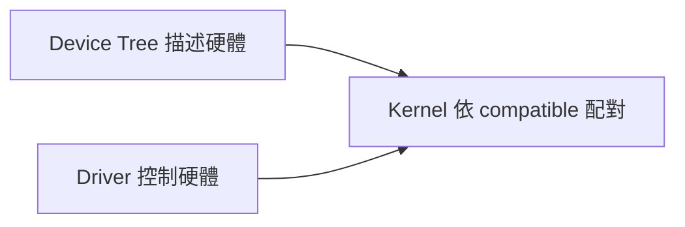
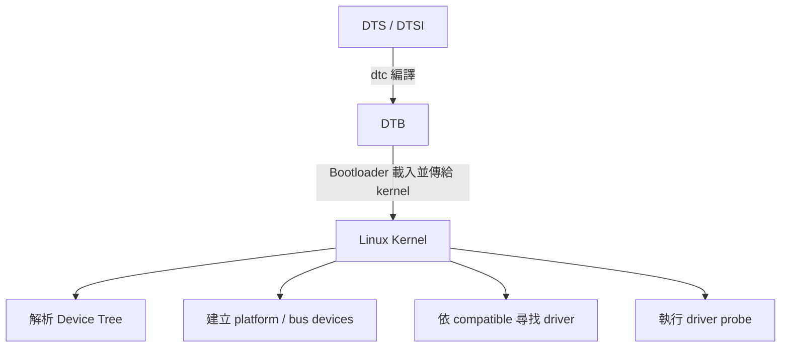
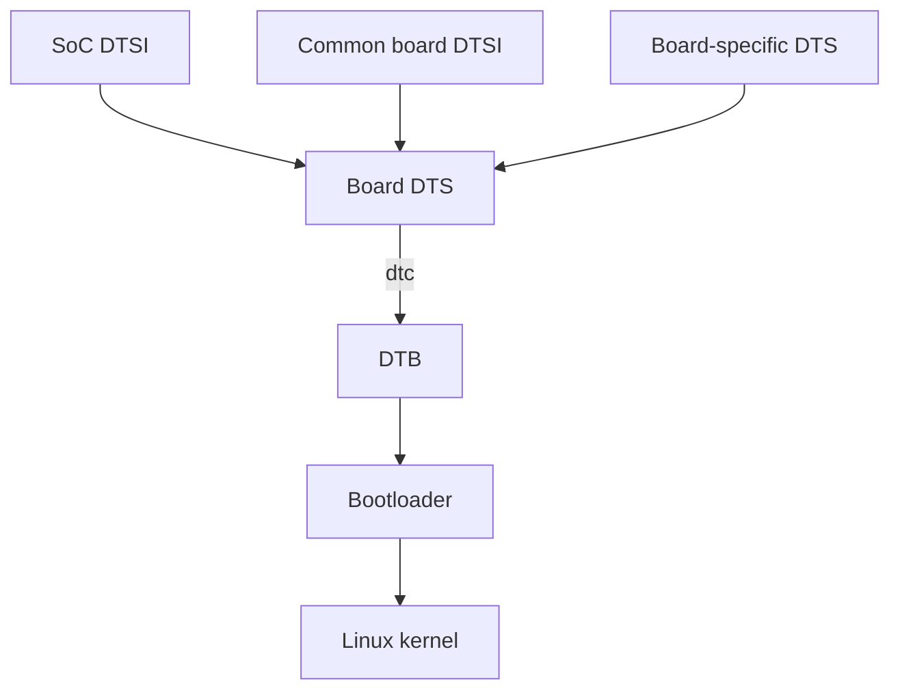
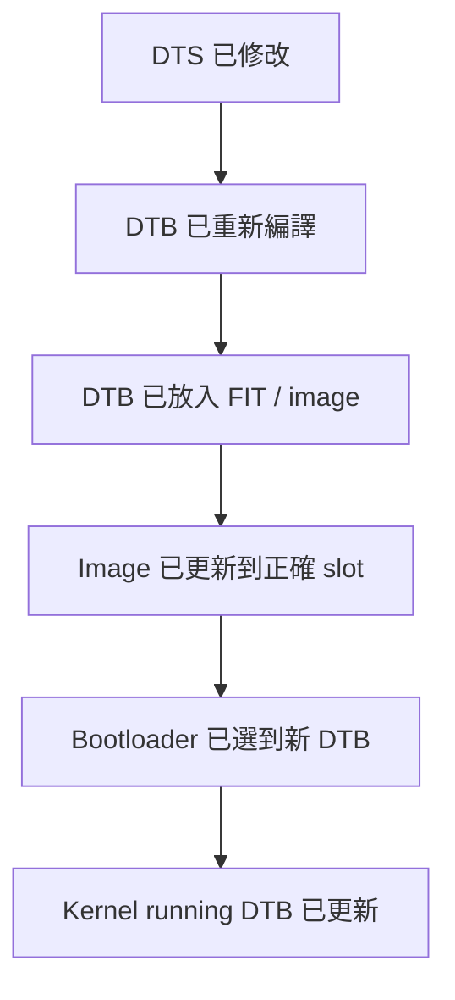
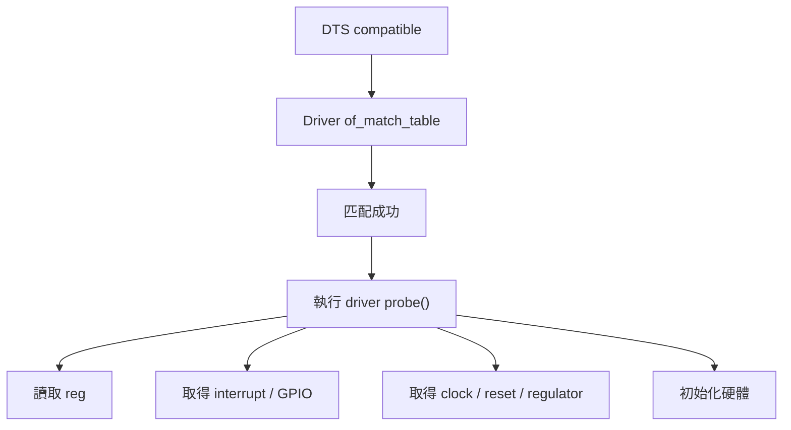
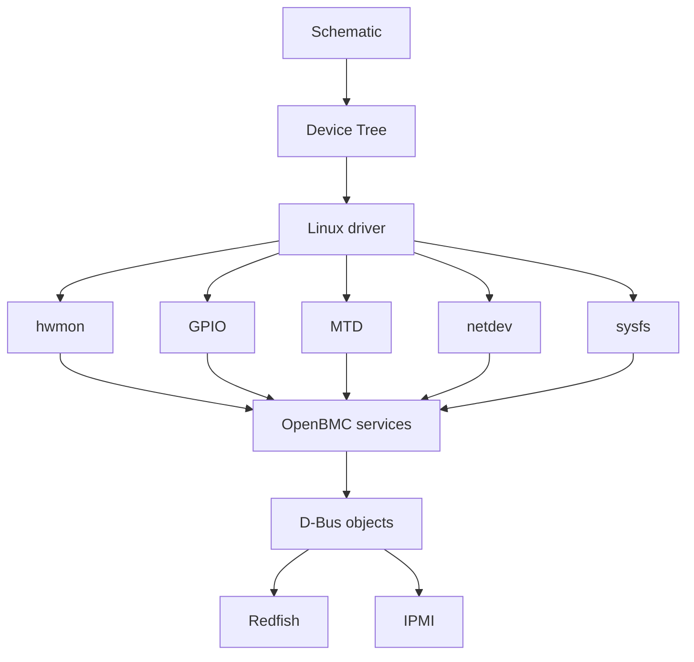
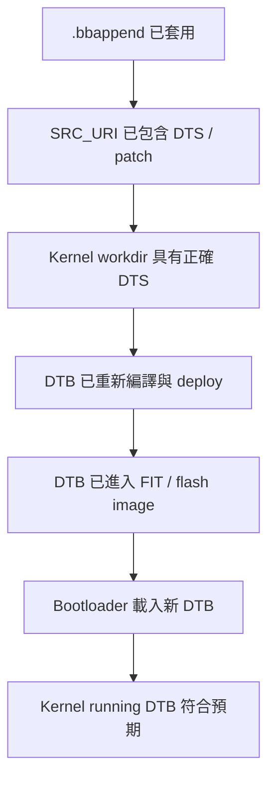
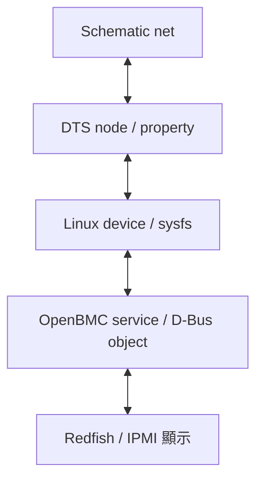

# 8. Device Tree: 從基本觀念到 OpenBMC Bring-up

Device Tree 是 Linux 嵌入式系統中用來描述硬體的一份資料. 它告訴 Linux kernel: 板子上有哪些裝置、裝置位於哪個位址、使用哪一條中斷、GPIO、clock、reset, 以及裝置之間有哪些相依關係.

Device Tree 本身不是 driver, 也不負責控制硬體. 它的工作是提供硬體資訊; 真正讀寫暫存器、處理中斷與提供 kernel 介面的, 是對應的 Linux driver.

例如, 板子上有一顆 TMP75 溫度感測器, 接在 I2C bus 5, 位址為 `0x48`:

- Device Tree 描述「I2C bus 5 上有一顆位於 `0x48` 的 TMP75」.
- TMP75 driver 負責與感測器通訊.
- Linux hwmon subsystem 將溫度資料提供給 userspace.
- OpenBMC 的 sensor service 再把資料轉成 D-Bus sensor object, 供 Redfish 或 IPMI 使用.

可以先記住以下關係:



本章依照「基本觀念 → DTS 語法 → driver matching → 常見硬體 → Yocto / OpenBMC 整合 → 建置與實機排查」的順序說明. 第一次閱讀時, 建議先理解 8.1～8.6; 實際進行 BMC porting 時, 再使用後半段的建置與排查流程.

## 適用範圍

本章涵蓋 Device Tree 的基本觀念、DTS 語法、driver matching、常見 BMC 硬體節點、Yocto / OpenBMC 整合、build-time 驗證, 以及 target 端 bring-up 與排查流程.

## 適用讀者

- 負責 BMC 平台移植、Linux kernel、Device Tree、Yocto / OpenBMC 建置或硬體 bring-up 的人員.
- 需要確認 DTS、DTB、binding、driver probe、running DTB 與 OpenBMC object 對應關係的人員.

## 快速導覽

- [Device Tree 的角色](#section-8-1)
- [DTS、DTSI、DTB、Binding 與 Overlay](#section-8-2)
- [第一份最小 Device Tree](#section-8-3)
- [DTS 語法](#section-8-4)
- [Kernel Driver Matching](#section-8-5)
- [常見硬體節點](#section-8-6)
- [Device Tree 與 OpenBMC 的責任邊界](#section-8-7)
- [Yocto / OpenBMC 整合](#section-8-8)
- [Build-time 驗證](#section-8-9)
- [確認 Target 使用新 DTB](#section-8-10)
- [Target 端子系統檢查](#section-8-11)
- [常見問題與排查順序](#section-8-12)
- [建議 Bring-up 順序](#section-8-13)
- [驗收 Checklist](#section-8-15)

<a id="section-8-1"></a>

## 8.1 Linux 為什麼需要 Device Tree

某些匯流排具有自動枚舉能力. 例如 PCI 或 USB 裝置連接後, 系統通常可以讀取裝置識別資訊, 再尋找對應 driver.

但 SoC 內部的 UART、I2C、SPI、GPIO、PWM、ADC 等 controller, 以及焊在板子上的感測器、EEPROM、GPIO expander、flash, 通常無法只靠自動枚舉取得完整資訊. Kernel 仍需要知道:

- 裝置是否存在.
- 裝置接在哪一個 controller.
- MMIO address 或 bus address 是多少.
- 使用哪一條 interrupt.
- 使用哪些 GPIO、clock、reset 或 regulator.
- 裝置目前是否應啟用.

同一顆 SoC 也可能被用在許多不同板子上. SoC 內部 controller 相同, 但外部接線、flash 容量、I2C 裝置與 GPIO 用途可能完全不同. 若把所有板級資訊直接寫在 driver 中, driver 會與特定板子綁在一起, 不利於共用與維護.

Device Tree 將兩類資訊分開:

| 類型 | 內容 | 常見位置 |
|---|---|---|
| 通用 driver 邏輯 | 如何控制 UART、I2C、GPIO、sensor、flash | Linux driver source |
| 平台硬體描述 | 裝置位址、中斷、接線、GPIO、clock、reset | DTS / DTSI |

開機流程可簡化為:



<a id="section-8-2"></a>

## 8.2 DTS、DTSI、DTB、Binding 與 Overlay

Device Tree 在開發過程中會以不同形式出現. 初學時最容易混淆的是: DTS、DTSI、DTB 都和 Device Tree 有關, 但它們不是同一個東西.

可以先用程式開發的方式理解:

```text
DTS / DTSI 近似原始檔
DTB        近似編譯後產物
Binding    近似格式與介面規格
Overlay    近似載入後再套用的差異片段
```

完整關係如下:



這個流程中:

1. DTS / DTSI 是人可以閱讀與維護的硬體描述.
2. `dtc` 將展開後的內容編譯成 DTB.
3. Bootloader 將 DTB 放到記憶體, 並把位址傳給 kernel.
4. Kernel 解析 DTB, 再依節點內容建立裝置並配對 driver.

### 8.2.1 DTS: 描述一塊特定板子

DTS 是 Device Tree Source, 副檔名為 `.dts`. 一份 board DTS 通常代表一塊可以獨立開機的板子, 例如某一塊 BMC evaluation board 或產品主板.

Board DTS 通常負責描述:

- 板子的 `model` 與 `compatible`.
- 引用哪一份 SoC DTSI 或共用 board DTSI.
- 哪些 SoC controller 要啟用.
- 板上固定存在的 I2C、SPI、MDIO 等裝置.
- GPIO line name、consumer GPIO 與 interrupt 接線.
- Flash partition、memory、reserved-memory.
- `aliases`、`chosen`、console 等開機資訊.

簡化範例:

```dts
/dts-v1/;

#include "aspeed-g6.dtsi"

/ {
    model = "David AST2600 BMC Board";
    compatible = "david,davidboard", "aspeed,ast2600";
};

&uart5 {
    status = "okay";
};

&i2c5 {
    status = "okay";

    eeprom@50 {
        compatible = "atmel,24c64";
        reg = <0x50>;
    };
};
```

這份 DTS 沒有重新描述 AST2600 的 UART、I2C controller 暫存器與中斷, 而是引用 SoC DTSI 中已存在的節點, 再透過 `&uart5`、`&i2c5` 啟用並加入板級裝置.

因此, board DTS 的核心工作可以理解為:

```text
引用共用硬體描述
＋
選擇這塊板子實際使用的 controller
＋
補上板級接線與外部裝置
```

### 8.2.2 DTSI: 保存可共用的硬體描述

DTSI 是 Device Tree Source Include, 副檔名為 `.dtsi`. 它通常不單獨作為最終開機使用的板子檔案, 而是由其他 DTS 或 DTSI 引用.

DTSI 常見分成三類.

第一類是 SoC DTSI, 用來描述 SoC 內部固定存在的硬體:

```text
aspeed-g6.dtsi
├── CPU
├── interrupt controller
├── clock / reset controller
├── UART controller
├── I2C controller
├── GPIO controller
├── SPI / FMC controller
└── Ethernet MAC
```

第二類是 SoC package 或系列共用 DTSI, 用來描述同系列晶片的共通內容與封裝差異.

第三類是 board common DTSI, 用來保存多個產品或 SKU 共用的板級設計, 例如:

- 共用的 power tree.
- 共用的 I2C MUX 與感測器配置.
- 共用的 GPIO expander.
- 共用的 flash layout.
- 共用的 fan board 或 riser board 連接方式.

例如:

```text
aspeed-g6.dtsi
      │
      ▼
davidboard-common.dtsi
      │
      ├── davidboard-a.dts
      └── davidboard-b.dts
```

其中:

- `aspeed-g6.dtsi` 描述 AST2600 SoC.
- `davidboard-common.dtsi` 描述產品系列共用電路.
- `davidboard-a.dts` 與 `davidboard-b.dts` 只保留各自差異.

這種分層可以降低重複內容, 但也要避免切得過細. 如果閱讀一塊板子的硬體描述需要跳轉大量 DTSI, 維護成本反而會增加.

### 8.2.3 `#include` 與 `/include/` 的角色

DTS 可以引用其他檔案. Kernel tree 中常見 C preprocessor 形式:

```dts
#include "aspeed-g6.dtsi"
#include <dt-bindings/gpio/gpio.h>
#include <dt-bindings/interrupt-controller/irq.h>
```

用途分別是:

- 引入 SoC 或共用 board DTSI.
- 引入 `GPIO_ACTIVE_LOW` 等常數定義.
- 引入 `IRQ_TYPE_LEVEL_LOW` 等 interrupt flag.

部分 Device Tree 原始檔也可能看到 `/include/"file.dtsi"` 語法. 實際專案應沿用該 kernel tree 的既有風格, 不需要在同一套平台檔案中混用不同形式.

引用 DTSI 後, 編譯器會把內容整合成一棵完整的 Device Tree. Kernel 最後取得的是編譯後的完整 DTB, 不會在 runtime 逐一讀取 `.dts` 與 `.dtsi`.

### 8.2.4 Label、Phandle 與覆寫既有節點

SoC DTSI 通常會替常用節點加上 label:

```dts
uart5: serial@1e784000 {
    compatible = "ns16550a";
    reg = <0x1e784000 0x1000>;
    status = "disabled";
};
```

Board DTS 可以透過 `&uart5` 找到該節點:

```dts
&uart5 {
    status = "okay";
};
```

這不是建立第二個 UART5, 而是修改同一個既有節點.

其他節點也可以透過 phandle 參照它:

```dts
chosen {
    stdout-path = &uart5;
};
```

可以將 label 視為 DTS 原始碼中的名稱, 而 phandle 是編譯後供節點互相參照的識別方式. 常見參照包含:

- GPIO controller.
- Clock provider.
- Reset controller.
- Regulator.
- Interrupt controller.
- PHY.
- I2C MUX 或其他 parent device.

### 8.2.5 DTB: 編譯後供 Bootloader 與 Kernel 使用

DTB 是 Device Tree Blob.`dtc` 會將 DTS、DTSI、include 與 label reference 展開並編譯成二進位格式.

概念指令如下:

```bash
$ dtc -I dts -O dtb -o board.dtb board.dts
```

也可以反向將 DTB 轉回較容易閱讀的 DTS:

```bash
$ dtc -I dtb -O dts -o board-decoded.dts board.dtb
```

反編譯結果通常不會完全保留原始排版、註解、include 結構與 label 命名, 因此它適合確認實際內容, 不適合取代原始 DTS 維護.

在實際產品中, DTB 可能以不同形式存在:

- 獨立 `.dtb` 檔案.
- 包在 FIT image 中.
- 與 kernel image 一起打包.
- 放在 flash partition 或 boot filesystem.
- 由 Bootloader 依 machine、SKU 或 slot 選擇.

所以修改 DTS 後, 需要確認整條路徑:



### 8.2.6 Bootloader 如何把 DTB 傳給 Kernel

Bootloader 通常會完成以下工作:

1. 載入 kernel image.
2. 載入 DTB, 或從 FIT image 選擇一份 DTB.
3. 視需要修改 Device Tree, 例如補上 bootargs、memory size、MAC address 或 reserved-memory.
4. 將 DTB 位址傳給 kernel.
5. 啟動 kernel.

因此, source DTS 與 kernel 最後看到的內容不一定完全相同. 常見差異來源包括:

- U-Boot 修改 `/chosen/bootargs`.
- U-Boot 根據實際 DRAM 容量修改 memory node.
- Bootloader 寫入 MAC address 或 serial number.
- FIT configuration 選到另一個 DTB.
- A/B update 使用到另一個 slot.
- Bootloader 套用 DT Overlay.

排查時必須同時區分三份資料:

| 資料 | 用途 |
|---|---|
| Source DTS / DTSI | 確認原始設計與 patch |
| Build output DTB | 確認建置產物 |
| Running DTB | 確認 kernel 實際取得的內容 |

### 8.2.7 Binding: 節點應如何撰寫的規格

Binding 定義某類裝置在 Device Tree 中應如何描述. 它不是 DTS 本身, 也不是 driver source, 而是兩者之間的格式契約.

例如, 一個溫度感測器 binding 可能規定:

- `compatible` 必須是支援的型號.
- `reg` 為必填, 表示 I2C address.
- 可選擇提供 interrupt.
- 不允許未定義的 vendor properties.

Binding 通常位於:

```text
Documentation/devicetree/bindings/
```

近年的 kernel 多使用 YAML schema, 例如:

```text
Documentation/devicetree/bindings/hwmon/ti,tmp75.yaml
Documentation/devicetree/bindings/i2c/i2c-controller.yaml
Documentation/devicetree/bindings/spi/jedec,spi-nor.yaml
```

Binding、driver 與 DTS 的關係如下:

```text
Binding
├── 規定 DTS 可以怎麼寫
└── 描述 driver 期待取得哪些資料

DTS
└── 依 binding 描述實際板子硬體

Driver
└── 讀取 DTS property 並控制硬體
```

`dtbs_check` 會使用 schema 檢查 DTB 是否符合 binding, 例如:

- 缺少必填 property.
- Property 型態錯誤.
- `compatible` 不在允許清單.
- `reg` cell 數量不符.
- 出現 binding 不允許的 property.

即使 DTS 能通過 `dtc` 編譯, 也不代表內容符合 binding.`dtc` 主要能找到語法與部分結構問題,`dtbs_check` 則進一步檢查 schema.

### 8.2.8 Overlay: 在 Base DTB 上加入差異

DT Overlay 是套用在 base DTB 上的差異片段. 它可用於:

- 選配 daughter board.
- 不同 SKU 的少量硬體差異.
- 可插拔模組.
- Bootloader 根據 board ID 選擇的附加設定.

概念如下:

```text
Base DTB
   │
   ├── Overlay A：加入額外 I2C sensor
   └── Overlay B：啟用另一組 GPIO / SPI device
```

Overlay 增加彈性, 也增加管理成本. 需要明確記錄:

- Base DTB 版本.
- Overlay 版本.
- 套用順序.
- 套用條件.
- Bootloader 支援方式.
- Overlay 失敗時的回復策略.

對固定硬體的 BMC 平台, 初期 bring-up 通常先使用完整 board DTS. 等 base platform 穩定、SKU 差異與載入機制明確後, 再評估 overlay 是否真的能降低維護成本.

### 8.2.9 這五個名詞如何區分

| 名稱 | 它是什麼 | 主要用途 | 是否直接供 Kernel 使用 |
|---|---|---|---|
| DTS | 板級 Device Tree 原始檔 | 描述一塊特定板子 | 否, 需先編譯 |
| DTSI | 可被引用的共用原始檔 | 保存 SoC 或共用板級內容 | 否, 需由 DTS / DTSI 引用 |
| DTB | 編譯後的 Device Tree Blob | 由 Bootloader 傳給 Kernel | 是 |
| Binding | 節點與 property 的格式規格 | 約束 DTS 並說明 driver 期待 | 否 |
| Overlay | 套用於 base DTB 的差異片段 | 描述選配或少量硬體差異 | 套用後才成為有效樹的一部分 |

初學階段最重要的是先掌握以下三句:

1. DTS 描述特定板子, DTSI 保存共用內容.
2. Kernel 真正取得的是 DTB, 不是 DTS 原始檔.
3. Binding 規定節點應怎麼寫, driver 依這些資料初始化硬體.

<a id="section-8-3"></a>

## 8.3 第一份最小 Device Tree

以下是簡化後的 board DTS:

```dts
/dts-v1/;

/ {
    model = "David Example Board";
    compatible = "david,davidboard";

    chosen {
        bootargs = "console=ttyS4,115200n8";
    };
};
```

逐項說明:

- `/dts-v1/;`: 宣告使用 DTS version 1 格式.
- `/{ ...};`: root node, 代表整個系統.
- `model`: 人類可讀的板子名稱.
- `compatible`: 描述平台相容性, 通常由較具體到較通用排列.
- `chosen`: 保存 kernel 啟動階段使用的資訊, 例如 bootargs 或 stdout path.
- 每個 property 後面都有分號 `;`.
- 每個 node 使用 `{ ...}` 包住內容, 結尾同樣需要分號.

這個範例還沒有描述實際 controller, 但已包含 DTS 的基本文法: directive、root node、property、child node、大括號與分號.

<a id="section-8-4"></a>

## 8.4 DTS 語法完整入門

DTS 看起來像程式語言, 但它主要是結構化資料, 不是依序執行的程式. 閱讀時可以先把一份 DTS 拆成四個部分:

```text
編譯指示與 include
        ↓
Root node
        ↓
Nodes 與 child nodes
        ↓
Properties 與 references
```

### 8.4.1 基本文法規則

DTS 最常見的文法規則如下:

1. Property 必須以分號 `;` 結尾.
2. Node 使用 `{` 與 `}` 包住內容, node 結尾也要加分號.
3. 字串使用雙引號.
4. 32-bit cell 通常放在角括號 `< ...>` 中.
5. Raw bytes 放在方括號 `[ ...]` 中.
6. `&label` 表示參照其他節點.
7. `//` 與 `/* ...*/` 可用來撰寫註解.
8. Node 與 property 名稱區分大小寫; 實務上通常使用小寫.

正確範例:

```dts
device@40 {
    compatible = "vendor,device";
    reg = <0x40>;
    wakeup-source;
};
```

常見語法錯誤:

```dts
/* 錯誤：property 後面缺少分號 */
compatible = "vendor,device"

/* 錯誤：node 結尾缺少分號 */
device@40 {
    reg = <0x40>;
}

/* 錯誤：字串沒有使用雙引號 */
status = okay;
```

`dtc` 通常會指出錯誤行附近, 但真正缺少分號的位置有時在前一行, 因此遇到 syntax error 時應一併檢查上方數行.

### 8.4.2 註解

DTS 常見兩種註解形式:

```dts
// 單行註解

/*
 * 多行註解
 * 適合說明硬體限制或特殊接線
 */
```

註解應說明無法直接從節點內容看出的原因, 例如:

```dts
&i2c5 {
    /*
     * Bus speed is limited to 100 kHz because the channel passes
     * through a long cable on the fan board.
     */
    bus-frequency = <100000>;
};
```

不建議只把 property 內容翻譯一次, 例如「`status = "okay"` 表示啟用」, 因為這類資訊從語法本身即可理解.

### 8.4.3 Root Node 與 Child Node

`/` 是整棵 Device Tree 的 root node:

```dts
/ {
    model = "David Example Board";

    chosen {
        bootargs = "console=ttyS4,115200n8";
    };
};
```

其中:

- `/` 是 root node.
- `model` 是 root node 的 property.
- `chosen` 是 root node 的 child node.
- `bootargs` 是 `chosen` node 的 property.

Device Tree 以階層表示硬體關係. 例如 I2C 裝置放在 I2C controller 底下:

```dts
i2c@1e78a200 {
    status = "okay";

    temperature-sensor@48 {
        compatible = "ti,tmp75";
        reg = <0x48>;
    };
};
```

此處 `temperature-sensor@48` 是 I2C controller 的 child, 因此它的 `reg = <0x48>` 會依 I2C bus 規則解讀為 I2C address, 而不是 MMIO address.

### 8.4.4 Node 的完整組成

一般 node 可寫成:

```dts
label: node-name@unit-address {
    property-name = <value>;
};
```

各部分說明:

| 部分 | 是否必要 | 說明 |
|---|---:|---|
| `label` | 否 | DTS 原始碼內的參照名稱, 可透過 `&label` 使用 |
| `node-name` | 是 | 裝置類型名稱, 例如 `serial`、`i2c`、`gpio` |
| `unit-address` | 視情況 | 裝置在 parent bus 下的位址, 通常對應 `reg` 第一個 address |
| `{ ...}` | 是 | Node 內容, 可放 properties 與 child nodes |
| 結尾分號 | 是 | Node 的 `};` 不可省略 |

例如:

```dts
uart5: serial@1e784000 {
    compatible = "ns16550a";
    reg = <0x1e784000 0x1000>;
    status = "disabled";
};
```

可以拆成:

```text
uart5                  label
serial                 node name
1e784000               unit address
compatible / reg       properties
```

Node name 應描述裝置類型, 不建議把產品名稱或 driver 名稱隨意塞進 node name. 實際允許的名稱仍應以 binding 為準.

### 8.4.5 Unit Address 與 `reg` 的關係

有 `reg` 的 node 通常需要 `@unit-address`, 而 unit address 通常等於 `reg` 的第一個 address.

```dts
temperature-sensor@48 {
    compatible = "ti,tmp75";
    reg = <0x48>;
};
```

這裡:

```text
@48        unit address
reg = <0x48>  裝置在 parent bus 上的 address
```

錯誤範例:

```dts
/* unit address 與 reg 不一致 */
temperature-sensor@49 {
    compatible = "ti,tmp75";
    reg = <0x48>;
};
```

沒有 `reg` 的 node 通常不應加入 unit address:

```dts
chosen {
    bootargs = "console=ttyS4,115200n8";
};
```

`dtc` 常會對 unit address 與 `reg` 不一致、或有 unit address 卻沒有 `reg` 的情況提出 warning.

### 8.4.6 Property: 名稱和值

Property 的基本格式為:

```dts
property-name = value;
```

也有不帶值的 boolean property:

```dts
wakeup-source;
```

Property name 的意義不是由 DTS 文法自行決定, 而是由 Devicetree Specification、通用 binding 或裝置 binding 定義. 例如:

- `compatible`: 用於裝置與 driver 配對.
- `reg`: 描述 address 與 size.
- `interrupts`: 描述 interrupt specifier.
- `clocks`: 參照 clock provider.
- `reset-gpios`: 描述 reset GPIO.
- `status`: 描述節點是否可用.

所以「語法正確」與「property 用得正確」是兩件事:

```text
dtc 語法通過
不代表
節點符合 binding，也不代表硬體接線正確
```

### 8.4.7 字串與字串列表

單一字串:

```dts
status = "okay";
model = "David Example Board";
```

字串列表使用逗號分隔:

```dts
compatible = "david,davidboard", "aspeed,ast2600";
```

對 `compatible` 而言, 通常由最具體排到較通用:

```text
david,davidboard   特定板子
aspeed,ast2600     通用 SoC 相容性
```

字串中若需要特殊字元, 可使用 escape. 例如:

```dts
message = "line1
line2";
```

實務上 property 是否允許單一字串或字串列表, 仍由 binding 決定.

### 8.4.8 Cell 與角括號 `< ...>`

角括號中的數值通常由一個或多個 32-bit cell 組成:

```dts
reg = <0x1e784000 0x1000>;
clock-frequency = <24000000>;
```

一個 cell 並不一定代表一個完整欄位. 如何分組要看 property 定義與 provider 的 `#*-cells`:

```dts
clocks = <&syscon 42>;
```

可概念性拆成:

```text
&syscon  clock provider
42       provider 定義的 clock ID
```

若 provider 宣告需要更多 cells, consumer 的 specifier 也會更長. 因此看到 `< ...>` 時, 不應只靠數字數量猜意思, 應查 parent bus 或 binding.

### 8.4.9 64-bit 數值與多個 Cell

當 address 或 size 超過 32-bit 時, 可能使用兩個 cell 表示一個 64-bit 數值:

```dts
memory@80000000 {
    device_type = "memory";
    reg = <0x0 0x80000000 0x0 0x40000000>;
};
```

若 parent 定義:

```dts
#address-cells = <2>;
#size-cells = <2>;
```

則 `reg` 會被解讀為:

```text
address = 0x00000000_80000000
size    = 0x00000000_40000000
```

這也是為何不能只看 `reg` 裡有四個數字就直接判斷有兩組裝置; 必須先看 parent 的 cell 定義.

### 8.4.10 Byte Array 與方括號 `[ ...]`

Raw bytes 使用方括號, 通常以兩位十六進位數表示:

```dts
mac-address = [00 11 22 33 44 55];
```

這代表六個 bytes, 不是六個 32-bit cells.

比較:

```dts
value-cells = <0x00 0x11 0x22>;
value-bytes = [00 11 22];
```

兩者 binary encoding 不同, 不能互換. 應依 binding 規定選擇 cell、string 或 byte array.

### 8.4.11 Boolean Property

Boolean property 只要出現就代表 true:

```dts
read-only;
wakeup-source;
regulator-always-on;
```

它不是這樣寫:

```dts
/* 通常不是合法 binding 寫法 */
read-only = <1>;
```

想停用某個 boolean property 時, 不能寫成 `<0>` 期待它變成 false. 若該 property 是從 DTSI 繼承而來, 需要使用 `/delete-property/` 移除.

### 8.4.12 Label、`&label` 與 Phandle Reference

Label 定義方式:

```dts
gpio0: gpio@1e780000 {
    gpio-controller;
    #gpio-cells = <2>;
};
```

其他節點可透過 `&gpio0` 參照:

```dts
device@40 {
    reset-gpios = <&gpio0 12 GPIO_ACTIVE_LOW>;
};
```

概念如下:

```text
&gpio0             GPIO provider
12                 GPIO line offset
GPIO_ACTIVE_LOW    polarity flag
```

Label 主要服務 DTS 原始碼的閱讀與引用. 編譯後, 這類 reference 會轉成 phandle 與對應 specifier.

### 8.4.13 覆寫既有節點

Board DTS 常用 `&label` 修改 SoC DTSI 已定義的節點:

```dts
&uart5 {
    status = "okay";
};
```

也可以補上 property:

```dts
&i2c5 {
    status = "okay";
    bus-frequency = <100000>;
};
```

或加入 child node:

```dts
&i2c5 {
    status = "okay";

    eeprom@50 {
        compatible = "atmel,24c64";
        reg = <0x50>;
    };
};
```

如果同一 property 在前面的 DTSI 已存在, 後面的定義通常會覆寫它. 實際結果應以預處理與編譯後 DTB 為準, 不應只看其中一個來源檔.

### 8.4.14 `/delete-property/` 與 `/delete-node/`

若共用 DTSI 定義了某個 property, 但特定板子需要移除, 可使用:

```dts
&device0 {
    /delete-property/ wakeup-source;
};
```

移除 child node:

```dts
&i2c5 {
    /delete-node/ eeprom@50;
};
```

若節點有 label, 也可依專案與工具鏈支援方式使用對應 reference. 移除內容前應先評估是否能透過 `status = "disabled"` 或更合適的共用 DTSI 分層表達. 大量 delete 通常表示 common DTSI 的抽象方式需要重新整理.

### 8.4.15 `/omit-if-no-ref/`

部分 kernel DTSI 會看到:

```dts
/omit-if-no-ref/
pinctrl_uart5_default: uart5-default {
    function = "UART5";
    groups = "UART5";
};
```

它表示: 如果最終 Device Tree 沒有任何節點參照此節點, 編譯時可省略它. 這常用於 pinctrl 等包含大量可選設定的 DTSI, 減少最終 DTB 中未使用的節點.

初學者通常不需要主動使用, 但閱讀 SoC DTSI 時應知道它不是一般 property.

### 8.4.16 `#address-cells`、`#size-cells` 與 `reg`

`reg` 的格式由 parent node 決定, 而不是由 child 自己決定.

例如 I2C bus:

```dts
&i2c5 {
    #address-cells = <1>;
    #size-cells = <0>;

    temperature-sensor@48 {
        compatible = "ti,tmp75";
        reg = <0x48>;
    };
};
```

解讀方式:

```text
address 使用 1 cell
size 使用 0 cell
所以 reg = <0x48> 只有 address，沒有 size
```

MMIO bus 可能是:

```dts
soc {
    #address-cells = <1>;
    #size-cells = <1>;

    serial@1e784000 {
        reg = <0x1e784000 0x1000>;
    };
};
```

解讀方式:

```text
address = 0x1e784000
size    = 0x1000
```

常見 bus:

| Parent bus | 常見 cells | Child `reg` 意義 |
|---|---|---|
| SoC / MMIO | address 1～2、size 1～2 | Base address 與範圍大小 |
| I2C | address 1、size 0 | 7-bit I2C address |
| SPI | address 1、size 0 | Chip select index |
| MDIO | address 1、size 0 | PHY address |

### 8.4.17 `ranges`

`ranges` 用來描述 child bus address 如何轉換到 parent bus address.

空的 `ranges;` 通常表示 child 與 parent address space 為直接對應:

```dts
reserved-memory {
    #address-cells = <1>;
    #size-cells = <1>;
    ranges;
};
```

有值的 `ranges` 通常包含:

```text
child bus address
parent bus address
size
```

實際 cell 數量由 child node 與 parent node 的 `#address-cells`、`#size-cells` 決定. 遇到複雜 bus translation 時, 應搭配 binding 與 SoC bus 定義閱讀.

### 8.4.18 `status` 的語法與意義

常見值:

```dts
status = "okay";
status = "disabled";
```

基本意義:

- `okay`: 裝置可使用, kernel 可以建立並嘗試配對 driver.
- `disabled`: 目前不應使用.

有些程式碼也接受 `ok`, 但專案通常統一使用 `okay`.

需要注意:

```text
status = "okay"
不代表
driver 一定 probe 成功，也不代表硬體訊號正常
```

Parent controller 若 disabled, 其 child device 即使寫 `okay`, 通常也不會正常建立.

### 8.4.19 `compatible` 的語法

Board compatible:

```dts
compatible = "david,davidboard", "aspeed,ast2600";
```

Device compatible:

```dts
compatible = "ti,tmp75";
```

一般格式是:

```text
vendor,device
```

字串內容必須符合 binding 或 driver match table, 不是顯示名稱. 若有多個 compatible, 通常先列最具體型號, 再列可相容的通用型號.

### 8.4.20 Interrupt、Clock、Reset 與 GPIO Specifier

這類 property 的共同模式是:

```text
provider reference + provider-specific cells
```

GPIO:

```dts
reset-gpios = <&gpio0 12 GPIO_ACTIVE_LOW>;
```

Clock:

```dts
clocks = <&syscon 42>;
clock-names = "macclk";
```

Reset:

```dts
resets = <&rst 12>;
reset-names = "mac";
```

Interrupt:

```dts
interrupt-parent = <&gpio0>;
interrupts = <42 IRQ_TYPE_LEVEL_LOW>;
```

每個 provider 需要幾個 cells, 由它的 `#gpio-cells`、`#clock-cells`、`#reset-cells` 或 `#interrupt-cells` 決定. 不能把不同 controller 的 specifier 格式直接互換.

### 8.4.21 `aliases` 與 `chosen`

`aliases` 提供某些節點的簡短名稱:

```dts
/ {
    aliases {
        serial4 = &uart5;
        ethernet0 = &mac0;
    };
};
```

它可能影響裝置編號或 bootloader / kernel 尋找特定節點的方式, 但具體行為取決於 subsystem.

`chosen` 保存系統啟動相關資訊:

```dts
/ {
    chosen {
        stdout-path = &uart5;
        bootargs = "console=ttyS4,115200n8";
    };
};
```

Bootloader 可能在開機時修改 `chosen`, 所以 target 排查應查看 `/proc/cmdline` 與 running DTB.

### 8.4.22 一份實際 DTS 的逐行拆解

以下把前面的語法組成一份較接近 BMC board DTS 的簡化範例:

```dts
/dts-v1/;

#include "aspeed-g6.dtsi"
#include <dt-bindings/gpio/gpio.h>

/ {
    model = "David AST2600 BMC Board";
    compatible = "david,davidboard", "aspeed,ast2600";

    aliases {
        serial4 = &uart5;
    };

    chosen {
        stdout-path = &uart5;
    };
};

&uart5 {
    status = "okay";
};

&i2c5 {
    status = "okay";
    bus-frequency = <100000>;

    eeprom@50 {
        compatible = "atmel,24c64";
        reg = <0x50>;
        pagesize = <32>;
        read-only;
    };

    gpio_expander0: gpio@20 {
        compatible = "nxp,pca9555";
        reg = <0x20>;
        gpio-controller;
        #gpio-cells = <2>;
        reset-gpios = <&gpio0 12 GPIO_ACTIVE_LOW>;
    };
};
```

逐段閱讀:

1. `/dts-v1/;` 宣告 DTS 格式.
2. `#include "aspeed-g6.dtsi"` 引入 AST2600 SoC 節點.
3. GPIO header 提供 `GPIO_ACTIVE_LOW` 常數.
4. Root node 定義板子名稱與相容性.
5. `aliases` 將 `serial4` 指向 `uart5`.
6. `chosen` 將開機輸出指向 `uart5`.
7. `&uart5` 覆寫 SoC DTSI 的 UART5, 將它啟用.
8. `&i2c5` 覆寫 I2C5, 設定 bus speed 並加入 child devices.
9. `eeprom@50` 的 unit address 與 `reg` 都是 `0x50`.
10. `read-only;` 是沒有值的 boolean property.
11. `gpio_expander0:` 是 label, 讓其他節點可以使用 `&gpio_expander0` 參照此裝置.
12. `#gpio-cells = <2>` 表示 consumer 參照此 GPIO controller 時, 要提供兩個 provider-specific cells.
13. `reset-gpios` 參照 SoC GPIO controller, line offset 為 12, logical polarity 為 active low.

### 8.4.23 語法、Binding 與硬體的三層檢查

完成 DTS 後, 應分三層確認:

第一層是語法:

```text
括號是否成對
分號是否完整
字串與 cell 寫法是否正確
label 是否存在
```

第二層是 binding:

```text
compatible 是否有效
必填 property 是否齊全
property 型態與 cell 數量是否正確
node name 是否符合 schema
```

第三層是硬體:

```text
address 是否符合 schematic
GPIO offset 與 polarity 是否正確
interrupt type 是否正確
power、clock、reset 與 pinmux 是否滿足
```

這三層都通過, 才表示一個 DTS 節點具備進入實機驗證的條件.

<a id="section-8-5"></a>

## 8.5 Kernel 如何找到對應 Driver

Device Tree 與 driver 的主要配對依據是 `compatible`.

DTS:

```dts
temperature-sensor@48 {
    compatible = "ti,tmp75";
    reg = <0x48>;
};
```

Driver 中會有對應的 match table, 概念如下:

```c
static const struct of_device_id tmp75_of_match[] = {
    { .compatible = "ti,tmp75" },
    { }
};
```

配對流程:



若 driver 沒有 probe, 可依序確認:

1. `compatible` 是否和 driver / binding 一致.
2. Node 與 parent controller 是否為 `status = "okay"`.
3. Kernel config 是否啟用該 driver.
4. Driver 是 built-in 還是 module; 若是 module, 是否已載入.
5. Binding 必填 property 是否齊全.
6. Clock、reset、regulator 或 GPIO provider 是否已 ready.
7. `dmesg` 是否有 probe error 或 deferred probe.

`status = "okay"` 只表示允許 kernel 嘗試建立裝置, 不代表硬體一定正常. 若 power rail、reset、pinmux 或 bus address 有誤, probe 仍可能失敗.

<a id="section-8-6"></a>

## 8.6 常見硬體節點

本節依照由簡到難的順序整理 BMC 常見節點. 閱讀每個範例時, 建議固定確認四件事:

1. Parent controller 是否啟用.
2. `compatible` 是否有對應 binding 與 driver.
3. Address、GPIO、interrupt、clock、reset 是否符合 schematic.
4. Target 上是否出現對應 kernel device.

### 8.6.1 UART 與 Console

```dts
/ {
    aliases {
        serial4 = &uart5;
    };

    chosen {
        stdout-path = &uart5;
    };
};

&uart5 {
    status = "okay";
    pinctrl-names = "default";
    pinctrl-0 = <&pinctrl_uart5_default>;
};
```

需要同步確認:

- UART pinmux.
- U-Boot console 設定.
- Kernel bootargs.
- Kernel serial driver config.
- Baud rate.
- 實際 UART TX/RX 接線.

Target 上應以 `/proc/cmdline` 與 boot log 為準, 因為 U-Boot 可能修改 `/chosen/bootargs`.

### 8.6.2 I2C Controller 與固定裝置

```dts
&i2c5 {
    status = "okay";
    bus-frequency = <100000>;

    eeprom@50 {
        compatible = "atmel,24c64";
        reg = <0x50>;
        pagesize = <32>;
    };

    temperature-sensor@48 {
        compatible = "ti,tmp75";
        reg = <0x48>;
    };
};
```

排查順序:

1. I2C controller 與 pinmux 是否啟用.
2. `i2cdetect -l` 是否出現 bus.
3. Bus address 是否為 7-bit address.
4. 裝置 power rail 與 reset 是否正常.
5. SDA / SCL 是否有 pull-up, 波形是否正常.
6. Driver 是否建立 `/sys/bus/i2c/devices/` 或 hwmon 裝置.

### 8.6.3 I2C MUX

```dts
&i2c6 {
    status = "okay";

    i2c-mux@70 {
        compatible = "nxp,pca9548";
        reg = <0x70>;
        #address-cells = <1>;
        #size-cells = <0>;

        i2c@0 {
            reg = <0>;
            #address-cells = <1>;
            #size-cells = <0>;

            eeprom@50 {
                compatible = "atmel,24c02";
                reg = <0x50>;
            };
        };
    };
};
```

MUX 後的 Linux bus number 可能受 probe 順序與 alias 影響, 不應只依文件中的固定 `i2c-N` 判斷. 應搭配:

```bash
$ i2cdetect -l
$ readlink -f /sys/bus/i2c/devices/i2c-*
```

### 8.6.4 GPIO、Line Name 與 Consumer GPIO

GPIO controller 可以提供 line names:

```dts
&gpio0 {
    gpio-line-names =
        "pwrbtn-n", "pltrst-n", "host-pgood", "bios-wp-n",
        "psu0-present-n", "psu1-present-n", "fan0-present-n", "fan1-present-n";
};
```

使用 GPIO 的裝置則透過 consumer property 參照:

```dts
device@40 {
    compatible = "vendor,device";
    reg = <0x40>;
    reset-gpios = <&gpio0 12 GPIO_ACTIVE_LOW>;
};
```

需區分:

- Line name: 提供人類可讀名稱, 方便排查與 userspace 對照.
- Consumer GPIO: 告訴特定 driver 使用哪一條 GPIO.
- Pinctrl: 決定 pin 目前是 GPIO、UART、I2C、PWM 或其他功能.

`GPIO_ACTIVE_LOW` 會影響 Linux 的 logical value. 排查時應同時記錄:

- Physical level.
- Active polarity.
- Logical value.
- Consumer name.

### 8.6.5 Interrupt

```dts
gpio_expander0: gpio@20 {
    compatible = "nxp,pca9555";
    reg = <0x20>;
    gpio-controller;
    #gpio-cells = <2>;

    interrupt-parent = <&gpio0>;
    interrupts = <42 IRQ_TYPE_LEVEL_LOW>;
};
```

注意事項:

- Active low 不一定表示 falling edge; IRQ type 應依硬體與 driver 行為選擇.
- Level interrupt 的 source 若未清除, 可能造成 IRQ storm.
- Shared interrupt 需要每個裝置都能判斷並清除自己的事件.
- Interrupt pin 的 pull-up、power domain 與 reset 狀態也要確認.

### 8.6.6 SPI Flash 與 Partition

```dts
&fmc {
    status = "okay";

    flash@0 {
        compatible = "jedec,spi-nor";
        reg = <0>;
        spi-max-frequency = <50000000>;
        label = "bmc";

        partitions {
            compatible = "fixed-partitions";
            #address-cells = <1>;
            #size-cells = <1>;

            u-boot@0 {
                label = "u-boot";
                reg = <0x00000000 0x00100000>;
                read-only;
            };

            u-boot-env@100000 {
                label = "u-boot-env";
                reg = <0x00100000 0x00020000>;
            };

            kernel@120000 {
                label = "kernel";
                reg = <0x00120000 0x00600000>;
            };
        };
    };
};
```

Flash partition 必須與以下內容對齊:

- Flash 實際容量與 erase block.
- U-Boot env / `mtdparts`.
- Yocto image layout.
- OpenBMC software update service.
- Recovery 與 A/B slot 設計.

Target 上使用 `cat /proc/mtd` 檢查 kernel 實際看到的 partition.

### 8.6.7 Clock、Reset 與 Regulator

```dts
vdd_3v3_aux: regulator-vdd-3v3-aux {
    compatible = "regulator-fixed";
    regulator-name = "vdd_3v3_aux";
    regulator-min-microvolt = <3300000>;
    regulator-max-microvolt = <3300000>;
    regulator-always-on;
};

ethernet@1e660000 {
    compatible = "vendor,soc-mac";
    reg = <0x1e660000 0x1000>;
    clocks = <&syscon 42>;
    clock-names = "macclk";
    resets = <&rst 12>;
    reset-names = "mac";
    status = "okay";
};
```

Driver probe 常同時依賴:

- Clock provider.
- Reset provider.
- Power rail / regulator.
- Pinctrl.
- 對應 bus 或 parent device.

若依賴尚未 ready, 裝置可能進入 deferred probe. 可檢查:

```bash
$ cat /sys/kernel/debug/devices_deferred
```

### 8.6.8 Ethernet、MDIO、PHY 與 NC-SI

```dts
&mac0 {
    status = "okay";
    phy-mode = "rgmii-id";
    phy-handle = <&ethphy0>;
    pinctrl-names = "default";
    pinctrl-0 = <&pinctrl_rgmii1_default>;
};

&mdio0 {
    status = "okay";

    ethphy0: ethernet-phy@1 {
        reg = <1>;
        reset-gpios = <&gpio0 46 GPIO_ACTIVE_LOW>;
        reset-assert-us = <10000>;
        reset-deassert-us = <30000>;
    };
};
```

網路不通時需同時確認:

- `phy-mode`.
- MDIO address.
- PHY reset 與 rail.
- Reference clock.
- MAC pinmux.
- Ethernet driver log.
- NC-SI channel、package 與 host power dependency.

### 8.6.9 PWM、Tach、ADC、Watchdog 與 RTC

```dts
&pwm_tacho {
    status = "okay";
    pinctrl-names = "default";
    pinctrl-0 = <&pinctrl_pwm0_default &pinctrl_tach0_default>;
};

&adc0 {
    status = "okay";
};

&wdt1 {
    status = "okay";
};

&i2c3 {
    status = "okay";

    rtc@51 {
        compatible = "nxp,pcf8563";
        reg = <0x51>;
    };
};
```

Controller 在 DTS 中啟用只是第一步:

- PWM 需確認 pinmux 與實際輸出波形.
- Tach 需確認 pull-up、每轉脈波數與 fan power.
- ADC 讀值需搭配分壓、scale 與 offset.
- Watchdog 需確認 reset 範圍與 systemd watchdog policy.
- RTC 需確認待機狀態下是否仍有供電.

### 8.6.10 Memory 與 Reserved Memory

```dts
/ {
    memory@80000000 {
        device_type = "memory";
        reg = <0x80000000 0x20000000>;
    };

    reserved-memory {
        #address-cells = <1>;
        #size-cells = <1>;
        ranges;

        video_engine_memory: framebuffer@9f000000 {
            reg = <0x9f000000 0x01000000>;
            no-map;
        };
    };
};
```

Memory 描述錯誤可能造成 kernel panic、DMA failure 或 memory corruption. 需確認:

- DDR 實際容量.
- Bootloader 是否修改 memory node.
- Reserved regions 是否重疊.
- Kernel、initramfs、CMA 與 secure firmware 的使用範圍.

<a id="section-8-7"></a>

## 8.7 Device Tree 與 OpenBMC 的責任邊界

OpenBMC 的資料路徑可以簡化為:



建議責任分工:

| 資訊 | 建議位置 |
|---|---|
| Controller、MMIO、interrupt、clock、reset | SoC DTSI / board DTS |
| 固定裝置的 bus、address、GPIO、supply | Board DTS |
| GPIO line name | Board DTS |
| Flash partition | Board DTS, 並與 image layout / U-Boot 對齊 |
| Sensor threshold、scale、名稱 | Entity Manager 或 sensor config |
| Fan curve、thermal policy | Fan / thermal service 設定 |
| Service 啟動順序與 restart policy | systemd unit / override |
| SKU、產品功能選擇 | Product layer、packagegroup、image 設定 |

判斷原則:

- 若資訊描述的是固定硬體接線, 通常屬於 Device Tree.
- 若資訊會依產品政策、SKU 或現場設定改變, 通常應留在 userspace.
- 可插拔裝置可由 DTS 提供 bus/controller 基礎, 再由 FRU、presence GPIO 或 Entity Manager 判斷實際存在狀態.

<a id="section-8-8"></a>

## 8.8 在 Yocto / OpenBMC 中加入 Board DTS

第 7.9 節已建立 machine layer 的基本流程. 本節只聚焦 Device Tree 如何進入 kernel build 與 image.

### 8.8.1 建議目錄

```text
meta-<company>/meta-<platform>/
├── conf/
│   └── machine/
│       └── <machine>.conf
├── recipes-kernel/
│   └── linux/
│       ├── linux-<provider>_%.bbappend
│       └── linux-<provider>/
│           └── <board>.dts
└── recipes-bsp/
    └── u-boot/
        ├── u-boot-<provider>_%.bbappend
        └── u-boot-<provider>/
            └── <u-boot-board>.dts
```

Linux DTS 與 U-Boot DTS 應視為兩份不同來源:

- Linux DTS 描述 kernel runtime 所需硬體.
- U-Boot DTS 描述 bootloader 階段所需硬體.
- 兩者可能共享部分概念, 但 binding、節點支援程度與初始化需求不一定相同.

### 8.8.2 Machine Config

範例:

```bitbake
PREFERRED_PROVIDER_virtual/kernel = "linux-aspeed"
KERNEL_DEVICETREE = "aspeed/aspeed-bmc-david-davidboard.dtb"
```

實際 DTB 路徑會隨 kernel branch 與 architecture 目錄結構不同, 應用以下指令確認最終值:

```bash
$ bitbake -e virtual/kernel | grep '^KERNEL_DEVICETREE='
```

### 8.8.3 Kernel `.bbappend`

```bitbake
FILESEXTRAPATHS:prepend := "${THISDIR}/${PN}:"

SRC_URI:append:davidboard = " file://aspeed-bmc-david-davidboard.dts"
```

DTS 加入 `SRC_URI` 後, 檔案通常會先進入 recipe 的 unpack / work area. 但不同 vendor recipe 如何將外部 DTS 放入 kernel source tree 或 build directory, 可能不相同.

在加入額外複製 task 前, 先確認:

```bash
$ bitbake -e virtual/kernel | grep -E '^(PN|BPN|WORKDIR|UNPACKDIR|S|B|FILESPATH|SRC_URI)='
$ bitbake-layers show-appends | grep -A5 -B2 linux
$ bitbake -c configure -f virtual/kernel
```

並查看:

```text
tmp/work/.../temp/log.do_configure
tmp/work/.../temp/run.do_configure
```

若 vendor recipe 已有 DTS 搬移邏輯, 應配合既有流程; 不建議未確認 task 行為就加入從 `${WORKDIR}` 複製到 `${B}` 的處理.

### 8.8.4 Kernel Makefile

部分 kernel tree 需要在對應 DTS Makefile 中加入新 DTB:

```makefile
dtb-$(CONFIG_ARCH_ASPEED) += aspeed-bmc-david-davidboard.dtb
```

若 upstream / vendor kernel 尚未列入新 DTB, 建議透過 patch 修改 Makefile, 而不是直接修改 vendor layer.

### 8.8.5 建置順序

```bash
# 確認 layer、recipe 與 append
$ bitbake-layers show-layers
$ bitbake-layers show-recipes virtual/kernel
$ bitbake-layers show-appends | grep -A5 -B2 linux

# 確認變數
$ bitbake -e virtual/kernel | grep -E '^(MACHINE|KERNEL_DEVICETREE|SRC_URI|FILESPATH)='

# 從 patch / configure / compile 逐步驗證
$ bitbake -c patch -f virtual/kernel
$ bitbake -c configure -f virtual/kernel
$ bitbake -c compile -f virtual/kernel
$ bitbake -c deploy virtual/kernel

# 最後重建 image
$ bitbake obmc-phosphor-image
```

若懷疑 sstate 還原舊結果, 可針對 kernel 使用:

```bash
$ bitbake -c cleansstate virtual/kernel
$ bitbake virtual/kernel
```

不建議一開始就刪除整個 `tmp/` 或共用 `sstate-cache/`.

<a id="section-8-9"></a>

## 8.9 Build-time 驗證

Device Tree 修改至少要通過三層檢查:

1. DTS 語法與編譯.
2. Binding schema.
3. Yocto / OpenBMC image 整合.

### 8.9.1 Kernel Tree 內驗證

```bash
# 編譯 DTB
$ make ARCH=arm dtbs

# 增加 dtc warning
$ make ARCH=arm W=1 dtbs
$ make ARCH=arm W=2 dtbs

# 檢查 binding 與 DTB schema
$ make ARCH=arm dt_binding_check
$ make ARCH=arm dtbs_check
```

如果整個 kernel tree 有既有 warning, 應限縮到本次修改的 DTB 或 binding, 判斷是否由本次 patch 新增.

### 8.9.2 Yocto Deploy 產物

```bash
$ bitbake -c deploy virtual/kernel
$ ls -lh tmp/deploy/images/${MACHINE}/
$ sha256sum tmp/deploy/images/${MACHINE}/*.dtb
```

若使用 FIT image, 除了獨立 DTB, 還要確認 FIT 內容是否更新. 可以依環境使用 `dumpimage` 或相應工具檢查 FIT 中包含的 kernel、DTB 與 configuration.

建議保存:

- Kernel commit.
- DTS patch commit.
- Machine config commit.
- DTB SHA-256.
- FIT / flash image SHA-256.
- Build timestamp.
- Symlink 的實際目標.

<a id="section-8-10"></a>

## 8.10 確認 Target 真的使用新 DTB

這是 Device Tree bring-up 最重要的驗證鏈:



只確認 source 或 deploy timestamp 不足以證明 target 已使用新內容.

### 8.10.1 讀取基本資訊

```bash
$ tr '\0' '\n' < /proc/device-tree/model
$ tr '\0' '\n' < /proc/device-tree/compatible
$ cat /proc/cmdline
```

### 8.10.2 保存 Running DTB

```bash
$ mkdir -p /tmp/dt-debug
$ cp /sys/firmware/fdt /tmp/dt-debug/running.dtb
$ sha256sum /tmp/dt-debug/running.dtb
```

若 target 有 `dtc`:

```bash
$ dtc -I dtb -O dts \
    -o /tmp/dt-debug/running.dts \
    /sys/firmware/fdt
```

接著將 `running.dts` 與 source DTS 或 build DTB 反編譯結果比對.

### 8.10.3 Bootloader 端確認

若 running DTB 仍是舊版, 優先確認:

- U-Boot 實際載入的 DTB path / address.
- FIT configuration 選到哪一份 DTB.
- A/B slot 或 recovery slot.
- Bootloader environment.
- Update package 是否包含新 DTB.
- Bootloader 是否在開機時修改 `/chosen`、memory 或 MAC address.

<a id="section-8-11"></a>

## 8.11 Target 端子系統檢查

### 8.11.1 Kernel 與 Deferred Probe

```bash
$ dmesg -T > /tmp/dt-debug/dmesg.txt
$ journalctl -b --no-pager > /tmp/dt-debug/journal.txt
$ cat /sys/kernel/debug/devices_deferred \
    > /tmp/dt-debug/devices-deferred.txt 2>&1
```

### 8.11.2 I2C

```bash
$ i2cdetect -l
$ ls -l /sys/bus/i2c/devices
```

對特定 bus 執行 `i2cdetect` 前, 需留意 driver 已綁定的裝置與 bus access policy, 避免干擾正在運作的硬體.

### 8.11.3 GPIO 與 Pinctrl

```bash
$ gpiodetect
$ gpioinfo

$ mount | grep debugfs || mount -t debugfs debugfs /sys/kernel/debug
$ cat /sys/kernel/debug/gpio
$ find /sys/kernel/debug/pinctrl -maxdepth 3 -type f -print
```

### 8.11.4 Clock 與 Regulator

```bash
$ cat /sys/kernel/debug/clk/clk_summary
$ find /sys/class/regulator -maxdepth 3 -type f -print
```

### 8.11.5 Flash 與 Storage

```bash
$ cat /proc/mtd
$ cat /proc/partitions
$ cat /proc/cmdline
```

### 8.11.6 Network

```bash
$ dmesg | grep -Ei 'eth|mac|mdio|phy|rgmii|rmii|ncsi|link'
$ ip link
$ ethtool eth0 2>/dev/null
$ cat /sys/class/net/eth0/carrier 2>/dev/null
```

### 8.11.7 OpenBMC D-Bus

```bash
$ busctl tree
$ systemctl --failed
$ journalctl -b --no-pager | grep -Ei 'entity|sensor|fan|inventory|gpio'
```

Kernel device 已出現但 OpenBMC object 缺少時, 排查重點會從 DTS / driver 轉到 Entity Manager、service config、probe rule、D-Bus policy 與 service dependency.

<a id="section-8-12"></a>

## 8.12 常見問題與排查順序

### 8.12.1 `.bbappend` 沒有套用

檢查:

```bash
$ bitbake-layers show-layers
$ bitbake-layers show-recipes virtual/kernel
$ bitbake-layers show-appends | grep -A10 -B2 linux
```

建議排查方向:

- Platform layer 未加入 `BBLAYERS`.
- `.bbappend` 名稱與實際 recipe 不匹配.
- `BBFILES` pattern 未涵蓋檔案位置.
- Recipe provider 與預期不同.

### 8.12.2 `file://<board>.dts` 找不到

檢查:

```bash
$ bitbake -e virtual/kernel | grep '^FILESPATH='
$ bitbake -e virtual/kernel | grep '^SRC_URI='
$ find meta-* -name '<board>.dts' -print
```

建議排查方向:

- `FILESEXTRAPATHS` 與實際目錄不一致.
- `${PN}` / `${BPN}` 選擇不適合 recipe variant.
- Machine override 名稱不符合 `OVERRIDES`.
- 檔名大小寫不同.

### 8.12.3 DTS 存在, 但 DTB 沒產出

檢查:

```bash
$ bitbake -e virtual/kernel | grep '^KERNEL_DEVICETREE='
$ bitbake -c compile -f virtual/kernel
$ find tmp/work -path '*linux*' -name 'log.do_compile*' -print
```

建議排查方向:

- `KERNEL_DEVICETREE` 路徑錯誤.
- Kernel DTS Makefile 未加入該 DTB.
- DTS include path 或 binding macro 缺失.
- DTS compile error.

### 8.12.4 修改 DTS 後 target 沒變

依序確認:

1. Deploy DTB timestamp 與 SHA-256.
2. FIT / image 是否重新產出.
3. Update 是否寫入正確 slot.
4. U-Boot 載入哪個 image / DTB.
5. `/sys/firmware/fdt` 的 SHA-256.
6. `running.dts` 是否包含本次修改.

### 8.12.5 Driver 沒有 Probe

依序確認:

1. Running DTB 中是否有該 node.
2. Parent 與 child 的 `status`.
3. `compatible`.
4. Kernel config.
5. Driver module 是否載入.
6. `dmesg` probe error.
7. Deferred probe.
8. Clock、reset、regulator、GPIO、interrupt dependency.

### 8.12.6 I2C 裝置沒有出現

依序確認:

1. I2C controller 與 pinmux.
2. Runtime bus mapping.
3. 7-bit address.
4. MUX channel.
5. Power rail 與 reset.
6. SDA / SCL pull-up 與波形.
7. `compatible` 與 driver.
8. Entity Manager 是否只是另外一層尚未建立物件.

### 8.12.7 GPIO 狀態相反

同時記錄:

- Schematic signal name.
- GPIO controller 與 offset.
- Physical voltage.
- `GPIO_ACTIVE_LOW` / `GPIO_ACTIVE_HIGH`.
- `gpioget` logical value.
- OpenBMC service 解讀方式.

不要只依 signal 名稱中的 `-n` 推定軟體 polarity, 仍需依電路與實測確認.

### 8.12.8 Flash Partition 不一致

比對:

- DTS `fixed-partitions`.
- Running DTS.
- `/proc/mtd`.
- U-Boot `mtdparts` / env.
- Yocto image layout.
- Software update service 設定.

### 8.12.9 Kernel Device 正常, 但 OpenBMC Object 缺少

這時 DTS 可能已完成基本任務, 接著檢查:

- `/sys/class/hwmon` 或對應 sysfs 是否存在.
- Entity Manager JSON 的 Probe 是否匹配.
- Sensor config 的 bus / address / name.
- Presence source.
- Service status 與 journal.
- D-Bus object path 與 interface.

<a id="section-8-13"></a>

## 8.13 建議 Bring-up 順序

新平台不建議一次加入所有 DTS 內容. 較容易收斂的順序如下:

1. 先完成第 7.9 節的 layer、machine 與 build directory.
2. 先沿用已知可用的 EVB DTB, 確認 image build flow.
3. 建立最小 board DTS, 只保留 boot-critical 內容.
4. 確認 UART console、memory、boot flash 與 watchdog.
5. 確認 DTB 已進 image, 並反編譯 running DTB.
6. 逐條啟用 I2C、SPI、GPIO、PWM/tach、ADC、eSPI/LPC/KCS、USB 等 controller.
7. 每次只加入一組硬體, 保存 build log、boot log 與 runtime 狀態.
8. Kernel device 穩定後, 再接 Entity Manager、sensor、fan、inventory、Redfish / IPMI.
9. 最後核對 flash update、recovery、A/B slot、secure boot 與量產設定.

建議建立以下對照資料:




<a id="section-8-14"></a>

## 8.14 平台實測紀錄表

| 項目 | 指令 / 來源 | 實測值 | 備註 |
|---|---|---|---|
| Machine | `bitbake -e obmc-phosphor-image` | [待填] | 應對應平台名稱 |
| Board DTS | Kernel tree / recipe | [待填] | 記錄 Git commit |
| SoC DTSI | DTS include | [待填] | 記錄 SoC revision |
| `KERNEL_DEVICETREE` | `bitbake -e virtual/kernel` | [待填] | 記錄完整值 |
| Deploy DTB | `tmp/deploy/images/${MACHINE}/` | [待填] | 記錄 SHA-256 |
| FIT / image | Deploy directory | [待填] | 記錄 SHA-256 |
| Running model | `/proc/device-tree/model` | [待填] | Target 實際值 |
| Running compatible | `/proc/device-tree/compatible` | [待填] | Board 與 SoC |
| Running DTB | `/sys/firmware/fdt` | [待填] | 記錄 SHA-256 |
| Kernel bootargs | `/proc/cmdline` | [待填] | U-Boot 最終結果 |
| I2C bus list | `i2cdetect -l` | [待填] | 記錄 MUX mapping |
| GPIO line names | `gpioinfo` | [待填] | 與 schematic 對照 |
| Flash partitions | `/proc/mtd` | [待填] | 與 image layout 對照 |
| Deferred probe | `devices_deferred` | [待填] | 每一項需說明 |
| Pinctrl | debugfs | [待填] | 關鍵 pinmux |
| Clock | `clk_summary` | [待填] | 關鍵 controller |
| Regulator | `/sys/class/regulator` | [待填] | Power dependency |
| OpenBMC objects | `busctl tree` | [待填] | Sensor / inventory / network |

<a id="section-8-15"></a>

## 8.15 驗收 Checklist

基礎與建置:

- [ ] 已理解 board DTS、SoC DTSI、DTB 與 binding 的角色.
- [ ] `MACHINE`、kernel provider、`KERNEL_DEVICETREE` 與 board DTS 名稱一致.
- [ ] Platform `.bbappend` 已由 BitBake 載入.
- [ ] `SRC_URI`、`FILESPATH` 與 DTS / patch 路徑正確.
- [ ] DTS 可通過編譯, 沒有本次新增且未處理的 warning.
- [ ] 已執行適用的 `dtbs_check`.
- [ ] Deploy DTB、FIT image 與更新套件已重新產出並記錄 SHA-256.

Runtime:

- [ ] Bootloader 實際載入預期的 DTB 或 FIT configuration.
- [ ] Running DTB 已保存並反編譯比對.
- [ ] `/proc/device-tree/model`、`compatible` 與 `/proc/cmdline` 符合預期.
- [ ] Kernel 沒有未解釋的 probe error 或 deferred probe.
- [ ] UART、boot flash、memory 與 watchdog 已先完成驗證.

硬體介面:

- [ ] I2C address 使用 7-bit 表示, MUX channel 與 runtime bus mapping 已記錄.
- [ ] GPIO line、offset、active level、physical level、logical value 已實測.
- [ ] Pinctrl 沒有互斥功能同時使用同一 pin.
- [ ] Interrupt parent、trigger type 與 clear rule 已確認.
- [ ] Clock、reset、regulator 與 power sequence 符合 binding 及硬體設計.
- [ ] SPI flash partition 與 U-Boot、Yocto image layout、update service 一致.
- [ ] MAC / PHY / NC-SI mode、MDIO address、reset、clock 與 rail 已驗證.
- [ ] PWM、tach、ADC、RTC 與 watchdog 已完成 sysfs / 實體訊號驗證.
- [ ] Memory 與 reserved-memory 無重疊.

OpenBMC:

- [ ] Kernel device、sysfs / hwmon 與 OpenBMC service 的責任邊界清楚.
- [ ] Entity Manager / sensor config 與實際 bus、address、presence source 一致.
- [ ] D-Bus sensor、inventory、network object 已確認.
- [ ] Redfish / IPMI 顯示與 D-Bus 資料一致.
- [ ] Build log、UART log、dmesg、journal、running DTB 與 runtime 檢查結果已保存.

<a id="section-8-16"></a>

## 8.16 本章重點

1. Device Tree 描述硬體, driver 負責控制硬體.
2. DTS 是原始檔, DTSI 是共用內容, DTB 是 kernel 實際取得的 binary blob.
3. `compatible` 是 Device Tree 與 driver 配對的核心, 但 driver probe 仍依賴 address、interrupt、clock、reset、GPIO 與 power.
4. Board DTS 應優先覆寫 SoC DTSI 的既有 controller, 不要重複建立 SoC 內部硬體區塊.
5. 寫節點前先查 binding;`dtbs_check` 用來檢查 DTS 是否符合 schema.
6. Device Tree 放固定硬體描述; threshold、fan policy、service policy 與產品功能選擇通常留在 OpenBMC userspace 或 product layer.
7. 修改 DTS 後, 要完成 metadata、build / deploy、runtime 三層驗證.
8. Source DTS 正確不代表 target 已更新; 最終需反編譯 `/sys/firmware/fdt`.
9. Bring-up 應從 UART、memory、boot flash 等必要項目開始, 再逐項加入其他 controller 與 child devices.
10. Kernel device 正常後, 再接 OpenBMC service、D-Bus、Redfish 與 IPMI, 可縮小問題範圍.

<a id="section-8-17"></a>

## 8.17 本章參考資料

- Linux kernel documentation - Linux and the Devicetree: https://www.kernel.org/doc/html/latest/devicetree/usage-model.html
- Linux kernel documentation - Devicetree index: https://docs.kernel.org/devicetree/index.html
- Devicetree Specification: https://www.devicetree.org/specifications/
- Linux kernel documentation - Devicetree bindings: https://docs.kernel.org/devicetree/bindings/
- Linux kernel documentation - DTS coding style: https://docs.kernel.org/devicetree/bindings/dts-coding-style.html
- Linux kernel documentation - Writing Devicetree Bindings: https://www.kernel.org/doc/html/latest/devicetree/bindings/writing-schema.html
- Yocto Project Reference Manual - Tasks: https://docs.yoctoproject.org/ref-manual/tasks.html
- Yocto Project Development Tasks Manual - Kernel Development: https://docs.yoctoproject.org/kernel-dev/
