# 10. I2C 與 PMBus: 從匯流排到 OpenBMC Sensor

I2C 是 BMC 連接感測器、EEPROM、GPIO expander、I2C mux、PSU 與 VR 的常用匯流排. PMBus 則是在 I2C 相容的傳輸基礎上, 定義電源遙測、狀態與控制命令, 常用於 PSU、VR、hot-swap controller 與 power monitor.

本章從 I2C 傳輸與 Linux I2C framework 開始, 接著說明 mux、PMBus driver、hwmon, 以及 OpenBMC 如何將電源資料轉成 D-Bus、Redfish 與 IPMI 資訊.

## 適用範圍

本章涵蓋 I2C 與 SMBus 基礎、Linux I2C framework、I2C mux、PMBus driver、hwmon、OpenBMC sensor integration、安全排查方式, 以及 fault snapshot 與平台驗證流程.

## 適用讀者

- 負責 BMC 硬體 bring-up、Linux I2C / PMBus driver、Device Tree、OpenBMC sensor 或平台驗證的人員.
- 需要從實體 I2C bus 追查至 hwmon、D-Bus、Redfish 或 IPMI 的開發與排查人員.

## 快速導覽

- [I2C 基礎](#section-10-1)
- [SMBus 與 PMBus 的關係](#section-10-2)
- [Linux I2C Framework](#section-10-3)
- [Root Adapter 與 Bus Number](#section-10-4)
- [I2C Client 建立與 Driver 綁定](#section-10-5)
- [i2c-tools 安全使用](#section-10-6)
- [I2C Mux 與 Adapter Tree](#section-10-7)
- [PMBus 基礎與數值格式](#section-10-8)
- [Linux PMBus Driver Framework](#section-10-9)
- [Hwmon 與 OpenBMC Sensor](#section-10-10)
- [安全排查方式](#section-10-13)
- [PMBus Fault 與 Status](#section-10-14)
- [Debug Log 收集](#section-10-17)
- [驗收 Checklist](#section-10-20)

<a id="section-10-1"></a>

## 10.1 I2C 是什麼

I2C 使用兩條訊號線:

- `SCL`: Serial Clock, 由目前控制傳輸的一方提供時脈.
- `SDA`: Serial Data, 用來傳送 address、資料與 ACK / NACK.

兩條訊號線通常都是 open-drain. 裝置只能主動將訊號拉低, 訊號回到高電位則依靠 pull-up resistor. 這種設計讓多個裝置可以共用同一組 SDA / SCL, 也能支援 arbitration 與 clock stretching.

```text
VDD              VDD
 │                │
Rp               Rp
 │                │
SCL───────────────┼──── Controller / Devices
SDA───────────────┼──── Controller / Devices
```

### 10.1.1 Controller 與 Target

一筆 I2C 傳輸由 controller 開始, target 則依 address 回應. 過去文件常使用 master / slave; 較新的文件多使用 controller / target.

在 BMC 平台中:

- BMC 通常是 I2C controller.
- Sensor、EEPROM、PSU、VR、GPIO expander 通常是 targets.
- Multi-controller bus 上可能還有 host、CPLD 或外部管理控制器可以發起傳輸.

### 10.1.2 一筆 I2C 傳輸

簡化的 write transaction:

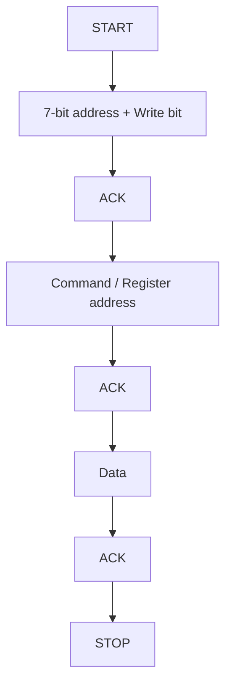

簡化的 register read 常包含 repeated START:

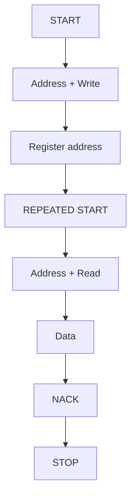

其中:

- `START` 表示傳輸開始.
- `STOP` 表示傳輸結束.
- `ACK` 表示接收方接受上一個 byte.
- `NACK` 表示未接受、沒有裝置回應, 或讀取方準備結束傳輸.
- Repeated START 讓 controller 在不釋放 bus 的情況下改變傳輸方向.

### 10.1.3 7-bit Address 與 8-bit 表示法

Linux I2C、Device Tree 與 `i2c-tools` 通常使用 7-bit address.

某些 datasheet 會將 address 加上 R/W bit, 寫成兩個 8-bit 值. 例如:

```text
Write address = 0xB0
Read address  = 0xB1
```

Linux 使用的 7-bit address 是:

```text
0xB0 >> 1 = 0x58
```

因此 DTS 應寫:

```dts
power-supply@58 {
    compatible = "pmbus";
    reg = <0x58>;
};
```

如果直接填 `0xB0`, address 會超出一般 7-bit I2C address 範圍, 且不符合 driver framework 的表示方式.

### 10.1.4 Bus Speed

常見 I2C / SMBus 速度包括:

| 模式 | 常見時脈 |
|---|---:|
| Standard-mode | 100 kHz |
| Fast-mode | 400 kHz |
| Fast-mode Plus | 1 MHz |

實際可用速度取決於 controller、所有 targets、pull-up、bus capacitance、走線、MUX、level shifter、hot-plug buffer 與 clock stretching. 較高速度不一定比較適合 BMC; PSU、外接線材或熱插拔 bus 常需要保守設定.

### 10.1.5 Clock Stretching、Arbitration 與 Bus Stuck

Target 可以暫時將 SCL 拉低, 要求 controller 等待, 這稱為 clock stretching. Controller driver 與硬體必須支援合理的 stretching 與 timeout.

當多個 controllers 同時傳輸時, I2C 可透過 arbitration 判斷誰繼續使用 bus. 若平台實際存在多個 controllers, 還需要確認外部 arbitration、ownership 與 recovery 規則.

Bus stuck 常見情況:

- SDA 持續被某個 target 拉低.
- SCL 被 target 長時間拉低.
- 傳輸中途 target reset 或失去供電.
- MUX 切換時序不正確.
- Pull-up、level shifter 或 signal integrity 異常.

<a id="section-10-2"></a>

## 10.2 SMBus 是什麼

SMBus(System Management Bus)是以 I2C 為基礎發展的系統管理通訊規範. 它使用相同概念的 SDA、SCL、address、START、STOP 與 ACK / NACK, 但進一步定義常用的傳輸格式、逾時條件與錯誤檢查方式.

I2C 比較接近通用的資料傳輸方法; SMBus 則把系統管理裝置常用的存取方式整理成固定的存取方式. 例如 read byte、read word 與 block read. Linux 因此在 I2C subsystem 中同時提供一般 I2C message API 與 SMBus helper functions.

三者的關係如下:

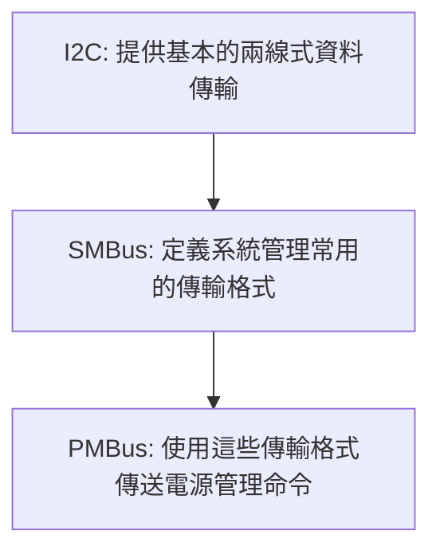

### 10.2.1 常見 SMBus transactions

常見的 SMBus transactions 包括:

- Quick command
- Send byte / receive byte
- Write byte / read byte
- Write word / read word
- Process call
- Block write / block read

例如, driver 可使用 SMBus helper 讀取一個 byte:

```c
ret = i2c_smbus_read_byte_data(client, command);
```

讀取一個 word:

```c
ret = i2c_smbus_read_word_data(client, command);
```

這些 functions 最後仍由 Linux I2C adapter 執行傳輸. 若 controller 沒有原生支援某一種 SMBus transaction, I2C core 可能依 adapter 能力進行模擬; driver 仍應先確認所需 functionality 是否可用.

### 10.2.2 PEC

PEC(Packet Error Checking)是在傳輸資料末尾加入 CRC byte, 用來檢查 address、command 與資料在傳輸過程中是否發生錯誤.

是否使用 PEC, 取決於 controller、target 與 driver 是否支援. 兩端設定不一致時, 可能出現讀寫失敗、資料無法更新, 或只有部分 commands 可用的情況.

### 10.2.3 SMBus 與 PMBus 的關係

PMBus 沒有重新建立一套底層匯流排, 而是使用 I2C 相容的電氣與傳輸方式, 並沿用 SMBus 的 byte、word 與 block transactions. 在這些傳輸格式上, PMBus 定義電源管理 commands, 例如:

- `READ_VIN`
- `READ_VOUT`
- `READ_POUT`
- `STATUS_WORD`
- `CLEAR_FAULTS`

因此, SMBus 負責定義「資料怎麼傳」, PMBus 則進一步定義「command 代表什麼電源功能」.

<a id="section-10-3"></a>

## 10.3 Linux I2C Framework

Linux I2C framework 主要使用 adapter、client 與 driver 表示一條 bus、bus 上的裝置, 以及控制裝置的程式.

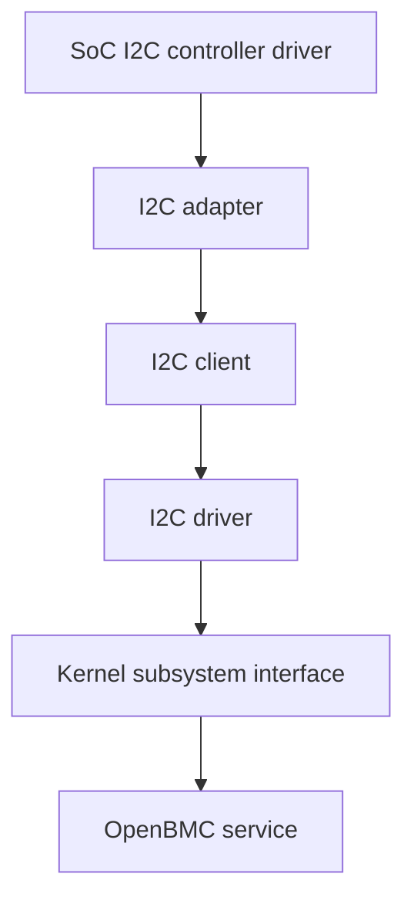

### 10.3.1 I2C Adapter

`i2c_adapter` 代表一條 Linux 可以執行 I2C transfer 的邏輯 bus.

Root adapter 通常由 SoC I2C controller driver 建立. 例如 AST2600 的某個 I2C controller probe 成功後, 會向 I2C core 註冊 adapter.

Target 上通常表示為:

```text
/sys/bus/i2c/devices/i2c-5
/dev/i2c-5
```

其中 `/dev/i2c-5` 需有 `i2c-dev` 支援, 供 `i2c-tools` 或其他 userspace 程式使用.

### 10.3.2 I2C Client

`i2c_client` 代表某條 adapter 上某個 address 的裝置.

```text
Adapter 5 + address 0x48
        ↓
5-0048
```

`5-0048` 的命名方式是:

```text
5       Linux adapter number
0048    以四位十六進位表示的 I2C address
```

Client 中會保存:

- 所屬 adapter.
- I2C address.
- `struct device`.
- Device Tree node 或其他 firmware 資訊.
- 已綁定的 I2C driver.

### 10.3.3 I2C Driver

`i2c_driver` 是支援某一類 I2C clients 的 kernel driver. 它會提供 match table 與 probe callback.

```c
static const struct of_device_id example_of_match[] = {
    { .compatible = "vendor,example-sensor" },
    { }
};
MODULE_DEVICE_TABLE(of, example_of_match);

static int example_probe(struct i2c_client *client)
{
    return 0;
}

static struct i2c_driver example_driver = {
    .probe = example_probe,
    .driver = {
        .name = "example-sensor",
        .of_match_table = example_of_match,
    },
};
module_i2c_driver(example_driver);
```

當 client 與 driver match 成功, I2C core 會呼叫 `probe()`.

### 10.3.4 從 Adapter 到 OpenBMC

完整路徑:

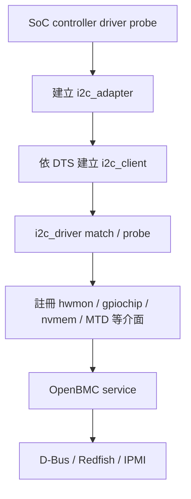

若最終 OpenBMC 沒有 sensor, 應依此順序確認, 而不是直接從 D-Bus 設定開始修改.

<a id="section-10-4"></a>

## 10.4 Root Adapter 與 Linux Bus Number

Root adapter 通常對應 SoC 的一個 I2C controller, 但 Linux bus number 不一定等於 schematic 上的 controller 編號.

例如 schematic 稱為 `BMC_I2C5`, Linux 可能顯示為 `i2c-5`, 也可能因 alias、driver 實作或 probe 順序顯示成其他號碼.

```bash
$ i2cdetect -l
```

可能輸出:

```text
i2c-5   i2c   1e78a280.i2c-bus   I2C adapter
```

欄位包括:

- Linux adapter number.
- Adapter 類型.
- Adapter name.
- 支援方式或描述.

### 10.4.1 Adapter 如何建立

DTS 啟用 controller:

```dts
&i2c5 {
    status = "okay";
    bus-frequency = <100000>;
};
```

接著:

1. Kernel 建立 platform device.
2. SoC I2C controller driver probe.
3. Driver 取得 MMIO、clock、reset、IRQ 與 pinctrl.
4. Driver 初始化 controller.
5. Driver 向 I2C core 註冊 adapter.
6. Target 上出現 `i2c-N`.

若 `i2cdetect -l` 沒有預期 root adapter, 問題通常位於 controller DTS、kernel config、pinctrl、clock、reset 或 controller driver, 而不是下游 sensor driver.

### 10.4.2 不要只依賴 Bus Number

Mux child adapters 常受 probe 順序影響. 長期辨識 bus 時, 應同時記錄:

- Adapter name.
- Sysfs device path.
- Parent adapter.
- Mux address 與 channel.
- Device Tree path.

```bash
$ readlink -f /sys/bus/i2c/devices/i2c-20/device
$ cat /sys/bus/i2c/devices/i2c-20/name
```

如果 OpenBMC config 必須使用 bus number, 需驗證 BMC reboot、kernel 更新、driver 改為 module, 以及其他 mux 加入後是否仍穩定.

<a id="section-10-5"></a>

## 10.5 I2C Client 如何建立

I2C 無法像 PCI 一樣, 安全地從 bus 自動得知每個裝置的完整型號. 因此 kernel 通常需要明確資訊, 才能建立 client.

### 10.5.1 由 Device Tree 建立

固定焊接或平台明確存在的裝置, 通常放在 DTS:

```dts
&i2c5 {
    status = "okay";
    bus-frequency = <100000>;

    temperature-sensor@48 {
        compatible = "ti,pmbus";
        reg = <0x48>;
    };

    eeprom@50 {
        compatible = "atmel,24c64";
        reg = <0x50>;
        pagesize = <32>;
    };
};
```

I2C controller 建立 adapter 後, I2C core 讀取 child nodes, 建立 address `0x58` 的 PSU client.

### 10.5.2 暫時使用 `new_device`

Bring-up 時可透過 sysfs 暫時建立 client:

```bash
$ echo pmbus 0x58 > /sys/bus/i2c/devices/i2c-5/new_device
```

移除:

```bash
$ echo 0x58 > /sys/bus/i2c/devices/i2c-5/delete_device
```

這個方法適合確認:

- Adapter 是否可傳輸.
- Driver 是否已存在.
- Address 與 driver 名稱是否能配對.
- Probe 後是否建立預期介面.

它不會保存到下一次開機, 也無法完整描述 GPIO、interrupt、supply 等 dependencies, 因此不應取代正式 DTS 或平台的動態裝置管理流程.

### 10.5.3 Driver Detect

少數 legacy I2C drivers 可以掃描特定 addresses 並嘗試辨識裝置. 但對 EEPROM、CPLD、PMBus 裝置或未確認的 address, 不宜任意偵測, 因為不同裝置在相同 command 上的行為可能不同, 錯誤存取也可能改變狀態.

### 10.5.4 動態或可插拔裝置

PSU、riser 或其他可插拔裝置可能依 presence、FRU 或 slot 狀態動態建立 client. 這類流程需處理:

- Presence debounce.
- Power rail ready timing.
- Client create / remove.
- Driver probe / remove.
- OpenBMC service restart.
- 裝置拔除期間正在進行的 transfer.

裝置由 DTS 固定建立, 或由 userspace / platform daemon 動態建立, 應有一致且可追蹤的設計, 不宜由多個元件重複建立同一 address.

### 10.5.5 Client 與 Driver 綁定

```bash
$ ls -l /sys/bus/i2c/devices/5-0048
$ cat /sys/bus/i2c/devices/5-0048/name
$ readlink -f /sys/bus/i2c/devices/5-0048/driver
$ cat /sys/bus/i2c/devices/5-0048/modalias
```

判讀方式:

```text
沒有 5-0048
→ Client 尚未建立

有 5-0048，但沒有 driver symlink
→ Client 已建立，driver 尚未綁定或 probe 失敗

有 driver symlink
→ Driver 已完成綁定
```

<a id="section-10-6"></a>

## 10.6 `i2c-tools` 如何使用

`i2c-tools` 常用於確認 adapters、addresses 與簡單的 transactions, 但它會直接透過 `/dev/i2c-N` 存取 bus. 使用前需知道裝置型號、command 定義與目前是否已有 kernel driver 綁定.

### 10.6.1 `i2cdetect -l`

列出 Linux adapters, 不會掃描 targets:

```bash
$ i2cdetect -l
```

### 10.6.2 `i2cdetect -y N`

掃描 bus 上可能有回應的 addresses:

```bash
$ i2cdetect -y 5
```

輸出常見狀態:

- 十六進位 address: 該位置有裝置回應.
- `--`: 沒有回應或未掃描.
- `UU`: 該 address 已由 kernel driver 使用.

`UU` 通常不是錯誤, 而是表示已有 client 綁定 driver.

掃描本身會對多個 addresses 發出存取命令. 部分裝置、繁忙 bus、multi-controller bus 或特殊 register protocol 不適合任意掃描. 量產系統應先評估影響.

### 10.6.3 `i2cget`、`i2cset` 與 `i2ctransfer`

`i2cget` 可執行簡單讀取;`i2cset` 會寫入裝置;`i2ctransfer` 可組合 I2C messages.

對已由 kernel driver 綁定的 address, 不建議同時從 userspace 直接存取, 原因包括:

- Driver 與 userspace 可能改變相同 register.
- Page、bank 或 command pointer 狀態可能互相干擾.
- 寫入 command 可能清除 fault、改變輸出或觸發 reset.
- Driver 讀到的快取與硬體狀態可能不一致.

在 PMBus、EEPROM、CPLD 與 power controller 上, 應先建立可讀 / 可寫 command 清單, 再使用 raw tools.

<a id="section-10-7"></a>

## 10.7 I2C Mux 與 Adapter Tree

I2C mux 讓一條 parent bus 切換到多個下游 channels. BMC 常用 mux 隔離相同 address 的裝置, 例如 PSU0 與 PSU1 都使用 `0x58`.

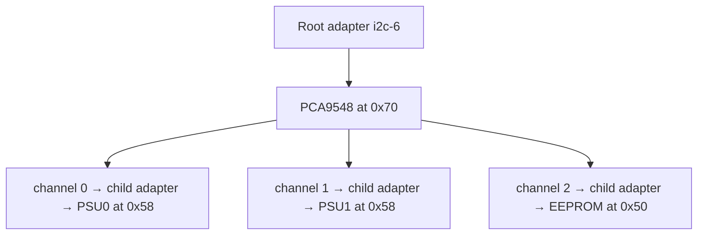

每一個 mux channel 會由 Linux 表示成一條 child adapter. 因此, 兩顆 `0x58` 裝置位於不同 child adapters, 不會產生同一 bus segment 的 address conflict.

### 10.7.1 DTS 範例

```dts
&i2c6 {
    status = "okay";

    i2c-mux@70 {
        compatible = "nxp,pca9548";
        reg = <0x70>;
        #address-cells = <1>;
        #size-cells = <0>;
        i2c-mux-idle-disconnect;

        i2c@0 {
            reg = <0>;
            #address-cells = <1>;
            #size-cells = <0>;

            psu@58 {
                compatible = "pmbus";
                reg = <0x58>;
            };
        };

        i2c@1 {
            reg = <1>;
            #address-cells = <1>;
            #size-cells = <0>;

            psu@58 {
                compatible = "pmbus";
                reg = <0x58>;
            };
        };
    };
};
```

### 10.7.2 Mux 傳輸時發生什麼

當 driver 要存取 channel 1 的 PSU:

1. I2C mux framework 鎖住必要的 adapter.
2. Mux driver 選擇 channel 1.
3. 下游 I2C transfer 經過 mux 傳送.
4. 依 driver 與 DTS 設定, mux 保持 channel 或切回 idle / disconnect.
5. Framework 解除鎖定.

因此, mux select / deselect timing、nested transfer 與 locking 都會影響複雜拓樸.

### 10.7.3 `i2c-mux-idle-disconnect`

此 property 要求 mux 在閒置時斷開 channels. 它可降低:

- 相同 address channels 同時連通的風險.
- 下游 bus noise 互相影響.
- 某一 channel stuck 拖住其他 channels 的機會.

但也會增加每次 transfer 的 channel select 行為. 是否使用應依 mux binding、硬體拓樸與裝置時序決定.

### 10.7.4 Mux 排查順序

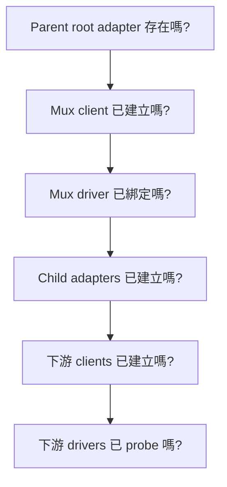

常用檢查:

```bash
$ i2cdetect -l
$ ls -l /sys/bus/i2c/devices
$ readlink -f /sys/bus/i2c/devices/i2c-20/device
$ dmesg | grep -Ei 'i2c.*mux|pca954|mux'
```

<a id="section-10-8"></a>

## 10.8 PMBus 是什麼

PMBus 是用來管理電源裝置的通訊規範, 常見於:

- PSU
- Voltage regulator(VR)
- Hot-swap controller(HSC)
- Power monitor
- Multi-rail power controller

PMBus 使用 SMBus / I2C 傳輸 commands. 它不只讀取遙測, 也可能控制輸出、設定 warning / fault limits、讀取狀態或清除 latched faults.

```text
I2C / SMBus
負責把 command 與資料送到裝置
        ↓
PMBus
定義 READ_VIN、READ_VOUT、STATUS_WORD 等電源 commands
```

### 10.8.1 PMBus Commands

常見 telemetry commands:

| Command | 內容 |
|---|---|
| `READ_VIN` | 輸入電壓 |
| `READ_VOUT` | 輸出電壓 |
| `READ_IIN` | 輸入電流 |
| `READ_IOUT` | 輸出電流 |
| `READ_PIN` | 輸入功率 |
| `READ_POUT` | 輸出功率 |
| `READ_TEMPERATURE_1` | 溫度 |
| `READ_FAN_SPEED_1` | 風扇轉速 |

常見 status commands:

| Command | 內容 |
|---|---|
| `STATUS_WORD` | 整體狀態摘要 |
| `STATUS_INPUT` | 輸入相關 fault |
| `STATUS_VOUT` | 輸出電壓 fault |
| `STATUS_IOUT` | 輸出電流 / power fault |
| `STATUS_TEMPERATURE` | 溫度 fault |
| `STATUS_CML` | 通訊、記憶體或邏輯 fault |

裝置未必支援所有標準 commands. 對不支援 command 的反應也可能不同, 因此不應用掃描方式任意讀取整張 PMBus command table.

### 10.8.2 Page 與 Phase

一顆 PMBus device 可能管理多個輸出 rails. PMBus 使用 page 選擇不同輸出或功能區塊.

```text
Page 0 → VDD_CPU
Page 1 → VDD_SOC
Page 2 → VDD_MEM
```

Phase 常用於多相 VR, 表示同一輸出的不同 power stages. Page 與 phase 不是相同概念:

- Page 常代表不同 output / rail.
- Phase 常代表同一 output 中的個別相位.

總輸出電流、單一 phase 電流與 input current 必須分清楚.

### 10.8.3 PMBus 數值格式

PMBus register 的 16-bit raw value 可能使用不同資料格式:

- LINEAR11
- LINEAR16
- DIRECT
- 裝置或 manufacturer-specific format

LINEAR11 通常把 exponent 與 mantissa 放在同一個 16-bit word. LINEAR16 常搭配 `VOUT_MODE` 提供 exponent. DIRECT format 則需使用裝置定義的 coefficients 換算.

因此, 同一個 raw word 若使用錯誤格式解讀, 可能得到完全不同的數值. Driver 必須知道每一類 sensor 使用的格式、page 與 coefficients.

<a id="section-10-9"></a>

## 10.9 Linux PMBus Driver Framework

Linux PMBus drivers 位於 hwmon 架構中. 它們通常分為:

- PMBus core
- Generic PMBus driver
- Device-specific PMBus driver

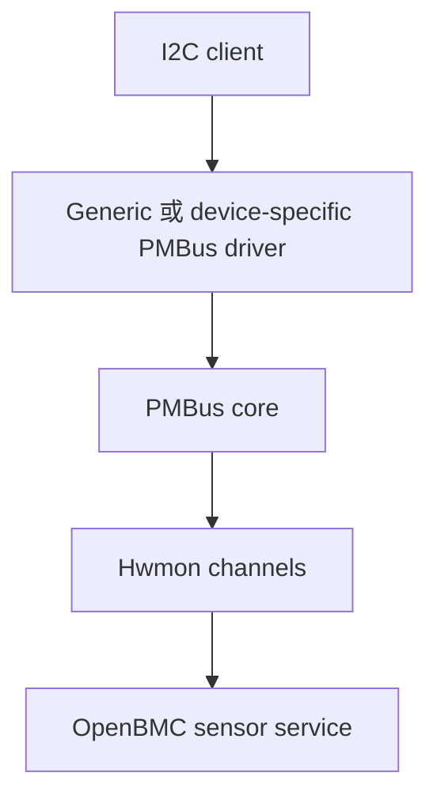

### 10.9.1 PMBus Core

PMBus core 提供共用功能, 例如:

- PMBus command read / write helper.
- Page 切換.
- 資料格式換算.
- Sensor / status 能力描述.
- Hwmon channel 與 attributes 註冊.

Device-specific driver 則描述該裝置有哪些 pages、支援哪些 commands、各類資料使用什麼格式, 以及特殊 commands 或 quirks.

### 10.9.2 Generic PMBus Driver

Generic `pmbus` driver 適合按照標準 PMBus 行為提供 telemetry 的裝置. 它能快速驗證基本資料, 但使用前仍需確認:

- 裝置是否能安全回應 capability probing.
- Page 數量是否正確.
- Commands 與 formats 是否符合裝置.
- 是否有 manufacturer-specific 初始化.
- Status 與 faults 是否需要特殊處理.

不能因為裝置接在 PMBus 上, 就假設 generic driver 一定適合.

### 10.9.3 Device-specific Driver

當 kernel 已有對應 driver, 例如某些 ADM、LTC、INA、IR、ISL、MPS 或 TPS 裝置, 通常優先評估該 driver. 它可能已處理:

- 正確 page 數量.
- 特殊 coefficients.
- VOUT format.
- Manufacturer commands.
- Status quirks.
- 裝置識別與初始化.

使用前需核對實際 part number、revision、kernel version 與 driver match table.

### 10.9.4 Custom Driver

若 generic 與既有 device-specific driver 都無法正確支援, 才評估 custom driver. 新增 driver 時需要同步確認:

- Binding.
- I2C / PMBus match table.
- Page、format、functions 與 commands.
- Hwmon channel mapping.
- Fault 與 status 語意.
- Suspend、remove、hot-plug 與 error handling.
- 是否適合提交 upstream.

<a id="section-10-10"></a>

## 10.10 PMBus 如何變成 Hwmon 資料

PMBus driver probe 成功後, PMBus core 會依 driver 宣告的能力建立 hwmon attributes.

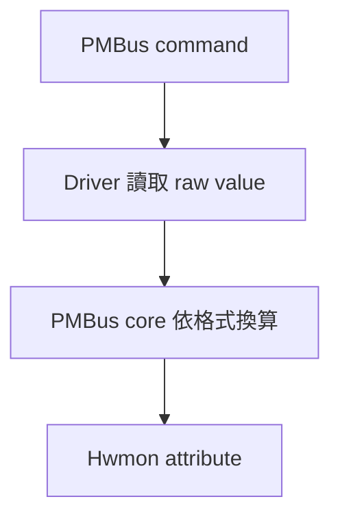

常見對照:

| PMBus command | Hwmon attribute 類型 | 常見單位 |
|---|---|---|
| `READ_VIN` / `READ_VOUT` | `in*_input` | millivolt |
| `READ_IIN` / `READ_IOUT` | `curr*_input` | milliampere |
| `READ_PIN` / `READ_POUT` | `power*_input` | microwatt |
| `READ_TEMPERATURE_*` | `temp*_input` | millidegree Celsius |
| `READ_FAN_SPEED_*` | `fan*_input` | RPM |

實際 attribute 編號不等於 PMBus command number, 也不保證不同 kernel version 或 driver 下完全相同. 應搭配:

- `name`
- `*_label`
- Device path
- Bus / address
- Driver 文件與 source

### 10.10.1 查看 Hwmon

```bash
$ for h in /sys/class/hwmon/hwmon*; do
$ echo "==== $h"
$ cat "$h/name" 2>/dev/null
$ readlink -f "$h/device"
$ grep -H . "$h"/*_input "$h"/*_label \
    "$h"/*_alarm "$h"/*_fault 2>/dev/null
$ done
```

不應只記錄 `hwmon3`, 因為 index 可能隨 probe 順序改變.

### 10.10.2 Input、Output 與 Rail 的語意

以下資料不能混用:

- PSU input voltage 與 output voltage.
- Input current 與 output current.
- PSU input power 與 output power.
- PSU 總輸出與單一 rail.
- VR 總電流與個別 phase 電流.

Sensor name、threshold、Redfish mapping 與 IPMI SDR 都需保留原始物理意義.

<a id="section-10-11"></a>

## 10.11 OpenBMC 如何使用 PMBus Sensor

OpenBMC sensor service 讀取 hwmon attributes, 再依平台設定建立 D-Bus sensors.

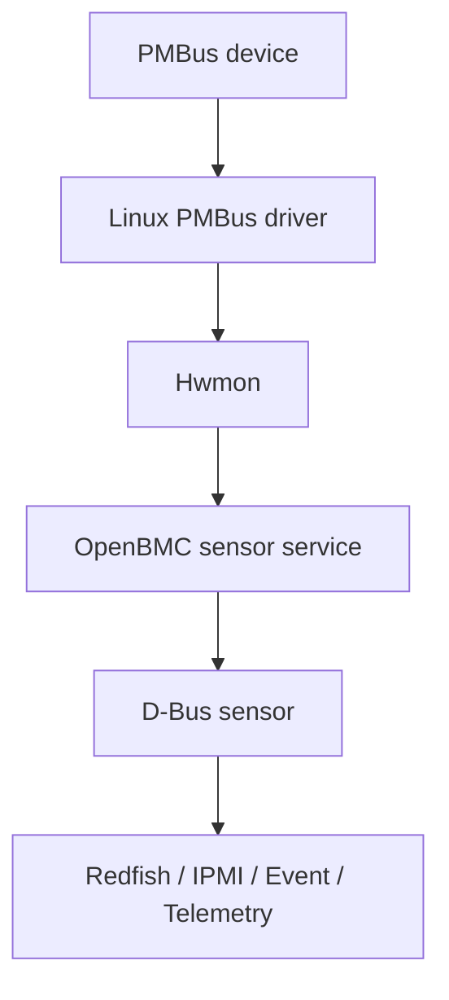

### 10.11.1 D-Bus Sensor

常見 object paths:

```text
/xyz/openbmc_project/sensors/voltage/...
/xyz/openbmc_project/sensors/current/...
/xyz/openbmc_project/sensors/power/...
/xyz/openbmc_project/sensors/temperature/...
```

OpenBMC 設定通常負責:

- Sensor 名稱.
- Hwmon channel 對應.
- Threshold.
- Scale 或 offset.
- Power-state gating.
- Inventory association.
- Availability 與 functional 狀態.

### 10.11.2 裝置不存在或讀取失敗

PSU 拔除、power rail 關閉或 bus timeout 時, 不應把讀取失敗轉成正常數值 `0`. 否則上層可能把「沒有資料」誤認為「電壓為 0 V」並產生錯誤 threshold event.

較合理的狀態包括:

- Sensor unavailable.
- Functional false.
- 對應 inventory absent.
- 暫停更新或移除 D-Bus object, 依平台設計決定.

Presence、power state、driver read error 與 sensor threshold 是不同事件來源, 應分開處理.

<a id="section-10-12"></a>

## 10.12 Device Tree、Driver 與 OpenBMC 設定的分工

| 資料 | 建議位置 |
|---|---|
| SoC I2C controller、pinctrl、clock、reset | DTS |
| I2C mux 與固定 child devices | DTS |
| Client address、interrupt、reset GPIO、supply | DTS |
| PMBus command、format、page 與 device quirk | Kernel PMBus driver |
| Sensor 顯示名稱、threshold、association | OpenBMC sensor config |
| PSU slot presence 與 inventory 關係 | Entity Manager / inventory service |
| Fan 或 power control 規則 | 對應 OpenBMC control service |

固定的硬體接線放在 DTS; 裝置本身的通訊與資料格式放在 driver; 顯示名稱、threshold、slot 與控制規則放在 OpenBMC userspace.

<a id="section-10-13"></a>

## 10.13 I2C 與 PMBus 的安全排查方式

I2C / PMBus 排查應由拓樸與唯讀狀態開始, 再逐步進行 raw transactions.

### 10.13.1 第一層: 硬體條件

確認:

- 裝置是否供電.
- Reset 是否解除.
- Presence 是否成立.
- Pull-up 電壓與阻值.
- SDA / SCL idle level.
- Mux、level shifter 與 hot-plug buffer 狀態.
- Bus 是否還有其他 controller.

必要時使用示波器或 logic analyzer 查看 START、address、ACK、clock stretching 與 timeout.

### 10.13.2 第二層: Adapter 與 Mux

```bash
$ i2cdetect -l
$ ls -l /sys/bus/i2c/devices
```

確認 root adapter、mux client 與 child adapters 是否依序建立.

### 10.13.3 第三層: Client 與 Driver

```bash
$ ls -l /sys/bus/i2c/devices/<bus>-00<addr>
$ cat /sys/bus/i2c/devices/<bus>-00<addr>/name
$ readlink -f /sys/bus/i2c/devices/<bus>-00<addr>/driver
```

### 10.13.4 第四層: Hwmon

確認:

- Hwmon `name`.
- Device symlink.
- Input 與 label.
- Alarm / fault attributes.
- 數值單位與 physical meaning.

### 10.13.5 第五層: OpenBMC

```bash
$ systemctl --failed
$ journalctl -b --no-pager | grep -Ei 'pmbus|psu|sensor|timeout|unavailable|functional'
$ busctl tree xyz.openbmc_project.ObjectMapper | grep -i sensor
```

Service names 會依 OpenBMC branch 與產品整合方式不同, 應先用 `systemctl` 與 ObjectMapper 找出實際服務.

### 10.13.6 最後才做 Raw PMBus Access

執行 raw read 前先確認:

- Command 在該裝置上是否支援.
- Command 是 read-only 還是會改變狀態.
- 目前 page / phase.
- Driver 是否已綁定並持續 polling.
- 是否需要 PEC.
- Read word 的 byte order 與資料格式.

任何 write command, 尤其 `OPERATION`、margin、fault limit、store / restore、reset 與 `CLEAR_FAULTS`, 都需有明確審核與回復方式.

<a id="section-10-14"></a>

## 10.14 PMBus Fault 與 Status

PMBus status registers 可用來判斷 fault 類型, 但讀取與清除順序會影響事後分析.

建議流程:

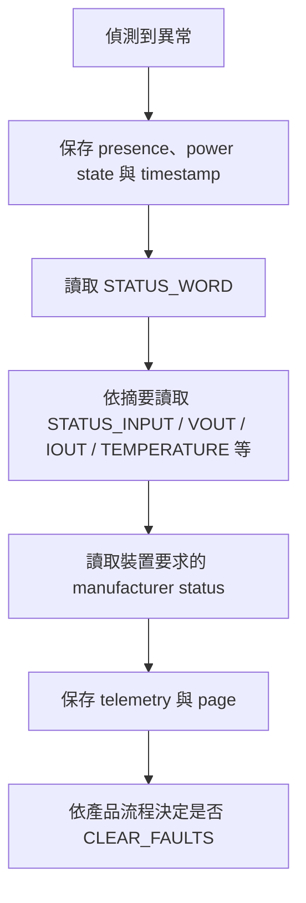

### 10.14.1 為什麼不能先 Clear Faults

部分 faults 會 latch. 若先執行 `CLEAR_FAULTS`, 重要的 status bit 可能消失, 後續無法判斷是 input loss、over-current、over-temperature 或通訊錯誤.

因此, clear 前至少應保存:

- `STATUS_WORD`
- 相關 `STATUS_*`
- Page / phase
- Input / output telemetry
- Presence 與 power state
- Kernel / service log
- Manufacturer-specific status, 若已確認安全

### 10.14.2 Fault 與 Threshold Event 不相同

- PMBus fault 是裝置內部 status 判斷.
- Hwmon alarm 可能來自 driver 對 status 的映射.
- OpenBMC threshold event 是 service 依 sensor value 與設定 threshold 判斷.

三者可能相關, 但不是同一層. 文件與 event log 應標示事件來源.

<a id="section-10-15"></a>

## 10.15 Kernel Config 與 Yocto 整合

需要確認的 kernel functions 可能包括:

- SoC I2C controller driver
- I2C core
- I2C mux
- PCA954x 或其他 mux driver
- I2C character device
- Hwmon
- PMBus core
- Generic 或 device-specific PMBus driver

Target:

```bash
$ zcat /proc/config.gz | grep -Ei 'I2C|I2C_MUX|PCA954|HWMON|PMBUS'
$ lsmod
$ find /lib/modules/$(uname -r) -type f | grep -Ei 'i2c|pmbus|hwmon'
```

Build 端:

```bash
$ bitbake -e virtual/kernel | grep -E '^(S|B|WORKDIR)='
$ bitbake -c configure -f virtual/kernel
$ find tmp/work -path '*linux*' -name '.config' -print
```

若 driver 編成 module, 還要確認 module package 有加入 image, 且在 OpenBMC sensor service 啟動前可完成載入與 probe.

<a id="section-10-16"></a>

## 10.16 常見問題與判讀

| 現象 | 流程大約停在哪裡 | 優先檢查 |
|---|---|---|
| `i2cdetect -l` 沒有 root bus | Adapter 建立以前 | DTS、controller driver、clock、reset、pinctrl |
| Mux client 存在但沒有 child bus | Mux probe / adapter 建立 | Compatible、driver、parent transfer |
| Address 沒有 ACK | Physical / bus layer | Power、reset、mux、7-bit address、waveform |
| Address 顯示 `UU` | Driver 已使用 address | Driver symlink、hwmon output |
| Client 存在但沒有 driver | Match / probe | Compatible、module、dmesg |
| PMBus driver 綁定但沒有 hwmon | PMBus capability / registration | Driver type、page、commands、probe log |
| Hwmon 數值比例錯 | Format / coefficient | LINEAR、DIRECT、VOUT_MODE、shunt |
| Hwmon 有值但沒有 D-Bus sensor | OpenBMC service | Config、label、power state、journal |
| PSU 拔除後出現 0 V critical | Presence / availability | Inventory、read error handling |
| Bus 偶發 timeout | Electrical / timing | Clock stretching、capacitance、hot-plug、multi-controller |
| Clear 後無法判斷 fault | Status 保存流程 | Clear 前保存完整 snapshot |

<a id="section-10-17"></a>

## 10.17 Target 端 Debug Log 收集

以下腳本以蒐集狀態為主, 不執行 bus scan、raw command 或 fault clear:

```bash
#!/bin/sh

OUT=/tmp/i2c-pmbus-debug
mkdir -p "$OUT"

cat /etc/os-release > "$OUT/os-release.txt" 2>&1
uname -a > "$OUT/uname.txt"
cat /proc/cmdline > "$OUT/proc-cmdline.txt"
zcat /proc/config.gz > "$OUT/proc-config.txt" 2>&1

dmesg -T > "$OUT/dmesg.txt"
journalctl -b --no-pager > "$OUT/journal.txt" 2>&1
systemctl --failed > "$OUT/systemctl-failed.txt" 2>&1

i2cdetect -l > "$OUT/i2cdetect-l.txt" 2>&1
ls -l /sys/bus/i2c/devices > "$OUT/i2c-devices-ls.txt" 2>&1
find /sys/bus/i2c/devices -maxdepth 3 -print > "$OUT/i2c-tree.txt" 2>&1
find /sys/bus/i2c/drivers -maxdepth 2 -print > "$OUT/i2c-drivers.txt" 2>&1

find /sys/class/hwmon -maxdepth 3 -type f -print > "$OUT/hwmon-files.txt" 2>&1

for h in /sys/class/hwmon/hwmon*; do
    [ -d "$h" ] || continue
    b=$(basename "$h")
    {
        echo "path=$h"
        echo "device=$(readlink -f "$h/device")"
        cat "$h/name" 2>/dev/null
        grep -H . "$h"/*_input "$h"/*_label \
            "$h"/*_alarm "$h"/*_fault 2>/dev/null
    } > "$OUT/$b.txt"
done

busctl tree xyz.openbmc_project.ObjectMapper > "$OUT/objectmapper.txt" 2>&1
journalctl -b --no-pager | grep -Ei \
    'i2c|smbus|pmbus|psu|sensor|timeout|unavailable|functional' \
    > "$OUT/i2c-pmbus-journal.txt" 2>&1

tar czf "/tmp/i2c-pmbus-debug-$(date +%Y%m%d-%H%M%S).tar.gz" \
    -C /tmp i2c-pmbus-debug
```

執行前需確認儲存空間與平台資料管理要求. 若要加入 raw PMBus status, 應針對已核准的裝置與 commands 另外建立腳本, 不應在通用收集腳本中掃描所有 commands.

<a id="section-10-18"></a>

## 10.18 Bring-up 順序

1. 整理 physical topology: controller、mux、channel、address、pull-up、power domain.
2. 在 DTS 啟用 root controller.
3. 確認 root adapter 出現在 `i2cdetect -l`.
4. 加入並驗證 mux client.
5. 確認所有 child adapters.
6. 逐一建立固定 clients.
7. 確認 7-bit address 與 driver binding.
8. 對 PMBus 裝置選擇 generic 或 device-specific driver.
9. 確認 page、phase、format 與支援 commands.
10. 驗證 hwmon name、label、單位與數值.
11. 加入 OpenBMC sensor config.
12. 確認 D-Bus、Redfish 與 IPMI mapping.
13. 測試 absent、power-off、timeout、bus stuck、mux reset、service restart 與 BMC reboot.
14. 保存 waveform、status snapshot、kernel / service log 與版本資訊.


<a id="section-10-19"></a>

## 10.19 平台拓樸與實測紀錄表

| 項目 | 來源 / 指令 | 實測值 | 備註 |
|---|---|---|---|
| Root adapter | DTS、`i2cdetect -l` | [待填] | Physical bus 對照 |
| Adapter name / path | Sysfs | [待填] | 不只記 bus number |
| Mux | Address / driver | [待填] | Part number |
| Child adapters | Sysfs tree | [待填] | Channel 對照 |
| Client | Bus + address | [待填] | 7-bit address |
| Bound driver | `driver` symlink | [待填] | Generic / vendor-specific |
| Power domain | Schematic | [待填] | Standby / main power |
| Presence | GPIO / inventory | [待填] | Hot-plug gating |
| PMBus pages | Datasheet / driver | [待填] | Rail mapping |
| PMBus format | Datasheet / driver | [待填] | LINEAR / DIRECT |
| Hwmon mapping | `/sys/class/hwmon` | [待填] | Name / label / unit |
| D-Bus mapping | `busctl tree` | [待填] | Sensor path |
| Redfish / IPMI | API / command | [待填] | 與 D-Bus 對照 |
| Fault snapshot | `STATUS_*` | [待填] | Clear 前保存 |
| Bus recovery | Fault test | [待填] | Recovery result |

<a id="section-10-20"></a>

## 10.20 驗收 Checklist

I2C 與拓樸:

- [ ] Root adapters 與 schematic 對應完成.
- [ ] Linux bus number、adapter name、sysfs path 都已記錄.
- [ ] Mux parent、address、channel 與 child adapters 正確.
- [ ] 所有 clients 使用 7-bit address.
- [ ] 同一 bus segment 沒有 address conflict.
- [ ] Bus speed、pull-up 與 signal integrity 符合所有裝置需求.
- [ ] Multi-controller、clock stretching 與 bus recovery 已確認.

Driver 與 PMBus:

- [ ] Client 已建立並綁定預期 driver.
- [ ] Kernel config、built-in / module 與 image package 正確.
- [ ] Generic、device-specific 或 custom PMBus driver 的選擇有依據.
- [ ] PMBus pages、phases、commands 與資料格式已確認.
- [ ] Hwmon name、labels、units 與 physical meaning 正確.
- [ ] Driver 與 raw userspace tools 不會同時衝突存取.

OpenBMC 與 Fault:

- [ ] Hwmon channel 與 D-Bus sensor 一一對應.
- [ ] Sensor 名稱、threshold、association 與 power-state gating 正確.
- [ ] PSU absent、power-off 與 read failure 不會被當成正常 0 值.
- [ ] Redfish / IPMI 與 D-Bus 資料一致.
- [ ] `CLEAR_FAULTS` 前會保存完整 status snapshot.
- [ ] Bus timeout、stuck、mux reset、hot-plug 與 service restart 已測試.
- [ ] Debug log、waveform、PMBus status 與版本資訊已保存.

<a id="section-10-21"></a>

## 10.21 本章重點

1. I2C adapter 代表一條 Linux 可執行 transfer 的 bus.
2. I2C client 代表某條 adapter 上某個 7-bit address 的裝置.
3. I2C driver 與 client 配對後, 由 I2C core 呼叫 probe.
4. Root adapter 由 SoC controller driver 建立; mux channels 會建立 child adapters.
5. Linux bus number 不一定等於 schematic bus number, 也可能隨拓樸與 probe 順序改變.
6. PMBus 使用 I2C 相容的傳輸, 並沿用 SMBus 的 byte、word 與 block transactions.
7. PMBus command 標準化不代表每顆裝置都支援所有 commands.
8. PMBus page、phase 與資料格式錯誤都可能造成 sensor mapping 或數值錯誤.
9. Hwmon 是 PMBus driver 與 OpenBMC sensor service 之間的主要共同介面.
10. Raw I2C / PMBus access 應放在拓樸、driver 與 hwmon 檢查之後, 任何 write command 都需先確認影響.

<a id="section-10-22"></a>

## 10.22 本章參考資料

- Linux kernel documentation - I2C and SMBus Subsystem: https://docs.kernel.org/i2c/
- Linux kernel documentation - Introduction to I2C and SMBus: https://docs.kernel.org/i2c/summary.html
- Linux kernel documentation - I2C Device Instantiation: https://docs.kernel.org/i2c/instantiating-devices.html
- Linux kernel documentation - I2C Muxes and Complex Topologies: https://docs.kernel.org/i2c/i2c-topology.html
- Linux kernel documentation - I2C Sysfs: https://docs.kernel.org/i2c/i2c-sysfs.html
- Linux kernel documentation - PMBus Driver: https://docs.kernel.org/hwmon/pmbus.html
- Linux kernel documentation - PMBus Core: https://docs.kernel.org/hwmon/pmbus-core.html
- Linux kernel documentation - Hardware Monitoring: https://docs.kernel.org/hwmon/
- PMBus Specifications: https://pmbus.org/specification-archives/
