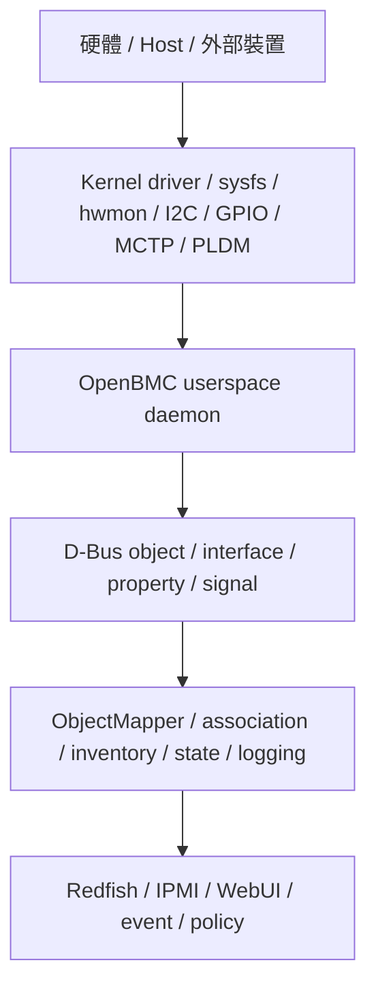

# 11. OpenBMC 常用 Project 與服務速查

## 適用範圍

本文件整理 OpenBMC 常見 project, daemon, D-Bus service, 設定來源, runtime 路徑與排查入口, 涵蓋 ObjectMapper, 系統設定, Sensor, Inventory, Power, Fan, Redfish, IPMI, Logging, 韌體更新, MCTP, PLDM 與 Host Interface.

## 適用讀者

- 負責 OpenBMC 平台 porting, bring-up, service 整合, Yocto recipe 或故障排查的人員.
- 需要從 kernel interface, userspace daemon, D-Bus object 追蹤至 Redfish, IPMI, WebUI 或事件介面的人員.

## 快速導覽

- [理解 OpenBMC 常見資料流](#112-openbmc-常見資料流): 從硬體與 kernel interface 追蹤至 D-Bus 及對外介面.
- [查詢 D-Bus 與 ObjectMapper](#113-d-bus-與-objectmapper-相關-project): Object owner, subtree, interface 與 system bus.
- [排查 Sensor 與 Inventory](#115-sensor--inventory--entity-manager-相關-project): Entity Manager, FRU, dbus-sensors 與 hwmon.
- [排查 Power, Fan 與 GPIO](#116-power--fan--thermal-相關-project): Power control, fan control, presence 與 GPIO monitor.
- [排查 Redfish, Web 與 IPMI](#118-redfish--web--ipmi-相關-project含-ipmi-擴充元件): bmcweb, WebUI 與 IPMI 元件.
- [查閱 runtime 與 Yocto 路徑](#1113-常用-recipe--service--runtime-路徑對照): systemd, D-Bus, journal, recipe 與 `.bbappend`.
- [依問題類型選擇入口](#1114-依問題類型選擇排查入口): 常見問題, 優先 project 與第一輪檢查.

## 11.1 本章目的

OpenBMC 採用 D-Bus centric 與 service-oriented 架構, 許多功能會拆成多個 daemon, 並透過 D-Bus object, interface, method, property 與 signal 串接. Sensor, Fan, Power, Inventory, Logging, Redfish, IPMI, MCTP / PLDM 等章節會反覆遇到同一批 OpenBMC project, 因此本章先建立共通對照, 後續章節只需引用本章, 不需要重複說明每個 project 的職責.

本章重點不是取代各 project 的官方文件, 而是讓 BMC porting / bring-up / debug 時可以快速回答下列問題:

- 這個 project / daemon 主要負責哪一層?
- 它通常讀取哪些設定或 kernel interface?
- 它會在 D-Bus 上提供哪些資料?
- 發生問題時應先看哪個 log, 哪個 service, 哪個 recipe?
- 在 Yocto / OpenBMC layer 中, 常見修改點在哪裡?

## 11.2 OpenBMC 常見資料流

多數 OpenBMC 功能可用下列資料流理解:



對 BMC porting 來說, 建議一律先判斷問題落在哪一層:

- **Kernel 層**: DTS, driver, sysfs, hwmon, I2C transaction, GPIO line
- **Userspace 層**: daemon 是否啟動, 設定是否解析, D-Bus object 是否建立
- **整合層**: ObjectMapper, association, inventory, state, logging
- **對外介面層**: Redfish, IPMI, WebUI, Event, SEL

## 11.3 D-Bus 與 ObjectMapper 相關 project

| Project / 元件 | 主要用途 | 常見修改 / 檢查點 | 常見排查入口 |
| --- | --- | --- | --- |
| `phosphor-dbus-interfaces` | OpenBMC 標準 D-Bus interface 的 YAML 定義來源, 常用來查 interface, property, method, enum 與 event registry. | 通常不在平台 layer 直接修改; 平台差異應優先放在 service, JSON config 或 OEM interface. | `grep -R xyz.openbmc_project.Sensor phosphor-dbus-interfaces/yaml` |
| `sdbusplus` | C++ D-Bus binding 與 async D-Bus 開發常用 library. | 修改 service source 時常會遇到產生出的 server / client binding. | build error, interface mismatch, method signature mismatch |
| `phosphor-objmgr` / `xyz.openbmc_project.ObjectMapper` | 協助尋找 D-Bus object owner, 列出 subtree, 建立 association 查詢. | 通常不改 source; 主要用於 runtime 查詢與 debug. | `busctl call xyz.openbmc_project.ObjectMapper ...GetObject`, `GetSubTree` |
| `dbus-broker` / system bus | OpenBMC system D-Bus message bus. | 通常不改; 需確認 service name, policy, activation 與 bus 連線狀態. | `busctl list`, `busctl tree`, `journalctl -b` |

ObjectMapper 是排查 D-Bus 問題的第一入口. 當只知道 object path, 不知道由哪個 service 提供時, 可先查 owner:

```bash
busctl call xyz.openbmc_project.ObjectMapper \
  /xyz/openbmc_project/object_mapper \
  xyz.openbmc_project.ObjectMapper GetObject \
  sas \
  /xyz/openbmc_project/sensors/voltage/P12V \
  0
```

若要列出某一類 sensor:

```bash
busctl call xyz.openbmc_project.ObjectMapper \
  /xyz/openbmc_project/object_mapper \
  xyz.openbmc_project.ObjectMapper GetSubTree \
  sias \
  /xyz/openbmc_project/sensors \
  0 \
  1 \
  xyz.openbmc_project.Sensor.Value
```

## 11.4 系統基礎服務與配置管理

| Project / 元件 | 主要用途 | 常見修改 / 檢查點 | 常見排查入口 |
| --- | --- | --- | --- |
| `phosphor-settings-manager` | 管理平台各項設定值(如 auto-reboot, boot mode, NTP 設定等), 每個設定為獨立 D-Bus object. | `/usr/share/phosphor-settings-manager/defaults.yaml`, platform layer 的 override YAML. | `busctl tree xyz.openbmc_project.Settings`, `journalctl -u phosphor-settings-manager.service -b` |
| `phosphor-networkd` | 管理 BMC 網路介面(IP, DHCP, DNS, NTP 等), 提供網路 D-Bus object. | 網路 interface 設定, DHCP enable/disable, DNS 設定. | `busctl tree xyz.openbmc_project.Network`, `journalctl -u phosphor-networkd.service -b` |
| `phosphor-time-manager` | 管理 BMC 與 Host 系統時間, 實作 `xyz.openbmc_project.Time.EpochTime` 介面. | 時間來源(NTP / Manual), time owner(BMC / Host). | `busctl introspect xyz.openbmc_project.Time.Manager /xyz/openbmc_project/time/bmc` |

**常用指令**:

```bash
# 查網路設定
busctl introspect xyz.openbmc_project.Network /xyz/openbmc_project/network/eth0
# 查時間
busctl get-property xyz.openbmc_project.Time.Manager /xyz/openbmc_project/time/bmc xyz.openbmc_project.Time.EpochTime Elapsed
# 查所有設定
busctl tree xyz.openbmc_project.Settings
```

## 11.5 Sensor / Inventory / Entity Manager 相關 project

| Project / 元件 | 主要用途 | 常見修改 / 檢查點 | 常見排查入口 |
| --- | --- | --- | --- |
| `entity-manager` | 以 JSON 描述平台實體元件, FRU, sensor, connector, association 與 Probe 條件. | `/usr/share/entity-manager/configurations/*.json`, platform layer 的 configuration recipe, schema. | `journalctl -u xyz.openbmc_project.EntityManager.service -b`, `busctl tree xyz.openbmc_project.EntityManager` |
| `fru-device` | 掃描 I2C FRU EEPROM, 建立 FRU / inventory 輔助資料. | I2C bus blacklist, FRU EEPROM address, FRU 格式, Probe rule. | `journalctl -u xyz.openbmc_project.FruDevice.service -b`, `busctl tree xyz.openbmc_project.FruDevice` |
| `dbus-sensors` | 一組 sensor daemons, 從 hwmon, D-Bus 或 direct driver access 讀值, 並發佈 sensor D-Bus object. | Sensor JSON, service enable, daemon source, threshold, PowerState, ScaleFactor. | `systemctl list-units '*sensor*'`, `busctl tree /xyz/openbmc_project/sensors` |
| `phosphor-hwmon` | 傳統 hwmon sensor 讀取方案, 部分平台仍使用. | hwmon config, label, scale, threshold, service instance. | `/sys/class/hwmon/hwmonX/*`, `journalctl -u '*hwmon*' -b` |
| `phosphor-inventory-manager` | 管理 inventory object 與 FRU / chassis / board / assembly 類資料. | inventory path, association, FRU property, Redfish inventory mapping. | `busctl tree xyz.openbmc_project.Inventory.Manager`, `busctl tree /xyz/openbmc_project/inventory` |

Sensor 類問題排查流程:

```text
1. kernel 是否有 sysfs / hwmon / IIO / device node
2. Entity Manager JSON 是否被載入
3. sensor daemon 是否啟動且無解析錯誤
4. D‑Bus sensor object 是否存在
5. threshold / association / inventory 是否正確
6. Redfish / IPMI 是否有對應 mapping
```

常用指令:

```bash
systemctl list-units '*sensor*' --no-pager
systemctl list-units '*Entity*' --no-pager
journalctl -u xyz.openbmc_project.EntityManager.service -b --no-pager | tail -100
busctl tree /xyz/openbmc_project/sensors
busctl introspect <service> <object-path>
```

## 11.6 Power / Fan / Thermal 相關 project

| Project / 元件 | 主要用途 | 常見修改 / 檢查點 | 常見排查入口 |
| --- | --- | --- | --- |
| `phosphor-fan-presence` | 風扇 presence 偵測. | GPIO / tach / inventory presence, fan tray 對應. | `journalctl -u '*fan*presence*' -b` |
| `phosphor-fan-control` / fan control service | 風扇 PWM, zone, target speed, thermal policy. | zone config, PID / table, sensor input, PWM polarity. | `busctl tree /xyz/openbmc_project/control/fanpwm`, fan service journal |
| `phosphor-pid-control` | PID 型 thermal / fan control, 部分平台使用. | PID config, sensor association, setpoint, failsafe. | config file, service log, D-Bus control object |
| Power control service | Host power on/off, chassis power, GPIO / CPLD / PMIC / sequencer 互動. | power GPIO, CPLD register, state transition, systemd target. | `busctl tree /xyz/openbmc_project/state`, `journalctl -b \| grep -Ei 'power\|chassis\|host'` |
| `x86-power-control` 或平台 power daemon | x86 平台常見 power control 實作之一. | PGOOD, power button, reset, NMI, host state. | service journal, GPIO state, CPLD register |

Fan tach 與 fan control 建議分開看: Fan Tach Sensor 只確認轉速讀值是否正確, Fan Control 則確認 PWM, policy, zone 與 failsafe 是否符合規格.

## 11.7 GPIO 監控

| Project / 元件 | 主要用途 | 常見修改 / 檢查點 | 常見排查入口 |
| --- | --- | --- | --- |
| `phosphor-gpio-monitor` | 監控 GPIO assertion 並觸發對應動作(如 checkstop, power-good 處理). | GPIO 監控設定檔, systemd service instance. | `journalctl -u phosphor-gpio-monitor*.service -b`, 查看 GPIO 狀態 |

> **使用場景**: 硬體訊號異常(checkstop, power fault)未被正確偵測或處理時.

## 11.8 Redfish / Web / IPMI 相關 project(含 IPMI 擴充元件)

| Project / 元件 | 主要用途 | 常見修改 / 檢查點 | 常見排查入口 |
| --- | --- | --- | --- |
| `bmcweb` | OpenBMC web server, 提供 Redfish, OpenBMC REST, WebSocket, KVM / console 等對外介面. | Redfish route, schema mapping, privilege, web feature option, OEM extension. | `journalctl -u bmcweb.service -b`, `curl -k https://<bmc>/redfish/v1/...` |
| `phosphor-webui` / WebUI package | Web UI 前端. 新版平台可能改用其他前端實作. | UI 顯示, API 路徑, build/package 是否進 image. | browser devtools, bmcweb log, network trace |
| `phosphor-host-ipmid` | Host 端 IPMI command handling, 常見於 KCS / BT / host interface. | OEM command, sensor command, SEL / SDR hook, host interface. | `journalctl -u phosphor-ipmi-host.service -b` |
| `phosphor-net-ipmid` | Network IPMI / RMCP+ 類服務, 依平台 image 設定而定. | network IPMI enable, user privilege, cipher suite, LAN channel. | `systemctl status phosphor-ipmi-net@*.service`, `ipmitool -I lanplus ...` |
| IPMI SDR / SEL 相關元件 | 把 D-Bus sensor, event, log 對應到 IPMI SDR / SEL. | SDR 設計, sensor number, entity ID, threshold event, SEL policy. | `ipmitool sensor`, `ipmitool sdr elist`, `ipmitool sel list` |
| `phosphor-ipmi-blobs` | 提供 OEM IPMI BLOB 傳輸協定框架, 支援 generic blob 讀寫. | blob handler 實作, OEM command 註冊. | `journalctl -u phosphor-ipmi*.service -b` |
| `phosphor-ipmi-fru` / `ipmi-fru-parser` | IPMI FRU 格式支援, 將 inventory 對應至 IPMI FRU. | FRU mapping YAML, inventory 對應表. | `ipmitool fru print`, `busctl tree xyz.openbmc_project.Inventory` |
| `phosphor-ipmi-ethstats` | 提供 BMC 乙太網路裝置統計資料的 OEM IPMI handler. | 網路介面統計, OEM command. | `ipmitool <oem command>` |

Redfish 顯示問題建議先分層:

```text
D‑Bus object 不存在：回到 daemon / Entity Manager / kernel
D‑Bus object 存在但 Redfish 沒有：查 bmcweb route、association、inventory path
Redfish 有資料但數值不對：比對 D‑Bus property 與 Redfish schema mapping
權限或登入問題：查 bmcweb、user manager、session / privilege 設定
```

## 11.9 Logging / Event / State 相關 project

| Project / 元件 | 主要用途 | 常見修改 / 檢查點 | 常見排查入口 |
| --- | --- | --- | --- |
| `phosphor-logging` | OpenBMC event / error log 相關服務, 負責產生與維護事件紀錄. | event metadata, error YAML, event registry, SEL / Redfish event 對應. | `journalctl -u phosphor-log-manager.service -b`, `busctl tree /xyz/openbmc_project/logging` |
| `phosphor-state-manager` | BMC, Chassis, Host state 管理, 例如 power state, host transition, BMC state. | power on/off state machine, host state, chassis state, systemd target 依賴. | `busctl tree /xyz/openbmc_project/state`, `journalctl -u '*state*' -b` |
| `phosphor-user-manager` | 帳號, 權限, 群組, password policy. | 使用者建立, role mapping, Redfish privilege. | `busctl tree /xyz/openbmc_project/user`, bmcweb auth log |
| `phosphor-certificate-manager` | TLS / certificate lifecycle 管理. | HTTPS certificate, CSR, 憑證更換與持久化. | bmcweb TLS error, certificate D-Bus object |
| `phosphor-led-manager` | LED group 與 LED state 管理. | fault LED, identify LED, enclosure LED group, GPIO / LED mapping. | `busctl tree /xyz/openbmc_project/led`, `journalctl -u '*led*' -b` |

Threshold event, Power fault, PSU fault, Fan fault 這類問題通常會跨越 sensor daemon, logging, state, LED 與 Redfish. 排查時建議保留同一時間點的 D-Bus property, journal, Redfish response 與實體 LED 狀態.

## 11.10 Host 日誌, POST Code 與 Debug Dump

| Project / 元件 | 主要用途 | 常見修改 / 檢查點 | 常見排查入口 |
| --- | --- | --- | --- |
| `phosphor-hostlogger` | 收集與儲存 Host console 輸出(boot log, kernel message), 透過 `obmc-console` UNIX socket 讀取. | console instance(ttyS0 / ttyVUART0), log 儲存位置, logrotate. | `journalctl -u phosphor-hostlogger@*.service -b`, `/var/log/hostlogger/` |
| `phosphor-host-postd` | 接收 POST code 並發出 D-Bus signal. | POST code 來源(LPC / eSPI), D-Bus path. | `busctl monitor xyz.openbmc_project.State.Boot.Raw` |
| `phosphor-post-code-manager` | 將 POST code 持久化儲存並經由 Redfish 暴露. | POST code 儲存路徑, Redfish mapping. | `busctl tree /xyz/openbmc_project/state/boot/raw` |
| `phosphor-debug-collector` | 收集各種 log 與系統參數(如 `dreport` 腳本), 用於問題排查. | dump 類型(BMC dump / Host dump), 儲存路徑. | `busctl tree xyz.openbmc_project.Dump`, `dreport` 指令 |

> **使用場景**: Host 開機失敗, POST code 卡住, 需要收集 FFDC 資料時.

**常用指令**:

```bash
# 監看 POST code
busctl monitor xyz.openbmc_project.State.Boot.Raw
# 列出 dump
busctl tree xyz.openbmc_project.Dump
# 查看 host console log
journalctl -u phosphor-hostlogger@*.service -b -f
```

## 11.11 軟體版本管理與韌體更新

| Project / 元件 | 主要用途 | 常見修改 / 檢查點 | 常見排查入口 |
| --- | --- | --- | --- |
| `phosphor-bmc-code-mgmt` | 管理 BMC 自身韌體版本, active / inactive 影像, 更新與 rollback. | 影像存放路徑, version ID, active 旗標, 更新流程. | `busctl tree xyz.openbmc_project.Software`, `journalctl -u phosphor-bmc-code-mgmt.service -b` |
| `phosphor-software-manager` | 提供系統軟體管理 daemon 集合, 適用於各種 OpenBMC 平台. | 軟體版本列舉, 啟用/停用, 更新策略. | `busctl tree /xyz/openbmc_project/software` |

> **使用場景**: BMC 升級失敗, 版本顯示錯誤, rollback 失效時優先檢查此區.

**常用指令**:

```bash
busctl tree xyz.openbmc_project.Software
busctl introspect xyz.openbmc_project.Software /xyz/openbmc_project/software/<version_id>
```

## 11.12 MCTP / PLDM / Host Interface 相關 project

| Project / 元件 | 主要用途 | 常見修改 / 檢查點 | 常見排查入口 |
| --- | --- | --- | --- |
| `mctpd` | MCTP endpoint, routing, binding 與 bus owner 管理. | I2C / SMBus / PCIe binding, EID, endpoint discovery. | `busctl tree xyz.openbmc_project.MCTP`, `journalctl -u mctpd.service -b` |
| `pldmd` | PLDM stack, 常用於 platform monitoring, FRU, firmware update, host / device telemetry. | PLDM type, terminus, sensor PDR, FRU record, FW update flow. | `journalctl -u pldmd.service -b`, PLDM D-Bus object |
| `phosphor-ipmi-*` | IPMI host / net / OEM command. | KCS / BT / SSIF, OEM command, SEL / SDR. | `ipmitool`, host interface journal |
| KCS / BT / SSIF kernel driver | Host 與 BMC IPMI 通道. | DTS, driver probe, IRQ, device node. | `/dev/ipmi*`, dmesg, host side test |
| eSPI / LPC bridge 相關 driver | x86 host sideband interface. | eSPI channel, LPC decode, host reset timing. | dmesg, register dump, host log |

MCTP / PLDM 問題常同時牽涉 kernel binding, daemon discovery, endpoint 狀態與上層資料模型. 建議先確認 endpoint 是否存在, 再確認該 endpoint 是否有對應的 PLDM terminus / PDR / FRU record.

## 11.13 常用 recipe / service / runtime 路徑對照

| 類型 | 常見位置 / 指令 | 用途 |
| --- | --- | --- |
| systemd unit | `/lib/systemd/system/`, `/usr/lib/systemd/system/` | 確認 daemon 啟動方式, 相依 target, restart policy |
| Entity Manager JSON | `/usr/share/entity-manager/configurations/` | 平台 sensor, FRU, inventory, connector 設定 |
| D-Bus service 清單 | `busctl list` | 查目前已註冊 service |
| D-Bus object tree | `busctl tree <service>` 或 `busctl tree /xyz/openbmc_project` | 查 object path 是否存在 |
| D-Bus interface | `busctl introspect <service> <path>` | 查 method, property, signal |
| journal | `journalctl -u <service> -b` | 查 daemon runtime log |
| kernel log | `dmesg`, `journalctl -k -b` | 查 driver probe, I2C error, hwmon, GPIO, MCTP binding |
| Yocto recipe 來源 | `bitbake-layers show-recipes <recipe>` | 確認 recipe 由哪個 layer 提供 |
| Yocto append | `bitbake-layers show-appends \| grep <recipe>` | 確認平台 `.bbappend` 是否套用 |
| recipe 變數 | `bitbake -e <recipe>` | 查 `SRC_URI`, `PACKAGECONFIG`, `SYSTEMD_SERVICE`, `FILES` |

## 11.14 依問題類型選擇排查入口

| 問題類型 | 優先檢查 project / layer | 建議第一步 |
| --- | --- | --- |
| Sensor 不出現 | `entity-manager`, `dbus-sensors`, `phosphor-hwmon` | 查 JSON 是否載入, daemon 是否啟動, hwmon/sysfs 是否存在 |
| Redfish 沒資料 | `bmcweb`, ObjectMapper, inventory association | 先確認 D-Bus object 是否存在, 再查 Redfish route / association |
| IPMI sensor 不對 | `phosphor-host-ipmid`, SDR mapping, sensor daemon | 比對 `ipmitool sdr`, D-Bus sensor path, sensor number |
| Power on/off 失敗 | `phosphor-state-manager`, power daemon, GPIO / CPLD | 查 host/chassis state, power signal, CPLD fault latch |
| Fan 轉速不對 | `dbus-sensors` / tach daemon, fan control daemon, hwmon | 先確認 tach input, 再確認 PWM / policy |
| FRU / Inventory 不對 | `fru-device`, `entity-manager`, `phosphor-inventory-manager` | 查 FRU EEPROM, Probe rule, inventory path |
| Event / SEL 沒產生 | `phosphor-logging`, sensor threshold, IPMI SEL bridge | 查 threshold alarm flag, logging D-Bus object, journal |
| MCTP / PLDM device 不出現 | `mctpd`, `pldmd`, kernel binding | 先確認 endpoint / EID, 再查 PLDM terminus / PDR |
| Web 登入或權限問題 | `bmcweb`, `phosphor-user-manager` | 查 session, user role, privilege mapping |
| 網路不通 | `phosphor-networkd`, kernel driver | 查 network D-Bus object, IP 設定, DHCP, DNS |
| 時間不準 | `phosphor-time-manager`, `phosphor-settings-manager` | 查 NTP 設定, time owner, 手動設定 |
| BMC 升級失敗 | `phosphor-bmc-code-mgmt`, `phosphor-software-manager` | 查 active/inactive 版本, 更新 journal |
| Host console 看不到 | `phosphor-hostlogger`, `obmc-console` | 查 service 是否啟動, console 設定 |
| POST code 卡住 | `phosphor-host-postd`, `phosphor-post-code-manager` | 監看 D-Bus signal, 比對 POST code 表 |
| GPIO 事件未觸發 | `phosphor-gpio-monitor` | 查 GPIO state, service journal, 設定檔 |
| IPMI OEM 功能異常 | `phosphor-ipmi-blobs`, `phosphor-ipmi-fru`, `phosphor-ipmi-ethstats` | 查對應 service journal, OEM command 測試 |

## 11.16 本章參考資料 [待確認: 原文件未包含 11.15]

- OpenBMC dbus-sensors README: https://github.com/openbmc/dbus-sensors
- OpenBMC entity-manager README: https://github.com/openbmc/entity-manager
- OpenBMC phosphor-dbus-interfaces: https://github.com/openbmc/phosphor-dbus-interfaces
- OpenBMC phosphor-objmgr: https://github.com/openbmc/phosphor-objmgr
- OpenBMC ObjectMapper architecture: https://github.com/openbmc/docs/blob/master/architecture/object-mapper.md
- OpenBMC bmcweb: https://github.com/openbmc/bmcweb
- OpenBMC phosphor-settings-manager: https://github.com/openbmc/phosphor-settings-manager
- OpenBMC phosphor-networkd: https://github.com/openbmc/phosphor-networkd
- OpenBMC phosphor-time-manager: https://github.com/openbmc/phosphor-time-manager
- OpenBMC phosphor-bmc-code-mgmt: https://github.com/openbmc/phosphor-bmc-code-mgmt
- OpenBMC phosphor-software-manager: https://github.com/openbmc/phosphor-software-manager
- OpenBMC phosphor-hostlogger: https://github.com/openbmc/phosphor-hostlogger
- OpenBMC phosphor-host-postd: https://github.com/openbmc/phosphor-host-postd
- OpenBMC phosphor-post-code-manager: https://github.com/openbmc/phosphor-post-code-manager
- OpenBMC phosphor-debug-collector: https://github.com/openbmc/phosphor-debug-collector
- OpenBMC phosphor-ipmi-blobs: https://github.com/openbmc/phosphor-ipmi-blobs
- OpenBMC phosphor-gpio-monitor: https://github.com/openbmc/phosphor-gpio-monitor
- OpenBMC 官方文件索引: https://github.com/openbmc/docs
