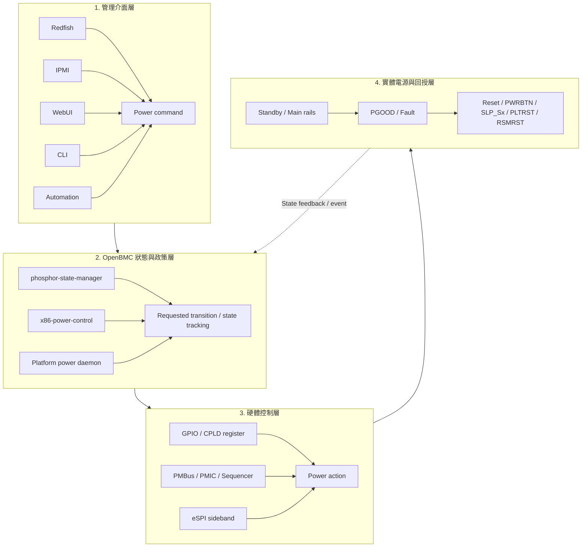
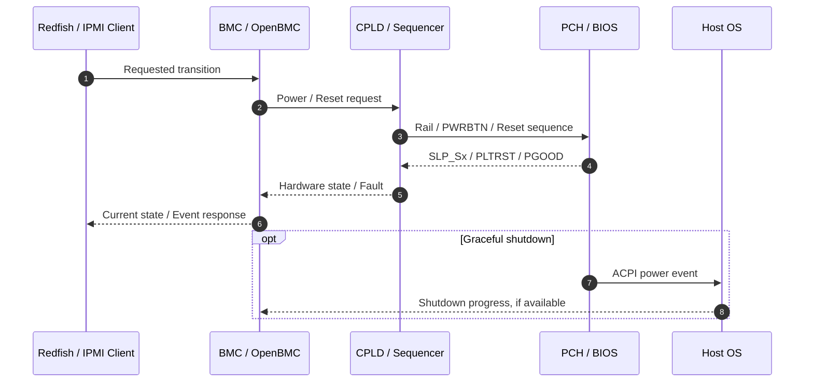
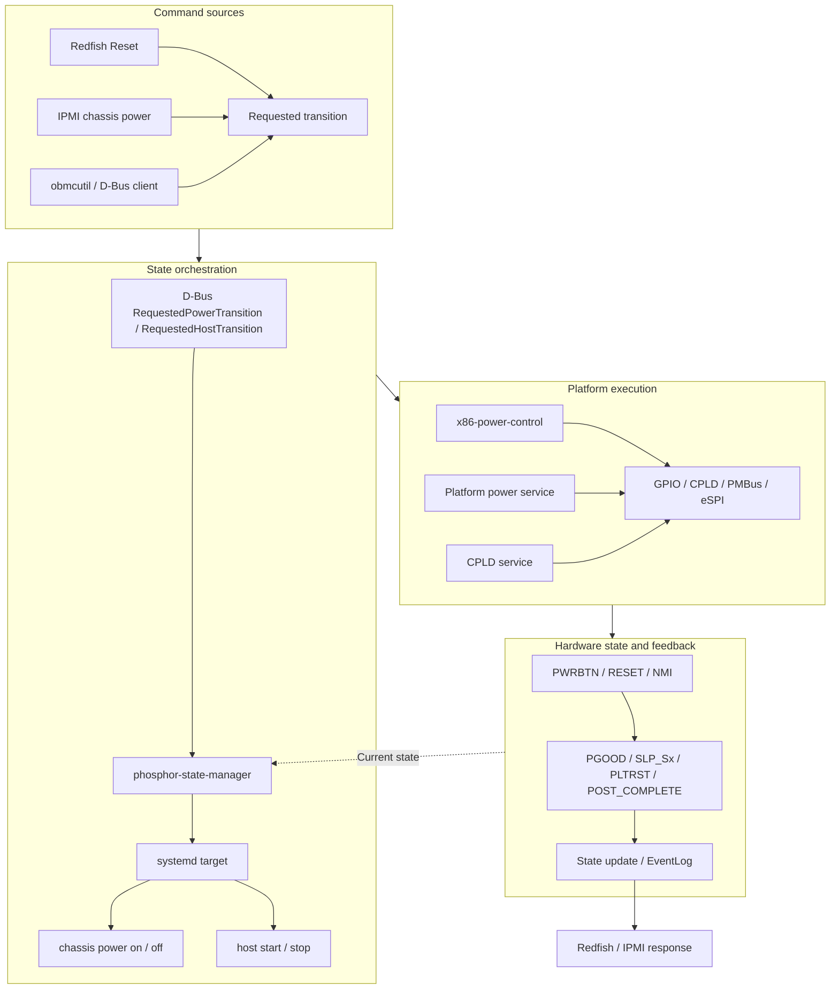
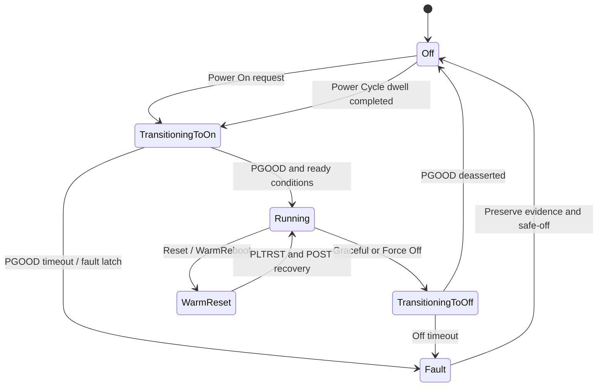
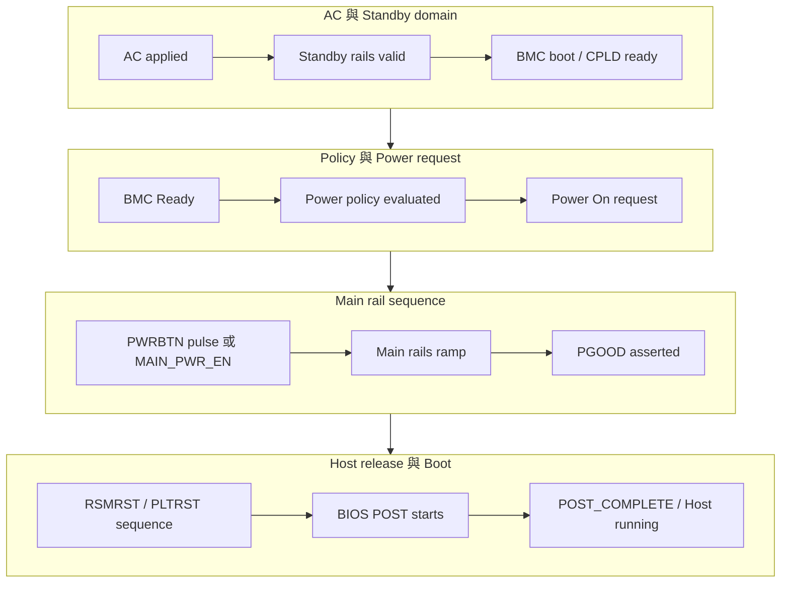
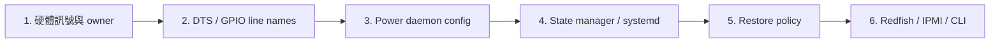
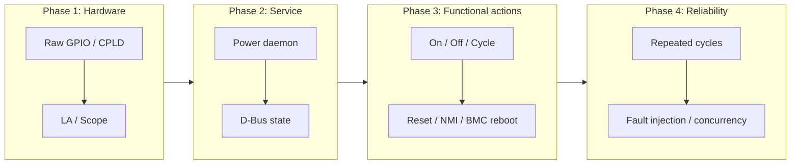
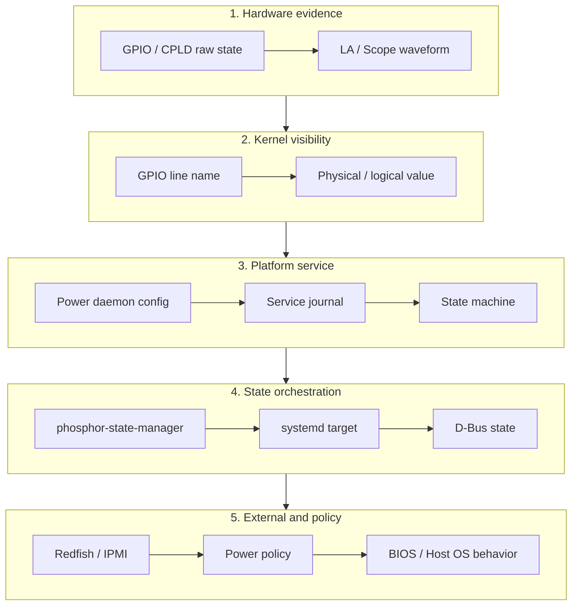

# 14. Power Control

本章整理 BMC 平台的 Power Control porting 與驗證方法. Power Control 不是單一 GPIO 問題, 而是由 standby power、CPLD / FPGA / PMIC、BMC GPIO、PCH / SoC sideband、BIOS / UEFI、OpenBMC state manager、Redfish / IPMI 與事件紀錄共同構成的跨層流程. Bring-up 時若只看某一個 D-Bus property 或某一條 GPIO, 容易漏掉實際電源時序、硬體 latch、host reset、BMC reboot recovery 與 power restore policy 的互動.

本章目標:

- 建立 BMC、CPLD、BIOS / UEFI 在 power control 上的責任邊界.
- 定義 chassis power、host power、BMC state、power button、reset、NMI、power policy 的資料路徑.
- 說明 OpenBMC 中 `phosphor-state-manager`、`x86-power-control`、systemd targets、D-Bus、Redfish / IPMI 的整合方式.
- 提供 porting 步驟、測試矩陣、常見問題與 checklist.

## 適用範圍

本章涵蓋 BMC 平台的 power control 架構、權責切分、重要訊號、power sequence、OpenBMC state management、x86-power-control、power restore policy、fault handling, 以及跨層 bring-up 與驗證方法.

## 適用讀者

- 負責 BMC 硬體 bring-up、CPLD / FPGA、Device Tree、OpenBMC power service、BIOS / UEFI 或平台驗證的人員.
- 需要從 Redfish / IPMI transition 追查至 D-Bus、systemd target、GPIO / CPLD 與實體 rail 的開發與排查人員.

## 快速導覽

- [Power Control 分層架構](#section-14-1)
- [BMC、CPLD 與 BIOS 權責](#section-14-2)
- [OpenBMC Power Control 架構](#section-14-3)
- [重要電源訊號](#section-14-4)
- [Power Sequence 與時間戳](#section-14-5)
- [Porting 步驟](#section-14-6)
- [Bring-up 驗證流程](#section-14-7)
- [Power Fault 與異常處理](#section-14-8)
- [常見問題與排查](#section-14-9)
- [Power Control Checklist](#section-14-10)

<a id="section-14-1"></a>

## 14.1 Power Control 的基本概念

Power Control 在 BMC 系統中通常分成四層:



常見 power control 指令:

| 指令 | 語意 | 常見路徑 | 注意事項 |
| :--- | :--- | :--- | :--- |
| Power On | 開啟 chassis 或 host | Redfish / IPMI → D-Bus transition → power daemon → GPIO / CPLD | 需確認 standby rail、BMC Ready、CPLD ready、fault latch |
| Graceful Shutdown | 讓 host OS 正常關機 | Redfish / IPMI → host transition → ACPI / power button pulse | 需要 host OS 支援; timeout 後是否 force off 需定義 |
| Force Off | 強制關閉主電 | D-Bus / IPMI → power button long press 或 CPLD off | 需記錄事件, 避免與 graceful off 混淆 |
| Power Cycle | 先 off 再 on | state manager target 或 x86-power-control state machine | off dwell time、PGOOD drop、VR discharge 需符合硬體需求 |
| Reset / Warm Reboot | 不移除所有電源, 只重置 host | RESET_OUT、PLTRST、PCH reset path | 需區分 warm reset、cold reset、BMC reset |
| NMI | 對 host 送 Non-Maskable Interrupt | NMI_OUT 或 D-Bus NMI interface | 用於 crash dump / diagnostic, 權限需受控 |
| BMC Reboot | 重啟 BMC | BMC state transition / systemctl reboot | 不應影響正在運作的 host |

<a id="section-14-2"></a>

## 14.2 BMC / CPLD / BIOS 權責切分

x86 或伺服器平台常見權責如下:

| 元件 | 主要責任 | 常見訊號 / 介面 | Porting 注意事項 |
| :--- | :--- | :--- | :--- |
| BMC | 接收遠端 power command、更新 D-Bus state、驅動 PWRBTN / RESET / NMI、記錄事件 | GPIO、D-Bus、Redfish、IPMI、SEL | 不應直接取代 CPLD 的硬體保護; 需遵守 policy 與 timeout |
| CPLD / FPGA | 硬體時序、rail enable、fault latch、reset gating、power button mux、watchdog | GPIO、I2C / LPC / eSPI register、interrupt | register map、clear rule、firmware version、預設值要記錄 |
| PMIC / Sequencer | power rail enable / power good 時序 | PMBus、GPIO、PGOOD | 需確認 rail dependency、PGOOD threshold、fault latch |
| PCH / CPU SoC | S-state、RSMRST、SLP_Sx、PLTRST、SMI/NMI、host reset | eSPI / LPC / GPIO sideband | 需與 BIOS / ME / PSP / AGESA 共同確認語意 |
| BIOS / UEFI | POST、boot progress、ACPI shutdown、inventory、host firmware log | POST_COMPLETE、boot progress、PLDM / IPMI / OEM | graceful shutdown、reset reason、boot complete 需對齊 |
| Host OS | 正常關機、重啟、crash dump | ACPI power button、NMI、OS watchdog | Graceful 與 Force 的差異需在測試中明確驗證 |

Power Control bring-up 時建議先用一張責任矩陣同步, 不要讓 BMC、CPLD、BIOS 都試圖控制同一條訊號.




| 動作 / 狀態 | BMC | CPLD | BIOS / Host | 驗證方式 |
| :--- | :--- | :--- | :--- | :--- |
| PWRBTN pulse | 產生 pulse 或請 CPLD 產生 | mux / gate / debounce | 接收 ACPI event | LA 量測 PWRBTN 與 SLP_Sx |
| Force off | 下指令與記錄事件 | 拉電源 enable / long press / fault gate | 可能無法正常處理 | PGOOD drop、host off、SEL |
| Power restore | 讀 policy 並發 transition | AC restore state / latch | BIOS AC policy 需避免衝突 | AC cycle 測試 |
| Fault latch | 讀取並上報 | latch fault bit | 依平台回報 | CPLD dump + EventLog |
| BMC reset recovery | 重新 discover state | 維持 host power | host 持續運作 | BMC reboot while host on |

<a id="section-14-3"></a>

## 14.3 OpenBMC Power Control 架構

OpenBMC 常見有兩種互補角色:

1. `phosphor-state-manager`: 負責 BMC、Chassis、Host、Hypervisor 等 state object 的狀態追蹤與 transition request. 它透過 D-Bus 對 Redfish / IPMI 等外部協定暴露目前狀態與要求的 transition, 並大量使用 systemd targets 驅動電源動作.
2. `x86-power-control` 或平台 power daemon: 負責實際 GPIO / eSPI / CPLD sideband 的監控與控制, 維護 host power state machine, 並將硬體事件與軟體 request 轉成具體電源動作.

常見資料流:



`phosphor-state-manager` 常見 state:

| Object | Current state | Requested transition | systemd targets / 補充 |
| :--- | :--- | :--- | :--- |
| BMC | `NotReady`、`Ready`、`Quiesced` | `Reboot` | 監看 `multi-user. target` 與 quiesce target |
| Chassis | `On`、`Off`、`BrownOut`、`UninterruptiblePowerSupply` | `On`、`Off`、`PowerCycle` | 常見 `obmc-chassis-poweron@. target`、`obmc-chassis-poweroff@. target` |
| Host | `Off`、`Running`、`TransitioningToRunning`、`TransitioningToOff`、`Quiesced`、`DiagnosticMode` | `Off`、`On`、`Reboot`、`GracefulWarmReboot`、`ForceWarmReboot` | 常見 `obmc-host-startmin@. target`、`obmc-host-stop@. target`、`obmc-host-quiesce@. target` |



`x86-power-control` 常見能力:

- BMC 內部維護 Host state machine.
- 支援 hard power on / off / cycle 與 soft power on / off / cycle.
- 可用 JSON 配置 GPIO 或 D-Bus 型訊號.
- 監控 power button、reset button、NMI / ID button、PowerOk、SIO power good、S5、POST complete 等訊號.
- 控制 PowerOut、ResetOut、NMIOut、SIO on control 等輸出.
- 依平台 feature 可使用 PLTRST 類訊號判斷 warm reset.

<a id="section-14-4"></a>

## 14.4 重要電源訊號與語意

Power Control 的第一步是把每條訊號的硬體語意寫清楚.

| 類型 | 常見訊號 | 方向 | 用途 | 常見風險 |
| :--- | :--- | :--- | :--- | :--- |
| Standby power | `P3V3_AUX`、`P1V8_AUX`、`BMC_STBY_PGOOD` | HW → BMC/CPLD | BMC / CPLD standby ready | standby 未穩但 BMC 已讀 GPIO |
| Main rail enable | `MAIN_PWR_EN`、`S0_EN`、`PS_ON_N` | BMC/CPLD → Power | 開主電 | active low / open drain 語意錯 |
| Power good | `PS_PWROK`、`SIO_POWER_GOOD`、`PWRGD_CPU` | Power/CPLD/PCH → BMC | 判斷 power on 是否成功 | debounce、latched fault、PGOOD drop 太短 |
| Power button | `PWRBTN_N`、`POWER_OUT` | BMC/CPLD → PCH | 模擬按電源鍵 | pulse width、mux owner、長按行為 |
| Reset | `RSTBTN_N`、`RESET_OUT`、`PLTRST_N` | BMC/CPLD/PCH | host reset / warm reset | reset domain 混淆 |
| Sleep state | `SLP_S3_N`、`SLP_S4_N`、`SLP_S5_N`、`SIO_S5` | PCH → BMC/CPLD | 判斷 host sleep / off state | 不同 chipset 語意差異 |
| Resume reset | `RSMRST_N` | PCH/CPLD | PCH resume well reset | 上電時序與 BIOS 關聯高 |
| POST / boot | `POST_COMPLETE`、boot progress | BIOS/PCH → BMC | 判斷 host boot 完成或 warm reset | BIOS 未支援或 reset 時電位行為不同 |
| NMI | `NMI_OUT` | BMC/CPLD → PCH/CPU | 觸發 crash dump / diagnostic | 權限與誤觸發風險 |
| Fault latch | `VR_FAULT`、`THERMTRIP`、`OC_FAULT` | CPLD/PMIC → BMC | 阻止上電或記錄故障 | clear rule 與事件嚴重度需定義 |

建議量測欄位:

| Signal | SoC pin / GPIO line | Owner | Active | Default | Pull | Source / Sink | Debounce | Boot risk | 備註 |
| :--- | :--- | :--- | :--- | :--- | :--- | :--- | :--- | :--- | :--- |
| `PWRBTN_N` | `[待填]` | BMC/CPLD | Low pulse | High | Pull-up | BMC → PCH | `[待填]` | 誤觸發 host power | `[待填]` |
| `PS_PWROK` | `[待填]` | CPLD/PCH | High = OK | Low | `[待填]` | HW → BMC | `[待填]` | state 判斷錯 | `[待填]` |
| `PLTRST_N` | `[待填]` | PCH | High = deassert | Low | `[待填]` | PCH → BMC | `[待填]` | warm reset 判斷 | `[待填]` |

<a id="section-14-5"></a>

## 14.5 Power Sequence 與時間戳

Power sequence 必須用 LA / scope 與 journal 一起記錄. 單看軟體 log 通常無法確認 rail enable 與 PGOOD 的真實順序.

建議資料:



時間戳表:

| Event | Signal / source | Target time | Measured time | Pass criteria | 備註 |
| :--- | :--- | :--- | :--- | :--- | :--- |
| AC applied | AC input | t0 | `[待填]` | baseline | `[待填]` |
| Standby PGOOD | `BMC_STBY_PGOOD` | `[待填]` | `[待填]` | stable | `[待填]` |
| BMC Ready | D-Bus BMC state | `[待填]` | `[待填]` | Ready before policy on | `[待填]` |
| Power request | Redfish / IPMI / D-Bus | `[待填]` | `[待填]` | request accepted | `[待填]` |
| PWRBTN asserted | `PWRBTN_N` | `[待填]` | `[待填]` | pulse width 合規 | `[待填]` |
| Main PGOOD | `PS_PWROK` | `[待填]` | `[待填]` | timeout 內 asserted | `[待填]` |
| PLTRST deassert | `PLTRST_N` | `[待填]` | `[待填]` | BIOS 可開始 POST | `[待填]` |
| POST complete | `POST_COMPLETE` / boot progress | `[待填]` | `[待填]` | host running | `[待填]` |

<a id="section-14-6"></a>

## 14.6 Porting 步驟



### Step 1: 收集硬體與平台資料

- Chassis power source: PSU / DC input / battery / UPS
- Standby rail 與 always-on domain
- Main rail enable / power good / fault 訊號清單
- PWRBTN / RESET / NMI 的訊號路徑與 owner
- SLP_Sx / RSMRST / PLTRST / POST_COMPLETE 的來源
- Power fault latch 與 clear rule
- CPLD / PMIC / sequencer register map
- AC restore policy 與 NVRAM / settings 儲存位置
- Power cycle 最小 off dwell time
- Graceful shutdown timeout 與 fallback force off policy
- Host running 判斷依據: PGOOD、POST_COMPLETE、PLTRST、host heartbeat、OS response
- BMC reboot while host on 的預期行為


### Step 2: Device Tree / GPIO Line Name

Power GPIO 建議一律命名清楚, 並避免與 sensor / presence GPIO 混淆.

```dts
&gpio0 {
    status = "okay";
    gpio-line-names =
        "POWER_BUTTON_N", "RESET_BUTTON_N", "NMI_BUTTON_N", "ID_BUTTON_N",
        "PS_PWROK", "SIO_POWER_GOOD", "SIO_S5", "POST_COMPLETE",
        "POWER_OUT", "RESET_OUT", "NMI_OUT", "SIO_ONCONTROL",
        "PLTRST_N", "RSMRST_N", "MAIN_PWR_EN", "CPLD_PWR_FAULT";
};
```

檢查:

```bash
$ gpioinfo | grep -E 'POWER|RESET|NMI|PWROK|PLTRST|RSMRST|POST'
$ gpioget gpiochip0 PS_PWROK
$ gpioget gpiochip0 PLTRST_N
```

若 x86-power-control 使用 line name, DTS 的 `gpio-line-names` 與 JSON `LineName` 必須一致.

### Step 3: x86-power-control JSON 配置

若平台使用 `x86-power-control`, 通常需提供 `power-config-host0. json` 或 host instance 對應檔案. 訊號可用 GPIO 或 D-Bus 型定義.

GPIO 型訊號:

```json
{
  "Name": "PostComplete",
  "LineName": "POST_COMPLETE",
  "Type": "GPIO"
}
```

D-Bus 型訊號:

```json
{
  "Name": "PowerButton",
  "DbusName": "xyz.openbmc_project.Chassis.Event",
  "Path": "/xyz/openbmc_project/Chassis/Event",
  "Interface": "xyz.openbmc_project.Chassis.Event",
  "Property": "PowerButton_Host1",
  "Type": "DBUS"
}
```

常見訊號對照:

| `Name` | 常見 line name | 類型 | 說明 |
| :--- | :--- | :--- | :--- |
| `PowerButton` | `POWER_BUTTON_N` | Input | 實體 power button |
| `ResetButton` | `RESET_BUTTON_N` | Input | 實體 reset button |
| `NMIButton` | `NMI_BUTTON_N` | Input | 實體 NMI button |
| `IdButton` | `ID_BUTTON_N` | Input | Identify button |
| `PowerOk` | `PS_PWROK` | Input | Power supply OK |
| `SioPowerGood` | `SIO_POWER_GOOD` | Input | Super I/O power good |
| `SIOS5` | `SIO_S5` | Input | S5 / sleep state |
| `PostComplete` | `POST_COMPLETE` | Input | BIOS POST complete |
| `PowerOut` | `POWER_OUT` | Output | 模擬 power button / power control |
| `ResetOut` | `RESET_OUT` | Output | 模擬 reset |
| `NMIOut` | `NMI_OUT` | Output | 送 NMI 到 host |
| `SioOnControl` | `SIO_ONCONTROL` | Output | 平台 SIO power control |

配置注意事項:

- Polarity 必須與 schematic / CPLD register map 對齊.
- Output pulse width、force-off hold time、power cycle off dwell time 必須符合平台規格.
- 若訊號由 CPLD 代理, BMC 不一定直接控制 host pin, JSON 需指向 BMC 實際看到的 GPIO 或 D-Bus property.
- 多 host 平台需明確區分 `host0`、`host1` 的配置檔、D-Bus path 與 GPIO line.

### Step 4: phosphor-state-manager 與 systemd targets

`phosphor-state-manager` 的設計是由 D-Bus RequestedTransition 觸發 systemd target, 再由 target 內的 service 完成平台動作. Porting 時要確認 target dependency 與 service ordering.

常見 target:

```bash
$ systemctl list-units 'obmc-*power*' 'obmc-host*' 'obmc-chassis*'
$ systemctl cat obmc-chassis-poweron@0.target
$ systemctl cat obmc-chassis-poweroff@0.target
$ systemctl cat obmc-host-startmin@0.target
$ systemctl cat obmc-host-stop@0.target
```

關鍵檢查:

- requested transition 寫入後, 對應 target 是否被啟動.
- target 內的 platform service 是否成功完成.
- 若 target 成功但硬體沒有變化, 需回到 platform power service / GPIO / CPLD 檢查.
- 若硬體已 power on 但 D-Bus state 仍是 Off, 需檢查 PGOOD / discover state / service state update.

### Step 5: Power Restore Policy

Power restore policy 決定 AC loss、BMC reboot 或系統電源事件後是否自動恢復開機. 常見策略:

| Policy | 說明 | 驗證方式 |
| :--- | :--- | :--- |
| Always Off | AC 回來後保持關機 | AC cycle 後確認 chassis off |
| Always On | AC 回來後自動開機 | AC cycle 後確認 power on sequence |
| Restore Previous | 回到 AC loss 前狀態 | on/off 各跑一次 AC cycle |
| No Change / platform default | 交由 CPLD / BIOS / platform policy | 需定義權威來源 |

注意事項:

- BMC policy、BIOS AC policy、CPLD AC restore strap 不應互相衝突.
- 若啟用 only-allow-boot-when-bmc-ready, 需確認 BMC Ready timeout 與 PowerRestoreDelay.
- 若 BMC reboot 時 host 已 running, BMC 必須重新 discover 狀態, 不應造成 host 掉電.

### Step 6: Redfish / IPMI / CLI 對外介面

Redfish 常用:

```bash
# 查 Chassis / System power 狀態
$ curl -k -u root:0penBmc https://<bmc>/redfish/v1/Systems/system
$ curl -k -u root:0penBmc https://<bmc>/redfish/v1/Chassis/chassis

# Power on / ForceOff / GracefulShutdown / PowerCycle 等 ResetType 依平台支援而定
$ curl -k -u root:0penBmc \
  -H 'Content-Type: application/json' \
  -X POST \
  https://<bmc>/redfish/v1/Systems/system/Actions/ComputerSystem.Reset \
  -d '{"ResetType":"On"}'
```

IPMI 常用:

```bash
$ ipmitool -I lanplus -H <bmc> -U root -P 0penBmc chassis power status
$ ipmitool -I lanplus -H <bmc> -U root -P 0penBmc chassis power on
$ ipmitool -I lanplus -H <bmc> -U root -P 0penBmc chassis power off
$ ipmitool -I lanplus -H <bmc> -U root -P 0penBmc chassis power cycle
$ ipmitool -I lanplus -H <bmc> -U root -P 0penBmc chassis power reset
$ ipmitool -I lanplus -H <bmc> -U root -P 0penBmc sel list
```

OpenBMC CLI / D-Bus:

```bash
$ obmcutil state
$ obmcutil poweron
$ obmcutil poweroff
$ obmcutil powercycle

$ busctl tree xyz.openbmc_project.State.Host
$ busctl tree xyz.openbmc_project.State.Chassis
$ busctl get-property \
  xyz.openbmc_project.State.Chassis \
  /xyz/openbmc_project/state/chassis0 \
  xyz.openbmc_project.State.Chassis \
  CurrentPowerState
$ busctl get-property \
  xyz.openbmc_project.State.Host \
  /xyz/openbmc_project/state/host0 \
  xyz.openbmc_project.State.Host \
  CurrentHostState
```

<a id="section-14-7"></a>

## 14.7 Bring-up 驗證流程

建議依下列順序驗證, 避免一開始直接測 Redfish power cycle 而難以判讀.



### Phase 1: 硬體原始訊號

```bash
$ gpioinfo
$ gpioget gpiochip0 PS_PWROK
$ gpioget gpiochip0 SIO_POWER_GOOD
$ gpioget gpiochip0 SIO_S5
$ gpioget gpiochip0 POST_COMPLETE
```

同步用 LA / scope 量測:

```text
PWRBTN_N
MAIN_PWR_EN
PS_PWROK
RSMRST_N
PLTRST_N
SLP_S5_N
POST_COMPLETE
RESET_OUT
```

### Phase 2: service 與 D-Bus

```bash
$ systemctl status phosphor-host-state-manager.service
$ systemctl status phosphor-chassis-state-manager.service
$ systemctl status 'xyz.openbmc_project.Chassis.Control.Power@0.service'
$ journalctl -u phosphor-host-state-manager.service -b --no-pager
$ journalctl -u phosphor-chassis-state-manager.service -b --no-pager
$ journalctl -u 'xyz.openbmc_project.Chassis.Control.Power@0.service' -b --no-pager
$ busctl tree xyz.openbmc_project.State.Host
$ busctl tree xyz.openbmc_project.State.Chassis
```

### Phase 3: 單一動作驗證

| 測試 | 前置狀態 | 動作 | 預期結果 | 需收集 |
| :--- | :--- | :--- | :--- | :--- |
| Power On | AC on、host off | Redfish / IPMI power on | PGOOD on、host running | journal、D-Bus、LA |
| Graceful Off | host OS running | Graceful shutdown | OS 正常關機、PGOOD off | OS log、timeout、EventLog |
| Force Off | host running | ForceOff | PGOOD off、事件記錄 | PWRBTN long press / CPLD off |
| Power Cycle | host running | PowerCycle | PGOOD drop 後重新 on | off dwell time、POST |
| Reset | host running | Reset / WarmReboot | PLTRST 或 reset pulse, PGOOD 不一定 drop | PLTRST、POST_COMPLETE |
| NMI | host running | NMI | host crash dump / diagnostic | OS / BIOS / BMC log |
| BMC Reboot | host running | BMC reboot | host 不掉電, BMC 回來後 state 正確 | PGOOD、D-Bus state |
| AC Cycle | host on/off 各一次 | 移除 AC 再恢復 | 符合 restore policy | LA、journal、EventLog |

### Phase 4: 長測與壓力測試

- [ ] power on/off 100 cycles
- [ ] power cycle 100 cycles
- [ ] graceful shutdown + force fallback
- [ ] BMC reboot while host running 50 cycles
- [ ] AC cycle with RestorePolicy=AlwaysOn / AlwaysOff / Previous
- [ ] CPLD fault injection
- [ ] PGOOD glitch injection(若硬體可支援)
- [ ] Redfish / IPMI 同時發 request 的互斥測試
- [ ] Host boot hang / POST timeout 測試

<a id="section-14-8"></a>

## 14.8 Power Fault 與異常處理

Power fault 不建議只用"power on failed"統稱, 需保留可追溯的 fault source.

| 類型 | 可能來源 | 建議處理 |
| :--- | :--- | :--- |
| PGOOD timeout | PSU、VR、PMIC、CPLD、short | 停止 power on、讀 CPLD / PMIC fault、記錄 EventLog |
| BrownOut | 輸入電源不足或 rail drop | Chassis 狀態可標示 BrownOut, 避免持續 retry |
| VR fault | VR PMBus STATUS_WORD、CPLD latch | 上報 fault sensor, 必要時阻止再次 power on |
| Thermal trip | PROCHOT / THERMTRIP / CPLD latch | 強制關機並記錄 thermal event |
| Power button stuck | GPIO 長時間 asserted | 記錄 button fault, 避免重複 power transition |
| Reset stuck | PLTRST / RSMRST 不釋放 | 標示 host boot failure, 保存 timing |
| POST timeout | BIOS 未完成 POST | 記錄 boot failure, 收集 POST code / BIOS log |
| BMC service fail | state manager 或 power daemon failed | 進入保守狀態, 不任意切換 host power |

事件紀錄建議包含:

```text
- Time / monotonic timestamp
- Requested transition
- Previous state / current state
- Fault signal raw value
- CPLD / PMIC register dump
- Power policy
- BMC / CPLD / BIOS version
- Redfish / IPMI requester（若可取得）
```

<a id="section-14-9"></a>

## 14.9 常見問題與排查

| 問題現象 | 建議排查方向 | 建議檢查 |
| :--- | :--- | :--- |
| Redfish power on 回成功但主機沒上電 | D-Bus target 成功但 GPIO / CPLD 未動作 | 查 systemd target、power daemon log、LA 量測 PWRBTN / MAIN_PWR_EN |
| IPMI power status 與實際不符 | PGOOD / S-state 判斷來源錯 | 比對 `PS_PWROK`、`SIO_S5`、D-Bus state |
| Power button pulse 產生但 host 無反應 | pulse width、polarity、mux owner、PCH power domain | LA 量測 PWRBTN_N; 確認 CPLD mux / BIOS setting |
| Force off 不會斷電 | 長按時間不足、CPLD gate、PS_ON_N 路徑錯 | 量測 long press、PS_ON_N、MAIN_PWR_EN |
| Power cycle 太快導致下一次開機失敗 | off dwell time 不足、VR 未放電 | 增加 cycle off delay; 量測 rail discharge |
| BMC reboot 後 state 顯示 Off 但 host 仍 running | discover state 不完整 | 檢查 PGOOD query、`/run/openbmc/chassis@0-on` 邏輯、state manager log |
| AC restore 行為不符 | BMC policy、BIOS policy、CPLD strap 衝突 | 逐一固定 policy 測試; 記錄權威來源 |
| Graceful shutdown 永遠 timeout | Host OS 沒處理 ACPI power button | 檢查 OS log、BIOS ACPI、power button event |
| POST_COMPLETE 不變 | BIOS 未驅動、GPIO polarity 錯、reset 行為不同 | 改用 PLTRST / boot progress / host heartbeat 交叉確認 |
| PGOOD 抖動導致 state 反覆變化 | 訊號雜訊或 debounce 不足 | scope 量測; 加 debounce / filter / CPLD latch |
| power daemon 啟動失敗 | JSON line name 不存在或 schema 不符 | `journalctl -u xyz. openbmc_project. Chassis. Control. Power@0. service` |
| 多 host 控錯節點 | instance / GPIO / Redfish path 對錯 | 檢查 host index、config file、D-Bus path |

建議排查順序:



<a id="section-14-10"></a>

## 14.10 Power Control Checklist

硬體 / CPLD:
- [ ] Power sequence 文件已取得
- [ ] Standby rail、main rail、PGOOD、reset、PWRBTN、SLP_Sx、PLTRST、RSMRST mapping 完成
- [ ] CPLD / PMIC / sequencer register map 完成
- [ ] Fault latch 與 clear rule 已定義
- [ ] Power button / reset / NMI owner 與 mux path 確認
- [ ] Active high / active low 與 pull resistor 確認
- [ ] Power cycle off dwell time 確認
- [ ] Graceful shutdown timeout 與 force fallback policy 確認

Device Tree / Kernel:
- [ ] GPIO line name 完整定義
- [ ] pinctrl 設定正確且無衝突
- [ ] GPIO expander / CPLD / PMBus driver probe 正常
- [ ] gpioget 可讀到 PGOOD / S-state / POST / reset 狀態
- [ ] dmesg 無關鍵 GPIO / I2C / PMBus probe error

OpenBMC service:
- [ ] phosphor-state-manager 相關 service 啟動正常
- [ ] x86-power-control 或平台 power daemon 啟動正常
- [ ] power-config-hostX. json 與 DTS line name 一致
- [ ] systemd targets dependency 與 ordering 正確
- [ ] D-Bus CurrentPowerState / CurrentHostState 正確
- [ ] Requested transition 可觸發對應 target
- [ ] BMC reboot while host on 後可重新 discover state

Redfish / IPMI:
- [ ] Redfish Systems Reset action 支援平台預期 ResetType
- [ ] IPMI chassis power on/off/cycle/reset/status 正確
- [ ] Power fault / transition event 有 journal / EventLog / SEL
- [ ] 多使用者或併發 request 有互斥保護

驗證 / 量測:
- [ ] Power on timing 完成量測
- [ ] Power off timing 完成量測
- [ ] Power cycle timing 完成量測
- [ ] Reset / warm reboot timing 完成量測
- [ ] AC cycle + restore policy 完成驗證
- [ ] BMC reboot while host running 完成驗證
- [ ] Fault injection / PGOOD timeout 完成驗證
- [ ] 長測 cycle 數與版本資訊已記錄

<a id="section-14-11"></a>

## 14.11 本章參考資料

- OpenBMC phosphor-state-manager README:<https://grok.openbmc.org/raw/openbmc/phosphor-state-manager/README.md>
- OpenBMC phosphor-state-manager repository:<https://github.com/openbmc/phosphor-state-manager>
- OpenBMC x86-power-control README:<https://github.com/openbmc/x86-power-control>
- OpenBMC x86-power-control 架構說明:<https://deepwiki.com/openbmc/x86-power-control>
- phosphor-dbus-interfaces state definitions:<https://github.com/openbmc/phosphor-dbus-interfaces>
- DMTF Redfish ComputerSystem Reset schema:<https://redfish.dmtf.org/schemas/>
- IPMI v2.0 specification: Chassis Control / Chassis Status commands
