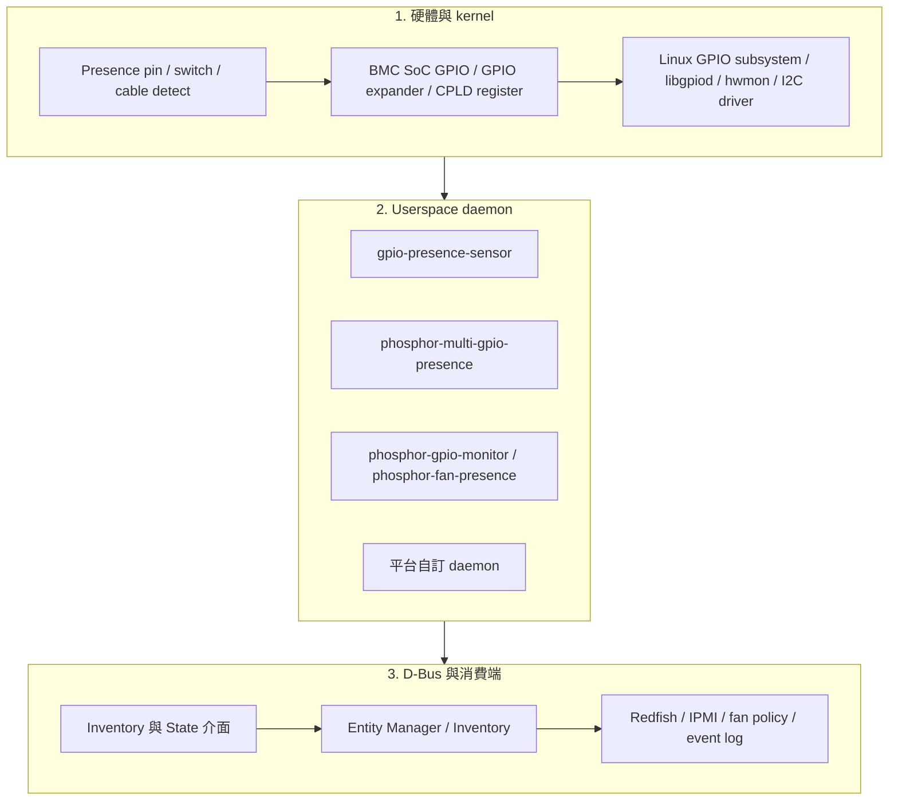
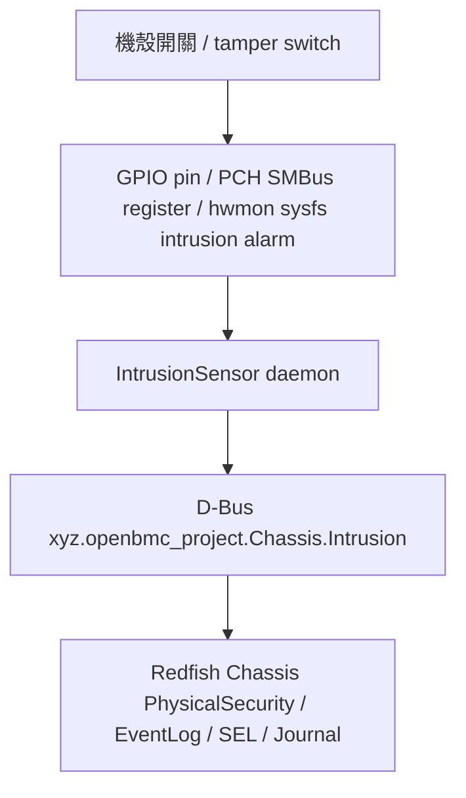

# 17. Presence / Intrusion / GPIO State Sensor

## 適用範圍

本文件整理 OpenBMC 中 Presence, Intrusion 與 GPIO State 類狀態感測器的 porting 方法, 涵蓋硬體訊號來源, Device Tree, Entity Manager, userspace daemon, D-Bus, Redfish/IPMI 映射, 事件與排查流程.

## 適用讀者

- 負責 OpenBMC GPIO, inventory, Entity Manager, dbus-sensors, Redfish, IPMI 或平台 bring-up 的開發與整合人員.
- 執行 presence, chassis intrusion, GPIO/CPLD state sensor 驗證與故障排查的人員.

## 快速導覽

- [確認適用情境與介面](#171-適用情境): Presence, Intrusion 與 GPIO State 的用途及 D-Bus 介面.
- [確認訊號來源](#172-常見來源): GPIO, CPLD/FPGA, MCU/EC, PMBus, hwmon 與 PCH/SMBus.
- [理解資料路徑](#173-資料路徑-data-flow): GPIO presence 與 chassis intrusion 資料流.
- [執行 Porting](#174-porting-步驟): 硬體確認, Device Tree, Entity Manager, userspace 與驗證程序.
- [排查常見問題](#175-進階除錯與常見陷阱): 原始訊號, kernel, daemon, D-Bus 與消費端檢查.
- [執行驗收](#176-presence-intrusion-gpio-state-sensor-完整-checklist): 硬體,系統整合及對外介面驗收項目.

本章整理 OpenBMC 中 Presence,Intrusion 與 GPIO State 類狀態感測器的 porting 方法.這類資料通常不是溫度,電壓,電流,功率或轉速等連續數值,而是代表硬體是否存在,機殼是否被開啟,GPIO / CPLD bit 是否 asserted 的布林或列舉狀態.它們會影響 inventory,FRU / asset,fan / power policy,Redfish / IPMI 對外呈現,SEL / EventLog 與安全稽核.

需要先分清楚兩個語意:

- `Present`:元件物理上是否存在,例如 PSU 插入,Fan tray 插入,Cable 扣上.
- `Functional` / `OperationalStatus`:元件存在後是否可正常工作,例如風扇存在但 tach 為 0,PSU 存在但 AC lost.

建議不要把 `Present=false` 與 `Functional=false` 混用,否則 Redfish / IPMI,event log 與 control policy 可能出現不一致.

## 17.1 適用情境

常見項目包含:

```text
Fan presence          風扇或風扇模組是否存在
PSU presence          電源供應器是否存在
Drive presence        HDD / SSD / NVMe carrier 是否存在
Cable presence        纜線、背板 cable、riser cable 是否連接
Chassis intrusion     機殼是否被打開或 tamper switch 是否觸發
Module presence       擴充卡、riser、GPU、accelerator、fan board 是否存在
CPU presence          CPU socket 是否安裝 CPU
DIMM presence         記憶體插槽是否安裝 DIMM
GPIO state            fault、alert、ID、strap、latch 類單一狀態
CPLD bit state        CPLD / FPGA 維護的 presence、fault、ID、interrupt bit
```

常見 D-Bus 介面:

| 介面 / 類型 | 用途 | 常見消費者 |
| :--- | :--- | :--- |
| `xyz.openbmc_project.Inventory.Item.Present` | inventory 物件是否存在 | bmcweb,IPMI,fan / power policy |
| `xyz.openbmc_project.State.Decorator.OperationalStatus` | inventory 或 sensor 是否 functional | Redfish Health,internal policy |
| `xyz.openbmc_project.State.Decorator.Availability` | sensor 是否目前可讀 | Redfish sensor status |
| `xyz.openbmc_project.Inventory.Source.DevicePresence` | gpio-presence-sensor 偵測到硬體後,供 Entity Manager Probe 使用 | Entity Manager |
| `xyz.openbmc_project.Configuration.GPIODeviceDetect` | GPIO presence 偵測配置 | gpio-presence-sensor |
| `xyz.openbmc_project.Chassis.Intrusion` | 機殼入侵狀態與 rearm 模式 | bmcweb,EventLog,SEL |
| `xyz.openbmc_project.Configuration.ChassisIntrusionSensor` | intrusion sensor 配置,欄位依 branch 而定 | IntrusionSensor daemon |

常見 D-Bus 路徑:

```text
/xyz/openbmc_project/inventory/system/chassis/motherboard/fan0
/xyz/openbmc_project/inventory/system/chassis/motherboard/dimm_c0a1
/xyz/openbmc_project/inventory/system/chassis/powersupply0
/xyz/openbmc_project/Intrusion/Chassis_Intrusion
/xyz/openbmc_project/Chassis/Intrusion
```

不同 OpenBMC branch / vendor fork 的 service name,object path 或 JSON schema 可能不同,實作前需以目前專案 source tree 與實機 `busctl tree` 為準.

## 17.2 常見來源

| 來源 | 說明 | 優點 | 常見風險 |
| :--- | :--- | :--- | :--- |
| BMC SoC GPIO | BMC 直接讀取 pin 腳 | 簡單,延遲低,可用 edge event | polarity,pull resistor,pinmux,line name 錯誤 |
| I2C GPIO expander | PCA955x,PCA953x,TCA64xx 等 | GPIO 數量可擴充 | I2C bus abnormal 時 presence 不可讀 |
| CPLD / FPGA register | CPLD 維護 presence / fault / latch bit | 可整合多個訊號,可做 latch | bit 定義,clear rule,版本差異需完整記錄 |
| MCU / EC | 由板上 MCU / EC 回報 | 可納入 debounce 與複合判斷 | 通訊協定,timeout 與 firmware version 需管控 |
| PMBus / FRU EEPROM ACK | 透過裝置是否回應判斷存在 | 不需額外 GPIO | 需區分拔出,bus error,device busy |
| hwmon sysfs | kernel driver 暴露 `intrusion*_alarm` 或 fault input | 可沿用 kernel driver | sysfs 名稱與 driver 支援依平台而異 |
| PCH / SMBus register | PCH 維護 chassis intrusion 狀態 | 常見於 x86 平台 | register,mask,rearm rule 需與 BIOS / PCH 文件對齊 |

Bring-up 前建議建立對照表:

| Item | Inventory path | Source type | GPIO / CPLD / I2C | Present / Active 條件 | Owner | 備註 |
| :--- | :--- | :--- | :--- | :--- | :--- | :--- |
| Fan0 | `/system/chassis/motherboard/fan0` | GPIO | `FAN0_PRESENT_N` | Low = present | BMC/HW | `[待填]` |
| PSU0 | `/system/chassis/powersupply0` | GPIO + PMBus | `PSU0_PRESENT_N`, bus/address `[待填]` | Low = present + PMBus ACK | BMC/HW | `[待填]` |
| Chassis cover | `/xyz/openbmc_project/Intrusion/Chassis_Intrusion` | GPIO | `CHASSIS_INTRUSION` | 依 schematic | BMC/HW/Security | `[待填]` |

## 17.3 資料路徑(Data Flow)

GPIO based presence detection:



Chassis Intrusion:



## 17.4 Porting 步驟

### 17.4.1 確認硬體資訊

從 schematic,board spec,CPLD register map,BIOS / PCH 文件取得:

```text
- 目標元件名稱與 slot 編號
- 訊號來源：SoC GPIO、expander、CPLD、MCU、PCH、hwmon、PMBus、FRU EEPROM
- GPIO line name、SoC pin、GPIO chip / offset、或 CPLD offset / bit
- Active high / active low，或 bit value 與狀態的對應關係
- Debounce 需求與時間
- 是否需要 latch；若有 latch，clear rule 是 W1C、read-clear、power-cycle clear 或 software clear
- Inventory path 與 FRU / asset / association
- 熱插拔時軟體需要採取的動作
- 若為 intrusion：Automatic / Manual rearm，以及誰可以清除事件
- Redfish / IPMI / SEL 是否需要露出與記錄
```

### 17.4.2 確認 GPIO / CPLD / hwmon 原始讀值

```bash
$ gpiodetect
$ gpioinfo
$ gpioget gpiochip0 4
$ gpioget gpiochip0 FAN0_PRESENT_N
```

legacy sysfs 僅作為舊平台排查:

```bash
$ ls /sys/class/gpio/
$ cat /sys/class/gpio/gpioN/value
```

CPLD / I2C register 類來源需先確認讀值,並注意 `i2cget` / `i2cset` 是否可能對裝置造成副作用:

```bash
$ i2cdetect -y <bus>
$ i2cget -y <bus> <addr> <reg>
```

hwmon 類來源:

```bash
$ find /sys/class/hwmon -maxdepth 3 -type f | grep -E 'intrusion|alarm|fault|present|label'
$ for h in /sys/class/hwmon/hwmon*; do echo === $h ===; cat $h/name 2>/dev/null; ls $h; done
```

### 17.4.3 Device Tree GPIO 命名與 pinctrl

為了讓 userspace 能依名稱取得 GPIO,需在 DTS 中定義 `gpio-line-names`,並確認 pinctrl 沒有被其他功能占用.

```dts
&gpio0 {
    status = "okay";
    gpio-line-names =
        "", "", "", "",                     /* 0-3 */
        "FAN0_PRESENT_N", "", "", "",       /* 4-7 */
        "FAN1_PRESENT_N", "", "", "",       /* 8-11 */
        "CHASSIS_INTRUSION", "", "", "",    /* 12-15 */
        ...;
};
```

GPIO 命名建議:

| 元件 | 建議命名 | 說明 |
| :--- | :--- | :--- |
| Fan presence | `FAN<N>_PRESENT_N` | `_N` 表示 active low |
| PSU presence | `PSU<N>_PRESENT_N` | N 與 PSU slot 編號一致 |
| Drive presence | `DRV<N>_PRSNT_N` 或 `DRIVE<N>_PRESENT_N` | 對齊背板 slot |
| Cable presence | `CABLE_<NAME>_PRESENT_N` | `<NAME>` 建議用 schematic net 名稱 |
| DIMM presence | `DIMM_<LOC>_PRESENT_N` | `<LOC>` 對齊 BIOS / silk / inventory |
| Chassis intrusion | `CHASSIS_INTRUSION` 或 `CHASSIS_INTRUSION_N` | 依 polarity 命名 |
| Fault pin | `<COMP>_FAULT_N` | presence 與 fault 不要混用 |

檢查:

```bash
$ gpioinfo | grep -E 'FAN0_PRESENT|CHASSIS_INTRUSION|PSU0_PRESENT'
$ ls /sys/firmware/devicetree/base
```

若改 DTS 後 line name 沒變,優先排查是否燒到正確 image,U-Boot 是否載入正確 DTB,FIT image 是否含舊 DTB,或 overlay / platform DTS 是否覆蓋.

### 17.4.4 Entity Manager 配置(GPIO Presence, 新設計)

新設計的 `gpio-presence-sensor` 位於 `entity-manager`,透過 `xyz.openbmc_project.Configuration.GPIODeviceDetect` 取得配置.設計重點是:presence daemon 偵測到硬體存在後,expose `xyz.openbmc_project.Inventory.Source.DevicePresence`,再讓 Entity Manager 用 Probe 建立該硬體對應的 inventory / sensor / FRU 配置.

單一 GPIO 範例:

```json
{
  "Name": "My Chassis",
  "Probe": "xyz.openbmc_project.FruDevice({'BOARD_PRODUCT_NAME': 'MYBOARDPRODUCT*'})",
  "Type": "Board",
  "Exposes": [
    {
      "Name": "com.example.Hardware.cable0",
      "Type": "GPIODeviceDetect",
      "PresencePinNames": ["CABLE0_PRESENT_N"],
      "PresencePinValues": [0]
    }
  ]
}
```

多 GPIO 組合範例:

```json
{
  "Name": "My Chassis",
  "Type": "Board",
  "Exposes": [
    {
      "Name": "com.example.Hardware.ComputeCard",
      "Type": "GPIODeviceDetect",
      "PresencePinNames": ["presence-slot0a", "presence-slot0b"],
      "PresencePinValues": [0, 1]
    },
    {
      "Name": "com.example.Hardware.AirBlocker",
      "Type": "GPIODeviceDetect",
      "PresencePinNames": ["presence-slot0a", "presence-slot0b"],
      "PresencePinValues": [1, 1]
    }
  ]
}
```

被偵測到的硬體可用 `Inventory.Source.DevicePresence` 作為 Probe 條件:

```json
{
  "Name": "My Fan Board 0",
  "Probe": "xyz.openbmc_project.Inventory.Source.DevicePresence({'Name': 'com.example.Hardware.fanboard0'})",
  "Type": "Board",
  "Exposes": [
    {
      "Name": "fanboard_air_inlet",
      "Type": "TMP75",
      "Bus": 5,
      "Address": "0x48"
    }
  ]
}
```

欄位說明:

| 欄位 | 說明 |
| :--- | :--- |
| `Type` | `GPIODeviceDetect` |
| `Name` | presence source 名稱,需與後續 Probe 條件一致 |
| `PresencePinNames` | GPIO line name 陣列,對應 DTS `gpio-line-names` |
| `PresencePinValues` | 每條 GPIO 被視為 present 時的值;`0` 常對應 active low present |

注意:新設計通常不是直接寫 `Inventory.Item.Present`,而是先 expose `Inventory.Source.DevicePresence`,讓 Entity Manager 決定後續 inventory / sensor 配置.

### 17.4.5 舊式 phosphor-multi-gpio-presence / phosphor-inventory-manager

舊式設計會先由 `phosphor-inventory-manager` 建立 static inventory,再由 `phosphor-multi-gpio-presence` 依 GPIO 狀態更新 `xyz.openbmc_project.Inventory.Item.Present`.

presence daemon JSON 範例:

```json
{
  "Name": "DIMM_C0A1",
  "LineName": "PLUG_DETECT_DIMM_C0A1",
  "ActiveLow": true,
  "Bias": "PULL_UP",
  "Inventory": "/system/chassis/motherboard/dimm_c0a1"
}
```

static inventory YAML 範例:

```yaml
- name: Add DIMMs
  type: startup
  actions:
    - name: createObjects
      objs:
        /system/chassis/motherboard/dimm_c0a1:
          xyz.openbmc_project.Inventory.Decorator.Replaceable:
            FieldReplaceable: true
          xyz.openbmc_project.State.Decorator.OperationalStatus:
            Functional: true
          xyz.openbmc_project.Inventory.Item:
            PrettyName: "DIMM C0A1"
            Present: false
```

舊式平台維護時需確認:

- static inventory 與 presence config 使用相同 inventory path.
- `ActiveLow=true` 表示 GPIO low 時 `Present=true`.
- 若同一元件還有 FRU EEPROM,PMBus,tach 等偵測方式,需定義優先順序.

### 17.4.6 Chassis Intrusion Sensor 配置

`IntrusionSensor` daemon 屬於 `dbus-sensors`.常見來源包含 GPIO,PCH / I2C,hwmon.不同 branch 的 JSON schema 可能不同,常見類型是 `ChassisIntrusionSensor`,並以 `Class` 選擇 `Gpio`,`Hwmon`,`I2C` 或平台特定 class.

GPIO 類範例:

```json
{
  "Name": "Chassis_Intrusion_Status",
  "Type": "ChassisIntrusionSensor",
  "Class": "Gpio",
  "GpioPolarity": "High",
  "Rearm": "Manual"
}
```

hwmon 類範例:

```json
{
  "Name": "Chassis_Intrusion_Status",
  "Type": "ChassisIntrusionSensor",
  "Class": "Aspeed2600_Hwmon",
  "Rearm": "Manual"
}
```

PCH / I2C 類範例:

```json
{
  "Name": "Chassis_Intrusion_Status",
  "Type": "ChassisIntrusionSensor",
  "Class": "I2C",
  "Bus": 13,
  "Address": "0x20",
  "Rearm": "Automatic"
}
```

實際欄位需以專案 branch 為準:

```bash
$ grep -R "ChassisIntrusionSensor" -n entity-manager/schemas dbus-sensors/src
$ grep -R "GpioPolarity\|Rearm\|CHASSIS_INTRUSION\|chassis_intrusion" -n dbus-sensors/src/intrusion
```

Rearm 模式:

| 模式 | 說明 | 驗收重點 |
| :--- | :--- | :--- |
| `Automatic` | 硬體狀態回到 closed / normal 後,D-Bus `Status` 自動回到 `Normal` | 開蓋→HardwareIntrusion,關蓋→Normal |
| `Manual` | 觸發後即使關蓋仍維持 `HardwareIntrusion`,直到管理介面執行 rearm / reset | 開蓋→HardwareIntrusion,關蓋仍維持,rearm 後 Normal |

### 17.4.7 Fan presence 與 fan tach / fan control 整合

Fan presence 可能由三種方式判斷:

| 方式 | 說明 | 適用情境 |
| :--- | :--- | :--- |
| Tach-based | 有 RPM 視為存在或 functional | 小型平台,無獨立 presence pin |
| GPIO-based | 專用 `FAN*_PRESENT_N` | 風扇托盤 / hot-swap fan module |
| Mixed | GPIO 判斷 present,tach 判斷 functional | 建議用於可更換風扇模組 |

若使用 `phosphor-fan-presence` 或舊式 GPIO detection,可能會透過 `gpio-keys` / evdev event number:

```yaml
- gpio:
  - PrettyName: "Fan0"
    Inventory: /system/chassis/motherboard/fan0
    key: 123
    Description: "Chassis location A1"
```

整合規則建議:

- `Present=false`:fan tach sensor 可標示 unavailable,並依熱策略決定是否進 failsafe.
- `Present=true` 且 tach=0:較接近 `Functional=false` 或 fault,不應當成 absent.
- 多 rotor fan:模組 presence 只有一個,但 tach sensor 可能有兩個或更多.
- Fan board 不存在時,該 board 下所有 fan / temp sensors 應隨 Probe 被移除或標示 unavailable.

### 17.4.8 D-Bus 驗證

Presence 狀態:

```bash
$ busctl tree xyz.openbmc_project.Inventory.Manager
$ busctl get-property   xyz.openbmc_project.Inventory.Manager   /xyz/openbmc_project/inventory/system/chassis/motherboard/fan0   xyz.openbmc_project.Inventory.Item   Present
```

gpio-presence-sensor:

```bash
$ systemctl status xyz.openbmc_project.gpiopresence.service
$ journalctl -u xyz.openbmc_project.gpiopresence.service -b --no-pager
$ busctl tree xyz.openbmc_project.EntityManager | grep -i gpio
$ busctl tree xyz.openbmc_project.EntityManager | grep -i DevicePresence
```

Chassis Intrusion:

```bash
$ systemctl status xyz.openbmc_project.IntrusionSensor.service
$ journalctl -u xyz.openbmc_project.IntrusionSensor.service -b --no-pager
$ busctl tree xyz.openbmc_project.IntrusionSensor
$ busctl get-property   xyz.openbmc_project.IntrusionSensor   /xyz/openbmc_project/Intrusion/Chassis_Intrusion   xyz.openbmc_project.Chassis.Intrusion   Status
```

若路徑不同,使用:

```bash
$ busctl introspect xyz.openbmc_project.IntrusionSensor <object-path>
```

### 17.4.9 Redfish / IPMI 驗證

```bash
$ curl -k -u root:0penBmc https://<bmc>/redfish/v1/Chassis/
$ curl -k -u root:0penBmc https://<bmc>/redfish/v1/Chassis/<chassis-id>
$ curl -k -u root:0penBmc https://<bmc>/redfish/v1/Chassis/<chassis-id>/Assembly
$ curl -k -u root:0penBmc https://<bmc>/redfish/v1/Chassis/<chassis-id> | jq '.PhysicalSecurity'
$ curl -k -u root:0penBmc https://<bmc>/redfish/v1/Systems/system/LogServices/EventLog/Entries

$ ipmitool -I lanplus -H <bmc> -U root -P 0penBmc sensor list
$ ipmitool -I lanplus -H <bmc> -U root -P 0penBmc sdr elist
$ ipmitool -I lanplus -H <bmc> -U root -P 0penBmc sel list
```

若 Redfish / IPMI 看不到 presence,先確認 D-Bus inventory 是否存在,再檢查 association,chassis mapping,bmcweb / IPMI SDR 產生策略.

## 17.5 進階除錯與常見陷阱

| 問題現象 | 建議排查方向 | 建議檢查 |
| :--- | :--- | :--- |
| GPIO 讀值與預期相反 | Active high / low 或 `PresencePinValues` 設定不符 | 量測 pin 腳;比對 schematic;修正 `PresencePinValues` 或 legacy `ActiveLow` |
| `gpioinfo` 看不到 line name | DTS `gpio-line-names` 未更新,DTB 未載入,GPIO controller 不同 | 檢查 deploy DTB,U-Boot/FIT,`/sys/firmware/devicetree/base` |
| presence 插拔不更新 | GPIO 不支援 edge,daemon 沒監控到,debounce 過長或 signal bounce | 看 journal;用 `gpiomon` 測 edge;確認 pull-up/down |
| 一開機 presence 狀態錯 | 上電時序導致 pin 尚未穩定,CPLD 還沒 ready | 加入初始化延遲,穩定條件或由 CPLD 提供 ready bit |
| 元件拔掉後 sensor 還存在 | Entity Manager Probe 沒被撤回,舊式 inventory 未更新 | 查 `DevicePresence` 物件是否移除;查 service log |
| 元件存在但 `Functional=false` | presence 來源正常,但 tach / PMBus / hwmon 故障 | 分開檢查 `Present` 與 `OperationalStatus` 來源 |
| PSU 拔出與 AC lost 混淆 | GPIO presence,PMBus ACK,AC input fault 語意沒分清 | 定義 PSU present,input lost,output fault 三種狀態 |
| Intrusion 無法清除 | `Rearm=Manual` 但未執行 rearm,或硬體 latch 未清 | 確認 D-Bus / Redfish rearm 流程與 CPLD clear rule |
| Intrusion 一直 HardwareIntrusion | polarity 錯,switch 常態電位不同,pull resistor 錯 | 量測開蓋 / 關蓋電位;確認 `GpioPolarity` |
| `IntrusionSensor` service 起不來 | JSON schema 欄位不符,line name 不存在,hwmon path 不存在 | `journalctl -u xyz.openbmc_project.IntrusionSensor.service` |
| Redfish PhysicalSecurity 不更新 | bmcweb mapping 或 object path 不符 | 查 D-Bus path,bmcweb journal,Redfish response |
| event log 沒紀錄 | 沒產生 PropertiesChanged,logging policy 未接上 | 監看 `busctl monitor`,`journalctl`,EventLog |
| CPLD bit 讀值不穩 | I2C timeout,CPLD firmware 版本差異,clear rule 不明 | 建立 register dump;記錄 CPLD version;與 HW 同步 bit 定義 |

建議除錯順序:

```text
1. 先看硬體原始訊號：示波器 / LA / GPIO / CPLD register
2. 再看 kernel 可見狀態：gpioinfo / hwmon / i2c / dmesg
3. 再看 userspace daemon：systemctl / journalctl
4. 再看 D-Bus object：busctl tree / get-property / introspect
5. 再看消費端：Entity Manager Probe、inventory、Redfish、IPMI、event log
```

## 17.6 Presence / Intrusion / GPIO State Sensor 完整 Checklist

```text
硬體設計階段：
- [ ] 元件與 slot 編號確認
- [ ] Presence / intrusion / fault / alert 訊號來源確認
- [ ] GPIO / CPLD / I2C / hwmon / PCH mapping 完成
- [ ] Active high / active low 或 bit value 語意確認
- [ ] Pull-up / pull-down 電阻與預設電位確認
- [ ] Debounce 需求確認
- [ ] Latch 與 clear rule 確認
- [ ] Inventory path 與 FRU / asset / association 確認
- [ ] Chassis intrusion rearm 模式確認：Automatic / Manual
- [ ] Redfish / IPMI / SEL 需求確認

Device Tree / Kernel：
- [ ] GPIO controller status = "okay"
- [ ] pinctrl 設定正確，pin 未被其他 function 占用
- [ ] gpio-line-names 定義正確
- [ ] 開機後 gpioinfo 可看到 line name
- [ ] 若用 GPIO expander，I2C bus、address、driver probe 正常
- [ ] 若用 hwmon，sysfs alarm / fault / intrusion file 存在
- [ ] 若用 CPLD，register map 與 driver / daemon 對齊

Entity Manager / Userspace：
- [ ] 新設計：GPIODeviceDetect 使用 PresencePinNames / PresencePinValues
- [ ] Probe 條件可依 DevicePresence 啟用後續 inventory / sensor
- [ ] 舊式：phosphor-multi-gpio-presence LineName / ActiveLow / Inventory 正確
- [ ] static inventory 的 Present default 合理
- [ ] ChassisIntrusionSensor JSON 欄位符合目前 branch schema
- [ ] Fan presence 與 fan tach / functional policy 分開
- [ ] PSU presence / AC lost / PMBus fault 分開

D-Bus / 系統整合：
- [ ] gpio-presence-sensor service 啟動無錯誤
- [ ] Entity Manager 可看到 GPIODeviceDetect 配置
- [ ] DevicePresence object 隨插拔正確建立 / 移除
- [ ] Inventory.Item.Present 正確變化
- [ ] OperationalStatus / Availability 語意正確
- [ ] IntrusionSensor service 啟動無錯誤
- [ ] Intrusion Status 可讀取 Normal / HardwareIntrusion
- [ ] Manual rearm 或 Automatic rearm 行為符合需求

硬體測試：
- [ ] 元件插入 / 移除時，GPIO / CPLD raw value 正確變化
- [ ] Present=true / false 與 raw value 對應正確
- [ ] 插拔 debounce 後沒有 bounce event storm
- [ ] AC cycle 後 presence 初始值正確
- [ ] BMC reboot 後 presence / intrusion 狀態合理
- [ ] 機殼開啟 / 關閉時 intrusion 狀態正確
- [ ] Manual rearm 前後行為已驗證
- [ ] Hot-swap 元件移除時，對應 sensors / inventory / fan policy 行為正確

Redfish / IPMI / 事件：
- [ ] Redfish Chassis / Assembly / Inventory 可反映 presence
- [ ] Redfish PhysicalSecurity 可反映 intrusion
- [ ] IPMI SDR / sensor list / SEL 符合平台需求
- [ ] presence change 或 intrusion event 有 journal / EventLog / SEL
- [ ] Redfish / IPMI 不會把 absent 誤報為 failed，或把 failed 誤報為 absent
```

## 17.7 常用指令速查

```bash
# GPIO / device tree
$ gpiodetect
$ gpioinfo
$ gpioget gpiochip0 <offset-or-line-name>
$ gpiomon gpiochip0 <offset-or-line-name>
$ find /sys/firmware/devicetree/base -name '*gpio*' -o -name '*pinctrl*'

# hwmon / I2C
$ find /sys/class/hwmon -maxdepth 3 -type f | grep -E 'present|fault|alarm|intrusion|label|name'
$ i2cdetect -y <bus>
$ i2cget -y <bus> <addr> <reg>

# service
$ systemctl status xyz.openbmc_project.EntityManager.service
$ systemctl status xyz.openbmc_project.gpiopresence.service
$ systemctl status xyz.openbmc_project.IntrusionSensor.service
$ journalctl -u xyz.openbmc_project.EntityManager.service -b --no-pager
$ journalctl -u xyz.openbmc_project.gpiopresence.service -b --no-pager
$ journalctl -u xyz.openbmc_project.IntrusionSensor.service -b --no-pager

# D-Bus
$ busctl tree xyz.openbmc_project.EntityManager
$ busctl tree xyz.openbmc_project.Inventory.Manager
$ busctl tree xyz.openbmc_project.IntrusionSensor
$ busctl introspect <service> <object-path>
$ busctl get-property <service> <object-path> <interface> <property>
$ busctl monitor
```

## 17.9 本章參考資料

- OpenBMC GPIO based hardware inventory design:<https://github.com/openbmc/docs/blob/master/designs/inventory/gpio-based-hardware-inventory.md>
- OpenBMC entity-manager gpio-presence-sensor README:<https://github.com/openbmc/entity-manager/blob/master/src/gpio-presence/README.md>
- OpenBMC dbus-sensors README:<https://github.com/openbmc/dbus-sensors>
- OpenBMC dbus-sensors Intrusion Sensors 說明:<https://deepwiki.com/openbmc/dbus-sensors/3.6.2-intrusion-sensors>
- OpenBMC / dbus-sensors intrusion Rearm property commit 說明:<https://gbmc.googlesource.com/dbus-sensors/+/b318dcaeaf0e847b6f0e2bc9365873ebe4e5dabd>
- Linux GPIO character device / libgpiod 文件:<https://www.kernel.org/doc/html/latest/driver-api/gpio/>
- DMTF Redfish Chassis / PhysicalSecurity schema:<https://redfish.dmtf.org/schemas/>
